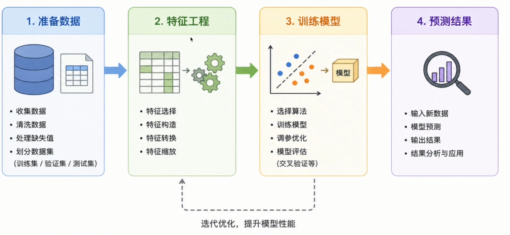
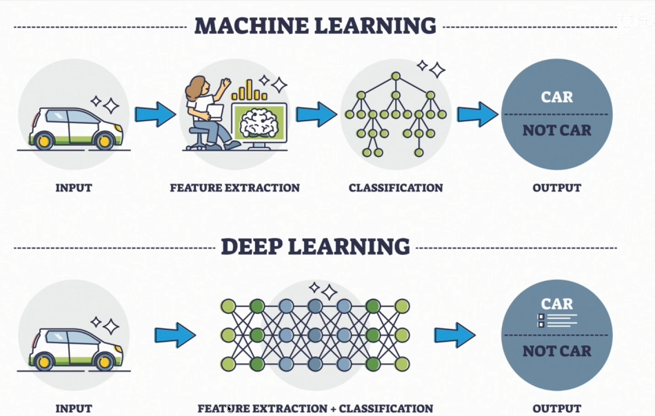
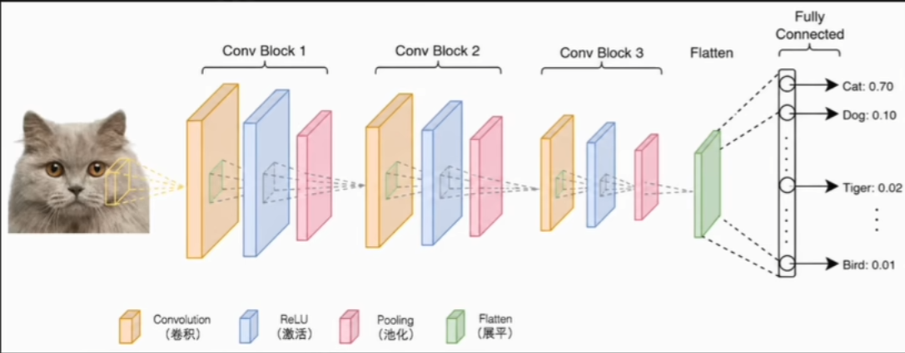

# 1、深度学习的本质

> 深度学习是机器学习的一个分支，它使用**多层神经网络**，从**原始数据**中**自动学习特征**，并完成预测或决策。

初次接触可能完全摸不到头脑：
- 什么叫“多层神经网络”？
- 什么是“自动学习特征”？
- 为什么要强调“原始数据”？

# 2、深度学习能做什么？

DL 广为人知是因为大模型和 Transformer，但商品推荐、文本翻译、人脸识别、自动驾驶……，DL早已悄悄渗透进日常生活的每一个角落：

| 计算机视觉(CV)                                 | 自然语言处理(NLP)                                  | 智能语音                              | 推荐系统 & 时间序列             |
| ----------------------------------------- | -------------------------------------------- | --------------------------------- | ----------------------- |
| 图像分类、目标检测、人脸识别。如手机“拍照识花”、工厂瑕疵检测、医院CT辅助诊断。 | 机器翻译、问答系统、人脸识别、自动驾驶。ChatGPT的底层就是NLP领域的深度学习模型 | 语音识别（转文字）、语音合成、声纹识别。支撑着手机助手和智能音箱。 | 短视频推荐、商品推荐、股价预测、电网负荷预测。 |

# 3、为什么传统机器学习不够用？

传统机器学习的标准流程中，*特征工程尤为关键*，核心依赖人工经验。

机器学习课程里的数据集（加州房价、泰坦尼克号）都是**结构化数据**（二维表格）。但现实世界中，非结构化数据远多于结构化数据。例如识别图片中的猫咪，你必须人工提取特征：猫耳是三角形、眼睛特定形状……

# 4、特征提取的核心瓶颈

> **1. 严重依赖领域专家**：图像需要图像处理专家，语音需要信号处理专家。每一次更换领域就需要重新设计特征，成本高且难复用。
> **2. 复杂数据无从下手**：人工可以定义“猫耳朵”，但无法定义一段话的“语气”或一张图里的“欢乐氛围”。高层次语义概念难以用手工特征描述。
> **3. 特征的天花板就是模型的天花板**：特征设计得不好，再强的模型也救不了。模型的表现上限被人工特征的质量死死卡住。

# 5、深度学习的思路转变

既然让人类去定义特征如此困难，为什么不让机器自己去海量数据中总结？

> 深度学习核心创新：把**特征提取**也纳入了学习过程本身！

# 6、从像素到概念：逐层抽象

- 第一层：识别基础视觉元素（横线、竖线、颜色边缘）
- 中间层：组合基础元素识别复杂结构（弧线、纹理块、局部形状）
- 更深的层：识别高层特征（三角形耳朵、胡须的细线条）
- 最后一层：综合所有特征，输出最终预测概率 97% 是猫

# 7、重新理解深度学习的定义

关键在于，这些特征不是人告诉它们的，而是它**自己从大量数据中学出来的**。准备好数据和标签，模型就会不断调整参数，越判越准。

> **多层神经网络**：逐层堆叠的网络结构，模拟大脑逐级抽象。
> **自动学习特征**：特征提取不再依赖人工，机器自己总结规律。
> **原始数据**：直接输入未经处理的底层信息（如RGB像素值、波形音频）。

# 8、深度学习的起源

实际上，DL 最初的名字叫**神经网络**，它的灵感源于仿生学——模拟动物神经元的思考与推理方式，早在 1950 年代就与 ML 并行发展。

既然**神经网络**概念诞生这么早、能解决的问题更广泛，为什么直到最近才名声大噪？这就要从它的*三起两落、波澜壮阔的探索史*说起。

## 1943-1958：第一次兴起

麦卡洛克和皮茨提出神经元模型，1958年罗森布拉提出**感知机(Perceptron)**，能学习简单线性分类，迎来*第一次春天*。

## 1969：第一次寒冬

明斯基在《感知机》一书中指出其无法解决 XOR 等非线性问题，击中要害，研究陷入停滞。

## 1986：第二次兴起

辛顿等人系统阐述了**反向传播算法(Backpropagation)**，解决了多层网络如何高效训练的核心问题。

## 1995：第二次寒冬

SVM 横空出世，神经网络受限于数据量少、算力不足（需要数周训练），再次进入漫长低谷。

## 2006：第三次兴起（深度学习元年）

辛顿提出深度信念网络和逐层预训练方法，2006年在论文中首次使用 Deep Learning 一词。

## 2012：大爆炸（AlexNet）

AlexNet 在 ImageNet 大赛中以 15.3% 错误率夺冠（比使用 SVM 的第二名低10%），全面引爆深度学习热潮。

> **深度学习爆炸的三大条件：**
> 1.互联网大数据：李飞飞主导的1400万标注图像数据集 ImageNet。
> 2.GPU 硬件进步：IIya 敏锐应用 GPU 并行计算，将训练从几年压缩到几天。
> 3.更好的训练技巧：ReLU 激活】Dropout、更好的初始化策略。

## 2017：大一统（Transformer）

Google 发表《Attention Is All You Need》，提出 **Transformer** 架构。其超强泛化能力迅速统一了 NLP、CV、语音等多模态领域，成为今天所有大模型的基础。

## 2022：新纪元（生成式 AI）

OpenAI 发布 ChatGPT，让普通用户感受到 AI 对话的惊艳。上线两月月活破亿。深度学习真正走进每一个人的生活，生成式 AI 时代全面开启。

# 9、课程内容概览

## 数学基础 & 工具链

- 线性代数：向量、矩阵、矩阵乘法
- 微积分与概率：导数、链式法则、期望
- Python 基础：Numpy、Matplotlib
- 环境与框架：Miniconda、PyTorch

## 神经网络核心原理

- 从感知机到神经网络、激活函数
- 前向传播、损失函数、梯度下降
- 反向传播，实现一个神经网络

## 常见问题与优化

- 学习率与优化器
- 权重初始化
- 归一化：Layer Norm、Batch Norm
- 正则化：L1、L2、Dropout

## CV

图像相关任务，视觉领域核心模型
- 卷积神经网络（CNN）
- 残差连接 ResNet
- YOLO实时目标检测

## NLP

文本处理方式与语言模型的发展
- 文本的表示问题
- 序列模型 RNN、LSTM
- Seq2seq 结构

## Transformer 时代

- 架构解读与训练过程
- 自注意力机制、多头注意力
- BERT：双向理解文本
- GPT 系列：自回归生成