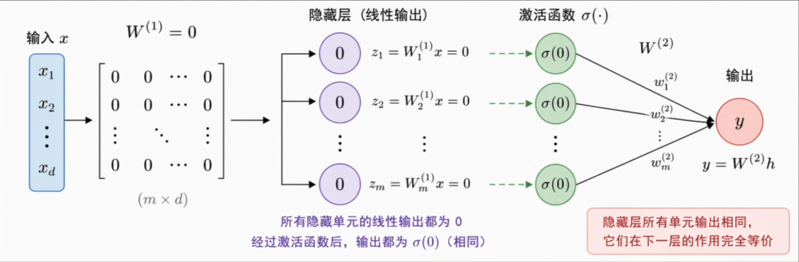
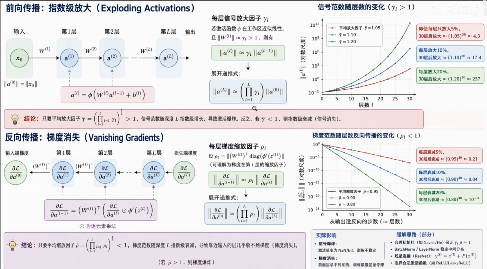
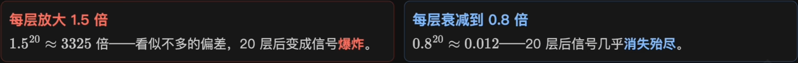
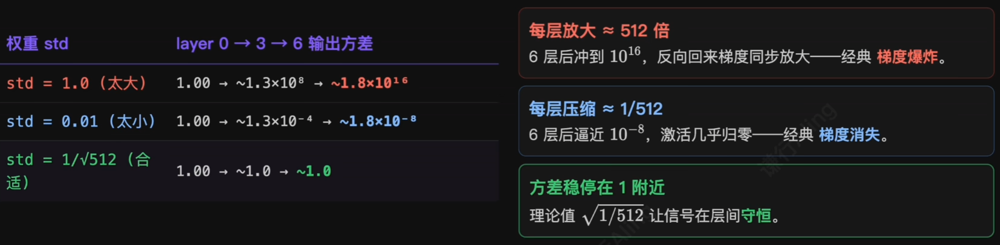
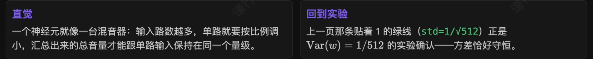
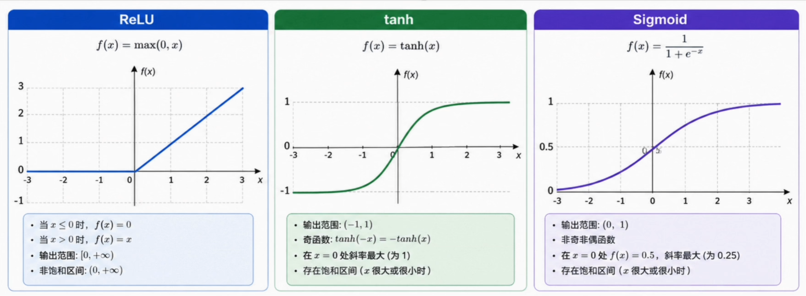
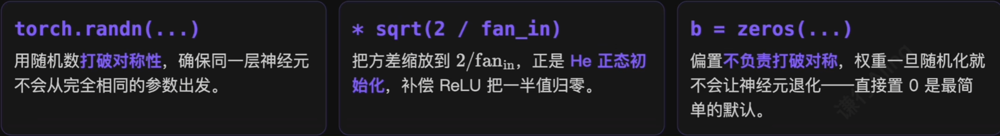
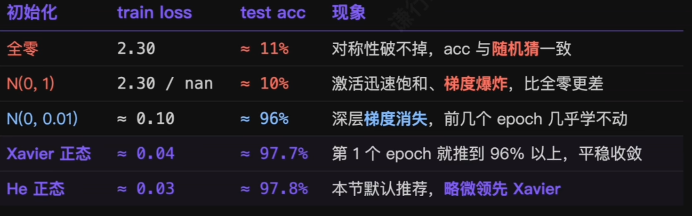
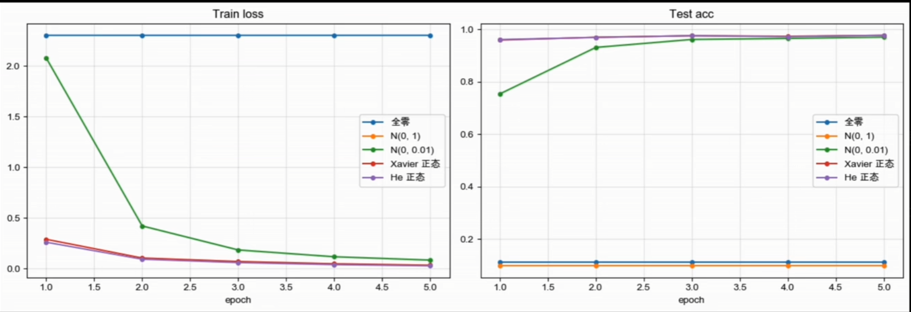
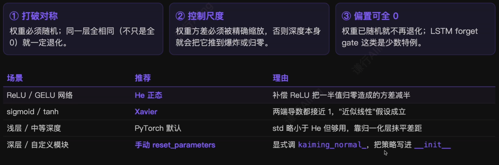

# 1.一段被略过的神秘代码

> 深度网络能不能训练起来，往往在第一次前向传播之前就已经定了。

还记得 [8.实现一个最简单的神经网络：看不懂代码不是因为不懂 PyTorch 语法](8.实现一个最简单的神经网络：看不懂代码不是因为不懂%20PyTorch%20语法.md) 这节写两层网络时的初始化吗？

```python
W1 = (torch.randn(784, 128) * (2.0 / 784) ** 0.5).requires_grad_()
b1 = torch.zeros(128, requires_grad=True)

W2 = (torch.randn(128, 10) * (2.0 / 128) ** 0.5).requires_grad_()
b2 = torch.zeros(10, requires_grad=True)
```

当时直接把`sqrt(2/fan_in)`当成经验值用了，留下三个疑问：

1. 为什么要乘系数？直接用标准正态难道不够吗？
2. 为什么是`2/fan_in`，而不是`1/fan_in`或其他？
3. 偏置为什么直接是 0？权重和偏置的处理凭什么不一样？

# 2.为什么权重不能全部初始化为 0？

第一次训练还没有参数，最朴素的想法是把所有权重置成 0，让梯度下降自己找答案。设两层网络：

$$
h=\sigma(W_1x+b_1),\quad y=hW_2+b_2
$$

如果 $W_1$ 全是 0，无论输入的 $x$ 是什么，隐藏层每个神经元看到的线性组合都**完全相同**，激活后输出也相同；反向回来落到它们身上的梯度也相同；更新之后这些参数**仍然完全相同**。



> **对称性问题（symmetry problem）**：同一层名义上的多个神经元始终在做同一件事，网络退化成**重复拷贝的单元**，再宽也没有意义。

> 把同一层权重初始化成**任何一个相同常数**，结果都一样——所以权重必须从一开始就被赋予**互不相同的随机性**。

# 3.为什么偏置可以全设成 0？

既然全部相同会出问题，偏置为什么还敢直接设成 0？

> 只要权重已经随机化，偏置是否相同就不会让神经元退化成一样。

神经元之间的差异主要来自**权重对输入的不同加权**。一旦权重不同，每个神经元的前向输出就已经不同，后续收到的梯度自然也不同——偏置全为 0 不会重新把它们变得一致。*所以在大多数 MLP / CNN / Transformer 的线性层里，偏置初始化为 0 是最常见的默认选择*。

# 4.每层的输出也需要稳定

参数随机可以解决对称性问题，但无论是前向传播还是反向传播，都涉及连乘操作。每层把信号放大一点，几层之后就指数级放大‘反过来每层稍微衰减一点，几层之后就压缩到解决 0。**层数的加深把任何微小的尺度偏差几何级地放大**。



> 那我们该如何量化“尺度”，又该怎么控制它？这就需要一个精确的数学工具——**方差**。

## 用方差量化信号尺度

**方差**（variance）就是描述一组数“散得有多开”的标准度量，数值越大说明分布越分散，越小说明越集中。它的平方根叫**标准差**（std），和原始数据单位相同。

$$
Var(x)=\frac{1}{n}\sum_{i=1}^n(x_i-\bar{x})^2,\quad \sigma=\sqrt{Var(x)}
$$

有了方差，“信号稳定”就有了精确含义：**每一层的输出，方差应该和输入的方差大致相等**。



> 维护方差，就保住了信号稳定性。接下来用实验看看不同 std 初始化权重，方差在层间会走出怎样的轨迹。

### 方差对信号稳定影响实验

6 层纯线性网络，每层宽度 512，分三种 std 初始化权重，观察方差在层间传播的轨迹：



> 两种崩坏的根源相同：每经过一层方差被乘上某个因子，深度再把这点偏差几何级放大。**只要这个因子等于 1**，方差就守恒——剩下的问题只是它由什么决定。

### 推导：方差守恒的条件

考虑一个没有激活函数的线性层，输出神经元 $y=\sum_{i=1}^nw_ix_i$。假定 $x_i$ 与 $w_i$ 独立、均值都为 0：

$$
Var(AB)=Var(A)\cdot Var(B),\quad Var(y)=n\cdot Var(w)\cdot Var(x)
$$

信号每经过一层，方差就被乘上 $n\cdot Var(w)$。这个因子大于 1 就层次放大，小于 1 就层层衰减，**恰好等于 1 才能稳定维持**。把 输出方差 $\approx$ 输入方差 代进去：

$$
Var(w)=\frac{1}{n},\quad (n=fan_{in})
$$



# 5.参数初始化要同时解决三件事


> 经典初始化公式逻辑很相似，首先使用正态、均匀分布打破对称性，然后控制方差 $Var(w)=\frac{1}{fan_{in}}$，再根据具体激活函数做修正。

# 6.Xavier 初始化

2010 年 Glorot & Bengio 提出 **Xavier 初始化**，同时照顾前向激活和反向梯度的尺度稳定。前向希望权重方差接近 $\frac{1}{fan_{in}}$，反向希望接近 $\frac{1}{fan_{out}}$，Xavier 在两者之间做折中：

$$
Var(W)=\frac{2}{fan_{in}+fan_{out}}
$$

```python
nn.init.xavier_normal_(linear.weight)  # Xavier 正态版
nn.init.xavier_uniform_(linear.weight) # Xavier 均匀版
```

Sigmoid / Tanh 在 0 附近导数都接近 1，前向反向都几乎不改变方差，Xavier 在这类激活函数下效果非常稳定。提出的年代正是 Sigmoid / Tanh 被大量使用的年代。



## 但 ReLU 把方差砍掉了一半

到了 ReLU 主导的时代，情况变了。ReLU 把**所有负值直接截成 0**，大约一半信号被抹掉，输出方差只剩输入的一半。

- **方差逐层减半**：即使权重方差已按 $1/fan_{in}$ 校准，ReLU 仍会在每一层额外吃掉一半。5 层下来只剩 $(0.5)^5\approx 3\%$。
- **解决思路**：既然 ReLU 天生砍掉一半方差，初始化时就把权重的尺度**补回来**——方差从 $1/fan_{in}$ 翻倍到 $2/fan_{in}$。

> 这正是 2015 年何恺明团队提出的 **He 初始化（Kaiming 初始化）**。

# 7.He：为 ReLU 多乘一个 2

2015 年何恺明团队提出 **He 初始化（Kaiming 初始化）**：既然 ReLU 会把方差削减一半，那就把权重方差**加倍补回来**。

| Xavier（前向版）                 | He（Kaiming）                 |
| --------------------------- | --------------------------- |
| $Var(W)=\frac{1}{fan_{in}}$ | $Var(W)=\frac{2}{fan_{in}}$ |

```python
nn.init.kaiming_normal_(linear.weight, nonlinearity='relu')  # He 正态：std = sqrt(2 / fan_in)
nn.init.kaiming_uniform_(linear.weight, nonlinearity='relu') # He 均匀
```

**注意**：`nonlinearity`默认不是 ReLU，PyTorch 的`kaiming_*`默认参数是`leaky_relu`。显式传`nonlinearity='relu'`才是标准 He。

# 8.回头看：那几行代码到底做了什么？

```python
W1 = (torch.randn(784, 128) * (2.0 / 784) ** 0.5).requires_grad_()
b1 = torch.zeros(128, requires_grad=True)

W2 = (torch.randn(128, 10) * (2.0 / 128) ** 0.5).requires_grad_()
b2 = torch.zeros(10, requires_grad=True)
```

现在可以明白这几行代码的神秘数字是什么意思了：



## PyTorch 默认初始化做了什么？

既然初始化这么重要，为什么平时直接`nn.Linear(...)`不调任何`init`，模型也常常能训起来？因为 PyTorch 已经在背后做了一次。`nn.Linear`的源码大致是：

```python
def reset_parameters(self):
	nn.init.kaiming_uniform_(self.weight, a=math.sqrt(5))
	if self.bias is not None:
		fan_in, _ = nn.init._calculate_fan_in_and_fan_out(self.weight)
		bound = 1 / math.sqrt(fan_in) if fan_in > 0 else 0
		nn.init.uniform_(self.bias, -bound, bound)
```

第一行虽然调的是`kaiming_uniform_`，但`a = sqrt(5)`把 gain 压成了 $\sqrt{1/3}$，最终 std 大约只有 标准 He 的 40%。

中等深度的网络里这点差距通常被优化器和归一化层抵消，**不调 init 也能训起来**，但深层纯 ReLU 网络仍建议手动覆盖成`kaiming_normal_(nonlinearity='relu')`。

# 9.五种初始化的实战对比

4 层 ReLU MLP (784 $\rightarrow$ 256 $\rightarrow$ 256 $\rightarrow$ 256 $\rightarrow$ 10) + MNIST, SGD + momentum, 5 epoch。同一份训练循环，只换初始化函数。





> Xavier 与 He 在这个 4 层网络上差距还不大；网络深到 ResNet-50 那种 50+ 层规模时，**He 通常比 Xavier 多 1-2 个百分点**，且训练曲线明显更平滑。

# 10.总结

> 参数初始化的目标不是随便给个随机数，而是让网络在训练一开始就处在一个**信号尺度合理**的状态里。

