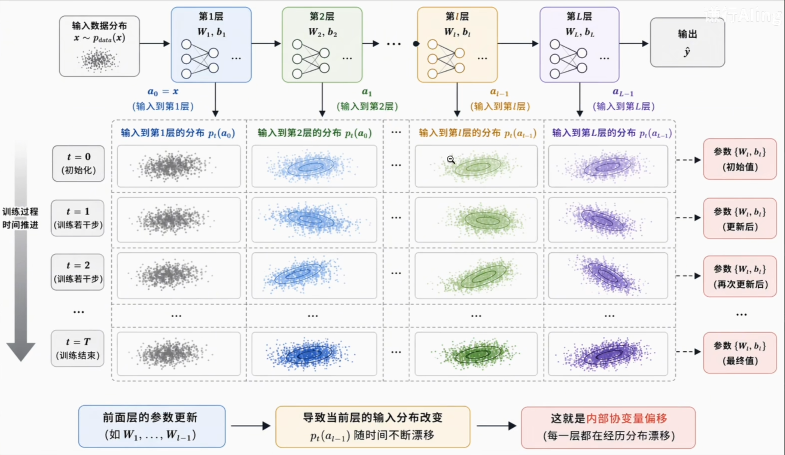
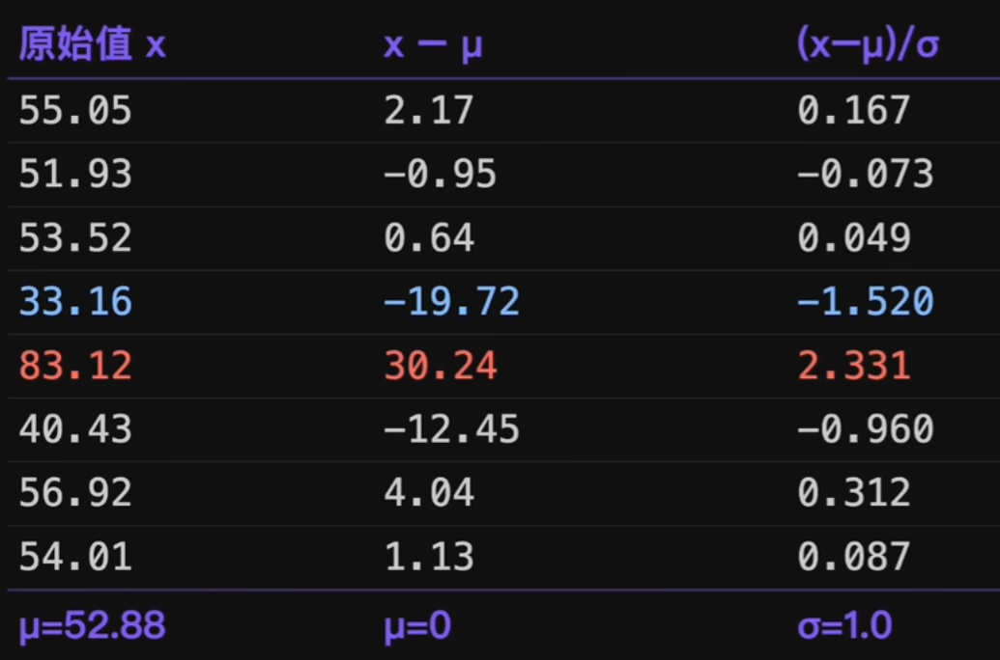
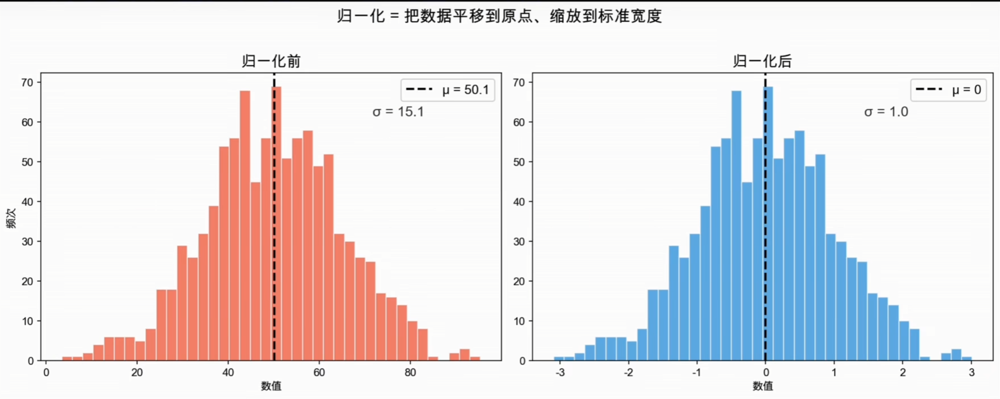
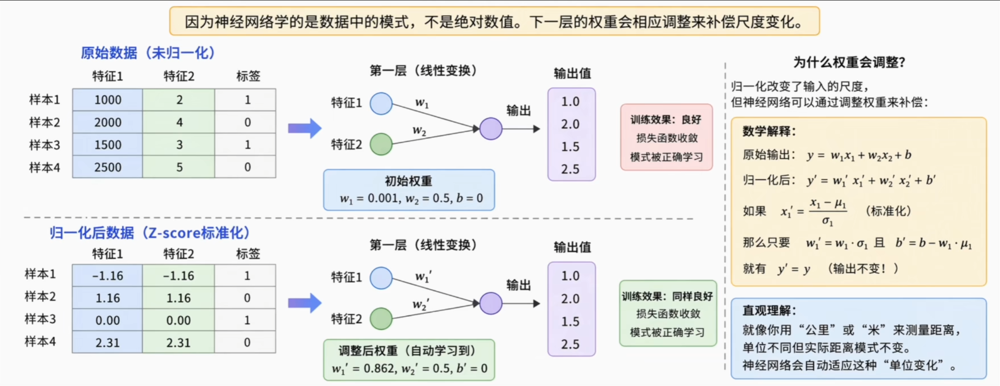
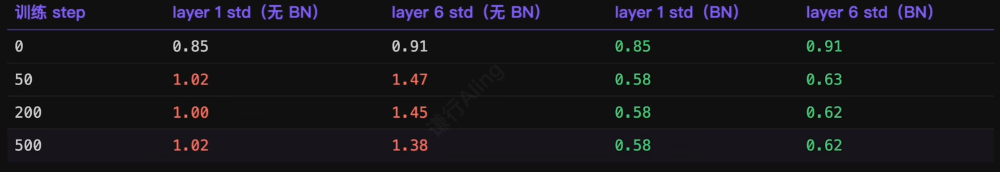
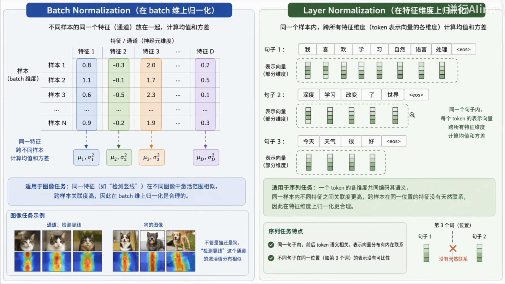
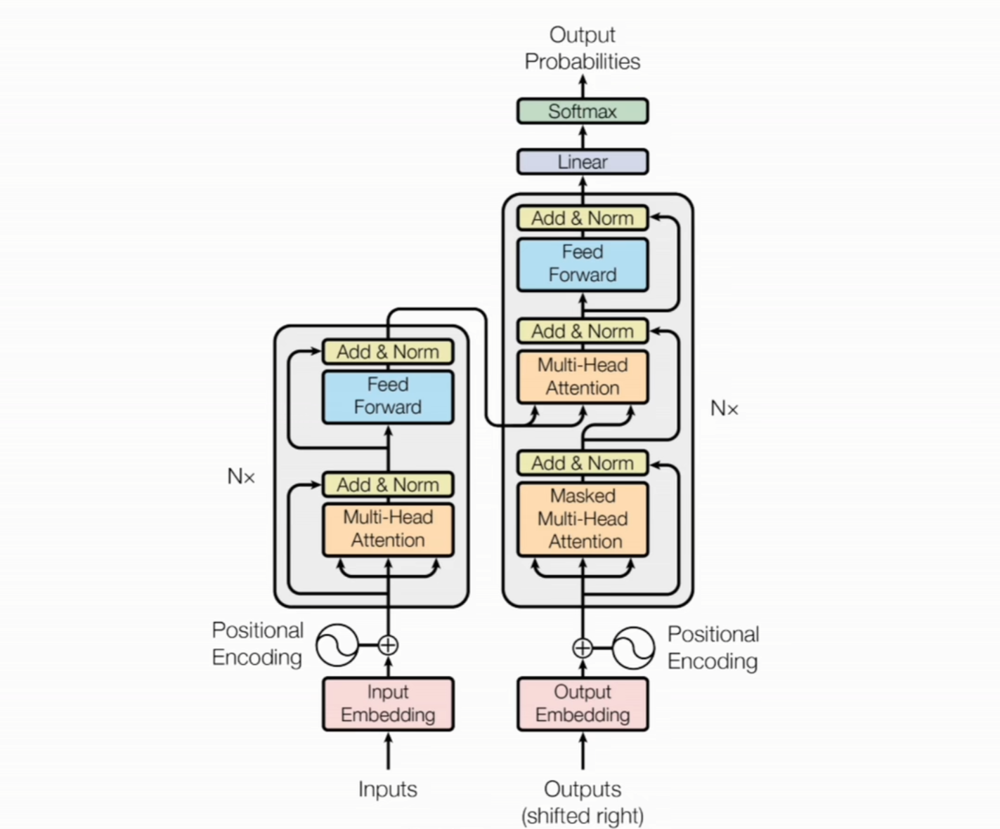
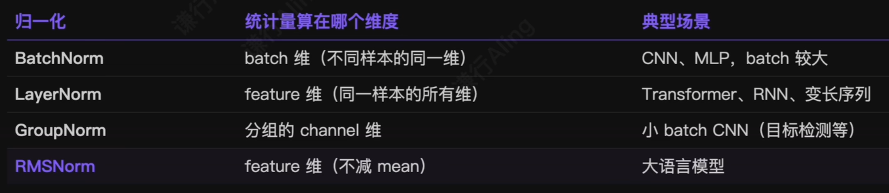
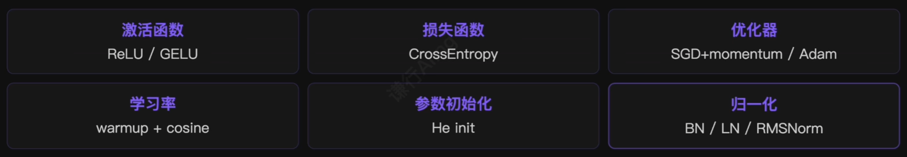

# 1.初始化只管得了第一步

> He 初始化让第 0 步的方差守恒，但训练一跑起来，权重在更新，激活分布也在漂移。

每一步梯度下降都会更新权重，权重变了，下一次前向传播的激活分布就和上一次不完全一样。单次差距很小，但几百上千次累积下来，深层的激活分布可以完全漂移到一个陌生的区间。

这种漂移从多个方面加大训练难度：

1. 某层激活值过大，对应的梯度也会过大，各层之间的学习速率隐式失衡，训练不稳定甚至**发散**。
2. 不同特征的尺度被拉开后，损失函数的等高线从圆形变成狭长椭圆，梯度方向偏离最优方向，**优化器来回震荡**。
3. 激活值被推到极端区域时，落入激活函数的饱和区，**梯度无法有效回传**。



# 2.什么是饱和区？

以 Sigmoid 为例，它的输出范围是 (0, 1)。当输入值很大（比如 10）或很小（比如 -10）时，输出几乎贴死在 1 或 0上，曲线变得极其平坦——这段区域就是**饱和区**。

曲线平坦意味着导数接近 0。反向传播时梯度要乘以这个导数，结果**梯度几乎消失**，参数无法有效更新。

> ReLU 没有右侧饱和的问题（输入大于 0 时导数恒为 1），这也是它取代 Sigmoid 成为主流的原因之一。不过 ReLU 在输入小于 0 时输出恒为 0、导数也是 0，神经元会彻底失活。


# 3.归一化 Normalization

既然问题出在均值和方差的漂移，那么在每一层做完线性变换之后，**将激活的均值拉回 0、标准差拉回 1**，就可以从根本上解决这个问题。

> 在统计学里，归一化和标准化是两个不同的概念：归一化通常指 min-max 缩放到 [0, 1]，标准化才是减均值除标准差。但深度学习社区从 2015 年 BatchNorm 论文开始就把后者叫做 Normalization，后续所有变体都沿用了这个名字。

所以在深度学习语境下提到的归一化，做的事情实际上就是**标准化（Standardization）**：对一组数据减去均值、再除以标准差，变换到均值 0、方差 1 的分布：

$$
\hat{x}=\frac{x-\mu}{\sigma}
$$

## 用具体数字走一遍归一化

假设某层一组激活值 $x$，均值 $\mu=52.88$，标准差 $\sigma=12.97$。第一步减均值，第二步除标准差：

|                        |
| ---------------------- |
|  |
|  |

> 整个过程只是 平移 + 缩放，分布形状完全没变。83.12 归一化后变成 2.33，仍然是最大——含义变成“比均值高 2.33 个标准差”。

## 数值变了为什么不影响训练？

> 神经网络学的是数据中的**模式**，而不是绝对数值。

某层的输入从 [33, 83] 变成 [-1.5, 2.3]，下一层的权重会相应调整来补偿尺度变化。网络的最终输出取决于各层的**组合变换能力**，不取决于中间某一层用什么尺度表示。就像温度从摄氏度变为华氏度，数字变了，但冷热关系没变——网络学的正是这种关系。



# 4.在神经网络中怎么做归一化？

归一化的操作只有两步，要在网络里使用，只需要回答一个问题：**均值和标准差从哪里来**？

训练时手上现成的样本就是当前 mini-batch。一个 batch 有 128 个样本，每个样本有 256 维特征，构成一个 128×256 的矩阵。对这个矩阵的每一列（每一个特征），用 128 个样本算出均值和标准差，然后对这一列做标准化。这就是**批归一化（Batch Normalization, BN）**。

$$
\hat{x_j}=\frac{x_j-\mu_j}{\sqrt{\sigma_j^2+\epsilon}}
$$

其中 $\mu_j$ 和 $\sigma_j^2$ 分布是这一列在当前 batch 内的均值和方差，$\epsilon$ 是一个极小的常数，防止除零。

## 可学习的缩放与偏移

到这一步，每一列激活都被拉回均值 0、方差 1。但只做到这一步还不够——所有层的激活都被压成一种分布，网络无法让某一层的输出偏大或偏小一点，**表达能力收到了限制**。

因此标准化之后还需要两个可学习参数 $\gamma$（缩放）和 $beta$（偏移）：

$$
y_j=\gamma_j\cdot\hat{x_j}+\beta_j
$$

| 为什么先标准化再学回去？                                                                                           | 推理时怎么办？                                                                                                |
| ------------------------------------------------------------------------------------------------------ | ------------------------------------------------------------------------------------------------------ |
| 不做标准化时，前面层参数一变，当前层输入分布就漂移，优化器的起点一直在变化。先标准化到 (0, 1) 等于给力优化器一个**固定的起点**，剩下的自由度通过 $\gamma,\beta$ 交给网络自己学。 | 推理时往往一次只有一个样本，没有 batch 统计量可用。解决办法是训练时同步维护一组**滑动平均（running mean / running var）**，推理时直接使用训练期间累积下来的全局统计量。 |

## 在 PyTorch 中使用 BatchNorm

在 PyTorch 中使用非常简单，在 Linear 之后、激活函数之前插入`nn.BatchNorm1d`。

看一个 6 层 MLP 写法，每层 Linear 之后、ReLU 之前各插一个`BatchNorm1d`：

```python
import torch.nn as nn

def make_deep_mlp_bn(depth=6, width=256, in_dim=784, out_dim=10):
    layers = [nn.Flatten()]
    last = in_dim
    for _ in range(depth):
        linear = nn.Linear(last, width)
        nn.init.kaiming_normal_(linear.weight, nonlinearity='relu')
        nn.init.zeros_(linear.bias)
        layers += [linear, nn.BatchNorm1d(width), nn.ReLU()]
        last = width
    layers.append(nn.Linear(last, out_dim))
    return nn.Sequential(*layers)
```

## 加上 BN，漂移消失了

对比加 BN 前后，各层激活标准差随训练步数的变化：



> 加 BN 之后，每层 std 从第 50 步起就稳定在 0.58~0.63。归一化将第 0 步的方差守恒扩展成了**训练全过程的方差守恒**。

# 5.LayerNorm：把方向转 90 度

BN 在 **batch 维**上做归一化——不同样本的同一个特征放在一起计算。这在图像任务里成立：同一个检测竖线的通道，输入猫或狗时激活值都应该在差不多的范围。

但在序列任务里情况反过来。一个 token 的**表示向量**内部各维度共同编码它的语义，更合理的做法是在**同一样本内部、跨所有特征维度**做归一化——这就是`LayerNorm`。



- **不依赖 batch size**：每个样本独立计算，训练和推理用同一套逻辑，不需要 running stats。
- **变长序列天然友好**：Transformer 以及当下几乎所有大语言模型都在使用 LN 或它的简化版。

## PyTorch 中使用 LayerNorm

```python
model_ln = nn.Sequential(
	nn.Linear(784, 256),
	nn.LayerNorm(256),
	nn.ReLU(),
	nn.Linear(256, 10),
)
```

## BN VS LN 使用场景

|                BN                 |                 LN                  |
| :-------------------------------: | :---------------------------------: |
|        CNN, MLP, batch 较大         |       Transformer, RNN, 变长序列        |
| 沿 batch 维 reduce（竖着切，每**列**一组统计量） | 沿 feature 维 reduce（横着切，每**行**一组统计量） |

# 6.Transformer 中的 Add & Norm

现在我们也能看懂 Transformer 架构图里反复出现的`Add & Norm`层了——它就是两步操作：

1. `Add（残差连接）`：把子层的输入直接加到输出上：`x + Sublayer(x)`，保证梯度能跳过子层直接回传。
2. `Norm（LayerNorm）`：对相加后的结果做 LayerNorm，把激活拉回稳定范围，防止深层漂移。

```python
x = self.norm1(x + self.attn(x))
x = self.norm2(x + self.ffn(x))
```



# 7.归一化家族

除了 BN 和 LN，还有两种常见的归一化方式：

1. `GroupNorm`：BN 与 LN 的折中，把通道分成若干组，每组内一起计算 mean/var。既不依赖 batch，也不像 LN 那样把所有通道混在一起。在 **batch size 极小的 CNN**（目标检测）中是 BN 的常见替代。
2. `RMSNorm`：LN 的进一步简化，去掉减均值这一步，只除以均方根, $\beta$ 参数也省去了。少做一步运算，效果却和 LN 相当甚至更好。LLaMA、Mistral、Qwen 等当代大语言模型几乎全部采用。



# 8.初始化 + 归一化 = 完整的稳定工具链

> 初始化负责第 0 步的方差守恒，归一化负责全过程的方差守恒。两者互补，缺一不可。

到这里，让网络稳定训练的工具链基本完整：



有了归一化兜底，初始化的选择变得没那么敏感——加了 BN/LN 之后，PyTorch 默认初始化就够用。把这些组合起来，几十层的网络都能稳定收敛。