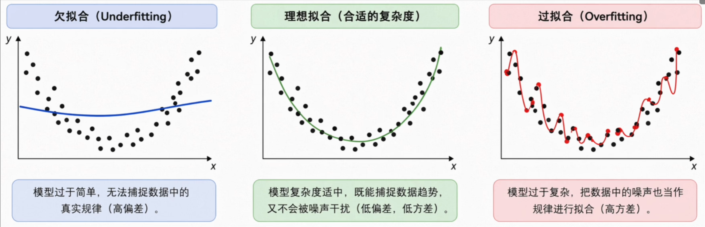
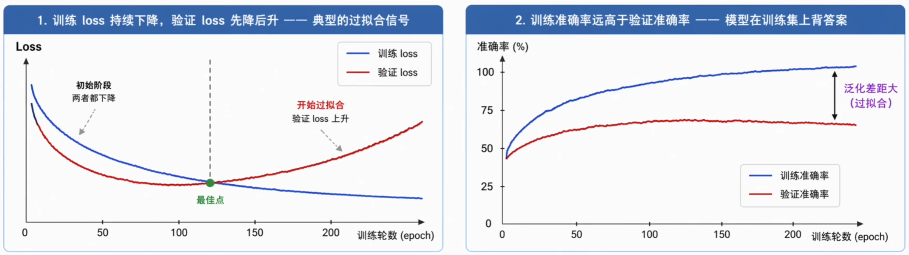
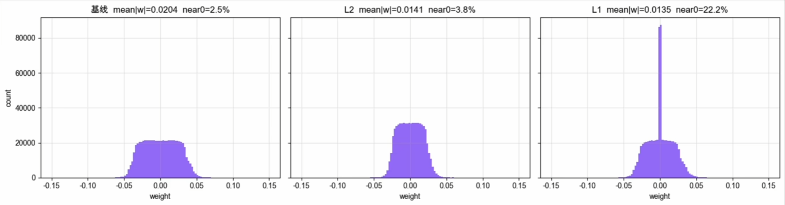
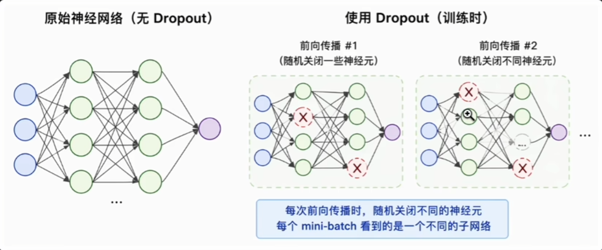
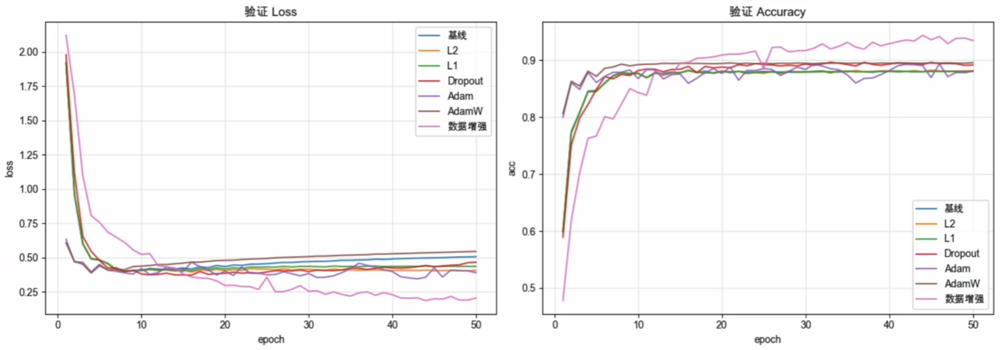
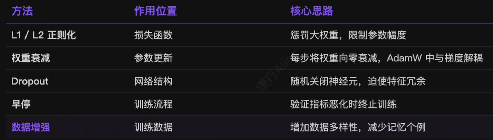

# 1.过拟合：训练越好，泛化越差

激活、损失、优化器、调度、初始化、归一化——前面六个环节都在拼命把**训练损失**往下压。但训练损失低不等于明显好用！在实践训练中，常常出现一种典型场景：

> 训练集 Loss 持续下降、准确率逼近 100%，验证集 Loss 在某个节点之后开始反弹，准确率不升反降。

- **欠拟合（Underfitting）**：模型容量不足，训练集和验证集都很差；
- **优秀拟合（Good Fit）**：捕捉整体趋势，自动忽略个别噪声，**泛化能力**最强；
- **过拟合（Overfitting）**：曲线试图穿过每一个噪声点，训练误差几乎为零，新数据上完全失控。



# 2.怎么判定过拟合：看训练曲线

过拟合的本质是**模型容量超过任务所需复杂度**，多出来的参数没有用来学规律，而是被用来死记硬背训练数据中的噪声和个例。判定过拟合最直接的方法就是观察训练曲线：

- **Loss 曲线分叉**：训练 Loss 持续下降，但验证 Loss 在某个拐点之后**先降后升**，呈现经典的 U 型反弹。
- **准确率悬殊**：训练准确率远高于验证准确率——模型在训练集上**背答案**，在验证集上**见光死**。



# 3.正则化：限制模型的有效容量

> Regularization：一系列对抗过拟合的技术，迫使模型学习更简洁、更通用的模式，而不是记忆训练数据的细节。

可以把正则化理解为一种**奥卡姆剃刀**原则的数学实现——在多个能解释训练数据的模型中，倾向于选择更简单的那个。深度学习中常用的正则化技术包括：

| L1 / L2 |   权重衰减   | Dropout | Early Stop |  数据增强  |
| :-----: | :------: | :-----: | :--------: | :----: |
|  惩罚大权重  | 向 0 衰减参数 | 随机关闭神经元 |   在恶化前停训   | 扩大训练分布 |

# 4.L1, L2 正则化

经典思路：在原始损失函数中引入**权重惩罚项**，对过大的权重施加约束，迫使模型倾向于选择数值更小的权重。

$$
\begin{cases}
\mathcal{L}_{reg}=\mathcal{L}_{原始}+\lambda\sum|w_i|\quad (L1) \\
\mathcal{L}_{reg}=\mathcal{L}_{原始}+\frac{\lambda}{2}\sum{w_i}^2\quad (L2)
\end{cases}
$$

其中 $\lambda$ 控制正则化的强度。

- **L1(Lasso)**：倾向于产生**稀疏权重**（许多参数直接变为 0），相当于自动特征选择。
- **L2(Ridge)**：倾向于让所有权重**均匀缩小**向 0 靠拢，但不会精确为 0，保持权重平滑分布。



## 为什么深度学习几乎只用 L2？

> 神经网络的泛化依赖**协同作用和参数的平滑分布**，而非剔除特定神经元。L2 处处可导，对 SGD, Adam 等梯度优化算法更友好。

在 PyTorch 中，L2 正则化通常不需要手动修改损失函数去加平方和，而是通过优化器的`weight_decay`参数实现：

```python
# 这行代码在标准 SGD 中，等价于在损失函数中加上了 (\lambda / 2 *\sum w^2)
optimizer = optim.SGD(
	model.parameters(), lr=0.01, momentum=0.9, weight_decay=1e-4
)
```

# 5.权重衰减 Weight Decay

权重衰减的核心思路是在每次梯度更新时，**强制让权重乘以一个略小于 1 的因子**，使其按比例自然缩小：

$$
w_{t+1}=\underbrace{{(1-\eta\lambda)}}_{衰减因子}\cdot w_t-\eta\cdot \frac{\partial\mathcal{L_{原始}}}{\partial w}
$$

$w_t$ 是第 $t$ 步的权重，$\eta$ 是学习率，$\lambda$ 是权重衰减系数（通常 $10^{-4}~10^{-2}$）。

> 每个权重就像绑了一根**回归原点的弹簧**——梯度没有强烈要求它增大时，它就会随时间自然衰减到零附近。

## SGD 下：权重衰减 ≡ L2 正则化

- **L2 正则化**：在损失函数层面给大权重施加惩罚项 $\frac{\lambda}{2}\sum{w_i}^2$。
- **权重衰减**：在优化器层面直接对参数动刀，每步乘以衰减因子 $(1-\eta\lambda)$。

两者在概念上是两件事。但把 L2 项代回 SGD 更新公式、对 $w$ 求导、展开重组：

1. **总损失**： $\mathcal{L}=\mathcal{L}_{原始}+\frac{\lambda}{2}\sum{w_i}^2$
2. **求导**： $\frac{\partial\mathcal{L}}{\partial{w}}=\frac{\partial\mathcal{L_{原始}}}{\partial\mathcal{L}}+\lambda{w}$
3. **SGD 更新**： $w_{t+1}=w_t-\eta(\frac{\partial\mathcal{L_{原始}}}{\partial w}+\lambda{w_t})$
4. **提取公因式**： $w_{t+1}=(1-\eta\lambda)\cdot w_t-\eta\cdot \frac{\partial\mathcal{L_{原始}}}{\partial w}$

> 展开后的公式与直接做权重衰减完全一致——概念上不同的两件事，**在标准 SGD 下数学上完全等价**。

## Adam 等价性被打破

> 既然 SGD 下两者等价，为什么还要区分？因为碰上 Adam 等自适应学习率优化器，这种等价性不再成立。

Adam 会根据**历史梯度的平方和**（二阶动量 $v_t$）对每个参数的梯度进行**自适应缩放**。如果把 L2 正则化写进损失，含义权重惩罚的 $g_t$ 会被一并混入 Adam 的一阶动量 $m_t$ 和二阶动量 $v_t$：

$$
g_t=\nabla\mathcal{L_{原始}}(w_t)+\lambda{w_t}\quad==>\quad 被混入 m_t, v_t
$$

这会导致一个严重的隐藏 Bug：

- **梯度原本就小的参数（vt 极小）**：在自适应除以 $\sqrt{v_t}$ 时，正则化力度被无形**放大**。
- **梯度原本就大的参数（vt 极大）**：同样的除法下，正则化力度被过渡**压缩**。

> 原本统一的正则化强度 $\lambda$ 被梯度的自适应缩放机制**扭曲**，正则化效果大打折扣，甚至无法收敛。

## AdamW：把权重衰减从自适应中解耦

2017 年 Ilya Loshchilov 等人提出 AdamW，核心思路： $\hat{m_t}$ 和 $\hat{v_t}$ 仅基于**原始损失梯度**计算，权重衰减直接作用于权重本身，与自适应缩放完全独立。

$$
w_{t+1}=(1-\eta\lambda)\cdot w_t-\frac{\eta}{\sqrt{\hat{v_t}}+\epsilon}\hat{m_t}
$$

```python
# ❌ 错误示范：标准 Adam + weight_decay
# 这里的 weight_decay 实际上实现的是 L2 正则化，会被自适应缩放
optimizer_l2 = torch.optim.Adam(
	model.parameters(), lr=1e-3, weight_decay=1e-4
)

# ✅ 正确示范：使用 AdamW 实现真正的解耦权重衰减
optimizer_adamw = torch.optim.AdamW(
	model.parameters(), lr=1e-3, weight_decay=1e-2
)
```

# 6.Dropout：随机关闭神经元

L1/L2 从权重数值角度限制容量，Dropout 则从网络结构多样性的角度做正则化——每次前向传播以一定概率随机将部分神经元的输出置 0，相当于在本次训练中将其关闭。

1. **强迫独立特征**：神经元不能再依赖相邻特定神经元的输出，每个都必须学习**独立有用**的特征。
2. **隐式集成**：每个 Batch 训练的都是不同的子网络，最终推理相当于**成千上万共享参数子网络的集体投票**。



```python
model = nn.Sequential(
	nn.Flatten(),
	nn.Linear(784, 512), nn.ReLU(), nn.Dropout(0.5),
	nn.Linear(512, 512), nn.ReLU(), nn.Dropout(0.5),
	nn.Linear(512, 10)
)
```

## 反向 Dropout：训练放大、推理不变

训练时部分神经元不工作，剩余神经元的输出期望会被压低。为了让训练时和推理时的**期望保持一致**，PyTorch 采用**反向 Dropout(Inverted Dropout) 机制**：

- **训练阶段**：丢弃神经元的同时，将**剩余神经元的输出除以 (1-p)**。例如 p=0.5 时存活的激活值被放大为原来的 2 倍。
- **推理阶段**：保持模型原样输出，**无需做任何缩放调整**，所有神经元正常工作。

```python
model.train() # 训练模式：Dropout 生效，激活值按比例缩放并随机丢弃
# 执行训练代码...

model.eval()  # 推理模式：Dropout 失效，所有神经元正常工作，无随机丢弃
# 执行验证/推理代码...
```

**注意**：忘记切换到`model.eval()`，Dropout 会在测试时继续随机关闭神经元，导致推理结果不一致、准确率大幅暴跌。

## Dropout 率的取值经验

Dropout 率的合理值取决于网络层位置和具体任务：


# 7.Early Stopping：在恶化前停下来

既然过拟合表现为验证指标在某个时刻开始恶化，那就在恶化之前停止训练——监控验证集指标，**连续若干个 epoch 没有改善**就终止训练，并回退到表现最好的 checkpoint。

```python
best_val_loss = float('inf')
patience = 10
no_improve = 0

for epoch in range(max_epochs):
	train_one_epoch(model, train_loader, optimizer)
	val_loss = evaluate(model, val_loader)
	
	if val_loss < best_val_loss:
		best_val_loss = val_loss
		no_improve = 0
		torch.save(model.state_dict(), 'best_model.pt')
	else:
		no_improve += 1
		if no_improve >= patience:
			print(f"Early stopping at epoch {epoch}")
			break
```

- **patience**：容忍多少个 epoch 没改善，通常 5~20 是合理范围；
- **隐式正则化**：没修改损失、没动结构，但训练步数越小，权重离初始值越近，可探索的**参数空间越小**，等价于限制了有效复杂度。

# 8.数据增强：从数据侧解决问题

上述方法都通过限制**模型容量**来缓解过拟合，数据增强则换了一个角度——**扩大训练分布**。对训练数据施加随机变换，让模型更难记住具体样本，被迫学习更通用的特征。

- **翻转**：水平 / 垂直
- **裁剪**：RandomCrop
- **旋转**：±N°
- **颜色抖动**：亮度 / 对比度

> 在 **CV** 任务中效果尤其显著——同一张图换几种角度、亮度，相当于免费多了几倍训练样本。

# 9.简单实验：七种方法的实际表现

在 1,000 份样本的过拟合场景下对比七种方法做横向对照，几条结论稳定可重现：

|                                                |
| ---------------------------------------------- |
|                          |
|  |

# 10.总结：五类正则化各司其职



> 现代工业级训练 Pipeline 往往同时应用 **AdamW 权重衰减 + 适度 Dropout + 丰富数据增强 + 早停机制**——它们从不同维度合力约束模型容量，最终训练出泛化良好的深度神经网络。