# 1.训练的主循环：四步反复跑

> 训练 = **初始化** $\rightarrow$ 重复(前向 $\rightarrow$ 损失 $\rightarrow$ 反向 $\rightarrow$ 更新) $\rightarrow$ **判断停下**

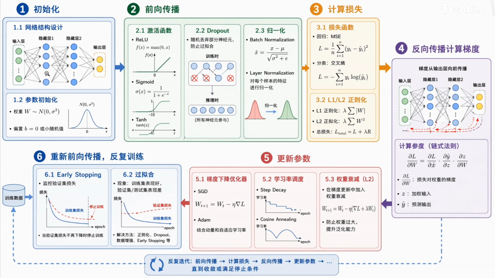

# 2.初始化

## 1）网络结构设计

训练的起点是确定网络的结构：**多少层、每层多少个神经元、层与层之间如何连接**。一个典型前馈网络由输入层、若干隐藏层、输出层组成，每层都做同一套共两步操作：

1. **先做线性变换**： $z=Wx+b$
2. **再加非线性**： $a=\sigma{(z)}$

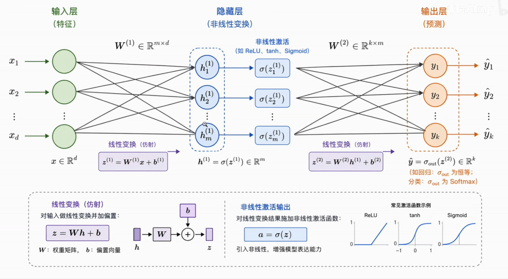

- **深度 VS 宽度**：层数决定**深度**，每层神经元数决定**宽度**。更深更宽 = 更强拟合能力 + 更多参数 + 更高过拟合风险；
- **从简到繁**：先用小模型起步、不够再加深加宽，比一上来就堆叠巨型网络**高效得多**。

## 2）参数初始化

结构定下来后，每层权重和偏置需要赋初值。处理不当会让信号在层间**爆炸或消失**，后续训练直接进行不下去。


```python
# 深网络 + ReLU 时手动覆盖为 He 初始化更稳妥
for m in model.modules():
	if isinstance(m, nn.Linear):
		nn.init.kaiming_normal_(m.weight, nonlinearity='relu')
		nn.init.zeros_(m.bias)
```

# 3.前向传播

## 1）激活函数

激活函数是神经网络拥有**非线性表达能力**的根本原因。去掉激活，无论多少层都等价于单层线性模型——**100 层和 1 层没有区别**。

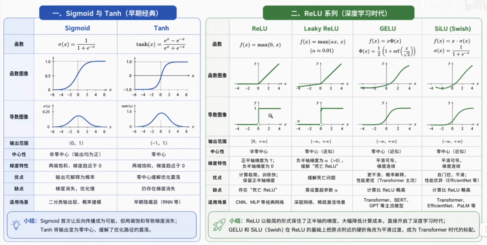

- **Sigmoid**：让反向传播成为可能；两端饱和、梯度消失；
- **Tanh**：零中心化，缓解优化路径震荡；
- **ReLU**：极简、保住正半轴梯度，开启深度学习时代；
- **GELU / SiLU**：平滑过渡，Transformer 时代标配。

> 输出层 **Sigmoid / Softmax**，隐藏层 **ReLU** 仍够用，Transformer / 大模型多用 **GELU / SiLU**。

## 2）Dropout

Dropout 是一种在前向传播过程中执行的正则化技术。训练时每个神经元都有一定概率（通常 0.1~0.5）被临时关闭，输出强制设为 0。

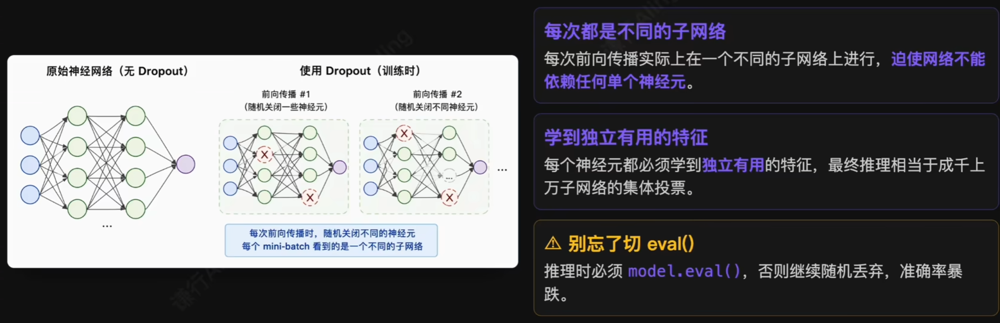

## 3）归一化

参数初始化只能保证**第一次**前向传播时方差稳定。训练推进、权重更新，各层激活值的分布会逐步漂移——归一化的作用就是把这种“方差守恒”**从初始化扩展到整个训练过程**。

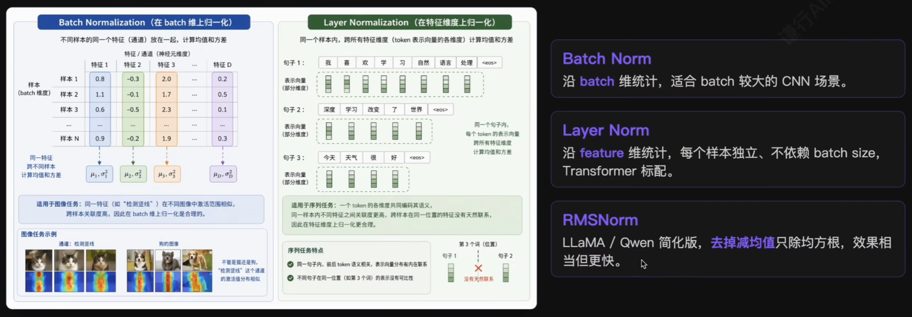

## 4）组装

> 每层顺序固定为 Linear $\rightarrow$ BN $\rightarrow$ ReLU $\rightarrow$ Dropout，最后一层留下裸 logits 交给损失函数处理。

```python
model = nn.Sequential(
	nn.Flatten(),
	nn.Linear(784, 256), nn.BatchNorm1d(256), nn.ReLU(), nn.Dropout(0.2),
	nn.Linear(256, 256), nn.BatchNorm1d(256), nn.ReLU(), nn.Dropout(0.2),
	nn.Linear(256, 10),  # 最后一层不加激活，输出 logits
)
```

前向传播结束后，模型产生预测值 $\hat{y}$。下一步就是衡量它和真值之间的差距。

# 4.计算损失

## 1）损失函数

损失函数把预测值 $\hat{y}$ 和真值 $y$ 的差距量化成一个标量 $L$。它本身告诉我们错得有多严重，**它的梯度是反向传播的起点**。


分类不能用 MSE：当预测概率接近 0 或 1 时，Sigmoid 梯度趋近 0，**模型反而学不动**。而 -log 形式让错得越离谱、损失爆炸式增长，梯度也越大。

```python
nn.MSELoss()           # 回归
nn.BCEWithLogitsLoss() # 二分类（输入 lofits, 内部自动加 Sigmoid）
nn.CrossEntropyLoss()  # 多分类（输入 lofits, 内部自动加 Softmax）
```

## 2）L1 / L2 正则化

单纯最小化训练损失，模型可能学到过于复杂的参数组合，泛化崩溃——这就是过拟合。L1 / L2 在原始损失上引入**权重惩罚项**，迫使模型选择数值更小的权重。

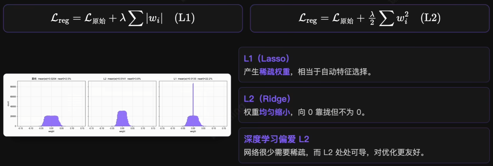

# 5.反向传播·计算梯度

反向传播的本质：从损失函数出发，沿前向传播**反方向**，利用链式法则逐层计算损失对每个参数的偏导数。

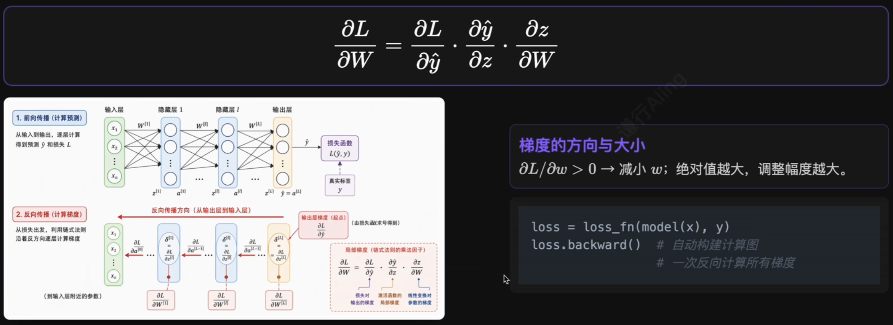

# 6.更小参数

## 1）优化器演化

$$
W_{t+1}=W_t-\eta\cdot\nabla{L}
$$

沿梯度反方向走一小步——但实际训练会遇到山谷震荡、参数敏感度差异、初期估计不稳等问题。优化器的演化就是研究者一代代针对这些问题做出的改进。

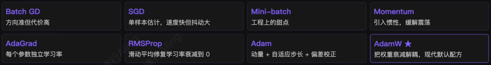

```python
# CV 任务常用：传统 CNN 仍偏爱 SGD+Momentum; ViT 已转向 AdamW
optimizer = optim.SGD(model.parameters(), lr=0.1, momentum=0.9)

# NLP / 大模型几乎清一色 AdamW(BERT, GPT, LLaMA, Stable Diffusion)
optimizer = optim.AdamW(model.parameters(), lr=1e-3, weight_decay=1e-2)
```

## 2）学习率调度

学习率 $\eta$ 是训练中最敏感的超参数：太大震荡发散，太小收敛缓慢。**训练不同阶段需要不同步长**。

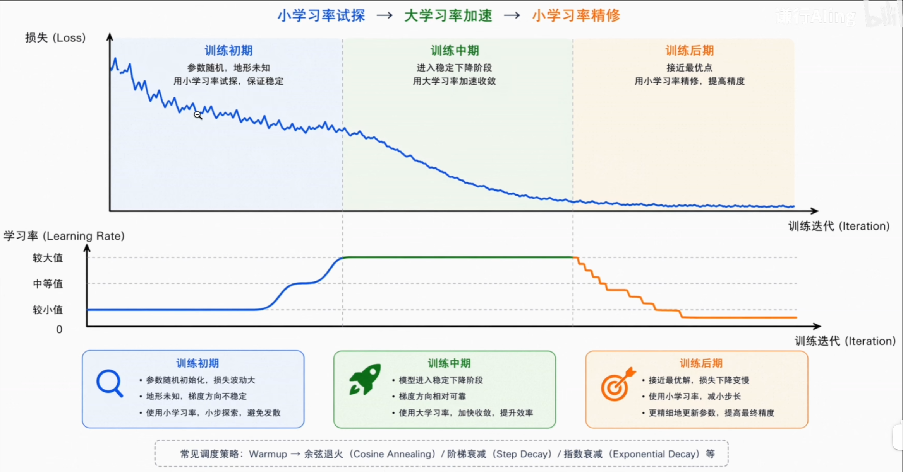

- **Warmup**：线性预热把学习率从 0 推到目标值，给优化器稳住**动量和二阶矩估计**。
- **Cosine Annealing**：余弦平滑下降——前期缓降、中期快降、后期再缓降，契合训练各阶段需求。

```python
def lr_lambda(step):
	if step < warmup_steps:
		return (step + 1) / warmup_steps
	progress = (step - warmup_steps) / max(1, total_steps - warmup_steps)
	return 0.5 * (1 + math.cos(math.pi * progress))
	
scheduler = LambdaLR(optimizer, lr_lambda)
```

## 3）权重衰减

权重衰减是另一个重要的正则化技术，在每一步参数更新时把权重朝零的方向缩一点：

$$
W_{t+1}=W_t-\eta(\nabla{L}+\lambda{W_t})
$$

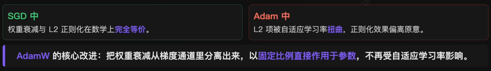

```python
opyimizer_adamw = torch.optim.AdamW(
	model.parameters(), lr=1e-3, weight_decay=1e-2
)
```

# 7.何时停下·Early Stopping

训练越久不一定越好——模型容量超过任务所需时，会出现典型的**过拟合**现象：训练 loss 持续下降，但**验证 loss 先降后升**，模型开始记忆噪声而非学习规律。

> **Early Stopping**：持续监控验证集指标，连续若干个 epoch(5~10个) 没改善就终止训练，回退到最佳 checkpoint。

```python
best_val_loss = float('inf')
patience = 10
no_improve = 0

for epoch in range(max_epochs):
	train_one_epoch(model, train_loader, optimizer)
	val_loss = evaluate(model, val_loader)
	
	if val_loss < best_val_loss:
		best_val_loss = val_loss
		no_improve = 0
		torch.save(model.state_dict(), 'best_model.pt') # 保存当前最佳
	else:
		no_improve += 1
		if no_improve >= patience: # 连续 10 轮没改善，停止
			print(f"Early stopping at epoch {epoch}")
			break
			
model.load_state_dict(torch.load('best_model.pt')) # 回退到最佳
```

# 8.总结：核心知识

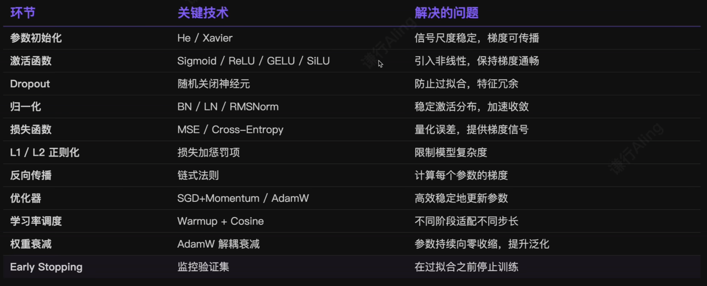