# 1.计算机视觉：让机器理解图像

对人类来说，识别一张图片往往毫不费力，但是对计算机而言，图像本质上只是一组数字，也就是像素对应的 RGB 数值。换个角度、改变光照、被遮挡一部分，**像素分布就可能剧烈变化**，人却依然认得出。

> CV 的核心不是处理像素，而是从原始视觉数据中**提取有意义的信息**，完成类似人类视觉系统的理解、判断和推理。

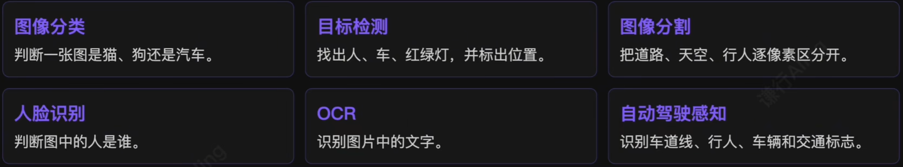

# 2.图像的数字化表示

## 1）图像在计算机里是什么？

一张图像可以看作由大量小色块按网格排列而成。每一个小色块称为一个**像素**，它记录了图像在该位置上的颜色信息。

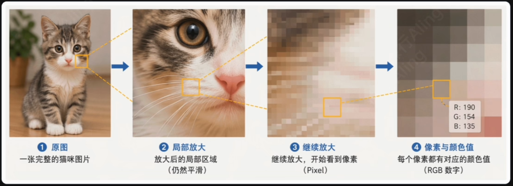

我们看到的是连续、自然的画面；计算机看到的则是一个个离散的像素点。把图像不断放大，像素网格就会逐渐显现出来。

## 2）颜色：RGB 通道组成图像张量

计算机通常用红、绿、蓝三种基础颜色通道表示颜色。每个通道的亮度是 [0, 255] 之间的数字，数值越大，对应颜色成分越强。

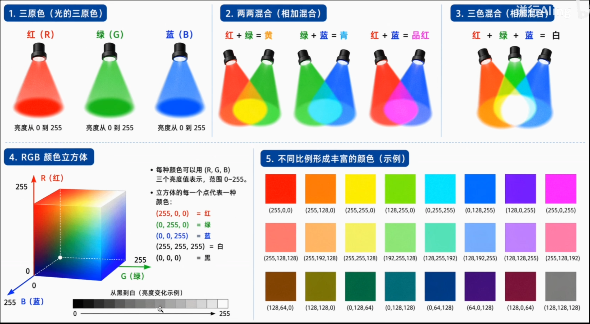

- **彩色图像**：每个像素含 R, G, B 三个数值。一张 32 × 32 的彩色图，在 PyTorch 中通常写作通道在前的三维张量：3 × 32 × 32；
- **灰度图像**：每个像素只需一个亮度数字，因此只需一个二维矩阵即可表示。

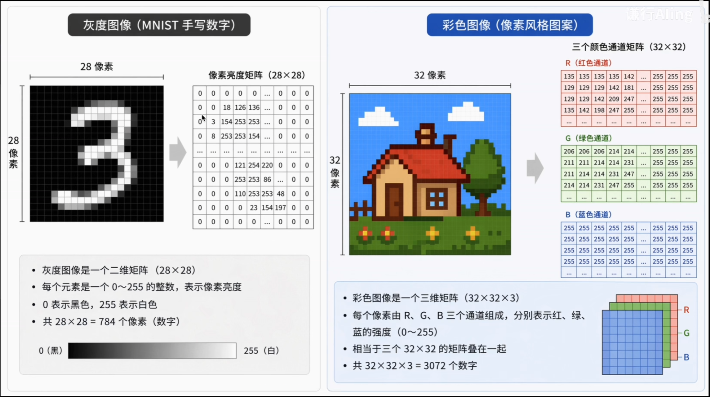

> 到这里，图像已经变成了神经网络能够接收的数字价格。问题是：如果像处理普通向量一样处理它，会发生什么？

# 3.MLP 的困局：展开以后再全连接

前面我们用 MLP 配合学习率调度、参数初始化、归一化和正则化，在手写数字识别上达到很高的准确率。自然问题是：稍作调整后，它能否处理更复杂的视觉任务？

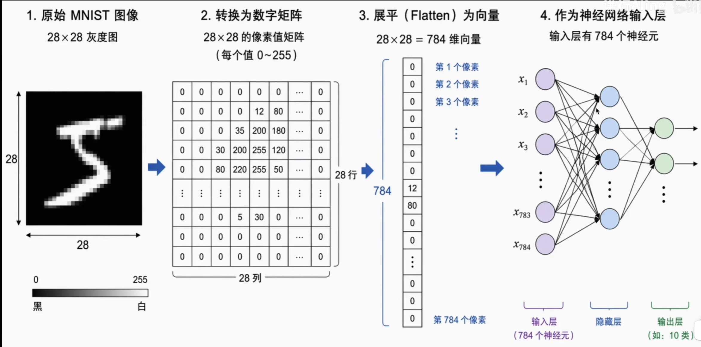

> MNIST 为什么还行：MNIST 是 28 × 28 灰度图，展平以后只有 784 个输入特征。对这样的低维输入，全连接层的参数量仍然相对可控。

真实图像一大，参数立刻膨胀：

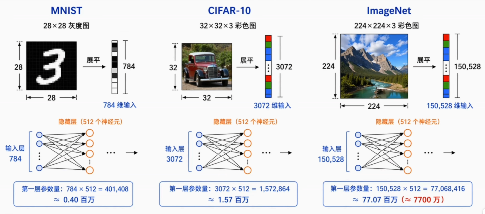

> 这还只是**第一层**而已！

问题不只是参数太多！参数量爆炸会让训练变慢、内存压力陡增，也会在数据有限时显著增加过拟合风险。但 MLP 不擅长处理图像更深层的原因在于：图像不是一串彼此独立的数字，而是一种具有**空间组织关系**的数据。

- **局部相关性**：模式通常只出现在一小块区域内；
- **平移等变性**：位置变了，模式本身依然存在；
- **层次结构**：低级模式逐级组合成高级语义。

## 1）局部相关性

一个像素的含义，主要由它**周围**的像素共同决定，而不是由整张图中距离很远的像素决定。

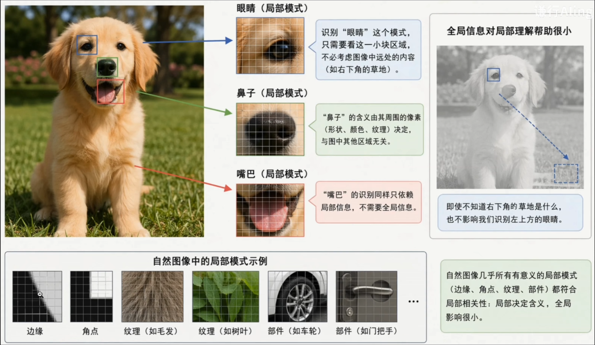

> 要识别眼睛这个基本模式，关注这一小块区域就够了，并不需要同时考虑草地、树。而我们在 MLP 中建立全连接，本质上是让所有的像素彼此之间都发生关系，但其实没有必要。

## 2）平移等变性

同一个局部模式出现在图像左上角或右下角，本质上仍是同一种模式，只是位置发生了变化。

> **检测器应该做到**：输入中的模式平移了，响应也跟着平移，而不必为每个位置重新学习一套检测规则。

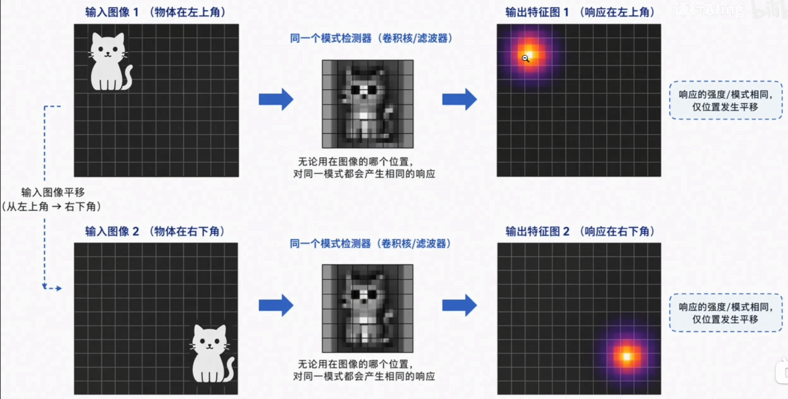

## 3）层次结构

图像中的高级语义通常不是直接从单个像素产生，而是由底层视觉模式**逐级组合**而来。

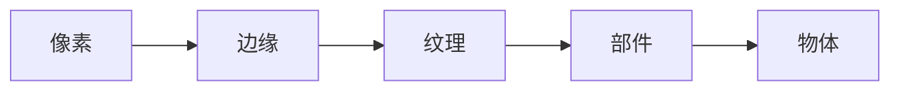

低层特征简单且通用（几乎每张图都有边缘）；高层特征复杂且专用（猫脸只在猫相关图像中出现）。

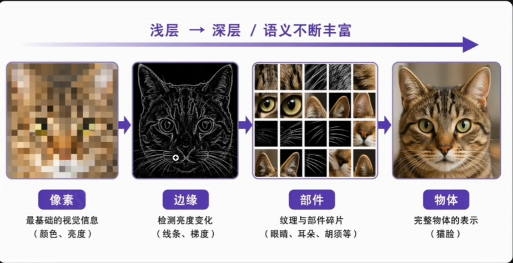

# 4.CNN 的核心思路：先看局部，再看整体

MLP 把图像展平成一维向量，既忽略局部相关性，又破坏空间结构。真正适合图像任务的网络，应该顺应图像本身的特点。

> 卷积神经网络（CNN）的核心思路可以概括为一句话：**先看局部，再逐渐看整体**。

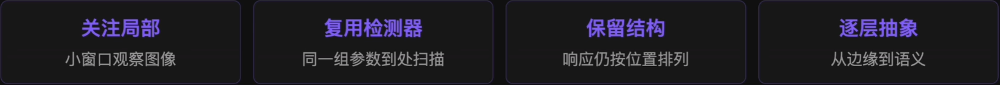

## 这个思路并不是凭空发明的

早在 20 世纪中叶，神经科学家 Hubel 和 Wiesel 在研究猫的视觉皮层时发现：有些神经元只对**特定方向的边缘**强烈响应。

> 神经系统并非一开始就识别猫、车、人脸，而是先从边缘、方向和明暗变化开始编码视觉信息。

正因为猫在这段历史里立过大功，很多 CV 科普都爱拿猫当例子。

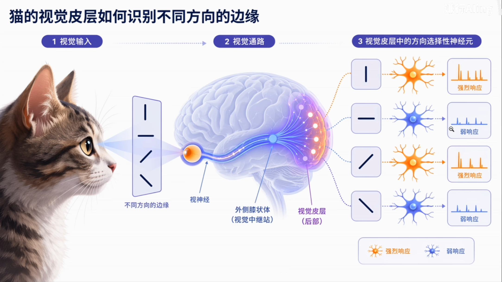

## 卷积：用同一个小窗口扫描整张图

这里的**扫描**，就是 CNN 名字里的卷积（Convolution）。先理解成：用同一个小窗口在整张图上滑动，每到一个位置，就计算这个局部区域与卷积核的匹配程度。

- **响应值**：当前位置越像卷积核要找的模式，响应值就越高；越不像，响应值就越低。
- **特征图（Feature Map）**：所有位置的响应值按空间位置排列，就形成一张新的特征图。

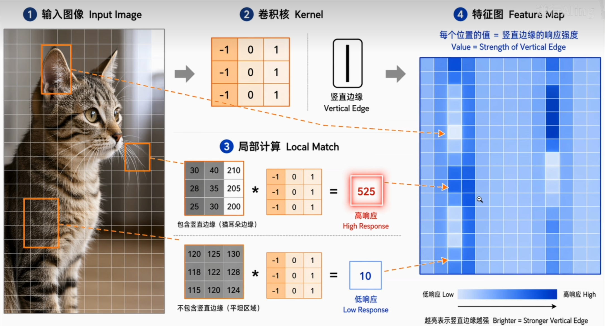

## CNN 为什么适合图像

卷积核扫描图像，既能降参数、又特别适合图像，核心就两条设计，**恰恰对上了图像的两条性质**：

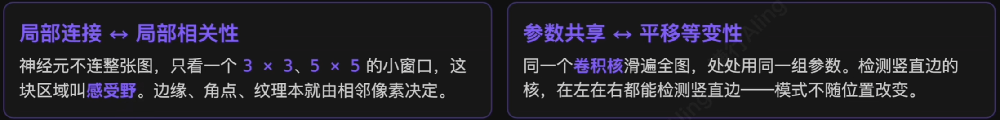

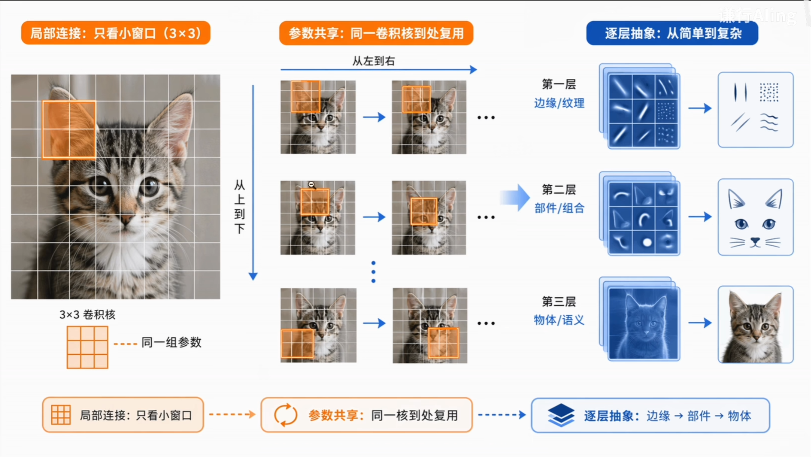

> **不同的核找不同的模式**：横向边、竖向边、颜色、纹理；层数越深，简单模式越被组合成形状、部件和语义概念。

# 5.总结

| 问题链       | 关键判断                | CNN 的对应设计             |
| --------- | ------------------- | --------------------- |
| 图像如何表示    | 图像是像素组成的二维 / 三维网络结构 | 保留空间网格，而不是当作普通向量      |
| MLP 为什么吃力 | 展平后参数量膨胀、空间关系被破坏    | 用局部连接替代大规模全连接         |
| 图像有什么规律   | 局部相关、位置可变、逐层组合      | 卷积核扫描图像，在不同位置复用检测器    |
| 卷积在做什么    | 小窗口逐位置计算局部匹配程度      | 生成特征图，逐层从低级纹理走向高级语义   |
| 为什么需要 CNN | 模型结构应该顺应数据结构        | 局部感知、参数复用、保留空间结构、逐层抽象 |
