# 1.CNN 的整体认知：提特征，再做判断

- **前半段**：**特征提取器，Conv ==> ReLU ==> Pool** 反复出现：**卷积**提取局部模式，**ReLU** 引入非线性，**池化**降低空间分辨率并扩大有效视野。
- **后半段**：**分类器，Flatten ==> Linear** 不再直接面对原始像素，而是处理卷积层提炼后的高层特征，最终输出类别得分。

> CNN 不是一层卷积直接看懂整张图，而是通过层层堆叠，把像素逐渐变成语义。

| 低层           | 中层            | 高层                  |
| ------------ | ------------- | ------------------- |
| 先看边缘、颜色变化和纹理 | 把局部线索组合成轮廓和部件 | 形成对完整物体的理解，感受野也越来越大 |

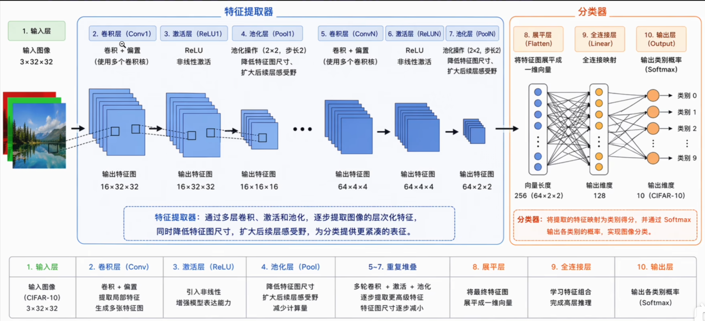

# 2.卷积层：把局部模式变成特征图

**卷积层**（Convolutional Layer）的核心任务，是在不展平图像、不做全连接的情况下，从图像中提取有意义的局部特征。它使用一个小的权重矩阵，也就是**卷积核**，在图像上滑动。每到一个位置，就把当前窗口中的像素与卷积核权重逐项相乘、再求和。

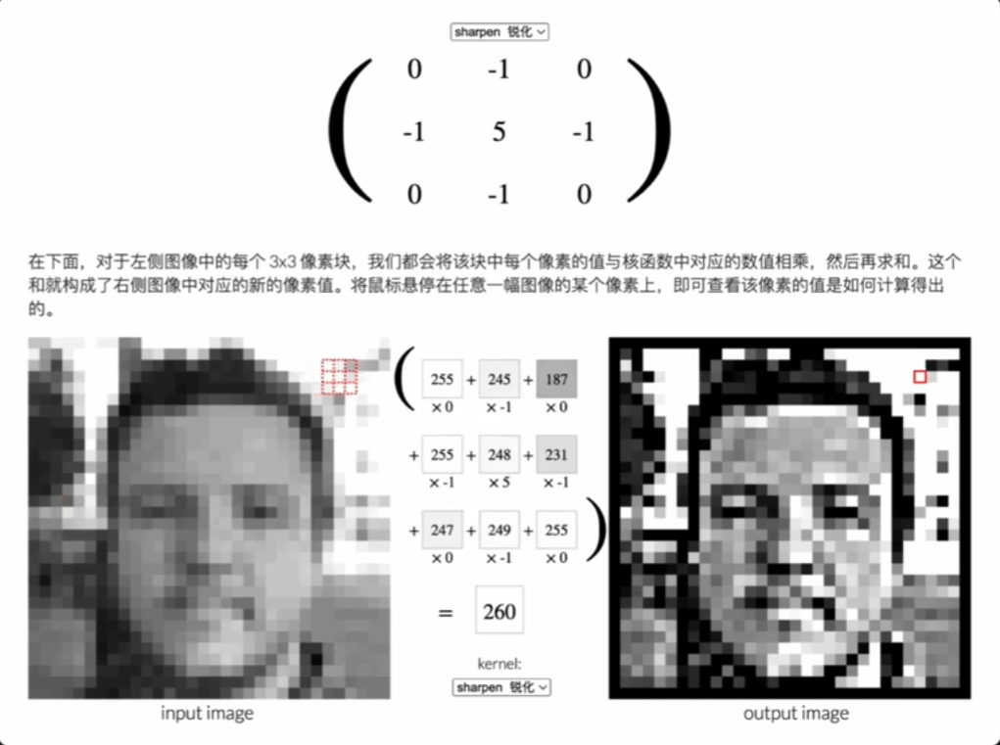

## 响应值：局部区域像不像这个模式

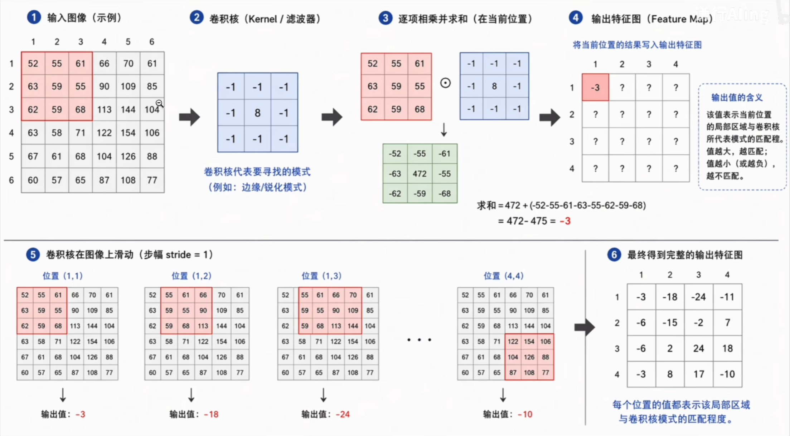

> 如果当前位置很像卷积核要寻找的模式，响应值就会比较大；如果不像，响应值就会比较小（负数算小）。

## 特征图：卷积核扫完整张图后的结果

当一个卷积核扫描完整张图像后，每个位置都会得到一个响应值。把这些响应值按空间位置排列起来，就得到这个卷积核对应的**特征图**（feature map）。

> 从这个角度看，卷积核就是一个小型特征检测器。

|                        |
| ---------------------- |
| 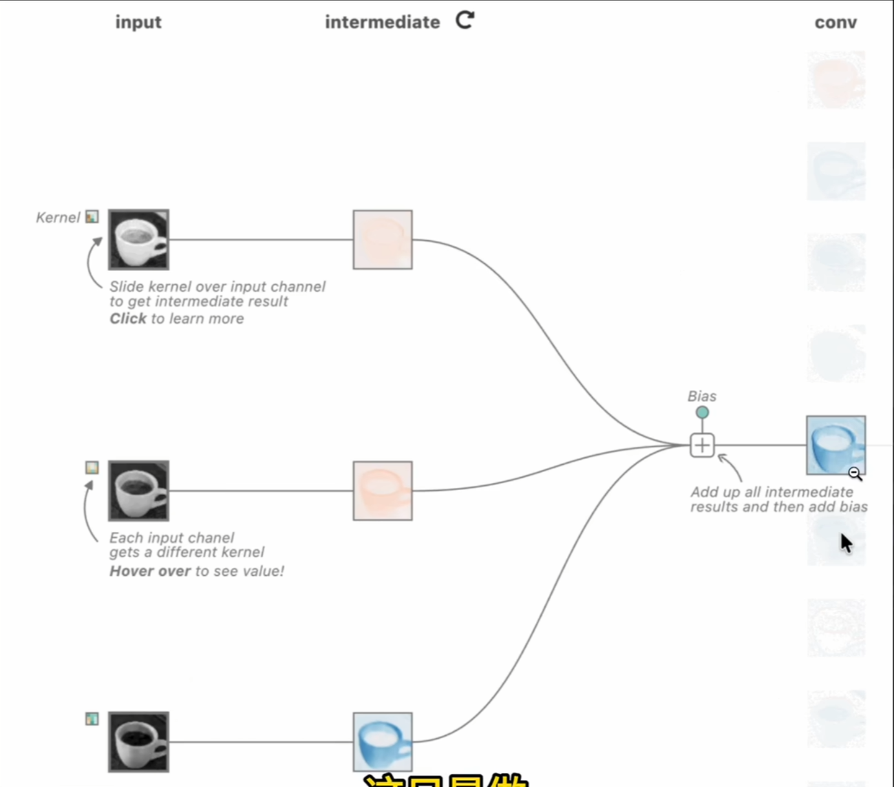 |
| 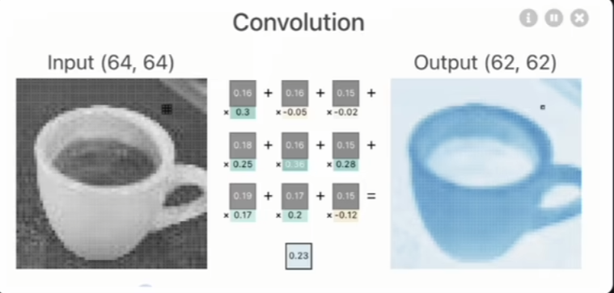 |

> ***卷积核不是手写规则，而是训练出来的！***

一个卷积核可能学会检测竖直边缘，另一个卷积核可能学会检测横向边缘，也可能对颜色变化、纹理或角点更敏感。

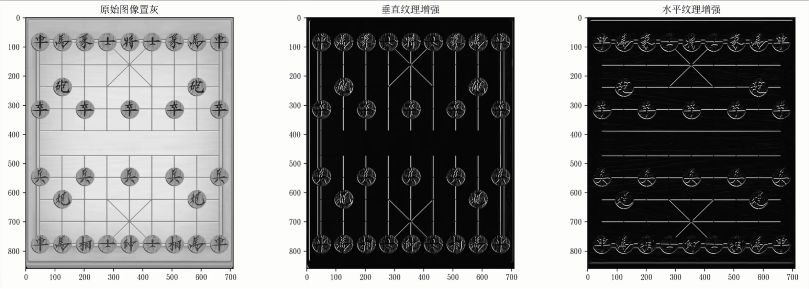

那我们怎么知道不同特征卷积核*该设成哪些数字嘞*？答案是没人预习知道这些数字该怎么设。它们和普通神经网络的权重一样，由训练自动学习出来。

## kernel size：每次看多大的局部区域

卷积核大小决定每次观察多大的局部区域。常见选择是 **3×3** 或 **5×5**。卷积核越大，一次能看到的范围越大，但参数量和计算量也会增加。现代 CNN 中最常见的是 **3×3**，因为它足够小，便于堆叠。

> 多层 **3×3** 卷积叠起来，也可以逐渐获得更大的感受野。

$$
输出大小 = \frac{输入大小-卷积核大小}{步幅} + 1
$$

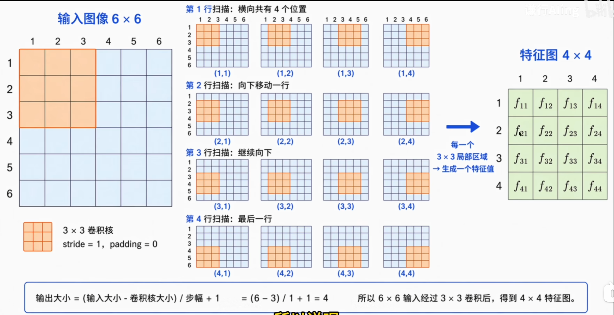

## stride：卷积核每次移动几格

步幅决定卷积核每次移动几个像素。*默认情况下步幅是 1*，表示每次移动一格。如果步幅设为 2，卷积核每次跳过一个位置，输出特征图的高和宽就会明显变小。

> 一般卷积层常用 stride=1，池化层或下采样位置才更常见 stride=2。

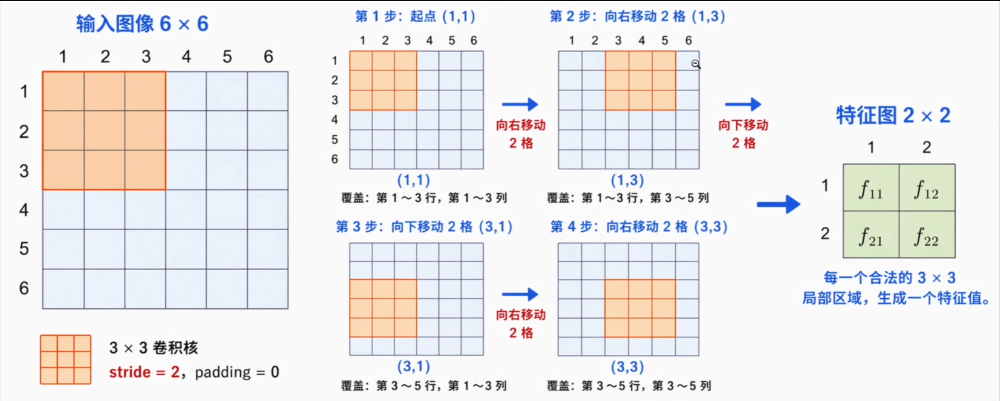

## padding：给图像边缘补零

一个 **3×3** 卷积核只能在图像内部完整滑动，输出尺寸会比输入小一圈。*为了保持卷积后图像尺寸不变*，可以在图像边缘补零。填充以后，卷积核也可以覆盖到边界附近的位置。

> **3×3** 卷积配合 padding=1，可以在提取局部特征的同时保持空间尺寸不变。

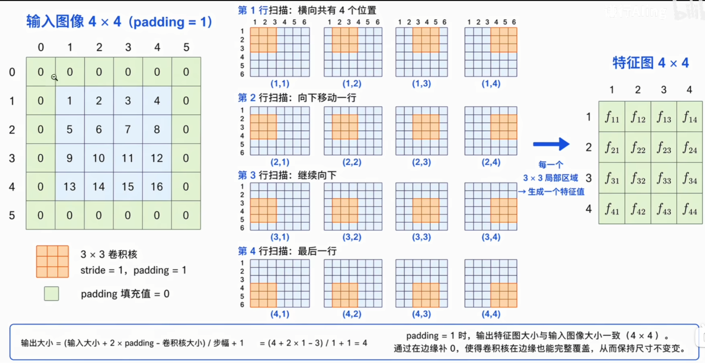

## 卷积输出尺寸怎么计算

$$
\begin{align}
H_{out}=\lfloor\frac{H_{in}+2P-K}{S}\rfloor+1 \\
W_{out}=\lfloor\frac{W_{in}+2P-K}{S}\rfloor+1
\end{align}
$$

- **保持尺寸**：32×32 输入，(K=3, P=1, S=1)，输出仍然是 32×32；
- **降低分辨率**：如果把 stride 改成 2，输出就会变成 16×16。

## 输入通道：彩色图像不是二维矩阵

真实 CNN 里的卷积必须处理通道数。一张彩色图像的输入形状是 3×H×W，三个通道分别对应 (R, G, B)。

> 此时一个卷积核不是简单的 K×K，而是 3×K×K，会同时覆盖三个输入通道。

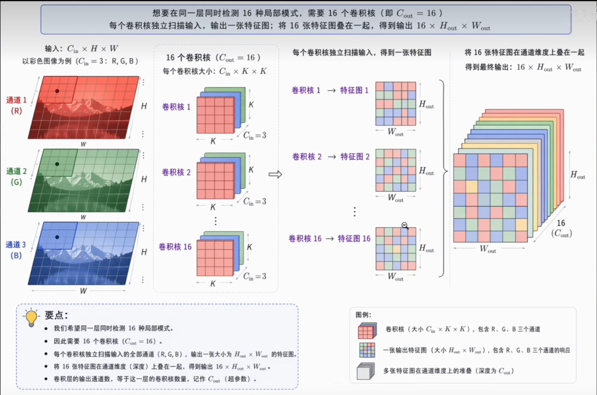

## 一个卷积核，只生成一张特征图！

不管输入有多少个通道，一个卷积核会在每个通道上分别做乘加，再把结果加在一起，最终得到一个响应值。因此，……

## 输出通道数 = 卷积核数量

一张特征图只能表示一种检测结果。如果希望同一层同时检测 16 种局部模式，就需要 16 个卷积核。每个卷积核独立扫描输入，各自输出一张特征图。把 16 张特征图叠在一起，输出就变成了 16×H×W。

```txt
3 × 32 × 32
Conv2d(3, 16, kernel_size=3, padding=1)
==> 16 × 32 × 32
```

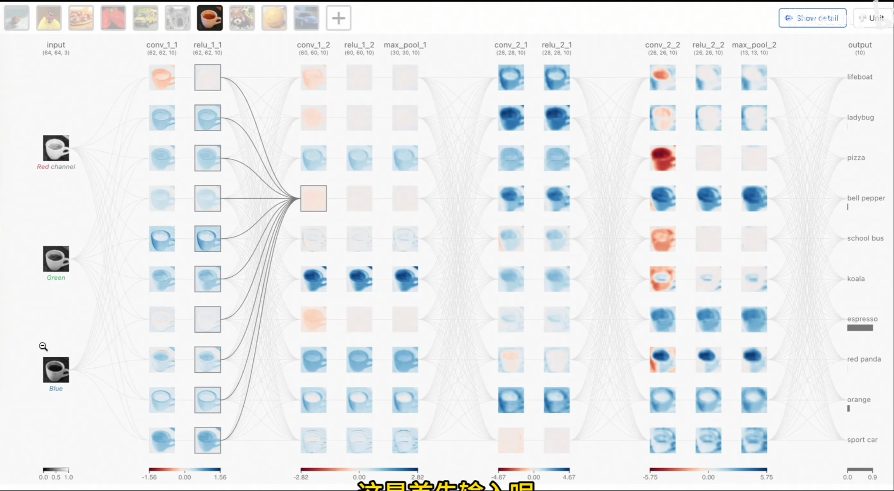

## 参数共享：卷积层为什么省参数

$$
C_{out}\times(C_{in}\times{K}\times{K})+C_{out}
$$

```txt
代入上面的例子：
16 × (3 × 3 × 3) + 16 = 448
```

> 这个数字和图像的高、宽没有关系。只要输入通道数、输出通道数和卷积核大小不变，卷积层参数量就不变。

## 卷积层小结

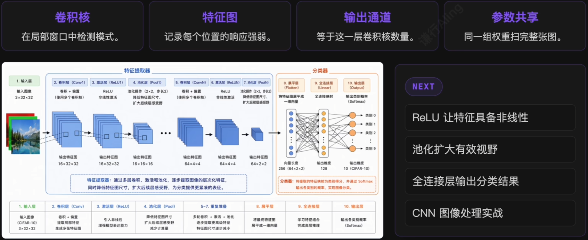

# 3.ReLU：让特征组合具备非线性

卷积层保留了空间结构，也显著减少了参数量，但它本质上仍然是线性运算。只堆叠卷积而不加入非线性，网络仍然很难表达复杂模式。

$$
ReLU(x)=\max(0,x)
$$

> 卷积负责检测局部模式，ReLU 负责引入非线性。后续层才有能力把不同位置、不同通道上的响应组合成复杂的视觉特征。

# 4.池化层：降低分辨率

池化层使用一个小窗口在**特征图**上滑动，对空间维度做**下采样**，最常见的是**最大池化**(max pooling)。一个 2×2 的最大池化窗口，会在每个局部区域中保留*响应最强*的那个值，使特征图的高和宽减半。

|                        |
| ---------------------- |
| 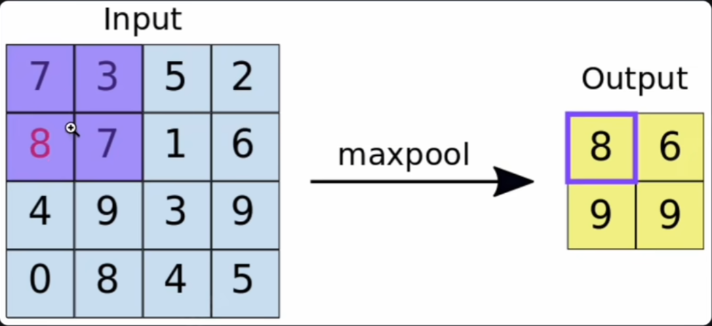 |
| 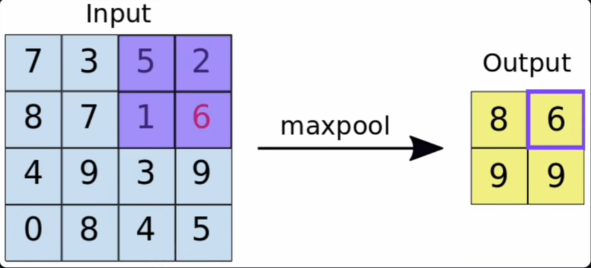 |
| ...                    |

## 池化更重要的作用：扩大有效视野

池化把相邻区域压缩之后，下一层卷积核在特征图上的尺寸可以保持不变，但对应回原图时覆盖的区域更大。

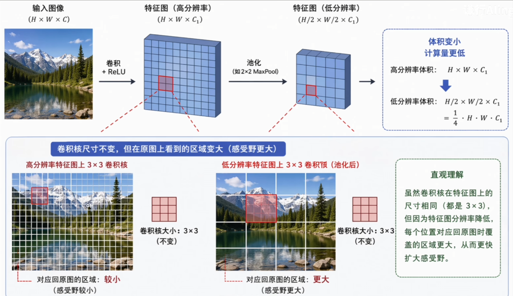

> 池化通过降低分辨率，让网络在看完局部之后，逐渐有能力看向整体。

# 5.Flatten 与 全连接：从特征图到类别

卷积部分输出的是 **C × H × W** 结构：有通道、高度、宽度。但分类任务最终需要的是每个类别对应的判断结果。

- **Flatten**：特征图拉成一维向量
- **Linear**：映射到类别数维度
- **Softmax**：推理时转成概率分布

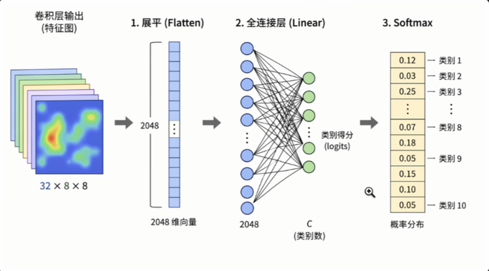

## CNN 最后也用了全连接，为什么没问题？

- **MLP 直接处理图像**：输入维度高，空间结构一开始就被展平，全连接层需要直接从原始像素中寻找模式。
- **CNN 后面的全连接**：处理的是多层卷积和池化之后的高层特征，尺寸更小、语义更强、冗余更少。

> 全连接层在这里不再负责从原始像素中找模式，而是根据高层特征做最终判断。

## 最小 CNN 的形状流

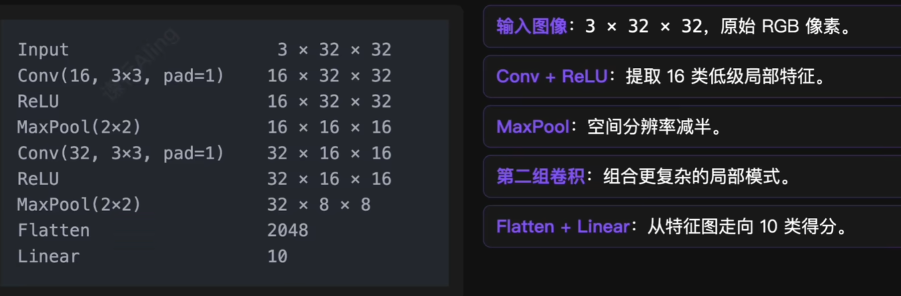

### CNN 内部的三个变化

- **空间尺寸变小**：从 32 × 32 到 16 × 16，再到 8 × 8；
- **通道数变多**：从 3 到 16，再到 32；
- **语义层级变高**：从边缘纹理，逐渐接近部件和整体结构。

> 空间越来越小，通道越来越多，语义越来越抽象。

***DLNotes 的单元 12：PyTorch 实现最小 CNN**

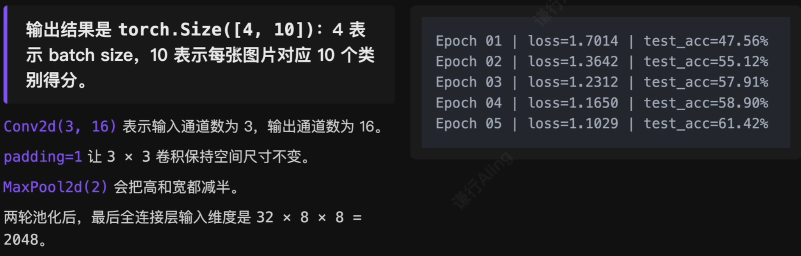

## 更接近实际训练的 CNN 写法

最小 CNN 适合理解形状变化。但在 CIFAR-10 这样的彩色图像任务上，如果希望训练表现更稳定，通常还会加入一些常见改进：

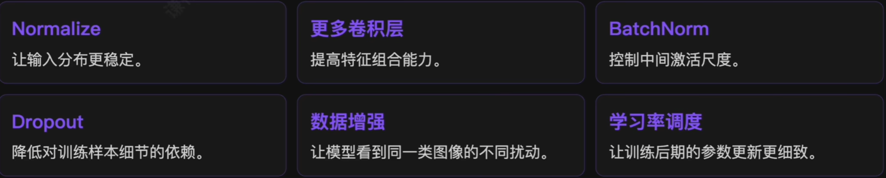

### 训练集增强，测试集保持稳定

***DLNotes 的单元 13**

## BetterCNN：更完整的特征提取器

***DLNotes 的单元 14**

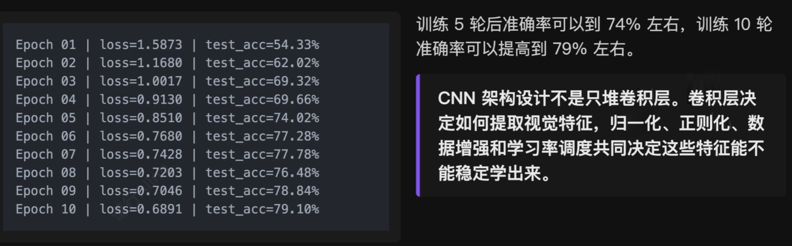

# 6.总结：CNN 如何看懂一张图像？

- **卷积层**：使用可学习的卷积核，在局部窗口中提取模式；卷积核数量决定输出通道数；
- **ReLU**：让卷积得到的特征响应具备非线性，使多层网络能组合复杂视觉模式；
- **池化层**：降低分辨率、减少计算量，同时扩大后续层的有效感受野；
- **Flatten -> Linear**：把高度抽象、尺寸压缩后的特征图转换成类别得分。

> 卷积核提取局部调整，特征图保留空间响应，池化扩大有效视野，多层堆叠完成抽象组合，最终由分类器输出图像类别。

## 可视化演示

如果想把卷积核、特征图和 CNN 内部流动看得更直观，可以配合这些可视化工具继续观察：

- https://setosa.io/ev/image-kernels/
- https://github.com/vdumoulin/conv_arithmetic
- https://poloclub.github.io/cnn-explainer/