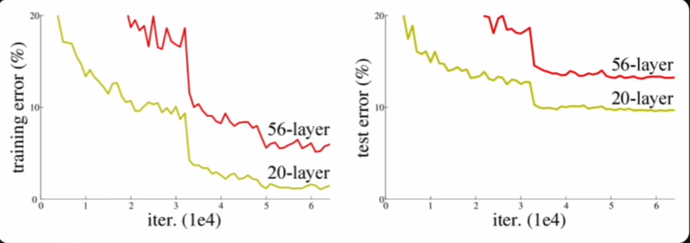
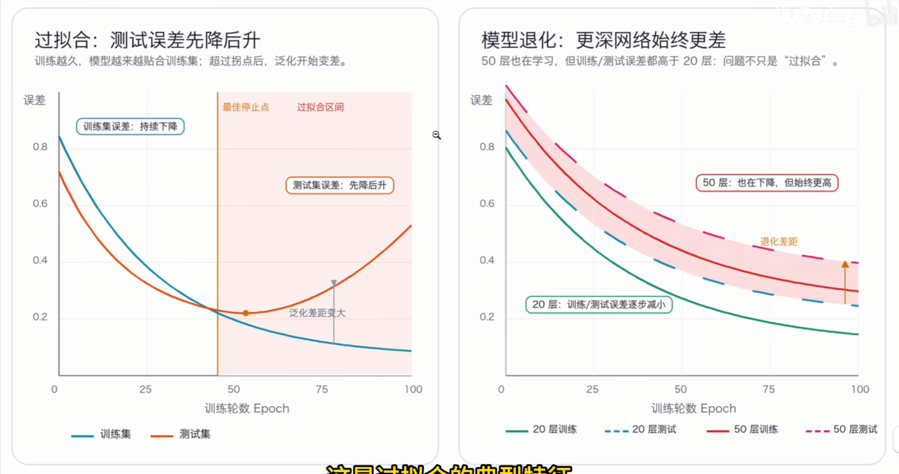
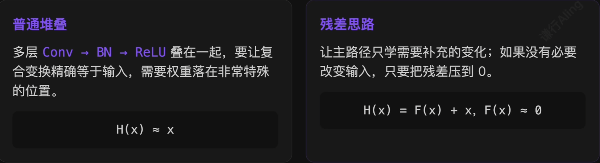
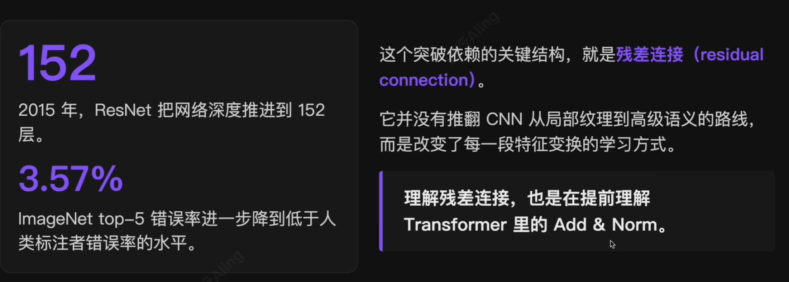
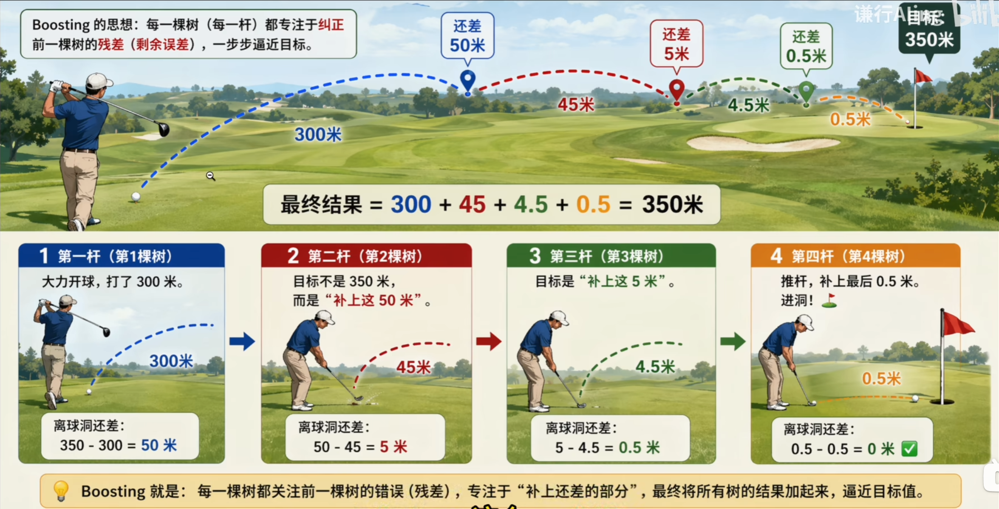
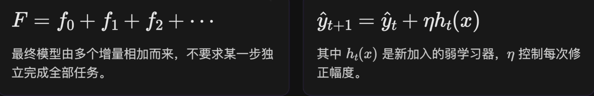
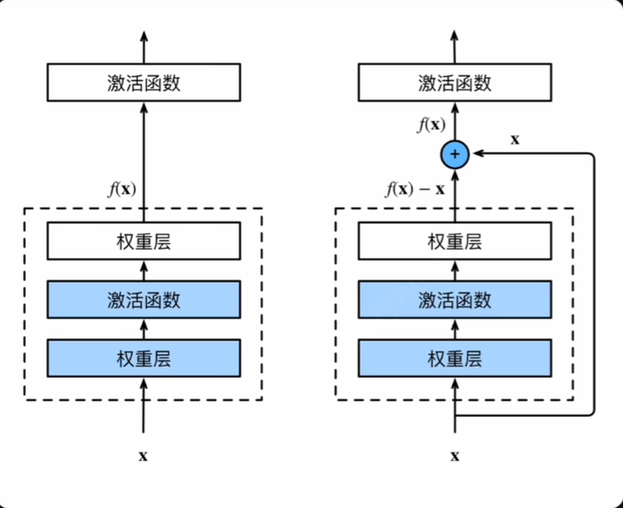
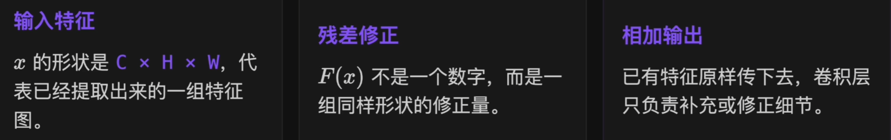
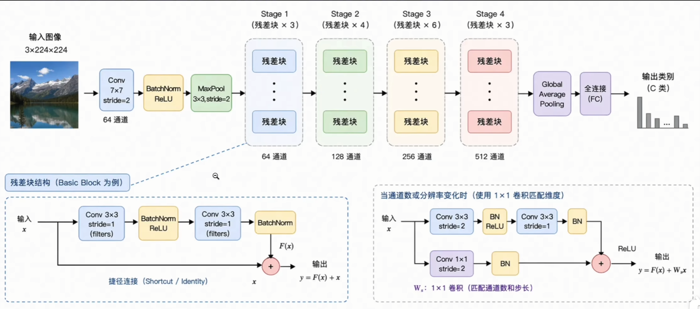
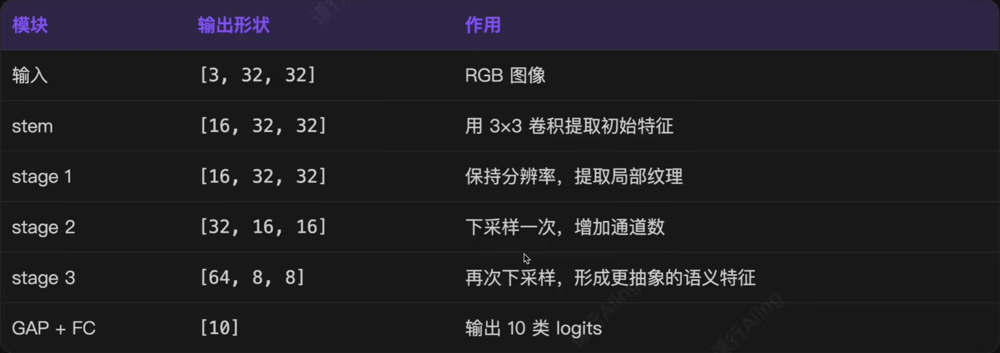

# 1.CNN 的演进先沿着深度推进

> 早期 CNN 语义层层组合，网络越深，能表达的视觉概念通常越复杂。

## 但继续加深之后，反常现象出现了

如果网络越深越好，那么把层数从几十层堆叠到上百层，训练误差至少不应该变差。ResNet 论文在 CIFAR-10 上比较了 20 层和 56 层普通网络。结果显示：*更深的网络不只是测试集效果下降，连训练集误差也更高*。

> 问题不出在泛化，而在优化本身！

## 退化不是过拟合，而是优化问题

过拟合的典型特征是训练误差很低，测试误差很高，模型把训练集背得很熟，泛化很差。而深度网络的退化不同：网络连训练集误差都降不下去。

> 深层网络更难被训练到一个好的解，这个现象叫做**退化**（degradation)。

## 深网络至少不应该更差：恒等映射的悖论

> 理论上能表示，不等于优化器能找到。

## 为什么“什么都不做”反而很难学？

把一组卷积层的权重学到接近 0，通常比让它们精确学出恒等映射容易得多。

# 2.ResNet 的突破：让深层网络重新可训练

## 残差：还没有解释掉的那一部分

在回归问题里，残差的含义非常明确：真实值里还没有被当前模型解释掉的部分。

$$
r = y - \hat{y}
$$

Boosting 方法也体现了这种思想：新加入的模型不必一次解决全部问题，而是一级一级地补当前还没解释好的部分。

## 加性建模：不要一步到位，而是逐步修正

> 残差连接把这种“在已有结果上做修正”的思想搬进了深层 CNN。

## CNN 里的残差：对特征图的修正量

与其让一组层直接学习目标映射 $H(x)$，不如让它只学习输入基础上还需要补多少。

$$
\begin{align}
H(x)=F(x)+x \\
F(x)=H(x)-x
\end{align}
$$

> 主路径学习残差映射 $F(x)$，跳跃连接把输入 $x$ 原样送到输出处相加。

### 这里的 $x$ 不是一个数，而是一整张特征图

当这层不需要做任何事情时，只要让 $F(x)$ 接近 0，输出就自动等于输入 $x$。

输入图像先经过 stem 转成初始特征图，随后进入多个 stage。每个 stage 内堆叠残差块；stage 之间空间尺寸逐步变小，通道数逐步变多。

> ResNet 不是等宽长链，而是带有尺度变化节奏的 CNN 主干。

## Stage 决定尺度，残差块负责修正

浅层保留边缘、颜色和纹理；越往后，空间尺寸降低，感受野变大，通道表达更多语义模式。

