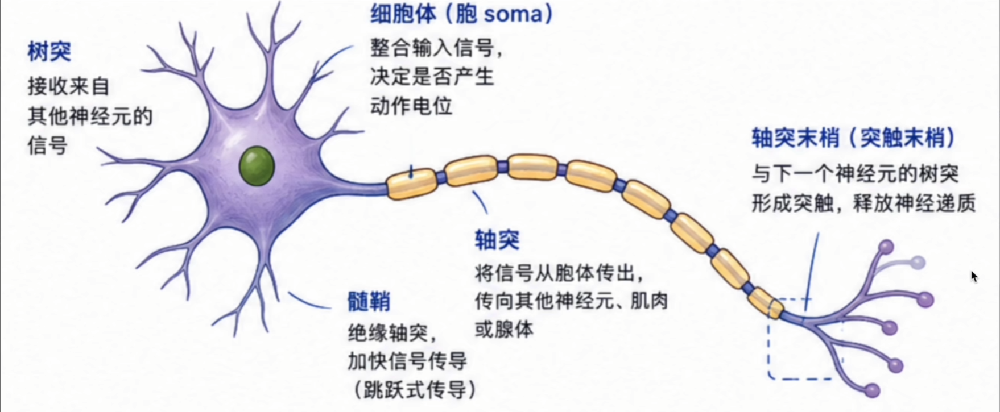
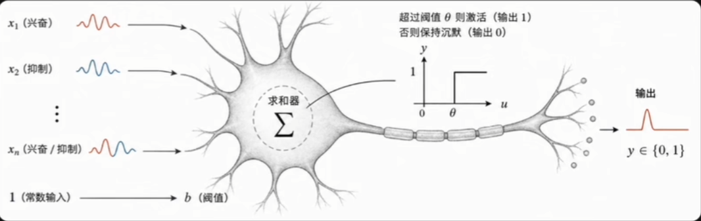
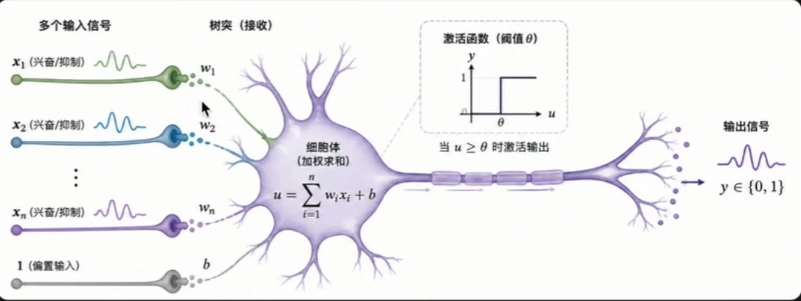
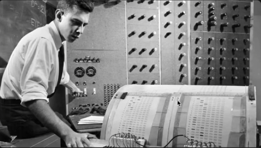
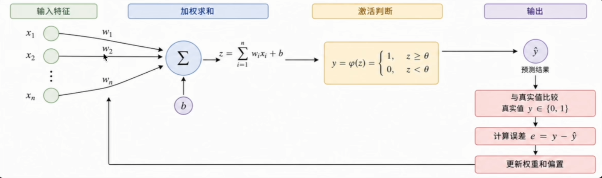
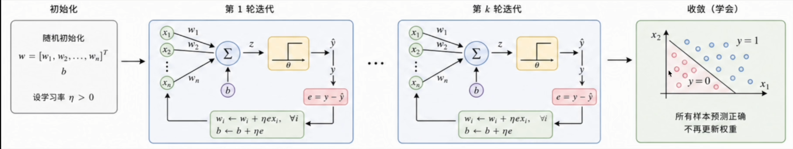
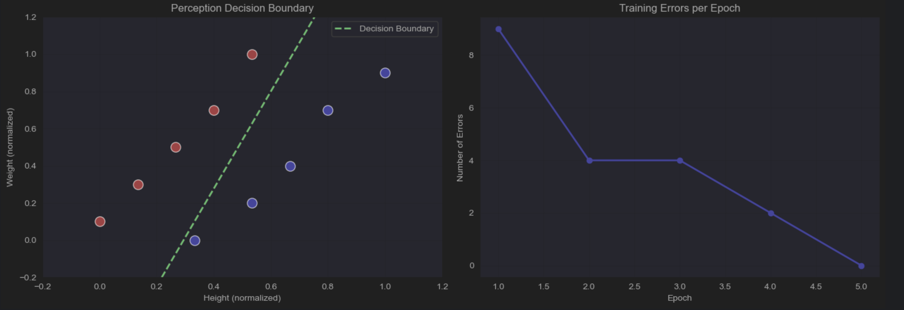
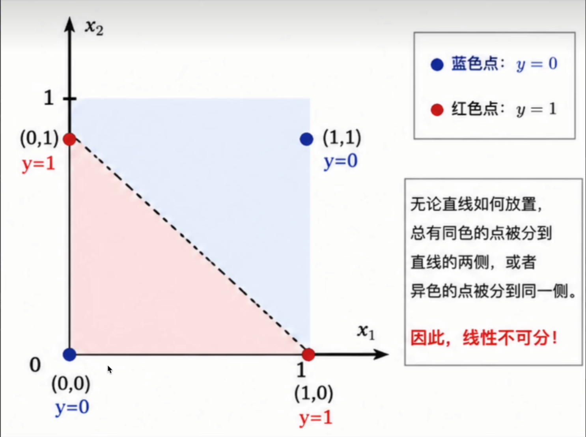

# 1、什么是感知机？

> 感知机是给定一组输入数据，自动找到一条决策边界，将不同类别的数据正确区分开来。

它是人类历史上**第一个真正落地的可学习机器方案**，让机器不再依赖人工编写的规则，而是从数据中学会分类。它虽然诞生于 1957 年，但是麻雀虽小五脏俱全。完整包含了神经网络所有核心要素的雏形：**输入、权重、求和、激活、误差反馈、参数更新**。真正理解了感知机，就相当于掌握了神经网络的完整骨架。

# 2、感知机的思想起源

我们知道，神经网络的灵感来自于仿生学。感知机的诞生并非偶然，它是多个学科交汇、多代学者思考积累的产物。

## 思想起源：M-P 神经元（1943）

故事得从 1943 年说起，麦卡洛克与皮茨联合发表了论文。

- 将生物神经元抽象为一个简单的**逻辑单元**。
- 同时接收多个兴奋或抑制信号。
- 当兴奋信号的总量超过某个阈值时，神经元激活并输出信号，否则保持沉默。

**缺陷**：权重必须由人工设定，机器本身无法学习。它只是一个精巧的逻辑装置。

## 思想起源：赫布理论（1949）

转机出现在 1949 年，心理学家唐纳德·赫布出版了《行为的组织》。

- 如果两个神经元经常同时激活，它们之间的连接就会不断增强。
- 反之，如果不常同时激活，连接则会逐渐减弱。
- 这是人类历史上**第一次从学习机制的角度解释神经连接的变化**。
- 第一次给出了一个关键问题的生物学依据——**权重是可以改变的**。

# 3、第一台会学习的机器（1957）

弗兰克·罗森布拉特在 M-P 神经元的基础上，加入了至关重要的创新：**让权重通过错误反馈自动调整**。

- 人机器每做出一次错误预测，权重就自动修正一次。
- 如此反复，直到学会正确分类。
- 1958 年，他亲手造出了一台真实的物理机器——**Mark I Perception**。

## 让机器学会分类

感知机的工作原理非常简单：对输入做加权求和，与阈值比较做出判断，根据错误反馈微调修正权重，直到学会正确分类。

> 如果有机器学习的基础，会发现把感知机的激活函数（阶跃函数）改为 Sigmoid 就是逻辑回归。

**调整权重**：如果预测正确，什么都不做；如果预测错误，就按照下面的规则调整权重：

$$
w_i \leftarrow w_i + \eta \cdot (y - \hat{y}) \cdot x_i
$$

- $y$ 是正确答案，$\hat{y}$ 是感知机的预测，两者之差是误差信号，$y - \hat{y}$ 就是残差 $e$。
- $x_i$ 是特征的输入值，误差要按照输入的大小来分配责任。
- $\eta$ 是学习率，控制每次调整的幅度。

## 案例：预测身材偏胖还是偏瘦

为了让感知机的工作过程更直观，我们来做一个具体的案例：判断一个人的胖瘦

- **输入特征**：收集一批人的数据，提取两个特征： $x_1$（身高）和 $x_2$（体重）。
- **数据处理**：消除身高和体重的量级差异，将数据压缩到 0~1 之间（归一化），保证学习稳定。
- **目标标签**：偏瘦标记为 0，偏胖标记为 1。
- **训练过程**：让感知机从对特征一无所知（权重为 0）开始，不断看数据、预测、对比、修正权重。

> 当感知机对所有样本都能给出正确的预测时，它就找到了那条完美的“决策边界”。

***具体示例见 DL.ipynb 单元1：感知机***。训练结果如下图所示：

# 4、深度学习的寒冬

感知机只能解决**线性可分**的问题。但现实中的数据往往没有这么听话。逻辑运算中的 XOR 问题将这个缺陷暴露得淋漓尽致：

**XOR 规则**：输入相同时输出 0，不同时输出 1。**不存在一条直线能将其完整地分开**。这不是技巧问题，而是数学上的根本限制——XOR 是线性不可分的。

## 《Perceptrons》与 20 年的沉寂

1969 年，MIT 人工智能实验室权威学者 马文·明斯基 和 西摩·帕普特出版了《Perceptrons》一书。他们花费了数年时间对感知机进行了系统而严密的分析，在书中给出了**完整的数学证明**：

> “感知机无法解决 XOR 这样的非线性问题，单层结构存在根本性的数学局限。”

此书一出，影响立竿见影。神经网络研究经费迅速撤离，大批学者转向其他方向，神经网络领域陷入了长达 20 年的沉寂。

## 寒冬之下，火种未熄

明斯基的批评有一个隐藏的前提：**多层网络无法被有效训练**。他只是证明了单层的局限，并没有证明多层训练永远无解。

在几乎所有人都离场的寒冬里，杰弗里·辛顿 等少数研究者选择留下。这份坚持，最终等来了答案：**反向传播算法（Backpropagation）**。