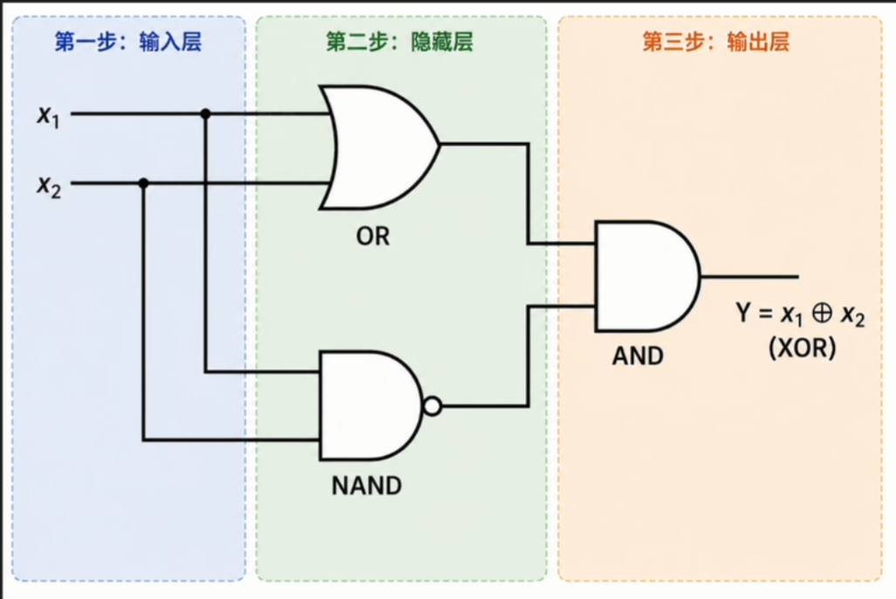
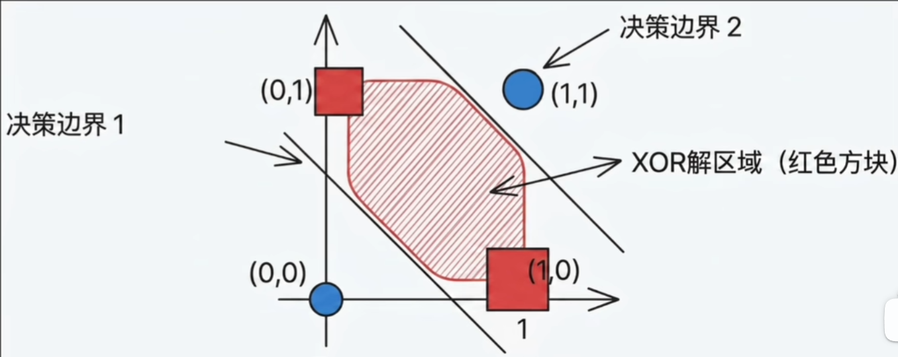
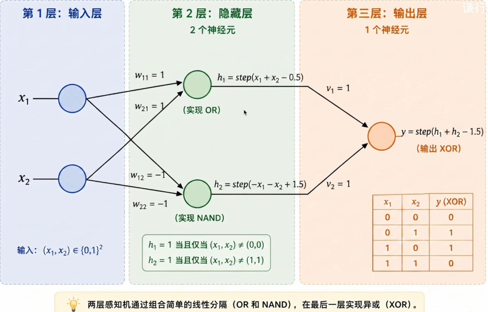
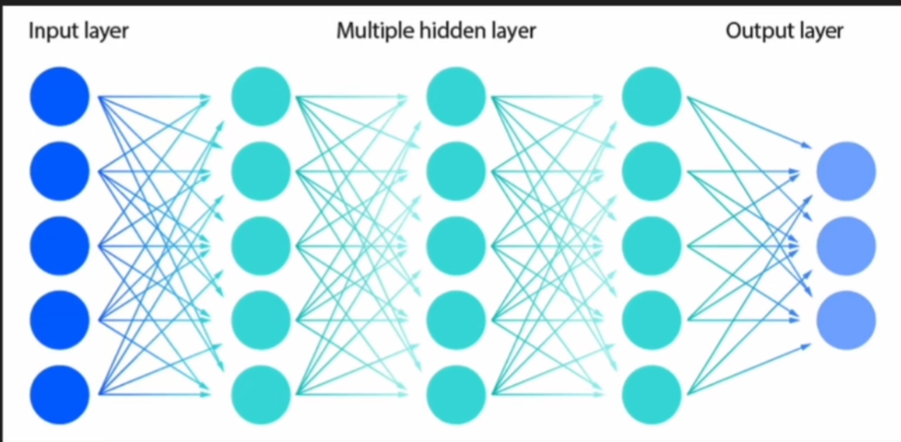
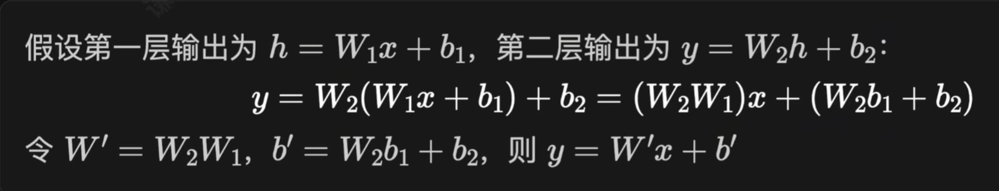

# 1、复杂功能可以由简单模块组合

XOR 问题在逻辑电路中早已解决，计算机的异或门是由更基础的门电路组合而成的。

- $x_1$ $OR$ $x_2$：至少一个输入为1
- $NOT$$(x_1$ $AND$ $x_2)$：两个输入不能同时为1

> 核心思想：复杂功能可以由简单模块层层组合得到。

## 多条线围出复杂区域

把基础功能的感知机组合堆叠，就可以解决异或这样的复杂问题。

- 单个感知机在特征空间里面画**一条直线**，只能做线性分割；
- 如果有两个感知机，就有两条线；三个感知机就有三条线；
- **多条线就可以围出任意复杂的区域**。

## 用两层感知机解决 XOR

- **输入层**：接收两个特征 $x_1, x_2$
- **隐藏层**：两个神经元使用不同的权重做并行运算，各自画一条分割线，输出 0 或 1
- **输出层**：将隐藏层的两个输出作为输入，再做一次加权求和与激活，得到异或判断

第一个隐藏神经元学会了**至少一个输入为1**，第二个学会了**不能同时为1**，输出层把两个条件取交集。

# 2、多层感知机的一般结构

多个感知机按层排列、层间全连接，构成了**多层感知机（MLP）**。

- 输入层接收原始特征，数个隐藏层进行中间运算，输出层给出最终结果；
- 同一层里的神经元**并行提取多个不同的特征或规则**；
- 后续层将前一层的输出作为输入，利用不同的权重进一步组合，**逐层构造出更抽象、更有用的表示**。

$$
\begin{align}
数学表达式：函数的层层嵌套 \\
output = h_n(h_{n-1}(...h_2(h_1(X))))
\end{align}
$$

# 3、为什么多层线性变换无效

如果每一层只是做线性变换，那么无论堆多少层都是徒劳的：

> 线性变换的组合仍然是线性变换。层层叠加，做的全是无用功。

## 使用激活函数打破线性难题

解决方案是在每个神经元的加权求和输出上，套一个非线性函数，称为**激活函数（Activation Function）**：

$$
h = f(Wx + b)
$$

有了非线性的 $f$，层与层之间的组合就无法再被花间为单一线性变换。

# 4、万能逼近定理

这种多层组合的能力到底有多强？1989 年正式证明了**万能逼近定理（Universal Approximation Theorem）**：

> 一个含有足够多神经元的单隐藏层 MLP，可以以任意精度逼近任意连续函数。

- 这意味着 MLP 在理论上具备表达任何函数的能力
- **表达能力**（足够多神经元）和**训练能力**（如何找到正确的权重）是两个不同的问题

# 5、如何训练模型仍然是个问题

既然多层网络能力这么强，为什么还会经历长达 20 年的寒冬？

- MLP 的结构在 1960 年代就已经被提出。问题不是没人想到多层，而是**没法训练**。
- 当时的感知机学习规则**只适用于单层网络**。
- 核心难题：**隐藏层的误差该怎么分配**？输出层的错误我们看得到，但中间那些隐藏的神经元，每个该为最终的错误承担多少责任？没人知道怎么算这个梯度。

> 直到 1986 年，**反向传播算法**与多层网络结合，提供了一套高效计算多层梯度的方法。