# 1、神经网络的训练难题

在 3.MLP 中我们见识到神经网络的强大：只要**神经元和层数足够多**，理论上可以拟合任意函数。

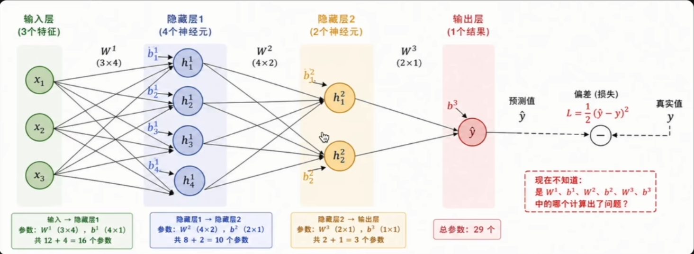

> 海量参数带来了强大能力，也带来了一个棘手问题：当预测出错，如何调整这**成千上万、甚至上亿**个参数？

# 2、反向传播的诞生

多层网络的训练难题，因一个算法而破解。

| 困境                       | 突破                                            | 核心思想                            |
| ------------------------ | --------------------------------------------- | ------------------------------- |
| 网络越深参数越多，无法为每个参数**手动求导** | 1986 年，Hinton、Rumelhart、Williams 提出**反向传播算法** | 利用**链式法则**，误差从输出层逐层传回，一次性算出所有梯度 |

## 反向传播的本质：层层追责

一家公司的追责路径：新产品（输出结果）口碑崩盘（产生Loss），CEO开启层层追责模式。

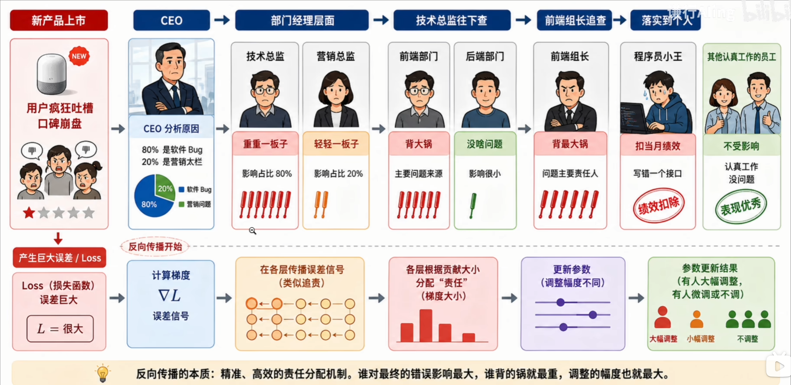

> **从最终结果出发、逐层倒推的责任分配机制**。谁对误差影响越大，它的参数的调整幅度就越大。

## 神经网络训练全流程

1. 初始化各层神经元的**权重和偏置**参数；
2. 输入数据做**前向传播**，得到预测结果；
3. 用**损失函数**计算预测与真实标签的误差；
4. 用**反向传播**从输出层逐层计算损失对参数的梯度；
5. 用**梯度下降**根据梯度更新权重和偏置；
6. 不断重复，让模型逐步收敛。


# 3、前向传播——模型用参数做预测

数据沿网络从输入流向输出：**线性加权** $\rightarrow$ **加偏置** $\rightarrow$ **激活函数**，把信息重构为更高阶特征传递给下一层。

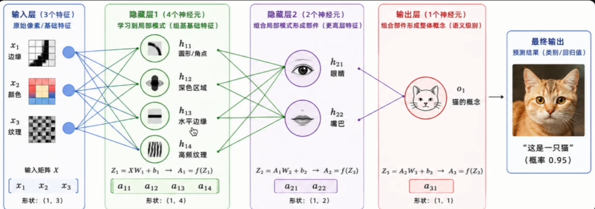

> 正是这种**逐层抽象**的机制，让神经网络具备了自动学习特征的能力。

## 每个神经元都做同一套共两步操作

1. **线性变换**： $z=w_1x_1+w_2x_2+...+w_nx_n+b$
2. **非线性激活**： $a=\sigma(z)$

差别在于：每个神经元维护着**自己的一套权重和偏置**。以下图为例（3输入 $\rightarrow$ 4神经元）：

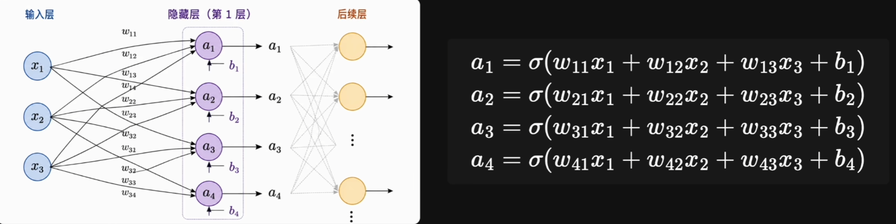

## 从单神经元到整层矩阵化

第 $l$ 层第 $i$ 个神经元的输出（通项形式）：

$$
a_i^{(l)}=\sigma(\sum_{j=1}^n w_{ij}^{(l)}a_j^{(l-1)} + b_i{(l)})
$$

为了运算效率，把同一层所有神经元**打包成矩阵**，一次乘法搞定整层：

$$
\boldsymbol{A}^{(l)} = \sigma(\boldsymbol{W}^{(l)} \boldsymbol{A}^{(l-1)} + \boldsymbol{b}^{(l)})
$$

> 这就是为什么神经网络计算**天然适合 GPU**——它就是一连串大型矩阵乘法。

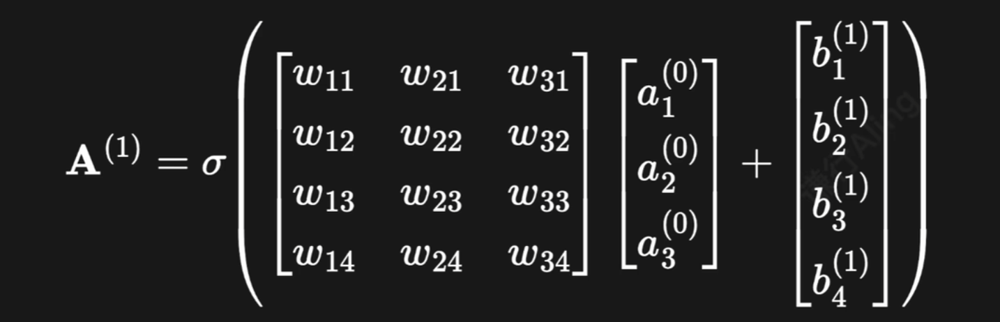

**一次矩阵乘法**就算完了 4 个神经元，比逐个循环高效几个数量级。

# 4、损失函数：把“错得多离谱”量化

前向传播得到 $\hat{y}$，但它和真实标签 $y$ 总有差距。我们用**损失函数**把这个差距量化为一个数：


$\mathcal{L}$ 越大，说明错得越离谱。问题随之而来：该怎么调整权重矩阵$\boldsymbol{W}$ 和 偏置$b$，才能让 $\mathcal{L}$ 变小？

线性回归、逻辑回归里的答案是**梯度下降**：算出损失对每个参数的偏导，组成向量——**梯度**，它指向损失**上升最快**的方向。要让损失下降，沿**负梯度**方向走一小步即可：

$$
\boldsymbol{W} \leftarrow \boldsymbol{W} - \eta \cdot \frac{\partial \mathcal{L}}{\partial \boldsymbol{W}}
$$

## 链式法则

> 如果 $x$ 影响 $u$，$u$ 又影响 $y$，那么 $x$ 对 $y$ 的**总影响 = 两段影响的乘积**。

若 $y = f(u), u = g(x)$，则：

$$
\frac{dy}{dx} = \frac{dy}{du} \cdot \frac{du}{dx}
$$

若 $z=f(u,v)$，而 $u=g(x,y)、v=h(x,y)$。此时 $x$ 沿**两条路径**影响 $z$：$x \rightarrow u \rightarrow z$ 与 $x \rightarrow v \rightarrow z$。每条路径用单变量链式法则算出导数，**再把它们加起来**：

$$
\frac{\partial z}{\partial x} = \frac{\partial z}{\partial u} \cdot \frac{\partial u}{\partial x} + \frac{\partial z}{\partial v} \cdot \frac{\partial v}{\partial x}
$$

# 5、反向传播——沿计算图寻找“背锅侠”

| ==>前向传播       | 反向传播<==                  |
| ------------- | ------------------------ |
| 沿箭头方向计算每个节点的值 | 逆着箭头方向，用链式法则把局部梯度一路乘回输入端 |

> 计算图的精妙之处：复杂的多元复合求导被简化成“**沿路径相乘局部梯度**”。每个节点只需关心自己的输入输出——这正是 PyTorch 等框架**自动微分**的基石。

## 构造一个极简神经网络

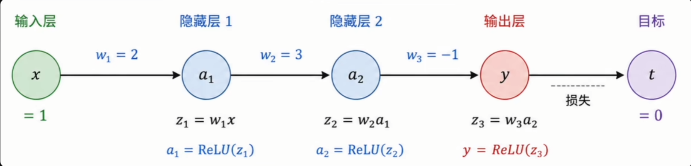

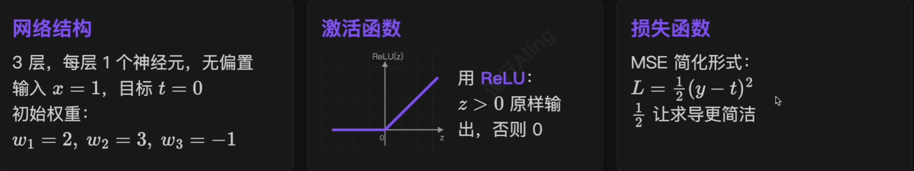

### 前向传播：从左到右一路算

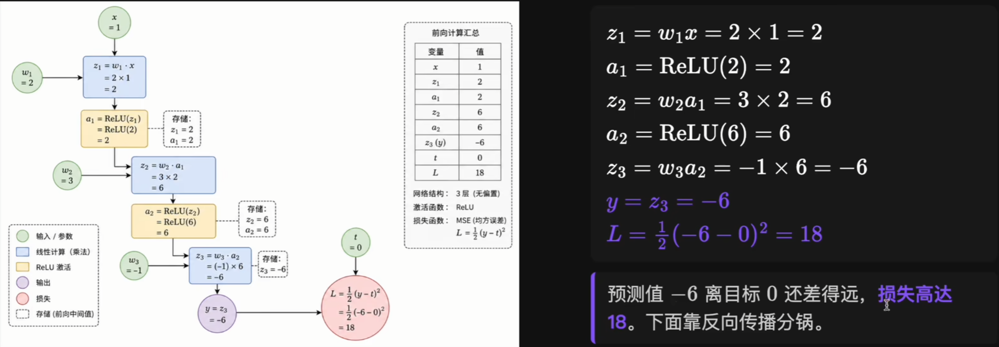

### 先准备好 ReLU 的导数

$$
ReLU'(z) = 
\begin{cases}
1, z > 0 \\
0, z \le 0
\end{cases}
$$

> **ReLU 比阶跃函数好在哪里？**
> 1、处处可导（0 处规定为 1），可参与反向传播；
> 2、导数极其简单，**大幅提升运算速度**。

### 反向传播：从右往左算梯度

从损失出发，利用链式法则反向逐层算出每个参数对最终误差的“**责任**”——也就是**梯度**。

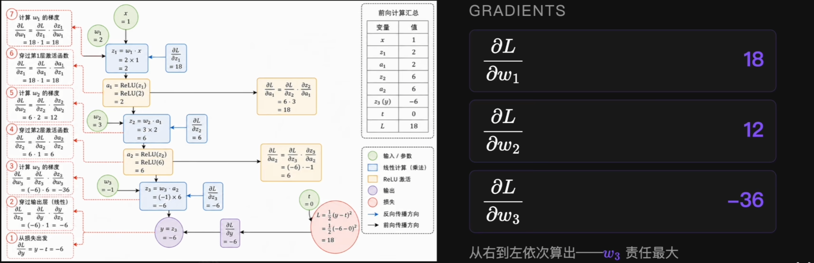

| 参数梯度                              | 梯度值 | 含义                      |
| --------------------------------- | --- | ----------------------- |
| $\frac{\partial L}{\partial w_1}$ | 18  | $w_1$ 增加 1，损失**增加**约 18 |
| $\frac{\partial L}{\partial w_2}$ | 12  | $w_2$ 增加 1，损失**增加**约 12 |
| $\frac{\partial L}{\partial w_3}$ | -36 | $w_3$ 增加 1，损失**减少**约 18 |

> 梯度**正** $\rightarrow$ 该参数增大会让损失上升，要**减小**它；梯度**负** $\rightarrow$ 反之。这就是 $-\eta \cdot \nabla$ 的来历。

### 用梯度下降更新参数

设学习率 $\eta = 0.01$，公式：

$$
w \leftarrow w - \eta \cdot \frac{\partial L}{\partial w}
$$

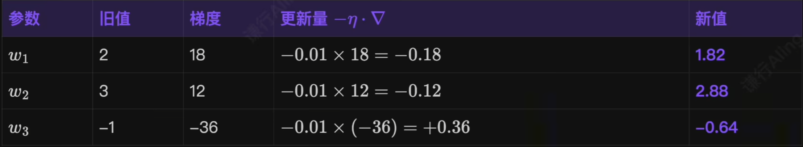

### 验证：再跑一次前向传播

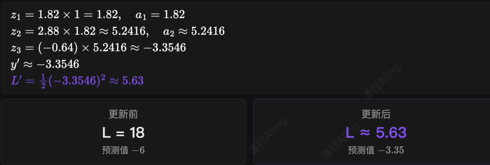

## 神经网络学习的本质

**前向传播** 算误差 $\rightarrow$ **反向传播** 算梯度 $\rightarrow$ **梯度下降** 更新参数 $\rightarrow$ 再次 **前向传播** $\rightarrow$ ……

> 如此循环成千上万次，直到损失降到接近 0，**模型就训练好了**。

# 6、用 PyTorch 实现：自动微分的优雅

只需写出前向公式，PyTorch 会在后台**自动构建计算图**，再用一行 `loss.backward()` 把所有梯度一次算出来。

***示例代码见 DL.ipynb 单元2：反向传播***，输出结果如下：

```
Epoch   1 | 预测值：-1.2674 | 损失：36.0000
Epoch  11 | 预测值：-0.0084 | 损失：0.0002
Epoch  21 | 预测值：-0.0001 | 损失：0.0000
Epoch  31 | 预测值：-0.0000 | 损失：0.0000
Epoch  41 | 预测值：-0.0000 | 损失：0.0000
Epoch  51 | 预测值：-0.0000 | 损失：0.0000
Epoch  61 | 预测值：-0.0000 | 损失：0.0000
Epoch  71 | 预测值：-0.0000 | 损失：0.0000
Epoch  81 | 预测值：-0.0000 | 损失：0.0000
Epoch  91 | 预测值：-0.0000 | 损失：0.0000
```

> **注意**：PyTorch 的 **nn.MSELoss()** 默认是 $(y-t)^2$（不带 $\frac{1}{2}$），所以第 1 轮损失是 36 而非 手算的 18，梯度也会大一倍！**但是不好影响最终收敛**！

# 7、反向传播的核心要点

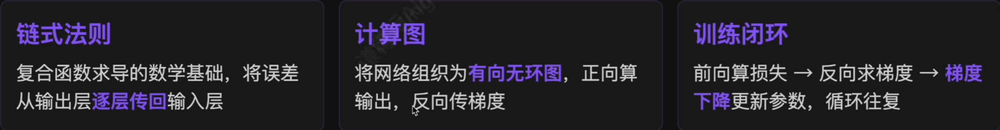

> 反向传播解决了深层网络的训练难题，PyTorch 等框架的 **autograd** 正是基于这一原理自动完成微分。