***3.MLP*** 讲到过，多层线性变换后还是线性的，要使用激活函数。那么：
##### 为什么不一步到位？

既然非线性这么重要，为什么不干脆把 $Wx + b$ 这一步就做成非线性？比如 $Wx^2+b$，省掉激活函数岂不更香？

> 从理论上讲没问题——但**工程上做不到**。原因有两个：

##### 原因1：线性运算的工程红利太大，丢不起

$Wx+b$ 看似平平无奇，背后是**几十年的数值计算积累**：

- **硬件加速**：GPU / TPU 就是为矩阵乘法**量身打造**的，cuBLAS 几毫秒就能算完亿级规模的 $Wx$。
- **梯度极简**： $\frac{\partial (Wx)}{\partial W} = x^\top$，反向传播一行公式搞定。

> 一旦把它换成复杂非线性，这些红利**全部消失**。

#### 原因2：强非线性叠加会引发数值灾难。

以 $z=Wx^2 + b$ 为；例，仅仅叠加 3 层：

$$
y = W_3(W_2(W_1x^2+b_1)^2+b_2)^2+b_3
$$

- 前向：数值冲向无穷大或归零，**模型瘫痪**；
- 反向：求导系数巨大，**梯度彻底失控**。

# 1.把非线性“独立抽出来”

所以工程上的解放是：**线性变换 + 独立非线性激活** 分层堆叠。激活函数刻意挑那些**输出有界或导数温和**的形式，主动掐断指数膨胀的传染性。

| Sigmoid   | Tanh       | ReLU      |
| --------- | ---------- | --------- |
| 压在 (0, 1) | 压在 (-1, 1) | 正半轴导数恒为 1 |

历史上 **Maxout、二阶神经元**都试过把非线性揉进线性运算——结论惊人地一致：**计算复杂度涨一个数量级，效果提升不到 10%**。

## 一个好的激活函数的“基本素养”

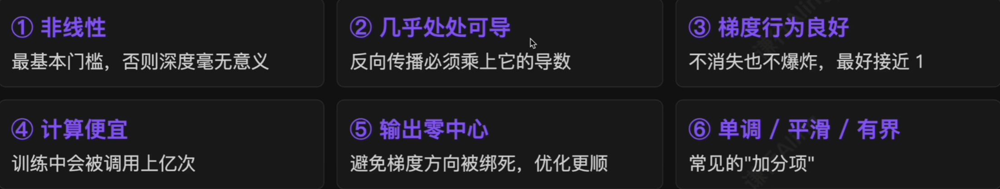

> 一个好的激活函数，是在**表达能力、梯度传播、计算成本和数值稳定性**之间取得平衡。

# 2.阶跃函数（1958）：最朴素的激活

1958 年，罗森布拉特用阶跃函数搭出了感知机。

$$
step(x) = 
\begin{cases}
1, x \ge 0 \\
0, x < 0
\end{cases}
$$

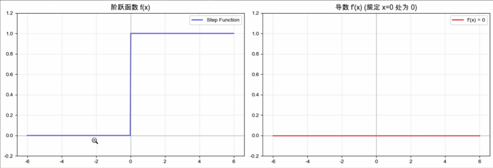

输入超过阈值就放电，否则沉默——一个最纯粹的“**全或无**”开关。

## 两个死穴

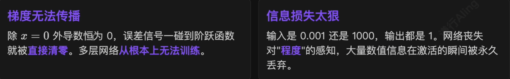

> 没有平滑过渡，就没有梯度可言——直接推动了 Sigmoid 的诞生。

# 3.Sigmoid（1986）：把“开关”变成“旋钮”

1986 年，辛顿等人把**反向传播**带回神经网络，它需要一个处处可导的激活函数——他们沿用了 19 世纪就用来描述人口增长的老朋友：

$$
\begin{align}
\sigma{(x)} = \frac{1}{1+e^{-x}} \\
\sigma'{(x)} = \sigma{(x)}(1-\sigma{(x)})
\end{align}
$$

一条优雅的 $S$ 形曲线，严格压在 $(0, 1)$，**导数就是一个简单乘法**。

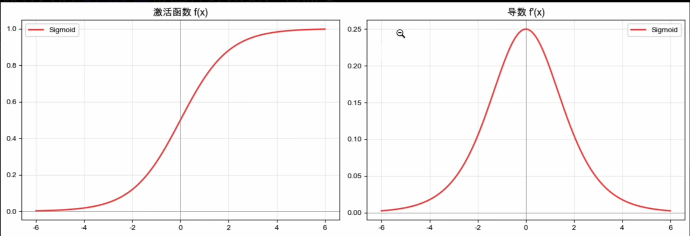

## Sigmoid 的三大优势

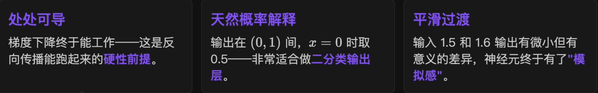

> 这一切看起来都很美好——直到大家把它堆到深层网络里。

## Sigmoid 的硬伤

### （1）梯度消失

Sigmoid 导数最大值出现在 $x=0$，也**只有 0.25**。$|x|$ 一大就饱和。

$$
\underbrace{0.25 \times 0.25 \times 0.25 \times 0.25 \times 0.25}_{5层} \approx 0.001
$$

- 反向传播每过一层，梯度就要乘一次这样的导数；
- 5 层之后梯度只剩 $0.001$，深层几乎**学不动**；
- 外层在百米冲刺，内层却还在**原地踏步**。

> 这是早期神经网络**很难训练得足够深**的根本原因。

### （2）输出非零中心

输出永远是**正数**。下一层在反向传播时算出来的梯度往往长期保持**同号**。权重更新失去灵活性——优化器走 **Z 字折线**，无法直奔最优。

### （3）计算贵 + 天然饱和

含**指数项**，比简单乘法贵得多；指数式压缩使两端斜率以指数速度衰减。把 $(-\infty, +\infty)$ 硬挤进 $(0, 1)$ ——**压缩的代价就是饱和**。

> 如今 Sigmoid 主要保留下来的位置，是**二分类任务的输出层**。

# 4.Tanh（1990s）：把 Sigmoid 摆正

90 年代初，**杨立昆**在贝尔实验室研究手写数字识别，被 Sigmoid 的非零中心**训练震荡**困扰。1998 年的 $Efficient$ $BackProp$ 中他系统总结了 Tanh 的优势：

$$
\begin{align}
tanh(x)=\frac{e^x-e^{-x}}{e^x+e^{-x}}=2\sigma(2x)-1 \\
tanh'(x)=1-tanh^2(x)
\end{align}
$$

输出范围被拉伸到 $(-1, 1)$，**关于原点对称**。

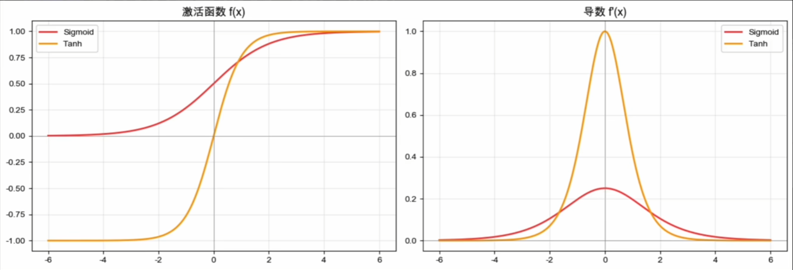

## Tanh 解决了什么？没解决什么？

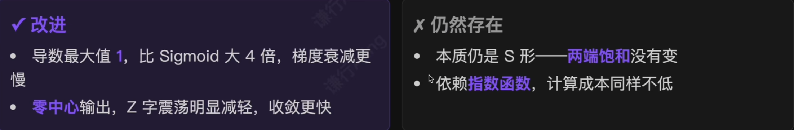

凭借 Tanh，LeNet 在 90 年代末已经能自动识别**美国 10%~20% 的手写支票金额**。但深层网络时代仍未到来——**这只是一次改良，不是一次突破**。

# 5.ReLU（2010）：懒得动脑的天才

2010 年，辛顿和同事提出了一个简单到令人发指的激活函数：

$$
\begin{align}
ReLU(x) = max(0, x) \\
ReLU'(x) =
\begin{cases}
1, x > 0 \\
0, x \le 0
\end{cases}
\end{align}
$$

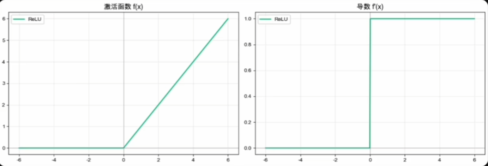

这么粗糙的东西，**真的能用吗**？

## 2012 年：AlexNet 改写历史

ImageNet 竞赛上，**AlexNet** 把图像分类错误率一举降到 15.3%——这样的优势在 ImageNet 历史上前所未有，所用的激活函数正是 **ReLU**。

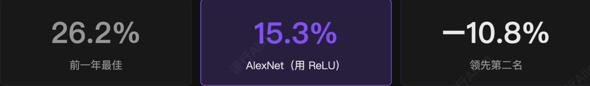

> 从那一刻起，整个 CV 圈迅速转向深度学习——**ReLU 几乎亲手开启了现代深度学习时代**。

## ReLU 的三大优势

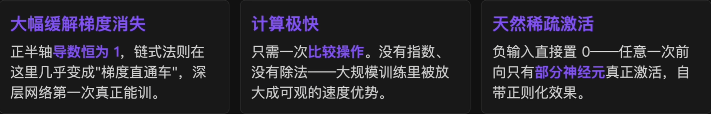

> ReLU 很快取代 Sigmoid 和 Tanh，成为深度学习时代**最具代表性的激活函数**。

## ReLU 的代价

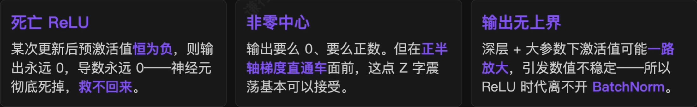

> ReLU 的伟大之处，恰恰在于它的**粗糙**——它是深度学习历史上重要的转折点之一。

## Leaky ReLU：给负半轴留一条缝

既然 ReLU 在负半轴归零会“死”，那就**给它留一个极小的斜率**：

$$
LeakyReLU(x) =
\begin{cases}
x, x > 0 \\
\alpha{x}, x \le 0
\end{cases}
$$

- 负半轴导数永远不为 0，神经元**不会彻底死亡**；
- 当训练过程中出现大量神经元死亡时，可以一试；
- 但 $\alpha$ 是**手动参数**，0.01 不一定最优；多数情况下 ReLU + 良好初始化 + BatchNorm 已经够用。

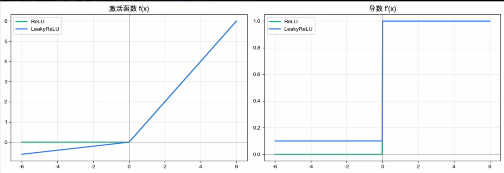

## GELU：把硬门换成软门

ReLU 在 $x = 0$ 处**硬性切断**。GELU 想换成一种**柔和的软门**——根据输入大小，以一定概率决定放行多少信号。

$$
GELU(x) = x \cdot \Phi(x)
$$

$\Phi(x)$ 是标准正态分布的累积分布函数。

$$
\approx 0.5x(1+tanh[\sqrt \frac{2}{\pi}(x+0.044715x^3)])
$$

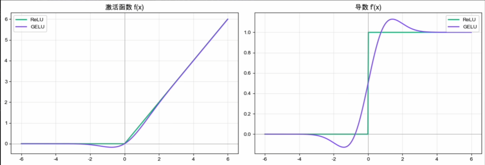

### GELU = Transformer 的标配

2016 年提出，2018 年随 **BERT** 进入大众视野，此后 **GPT、ViT** 以及几乎所有主流 Transformer 类模型相继跟进。

> GELU 在大模型时代的地位，几乎相当于 ReLU 在 CNN 时代的地位。

| ✅适用场景                               | ❌代价                             |
| ----------------------------------- | ------------------------------- |
| Transformer 类模型（BERT、GPT、ViT）的前馈网络层 | 需要 tanh、三次方、平方根——比 ReLU **慢得多** |

## Swish / SiLU：机器自己挑出来的

2017 年 Google Brain 用**神经架构搜索**让模型自己挑激活函数，结果搜出来的形式和 GELU 几乎一模一样：

$$
Swish(x) = x \cdot \sigma(x)
$$

其实 2016 年 Elfwing 等人就独立提出过完全相同的函数——叫 **SiLU(Sigmoid Linear Unit)**。PyTorch 中即 `nn.SiLU`。

> 相比 GELU 的优势：只需一个 Sigmoid，**计算更轻**。

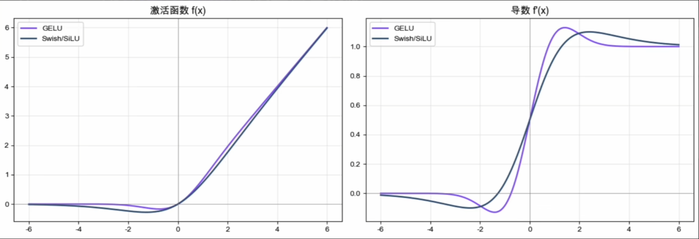

### Swish 在实战中站稳了哪些场景

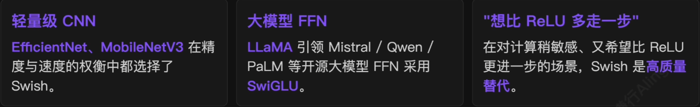

> $Swish \approx GELU$，但形式更简单——**大模型时代的另一个常见选项**。

# 6.激活函数 80 年的演化

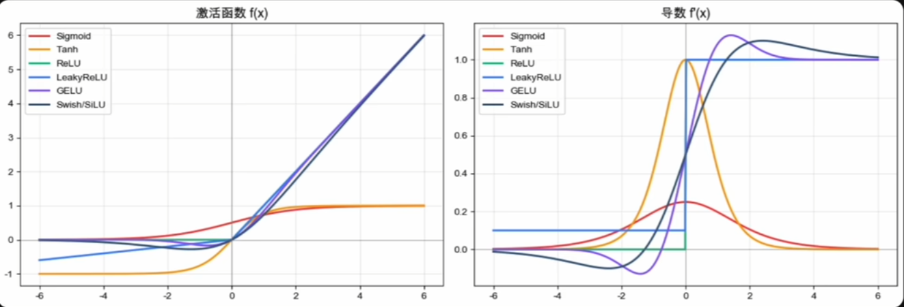

> 演化方向不是越来越复杂，而是**越来越懂得在表达能力、梯度传播和工程效率之间做权衡**。

## 每一代解决的问题

- **阶跃函数**：解决了“要不要激活”——但是太硬了，无法反向传播，信息丢得太狠；
- **Sigmoid**：第一次让**可导的非线性**进入神经网络——但两端饱和、非零中心、深层学不动；
- **Tanh**：Sigmoid 的零中心改良——但本质仍是 $S$ 形，饱和问题没根本上解决；
- **ReLU**：用最直接的方式保住梯度——正半轴恒为 1，**真正开启了现代深度学习**；
- **GELU / Swish**：把 ReLU 的硬折角磨成**平滑过渡**——大模型 / Transformer时代的精修。

## 该如何选择嘞？

| 输出层                         | 普通隐藏层               | Transformer / 大模型          |
| --------------------------- | ------------------- | -------------------------- |
| 概率问题用 **Sigmoid / Softmax** | 很多场景下 **ReLU** 仍然够用 | **GELU / SiLU(Swish)** 更常见 |

> 激活函数提供“**非线性**”，梯度下降提供“**学习能力**”——一个让网络能拟合任意函数，一个让网络能找到正确参数。