# 1.神经网络训练 = 找一组好参数

激活函数让神经网络**具备拟合任意函数的能力**。但 能力 != 现成的答案——一个上亿参数的模型，要让它真正干活，必须先回答：**这上亿个参数，应该取什么值**？

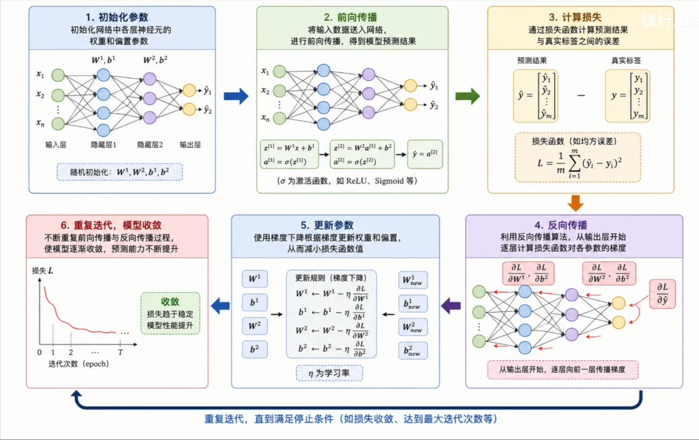

# 2.训练就是求一个最小化问题

数学上，训练神经网络等价于求解：

$$
\theta^* = \arg\min_{\theta} \, L(\theta)
$$

- $\theta$ 是所有参数的集合，$L(\theta)$ 是损失函数，衡量预测和真值差多远。

听起来像高中数学题——求导 $\rightarrow$ 令导数为 0 解出来即可。但现代大模型动辄**百亿参数**，会得到一个百亿元方程组，**没有解析解**。既然解不出来，那就**一步一步往下走**——这就是**梯度下降**被请来做训练引擎的原因。

# 3.梯度下降的直觉：蒙眼下山

想象自己被**蒙着眼丢在一座山上**，目标是走到山谷最低处。

- 没有动图，**只能用脚感受坡度**；
- 判断当前位置哪个方向最陡峭；
- 朝那个方向**迈一小步**；
- 再重新感受、再迈一步。

> 就这么循环，直到走不动了——**这就是梯度下降**。

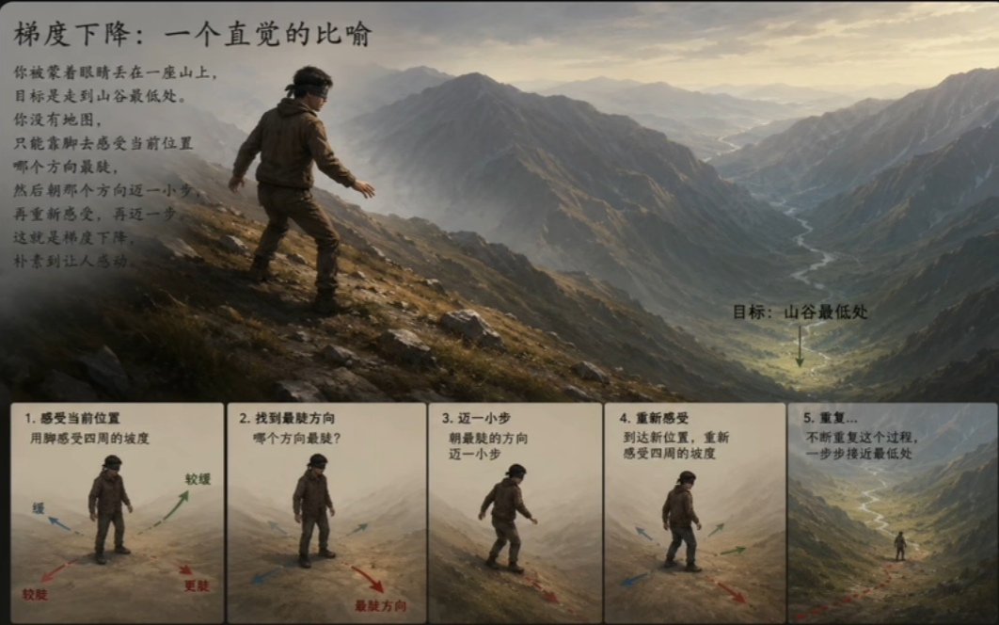

## 多维：把偏导打包成梯度

单维的 $y=f(x)$ 的求导就不说了。推广到多维损失函数 $L(\theta)$，把对每个变量的偏导组成一个向量，称之为**梯度**：

$$
\nabla{L(\theta)}=[\frac{\partial L}{\partial \theta_1},\frac{\partial L}{\partial \theta_2},\dots,\frac{\partial L}{\partial \theta_n}]^\top
$$

> 梯度指向 $L$ 在当前点 $\theta$ 处**上升最快**的方向；取负号——就是**下降最快**的方向。

# 4.梯度下降的工作流程

把“朝负梯度方向迈一步”写成公式：

$$
\theta_{t+1}=\theta_t-\eta \cdot \nabla{L(\theta_t)}
$$

参数说明：

- $\theta_t$：第 $t$ 步的参数（当前位置）；
- $\nabla{L(\theta_t)}$：当前位置的**梯度方向**（脚下最陡的方向）；
- $\eta > 0$：**步长 / 学习率**，控制每一步迈多远。

## 小例子

从 $x_0=4$ 出发且 $\eta=0.1$。

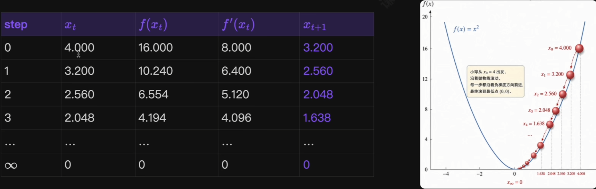

此处，上面的公式即为：

$$
\begin{cases}
\nabla{L(\theta_t)}=f'(x)=(x^2)'=2x \\
x_{t+1}=x_t-\eta \cdot (2x)
\end{cases}
$$

### 这个简单例子里的三个观察

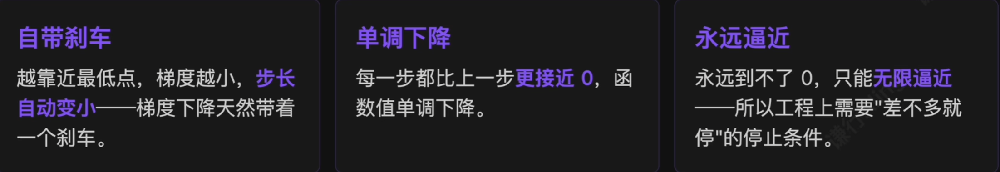

> 把这套流程搬到真实神经网络里，**只是把维度从 1 涨到了上亿**——更新规则不变。

### 搬到神经网络：维度爆炸但规则不变

- $\theta$ 是**所有参数的集合**（上亿维向量）；
- $\nabla{L(\theta)}$ 是 $L$ 对每个参数的偏导构成的向量，通过**反向传播**算出来；
- 更新规则 $\theta_{t+1}=\theta_t-\eta \cdot \nabla{L(\theta_t)}$ **不变**。

> 这里的 $\eta$ 是整个训练过程**最敏感的超参数**——太大会震荡甚至发散，太小则进展缓慢。后面会专门展开，先记住它的存在，以及不同**优化器**为它**省心**所做的种种巧妙设计。

# 5.为什么需要各种各样的优化器？

> 这个在 ***机器学习手写版第 5 张纸的背面也有***。

公式 $\theta_{t+1}=\theta_t-\eta \cdot \nabla{L(\theta_t)}$ 看起来非常简洁，但在真实场景里马上浮现四个问题：

> 优化器的演化，本质上就是一代代研究者围绕这一行公式，不断回答上面这些问题：**改梯度怎么算、改步子怎么迈、改学习率怎么分配**。

## 1）Batch GD：每次都用全部样本

**起源（1847）**：柯西在研究彗星轨道时，提出人类历史上最早的梯度下降思想——面对六个未知数和一组高度非线性的方程，找不到解析解，只能**沿着目标函数下降最快的方向**一步步逼近。

> 这里的 "Batch" 指的是**每次参数更新前都先把整个训练集完整处理一遍**。

每次更新使用**全部 N 个训练样本**计算梯度：

$$
\theta_{t+1}=\theta_{t}-\eta\cdot\frac{1}{N}\sum_{i=1}^N\nabla{L_i}(\theta_{t})
$$

在第 $t$ 步更新时，模型先遍历完**整个训练集**，计算所有样本损失的平均梯度，再执行**一次**更新。

### Batch GD：方向准但代价高

#### 优势：

- **方向准确**：每步沿全数据真实梯度，几乎无噪声；
- **理论性质好**：凸优化下学习率合适即有较好收敛保证

#### 代价：

- **训练成本高**：一次更新就要跑完全部数据，模型往往要很久才能走；
- **缺少随机性**：进入**鞍点 / 梯度小的区域**，没有噪声扰动来跳出去

> Batch GD 的本质：用**更高的计算成本**，换**更精确、更稳定**的梯度方向。在小数据集和经典凸问题里仍有价值，但在现代深度学习里已经不现实。

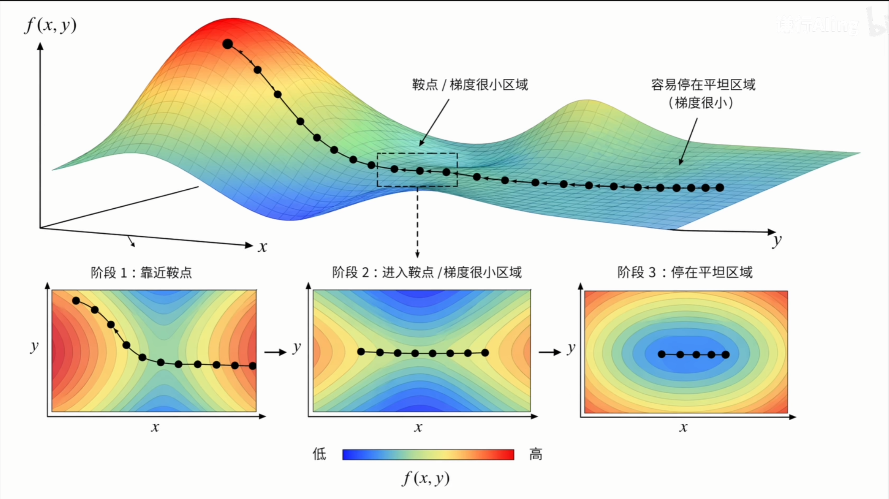

## 2）SGD：用一个样本就更新一次

**随机逼近（1951）**：北卡罗莱纳大学的两位统计学家在研究小白鼠用药问题：每次只能观察到一个**带随机波动**的反应，如何估计出让 50% 个体产生反应的剂量？

他们提出的**随机逼近**思想很朴素：既然每次只有一个带噪声的观测，那就用它做一次小幅调整——长期来看依然能逼近真实答案。

迁移到机器学习，就是 **SGD(Stochastic Gradient Descent)**：

$$
\theta_{t+1}=\theta_t-\eta\cdot\nabla{L_i}(\theta_t)\,\,,\,\,\,i\sim{Uniform(1,N)}
$$

第 $t$ 次更新**不再用全集平均**，而是**随机抽一个样本**，用它的梯度作为整体梯度的估计。

### SGD：噪声既是救命稻草，又是隐患

#### 优势：

- **计算成本骤降**：每步从 $O(N)$ 降到 $O(1)$，效率提升几个数量级；
- **跳出局部最优**：单样本梯度天然带噪声，反而能帮模型跳出鞍点和浅层极小值；
- **支持在线学习**：数据可一条条流入，边接收边更新。

#### 代价：

- **剧烈震荡**：单样本方差大，参数在最优点附近来回摆动，难以稳定收敛；
- **学习率需衰减**：固定可能永远震荡；衰减过快又过早停在次优位置；
- **对离群样本敏感**：一个异常样本就可能把参数拉向奇怪方向。

> 现如今很少用纯与 SGD，但“**用随机子样本近似全样本梯度**”这一核心思想，已经是现代深度学习优化方法的**基石**。

## 3）Mini-batch SGD：工程上的甜点

90 年代研究者意识到：**一个样本太抖、全体样本太慢**。折中方案——每次随机抽一小批（32/64/128/256）：

$$
\theta_{t+1}=\theta_t-\eta\cdot\frac{1}{B}\sum_{i\in{B_t}}\nabla{L_i}(\theta_t)
$$

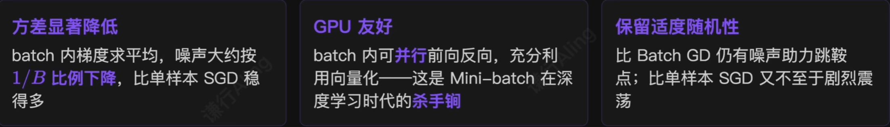

### Mini-batch 的代价与现代意义

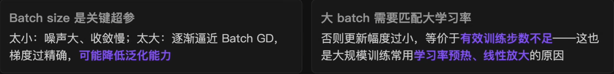

> Mini-batch SGD 在**统计效率（降方差）** 与 **计算效率（用满硬件）** 之间找到极具工程价值的平衡点。如今深度学习语境下，**SGD 默认就是指 Mini-batch SGD**，几乎所有优化器都在它的框架上做改进。

## 4）Momentum：给梯度下降装上惯性

**Polyak（1964）**：苏联数学家 Boris Polyak 在研究迭代法收敛速度时提出动量法。

**核心思想**：**不要只看当前这一步的梯度，把过去几步的运动趋势也考虑进来**——方向一致的更新被持续强化，来回震荡的更新规则被逐步抵消。

### 小例子：铁球下山

- **朴素 GD**：每走一步都把球停下来，重新测坡度——谨慎但是效率低；
- **真实球**：有**惯性**，朝某个方向滚就越来越快；遇到小坑 / 小平台，凭借惯性继续冲过去。

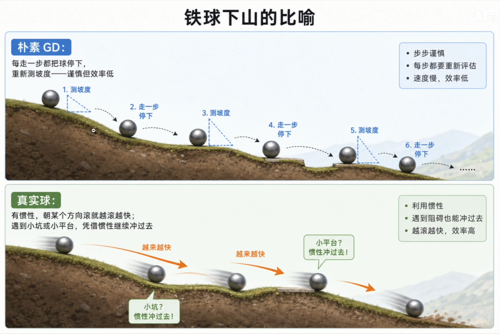

### Momentum 的公式与三大作用

维护一个速度向量 $v_t$ （梯度的指数滑动平均）：

$$
\begin{cases}
v_{t+1}=\beta{v_t}+\nabla{L}(\theta_t)\,\,,\,\,\, (\beta 是动量系数，通常取 0.9)\\
\theta_{t+1}=\theta_t-\eta\cdot{v_{t+1}}
\end{cases}
$$

#### 三大作用：

1. **加速一致方向**：连续几步梯度方向相近 $\rightarrow v_t$ 累积 $\rightarrow$ 越走越快；
2. **抑制震荡方向**：谷地中横向左右摆动 $\rightarrow$ 相反方向相互抵消 $\rightarrow$ 把更新留给真正前进方向；
3. **穿越浅鞍点与平台区**：即使瞬时梯度接近 0，凭已积累的速度仍能够继续前进。

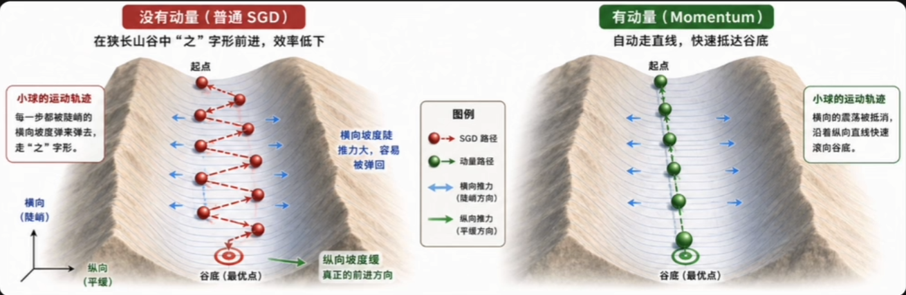

### 惯性是一把双刃剑

**历史地位**：现在几乎所有 SGD 训练默认都带 Momentum——Pytorch 中，`torch.optim.SGD(momentum=0.9)`是工业界和学术界广泛接受的标准。**VGG、ResNet 等经典 CNN 大模型训练，核心方案就是 Mini-batch SGD + Momentum**。

## 5）AdaGrad：每个参数有自己的学习率

**Stanford / Duchi 等**：出发点很朴素：**不同参数的梯度大小差异悬殊**，用同一个学习率更新所有参数过于简单粗暴。

**解决思路**：**给每个参数单独维护一个历史梯度积累量**，用它来自适应地调整这个参数的有效学习率。

### NLP 里的痛点例子

- **"the"**：高频词，几乎每个 batch 都出现，对应参数梯度很大、更新已经很充分；
- **"serendipity"**：低频词，整个训练里只出现廖廖几次，梯度极小；
- 同一学习率下，低频词参数**几乎永远学不动**。

### AdaGrad 的公式：分母累加梯度平方

$$
\begin{cases}
G_t=G_{t-1}+\nabla{L(\theta_t)^2}\,,\,\,\,\,\,\,\,\,\,\,\,\,\,\,\,\,(逐元素平方累加)\\
\theta_{t+1}=\theta_t-\frac{\eta}{\sqrt{G_t}+\epsilon}\cdot\nabla{L(\theta_t)}
\end{cases}
$$

$G_t$ 记录该参数从训练开始到第 $t$ 步的**梯度平方累积和**，$\epsilon$ 防止分母为零。每个参数的有效学习率 = $\frac{\eta}{\sqrt{G_t}+\epsilon}$。

“**对历史更新多的参数降速、对历史更新少的参数提速**”——这就是**自适应学习率**的核心思想，AdaGrad 是开山之作。

### 致命缺陷：学习率单调衰减到 0

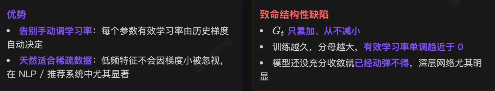

> 正是这个缺陷，催生了后来的 RMSProp 和 Adam——它们的核心改进都指向同一件事：**不要让历史梯度无限积累，只保留近期梯度的影响**。

## 6）RMSProp：用滑动平均修补 AdaGrad

2012 年是 AlexNet 引爆深度学习的年头。网络越来越深、训练越来越久，研究者迫切需要比 AdaGrad **更适合长期训练**的自适应方法。

改进思路非常直接：**不要把训练以来的所有梯度平方都加起来，只保留近期的梯度信息**——这就是 RMSProp 的核心思想。

有意思的是，RMSProp 并没有正式论文。它最早来自 Geoffrey Hinton 2012 年 Coursera 课程《Neural Networks for Machine Learning》的一组讲义幻灯片。Hinton 自己说，他当时只是觉得这个改进显然合理，**没把它当成值得发表的工作**。但后来全世界的人引用 RMSProp 时，最规范的写法竟然就是：Hinton, slides of lecture 6e, Coursera, 2012——一个写在 PPT 里的算法就这样成了主流。

### RMSProp 的公式、优势与局限

$$
\begin{cases}
E[g^2]_t=\beta E[g^2]_{t-1}+(1-\beta)\nabla{L(\theta_t)^2} \\
\theta_{t+1}=\theta_t-\frac{\eta}{\sqrt{E[g^2]_t}+\epsilon}\cdot\nabla{L(\theta_t)}
\end{cases}
$$

$E[g^2]_t$ 是**梯度平方的指数滑动平均**，$\beta$ 通常取 0.9。和 AdaGrad 的唯一差别：分母里的“累积和”换成了“滑动平均”。

#### 优势：

#### 局限：

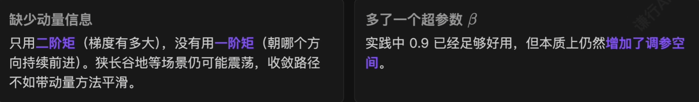

> RMSProp 在训练 RNN 时尤其受欢迎——RNN 的损失曲面更崎岖，AdaGrad 那种**训练越小、最后停住**的死法在这里特别难以接受。RMSProp 一度成为**循环神经网络训练的常用选择**——直到 2015 年 Adam 的出现。

## 7）Adam：把动量与自适应学习率合体

到 2014-2015 年，深度学习优化方法已经形成两条清晰的思路：

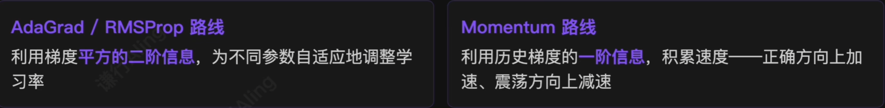

> 既然各有所长，**为什么不把它们合起来**？这正是 2014 年 Diederik Kingma 和 Jimmy Ba 提出的 Adam(Adaptive Moment Estimation) 的出发点——既要方向感，又要步长感。

### Adam 的公式：一阶矩 + 二阶矩 + 偏差校正

$$
\begin{cases}
m_t=\beta_1m_{t-1}+(1-\beta_1)\nabla{L(\theta_t)}\,,\,\,\,(一阶矩，对应 Momentum) \\
v_t=\beta_2v_{t-1}+(1-\beta_2)\nabla{L(\theta_t)^2}\,,\,\,\,\,\,(二阶矩，对应 RMSProp) \\
\hat{m_t}=\frac{m_t}{1-\beta_1^t}\,,\,\,\,\,\,\,\,\,\,\,\,\,\hat{v_t}=\frac{v_t}{1-\beta_2^2}\,,\,\,\,\,\,\,\,\,\,\,\,\,\,\,\,(偏差校正) \\
\theta_{t+1}=\theta_t-\eta\cdot\frac{\hat{m_t}}{\sqrt{\hat{v_t}+\epsilon}}
\end{cases}
$$

- $\beta_1,\beta_2$ 通常取 0.9, 0.999。

> **偏差校正（bias correction）**：因为 $m_0,v_0$ 都能被初始化为 0，训练初期 $m_t,v_t$ 偏向 0，前几步更新被严重低估。除以 $(1-\beta^t)$ 可以消掉这种初始偏差，让训练**从第一步起就走在合理尺度上**。

### Adam 的三大优势

> 这种“全能型”的表现，让 Adam 具备极强的**开箱即用性**——收敛飞快，对初始学习率也不挑剔。在很长一段时间里，它**几乎是所有开发者首选的默认优化器**。

## 8）AdamW：修掉 Adam 隐藏的 bug

研究深入后人们发现，Adam 有一个隐藏的 bug：**它的权重衰减（Weight Decay）失效了**。

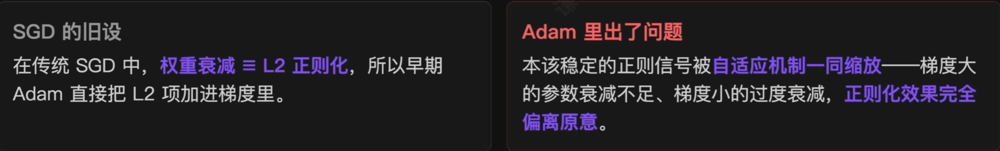

> 2017 年 Ilya Loshchilov 等人提出 AdamW，把**梯度更新**和**权重衰减**彻底拆开。

### AdamW 的更新公式

$$
\theta_{t+1}=\theta_t-\eta(\frac{\hat{m_t}}{\sqrt{\hat{v_t}}+\epsilon}+\lambda\theta_t)
$$

新增的 $\lambda\theta_t$ 项就是**直接作用在参数上的权重衰减**——它**不再走梯度通道**，也就不会被自适应学习率机制污染。

> 这个看似细微的修正带来了巨大工程收益。
> 在 Transformer、BERT、ViT 以及如今的大语言模型中，AdamW 几乎成了雷打不动的**事实标准**——今天我们见到的绝大多数顶尖模型，底层用的都是它。

## 9）Muon：把视角从标量抬到权重矩阵

**Keller Jordan 等（2024）**：Adam / AdamW 把每个标量参数**当作独立维度**。Muon 换了视角——神经网络里真正的主角是**二维权重矩阵**。在 Momentum 之上，对更新矩阵做一次 **Newton-Schulz 迭代**近似 SVD 正交化——**把奇异值拉平后再走一步**。

针对二维权重 $W$ 的公式骨架：

$$
\begin{cases}
M_t=\beta M_{t-1}+\nabla{L(W_t)} \\
O_t=NewtonSchulz(M_t) \\
W_{t+1}=W_t-\eta\cdot{O_t}
\end{cases}
$$

> 效果：让**所有奇异方向获得均衡的更新幅度**，避免少数大奇异值方向主导整步。

> 在 nanoGPT speedrun、Moonshot Kimi K2 等前沿训练中相比 AdamW 跑出更高的**样本效率**——下一代大模型预训练的**有力竞争者**。

# 6.优化器的演化路线

每一次改进背后都有同一个问题在驱动：**怎么让参数更新得又快又稳**？

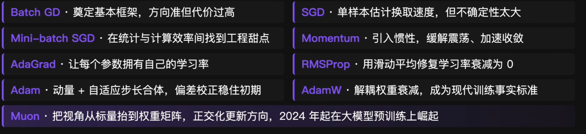

## 当代实践：不同领域不同选择

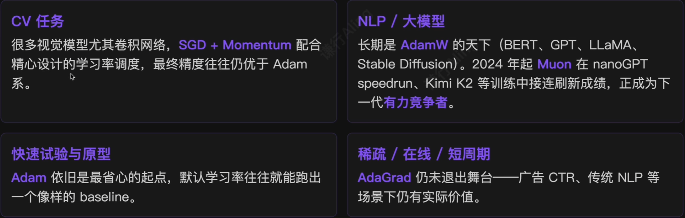