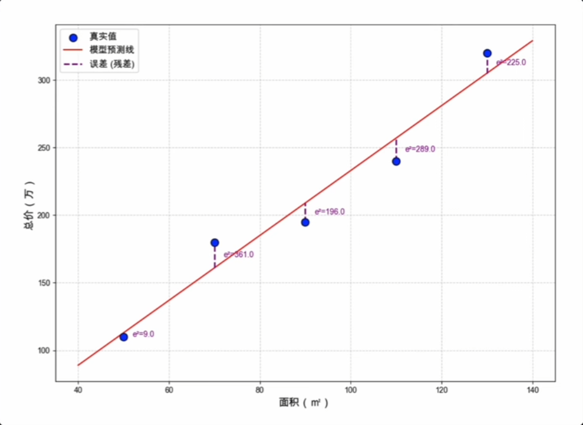
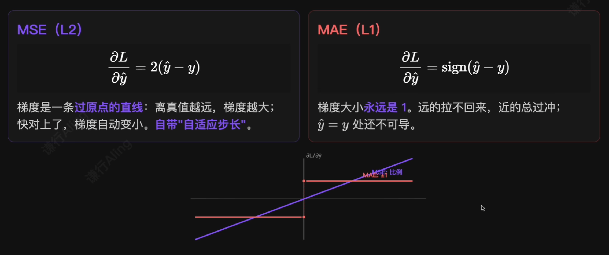
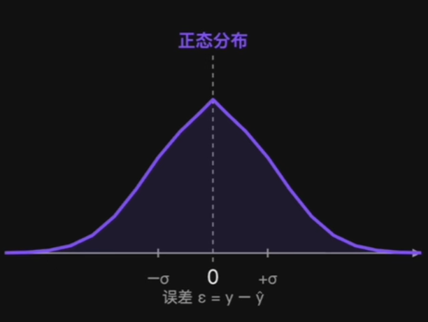
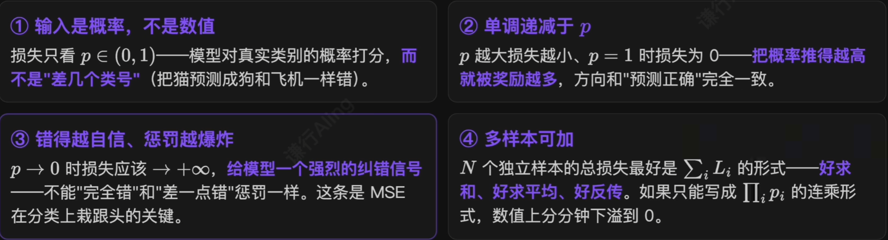
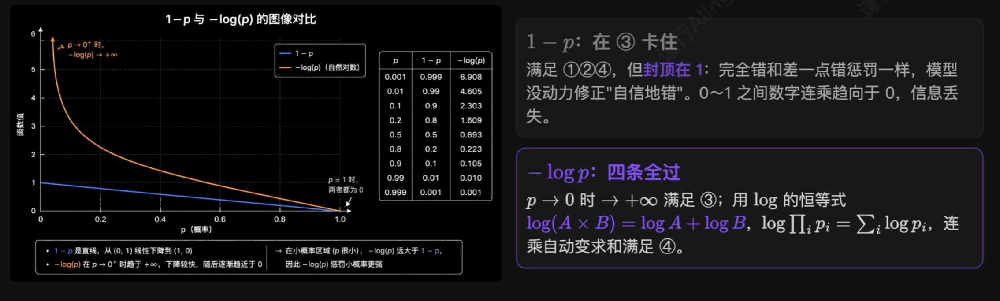
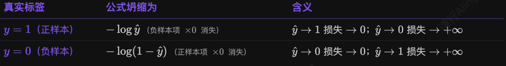
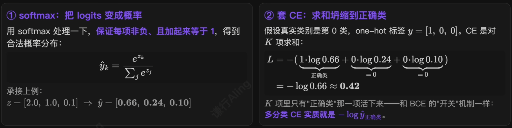
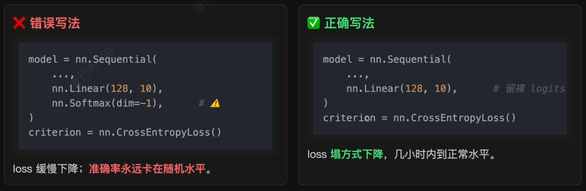
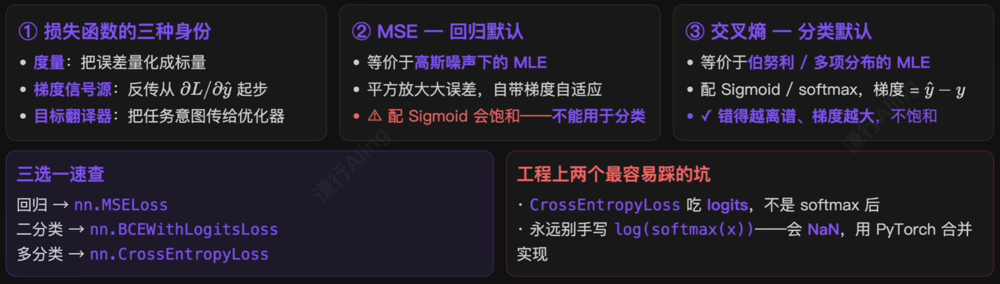

# 1.损失函数到底在干什么？

> 用一个**数字**告诉模型“你错得有多离谱”——再用这个数字的**梯度**告诉模型“往哪个方向改才能错的少”。

这个“数字”就是损失函数的输出。它在训练里扮演三种角色：

1. **度量**：把预测 $\hat{y}$ 和真值 $y$ 的差距量化成一个**标量** $L(\hat{y},y)$。没有标量，就没有“哪个模型更好”。
2. **梯度信号源**：反向传播从 $\frac{\partial L}{\partial \hat{y}}$ 起步。损失选得不一样，**反传的起点信号**就完全不同。
3. **任务目标**：“我要做分类”模型听不懂；“我要最小化**交叉熵**”才行——损失是把**人类意图翻译给优化器**的唯一通道。
# 2.MSE：回归任务的默认损失

**均方误差（Mean Squared Error）**，也叫 **L2 Loss**：

$$
L_{MSE}=\frac{1}{N}\sum_{i=1}^{N}(\hat{y_i}-y_i)^2
$$

三步直觉：

> 有时会看到 $L=\frac{1}{2}(\hat{y_i}-y_i)^2$——加 $\frac{1}{2}$ 只是让求导 $\frac{\partial L}{\partial \hat{y}}=\hat{y}-y$ 干净一点，不影响优化结果。

## 为什么是平方而不是绝对值

最朴素的两个理由：

1. **消去正负号**：直接求和，正负误差会互相抵消；
2. **放大大误差**：误差 3 平方变为 9，误差 0.4 平方变为 0.16，诧异被显著拉开，让模型对大错误更敏感。

> 在深度学习场景下还能再补充两条更深的。

### 1）平方还带来了梯度自适应

### 2）MSE 隐含的概率假设：正态分布

MSE 看着像“拍脑袋平方一下”。其实背后有一条非常具体的**概率假设**：

> 预测误差 $\epsilon = y-\hat{y}$ **服从正态分布（高斯分布）**——大部分样本误差接近 0，离 0 越远越少见。

在这条假设下，**最小化 MSE 就等价于最大似然估计**。所以 MSE 真正擅长的，是**误差对称、集中在 0 附近、没有重尾**的回归任务。

## MSE 的三条局限

1. **对离群点过分敏感**：平方放大是双刃剑。一个标签出错的样本（真值 100，错标 10,000）贡献是 $9900^2 \approx 10^8$，**会把整个 batch 的梯度都带偏**。标签噪声大时切到 **Huber Loss**（小误差 MSE，大误差 MAE）更稳。
2. **假设目标连续可比**：MSE 默认“差 2 比差 1 严重 4 倍”。对房价、温度成立，**对类别标签完全不成立**——把猫预测成狗和把猫预测成飞机。从分类正误来看，都是错误的！
3. **配合 Sigmoid 会梯度消失**：这是 MSE **几乎不能用在分类任务上**的根本原因。

## MSE + Sigmoid：错的越离谱、梯度越小

设 $\hat{y}=\sigma{(z)}、L=\frac{1}{2}(\hat{y}-y)^2$，反传到 $z$（直接用 $\sigma'(z)=\hat{y}(1-\hat{y})$）：

$$
\frac{\partial L}{\partial z}=\frac{\partial L}{\partial \hat{y}}\cdot\frac{\partial \hat{y}}{\partial z}=(\hat{y}-y)\cdot\underbrace{\hat{y}(1-\hat{y})}_{\sigma'(z)}
$$

正样本 $y=1$ 被错得离谱（$\hat{y}\approx0$），代入：

$$
\frac{\partial L}{\partial z}=\underbrace{(\hat{y}-y)}_{=-1，很大}\cdot\underbrace{\hat{y}(1-\hat{y})}_{\approx0，饱和}\approx0
$$

> 按理说应该**狠狠更新**——但 Sigmoid 在 0 端已经“压平”，$\hat{y}(1-\hat{y})\rightarrow 0$ 把整个梯度 **乘成了 0**。模型被推到错误极端后**再也学不回来**。

# 3.分类任务损失函数该长什么样？

回归用 MSE，是因为它和“残差越小越好”完美对齐。换到分类，目标变成“**模型给真实类别打的概率 p 有多高**”——在动手挑公式之前，先列清楚这个损失应当满足哪些性质：

## 两个候选：1-p VS -log(p)

满足 ①②（输入是 p、单调递减）最直白的两个公式： $1-p$ 和 $-\log(p)$。把它们画出来比较一下：

## 信息论小科普：它为什么叫“交叉熵”？

上面提及的 $L=-\log(p)$（真实类别）在信息论里有个大名——**交叉熵（Cross-Entropy）**。两句话讲清楚：

### 1）熵（Entropy）= 一个分布的“不确定性”

想搞清楚一件事，平均需要多少“信息量”。

- **公平硬币**（50/50）：完全猜不透  ==> **熵很大**
- **作弊硬币**（99/1）：几乎没有悬念 ==> **熵很小**（100% 时熵=0）

### 2）交叉熵（Cross-Entropy）= 两个分布的“差异”

在分类任务里，这“两个分布”就是**模型预测的概率分布**和**真实标签分布**。CE Loss 算的就是它们之间的差距——**差距越小，模型越靠谱**。

# 4.二分类交叉熵（BCE）

$$
L_{BCE}=-[\underbrace{y\log\hat{y}}_{正样本项}+\underbrace{(1-y)\log(1-\hat{y})}_{负样本项}]
$$

标签一确定，**就有一项被乘 0 关掉，另一项被乘 1 留下**，所以同一时间永远只有一项在算损失：

## BCE + Sigmoid：梯度干净到不可思议

BCE + Sigmoid 一路链式算到 $z$（Sigmoid 之前的 logit）：

$$
\frac{\partial L_{BCE}}{\partial z}=\hat{y}-y
$$

没有 $\sigma'(z)$ 这个饱和因子了。误差有多大，梯度就有多大。

# 5.多分类交叉熵：softmax + CE

比如 3 类任务下，网络给出 $z=[2.0,1.0,0.1]$（第 0 类得分最高）。要把它套进交叉熵的 $-\log(p)$，必须分两步：先把这串“原始打分”变成**合法概率分布**，再算交叉熵。

反传到 logits 的梯度，和 BCE 一样干净（softmax 导数刚好和 CE 的 log 互相约掉）：

$$
\frac{\partial L_{CE}}{\partial z_k}=\hat{y_k}-y_k
$$

# 6.三大常用损失：MSE / BCE / Softmax + CE

|                        | MSE               | BCE                                    | Softmax + CE                                              |
| ---------------------- | ----------------- | -------------------------------------- | --------------------------------------------------------- |
| 适用任务                   | 回归（预测连续值）         | 二分类                                    | 多分类                                                       |
| 输出层 $\rightarrow$ 损失输入 | 无激活(线性 $\hat{y}$) | Sigmoid $\rightarrow$ 1 个概率 $\hat{y}$  | Softmax $\rightarrow$ $K$ 个概率 $\hat{y_1},\dots,\hat{y_k}$ |
| 损失公式                   | $(\hat{y}-y)^2$   | $-[y\log\hat{y}+(1-y)\log(1-\hat{y})]$ | $-\log\hat{y_c}$                                          |
| 梯度公式                   | $2(\hat{y}-y)$    | $\hat{y}-y$                            | $\hat{y_k}-y_k$                                           |
| 底层概率假设                 | 高斯噪声              | 伯努利分布                                  | 多项分布（Categorical）                                         |
| PyTorch API            | `nn.MSELoss`      | `nn.BCEWithLogitsLoss`                 | `nn.CrossEntropyLoss`                                     |

> 一句话选型：**回归用 MSE；二分用 BCE；多分类用 Softmax + CE**。

***例子见 DL.ipynb 单元3：损失函数***！

## 一个 bug

> 记住一句话：**CrossEntropyLoss 期望的就是裸 logits**。

# 7.总结

> **优化器决定怎么走，损失函数决定走向哪里**。地图画错了，引擎再强也只会跑得更偏。

