# 1.前面几节我们学了什么？

从感知机到反向传播，看似只是 3 节理论，但其实拼起来就是**训练一个神经网络的全部**——只差把它写出代码。

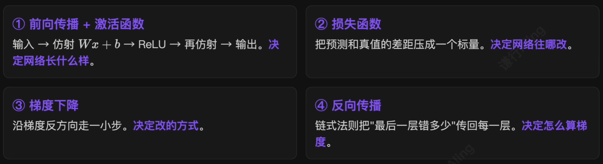

> 这 4 件事的循环，就是**所有现代神经网络**训练的全部内容——从 MNIST 到 GPT，没有例外。

# 2.本节的任务：把这 4 件事写成代码

用前面学的知识，亲手写一个 **2 层 MLP**，让它学会识别手写数字——并能在屏幕上画一个数字让模型实时识别。

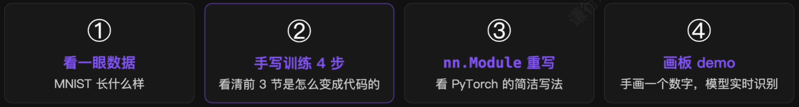

> 本节写的代码，本质上就是**银行支票金额识别、邮政编码自动分拣、答题卡识别**背后用的技术。把网络放大、换成卷积，就是 CNN。

# 3.MNIST：深度学习界的 Hello World

MNIST 是 $28 \times 28$ 的灰度手写数字图，0-9 共 10 类。

|  训练集   |  测试集   | 每张图（灰度） | 数字  | 示例                    |
| :----: | :----: | :-----: | :-: | --------------------- |
| 60,000 | 10,000 | 28 × 28 | 0-9 | 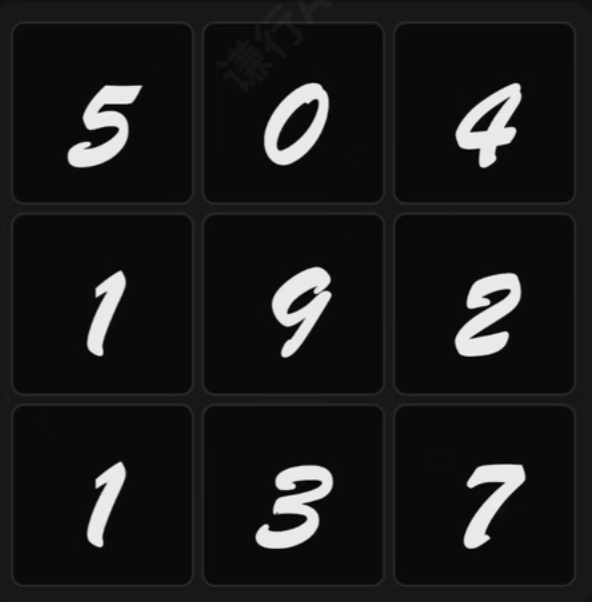 |

> 小到能在 CPU 上几十秒跑完，又足够真实——是**验证想法的标准沙盘**。

***代码见 DL.ipynb 单元4~5***！

取 9 张样本看看：

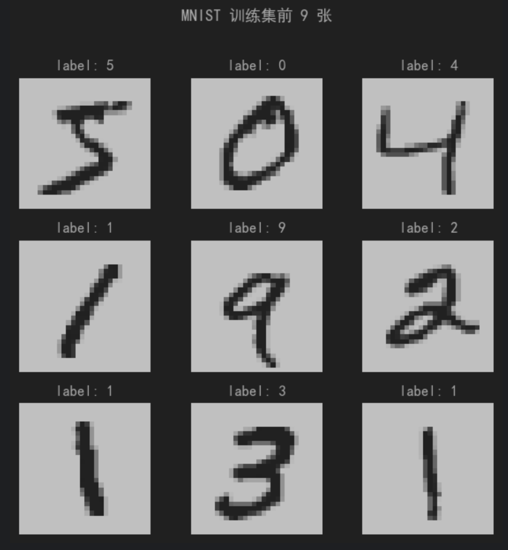

## 网络结构：784 ==> 128 ==> 10

最朴素的 2 层 MLP——三句话讲完它的所有秘密：

1. **输入（784）**：把 28 × 28 灰度图**拍平**成 784 维向量——每一个像素是一个特征；
2. **隐层（128）**：$ReLU(W_1x+b_1)$——仿射变换 + 非线性。**是网络真正”学东西“的地方**；
3. **输出（10）**：$W_2h+b_2$——10 维 logits，对应 10 个数字类别。

> **参数量**：
> $W_1$：784 × 128，$b_1$：128 ==> 100,480
> $W_2$：128 × 10，$b_2$：10 ==> 1,290
>共 101,770 个参数（参数量很大，这也是为什么 CNN 中不用最基础的神经网络）

# 4.PyTorch 训练循环：永远是这 4 个动作

不管你看的是 MNIST、ImageNet，还是 LLM 的预训练。**主流循环都是这 4 个固定动作**——剩下都是工程细节。

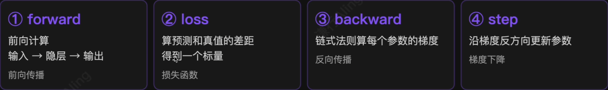

我们先不用`nn.Module`，纯`torch.tensor`把这 4 步写出来——看清楚 PyTorch 底层在做什么。

***代码见 DL.ipynb 单元6~8***！

## 跑起来：5 个 epoch，97% 测试准确率

```
epoch 1/5 train_loss=0.2839 test_acc=0.9488
epoch 2/5 train_loss=0.1387 test_acc=0.9651
epoch 3/5 train_loss=0.1011 test_acc=0.9674
epoch 4/5 train_loss=0.0806 test_acc=0.9714
epoch 5/5 train_loss=0.0670 test_acc=0.9742
```

训练结果如下图所示：

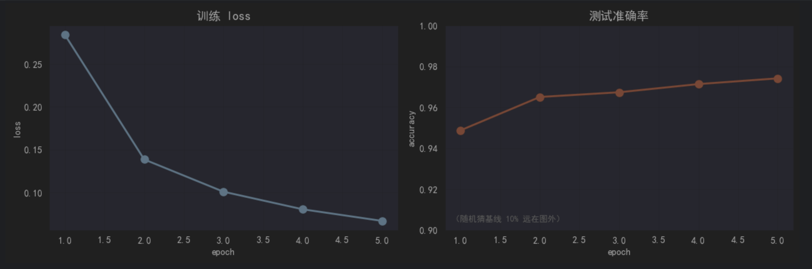

> 第一个 epoch loss 就从随机猜的 $ln(10)\approx2.30$ 砸到 0.28——只跑了 1 个 epoch 模型就**懂事了**；5 个 epoch 后 $test\_acc=97\%$，这是只用前面几节知识做出来的成绩。

## 5 个值得品味的细节

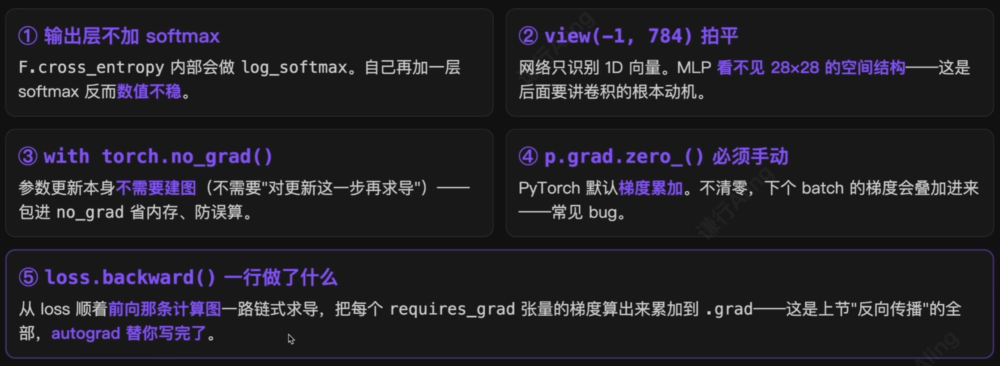

## 用 nn.Modele 重写——同样的 4 步，更简洁

***代码见 DL.ipynb 单元9***！

```
epoch 1/5 train_loss=0.3329 test_acc=0.9466
epoch 2/5 train_loss=0.1606 test_acc=0.9626
epoch 3/5 train_loss=0.1147 test_acc=0.9674
epoch 4/5 train_loss=0.0915 test_acc=0.9726
epoch 5/5 train_loss=0.0738 test_acc=0.9748
```

## 对照表：PyTorch 替你打包了哪些东西

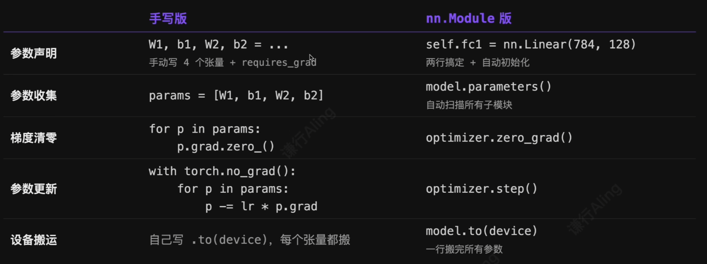

`nn.Module`不是新东西——它只是把上面那段手写代码**打包成更顺手的 API**。背后的 4 步循环没变！

## 从测试集中随机抽取 9 张测试图

测试结果如下图所示：

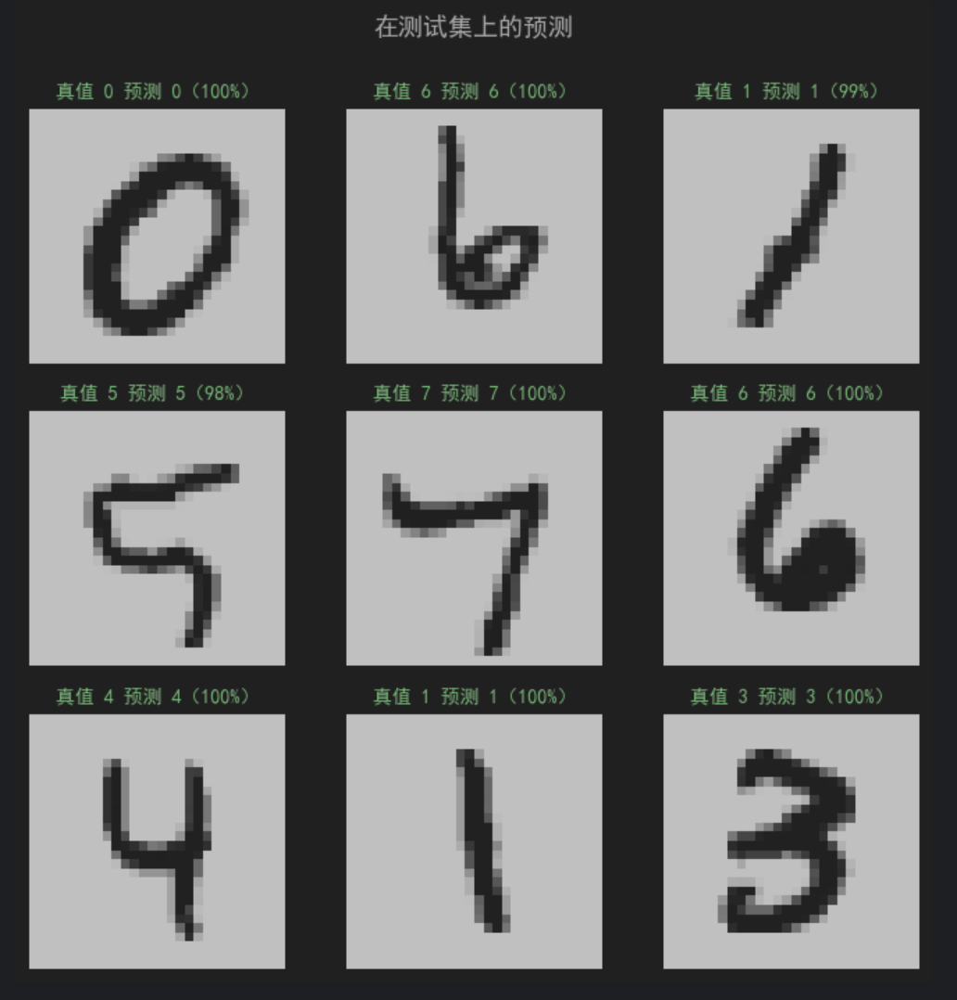

# 5.画板 demo：让模型识别你画的数字

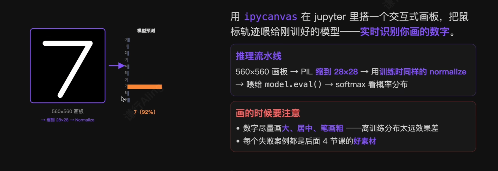

结果如下：

| 推理结果（概率）                                                                                                                                   | 手绘图                   |
| ------------------------------------------------------------------------------------------------------------------------------------------ | --------------------- |
| 预测：3，置信度：100.00%<br>0: 0.00%<br>1: 0.00%<br>2: 0.00%<br>3: 100.00%<br>4: 0.00%<br>5: 0.00%<br>6: 0.00%<br>7: 0.00%<br>8: 0.00%<br>9: 0.00% | 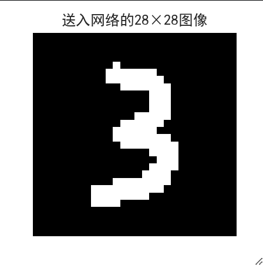 |

## 我们用了哪些“默认值”？

回头看代码，很多地方我们用了“经验值”**没解释为什么**。这些没解释的，正是接下来的章节要回答的：

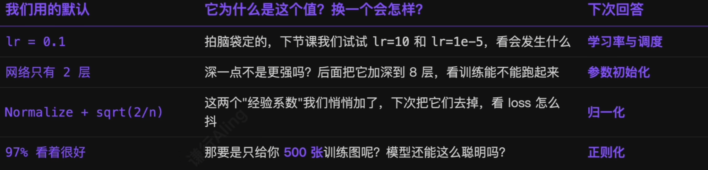

# 6.本节的代码就是深度学习的全部

> 本节中写的这**三十多行代码**，本质上就是**所有深度学习模型**的训练循环——从 MNIST 到 ResNet，再到 GPT-4，**没有例外**。

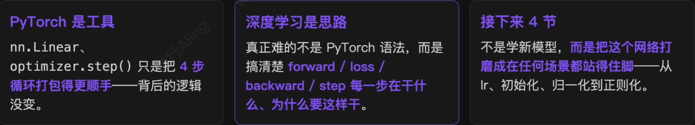