# 1.超参数中最敏感的一个

神经网络的参数大部分通过梯度下降**自动学得**。还有一类参数需要训练前手动设定——学习率、batch size、epoch 数、隐藏层维度、激活函数，称为**超参数（hyperparameter）**。

其中**学习率**通常被认为是最重要、最敏感的：量级设错。模型完全训不起来；量级对了但不会动态调整，最终精度也会被压死在一个上限。

> Adam, AdamW 这些自适应优化器只在**参数之间**做相对步长的微调。**全局学习率 ŋ 仍然是公式里那个常数**——它怎么变化，由调度策略说了算。

$$
\theta_{t+1}=\theta_t-\eta\cdot\frac{\hat{m_t}}{\sqrt{\hat{v_t}+\epsilon}}
$$

## 把上节那个 MLP 的 lr 拨 4 个数量级看看

同一个 2 层 MLP（784 ==> 128 ==> 10），SGD 训 5 epoch，只改 lr 一个旋钮——直接对应 4 种完全不同的训练状态。

| lr   | 现象                             | 5 epoch 后             |
| ---- | ------------------------------ | --------------------- |
| 10   | 第一步 loss 飙升到三位数，长期卡在 2.33 左右发散 | loss, acc ≈ 2.34, 10% |
| 1.0  | 能下降，但每步都夸过谷底，loss 明显震荡         | loss, acc ≈ 1.07, 59% |
| 0.1  | 下降平稳，是这个任务的甜区                  | loss, acc ≈ 0.07, 97% |
| 1e-5 | 每步更新都极小，5 epoch 后几乎原地不动        | loss, acc ≈ 2.31, 15% |

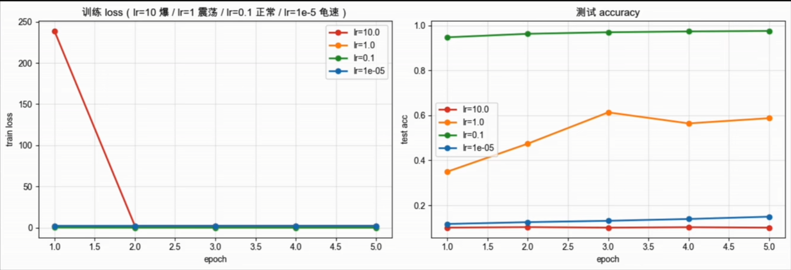

> 四条曲线放在一起，差异是肉眼可见的大——发散 / 震荡 / 收敛 / 龟速。

# 2.学习率需要有节奏地变化

有经验的跑者不会一开始就冲刺，也不会从头到尾都保持一个速度——先热身、再进入配速、最后减速放松。

1. **训练初期**：参数随机初始化，梯度大且方向不稳。**先用较小的 lr 试探地形**，让模型进入合理的优化区域。
2. **训练中期**：已经进入稳定下降阶段，**可以用相对较大的 lr**，加快向较优解靠近的速度。
3. **训练后期**：参数接近最优点，**把 lr 逐步调小**，以更细的步伐做精修，提高最终精度。


## 1）线性 Warmup：让 lr 稳定进入状态

预热（Warmup）的思路很直接：训练最开始的若干步内，让学习率从一个很小的值**逐步上升到目标值**，给优化器一段预热时间，参数和动量估计稳定下来后再正式大步前进。

最常见的方式是**线性预热**：

$$
\eta_t=\eta_{max}\cdot\frac{t}{T_{warmup}}
$$

其中 $t$ 是当前训练步数，$T_{warmup}$ 是预热总步数。学习率随训练步骤均匀爬升，预热结束后切换到目标学习率或后续调度策略。

| 按步数设置                                            | 按比例设置                                 |
| ------------------------------------------------ | ------------------------------------- |
| 例如前 1,000 步预热，与 batch size 和数据集大小**解耦**，跨任务迁移方便。 | 例如总步数的 5%-10%，更直观，能随总训练量**自动调整**预热长度。 |

### 固定学习率 VS 线性 Warmup

4 层 MLP (784 ==> 256 ==> 256 ==> 256 ==> 10) + Adam (lr=0.02), MNIST 5 epoch。

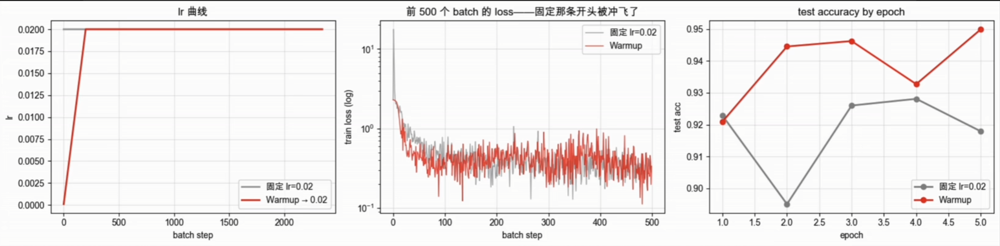

## 2）衰减

预热结束后进入收敛阶段，**什么时候降、降多少**，最直觉的答案是由人来决定。

### （1）手动挡衰减：Step / MultiStep

#### Step decay：固定间隔衰减

$$
\eta_t=\eta_0\cdot\gamma^{\lfloor\frac{t}{T_{step}}\rfloor}
$$

每隔一个间隔 $T_{step}$ 学习率乘一次 $\gamma$，呈阶梯下降。逻辑简单、几乎所有框架原生支持。

#### MultiStep decay：自由指定节点

$$
\eta_t=\eta_0\cdot\gamma^k,\quad k=\sum_{i=1}^N1_{\{t\ge{m_i}\}}
$$

不再等间隔，手动指定一组节点 $m_1,m_2,\dots,$ 每经过一个节点学习率乘一次 $\gamma$。

> 共同问题：**衰减节奏是固定的，不管模型当前收敛得好不好，到店就降**。换个任务、数据集，之前的经验往往就不再适用。

### （2）自动挡衰减

#### Exponential decay：指数衰减

指数衰减把 Step decay 磨平：每一步都把学习率乘一个固定系数 $\gamma$。

$$
\eta_t=\eta_0\cdot\gamma^t
$$

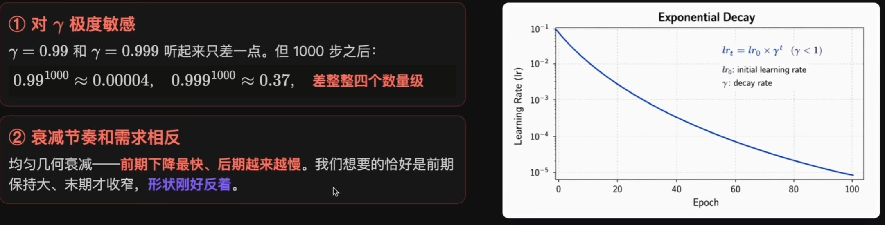

> 正因为 ①②，**指数衰减在实践中已经几乎没人用了**——下面的两种才是当代主流。

#### Cosine Annealing：余弦退火

余弦退火借用余弦函数的形状控制学习率，从 $t=0$ 到 $t=T$ 沿**半个余弦周期**平滑下降：

$$
\eta_t=\eta_{min}+\frac{1}{2}(\eta_{max}-\eta_{min})(1+\cos(\frac{t\pi}{T}))
$$

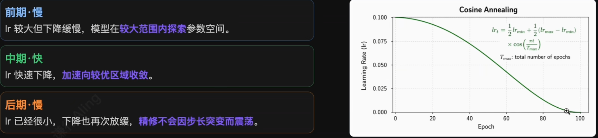

> 相比指数衰减前期跌太快、Step decay 阶梯跳变，**余弦退火的曲线更加平滑自然**。2017 年提出后迅速成为单段训练的默认选择。

#### Cosine Annealing with Warm Restarts：带热重启的余弦退火

余弦退火降到最小值后**学习率更新停住**，**SGDR** 重新升回较大值，开始下一轮退火，循环往复。

$$
\eta_t=\eta_{min}+\frac{1}{2}(\eta_{max}-\eta_{min})(1+\cos(\pi\cdot\frac{T_{cur}}{T_i}))
$$

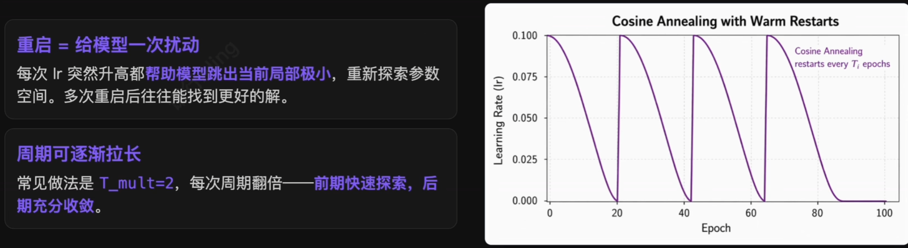

#### 自动挡三种衰减方式对比

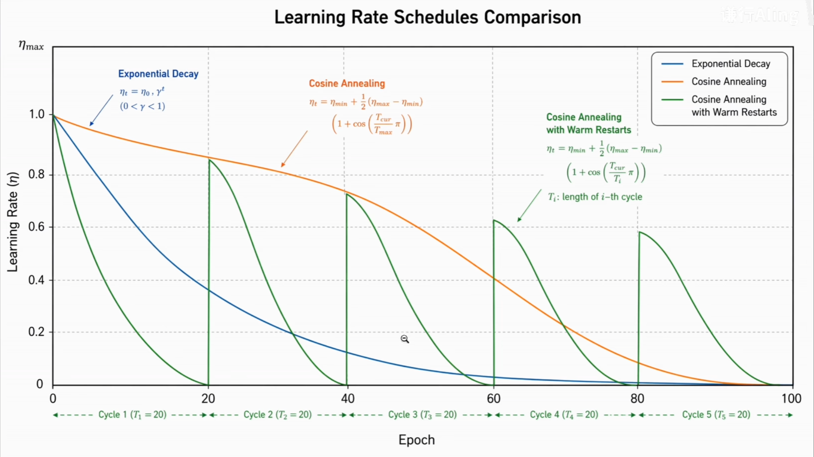

- **Exponential**：前期跌得凶、后期反而停不住，和训练实际需求恰好相反；
- **Cosine**：前慢中快末慢，曲线形状几乎是为下来节奏量身定制的；
- **Cosine + Restart**：每个重启点把 lr 重新拉高，给模型一次跳出局部极小的机会。

### 为什么 Warmup + Cosine 更常用

理论上 Cosine + Warmup Restarta 多了几次逃出局部极小的机会，似乎应该更强。但是 GPT、LLaMA、BERT 等主流大模型几乎清一色用的都是 **Warmup + Cosine**。原因有三：

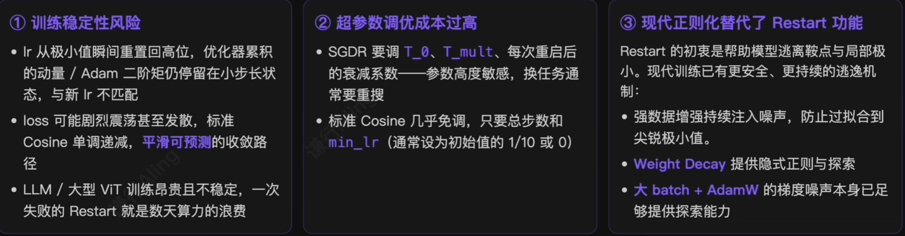

> Restart 仍有适用场景——**比赛刷榜、可反复试错**的场合。但训练成本、可控性、可复现性优先时，Warmup + Cosine 几乎都是更稳的选择。

### （3）ReduceLROnPlateau：按效果调度

前面所有调度器有一个共同点——衰减时机和幅度都是**提前计划好的**，不看模型当前的实践收敛状态。如果训练长度不确定、收敛特征陌生、提前定计划就成了赌运气。

|       调度方式        |     触发依据     |       何时降 lr        |
| :---------------: | :----------: | :-----------------: |
|      前面所有调度器      | 预定的 schedule |     到时间就降，不看效果      |
| ReduceLROnPlateau |   验证集指标停滞    | 连续 N 轮无改善才降，**按效果** |

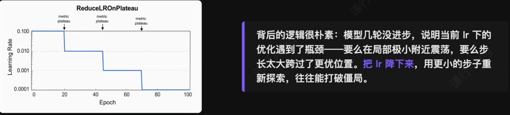

#### ReduceLROnPlateau：API 与适用边界

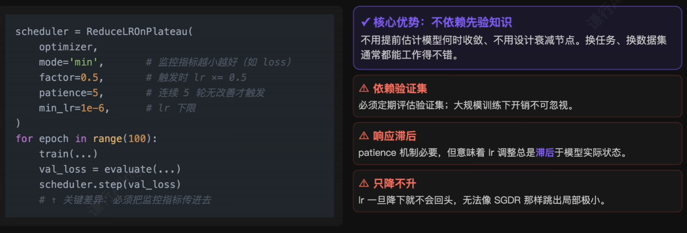

### ReduceLROnPlateau VS 余弦退火：怎么选？

1. **余弦退火**：大语言模型、大规模视觉模型等**预训练场景**。

- 训练成本极高，**没法频繁跑验证集**；
- 训练流程需要高度可控，任意时刻的 lr 都可以**由步数直接算出**；
- 预训练通常**没有明确的验证指标**可监控。

2. **ReduceLROnPlateau**：中小规模任务、**快速实验或微调**。

- 验证集开销可以接受；
- 对任务的收敛特征不够熟悉，**不好提前设计衰减计划**；
- 对新手和**快速迭代非常友好**。

> 大部分场景默认选**余弦退火**；面对陌生任务、不确定要训练多久时，用**ReduceLROnPlateau**。

### （4）OneCycleLR：另一种哲学，先大步、再急收

前面所有调度器都遵循同一个假设：**lr 总体向下，越到后期越小**。预热只是开头很短一段，整体趋势仍然是下降。所以这些调度器都是**每个 epoch 调一次**。

> Leslie Smith 2017 年提出 OneCycleLR：把调度粒度从 epoch 改到 batch，让 lr **先升到很大、再降到很小**，模型不仅不会发散，还能在极短训练时间内达到更高精度。

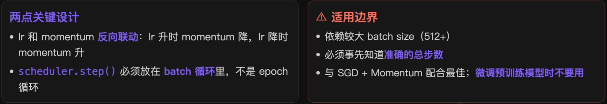

```python
from torch.optim.lr_scheduler import OneCycleLR

optimizer = torch.optim.SGD(model.parameters(), lr=0.01, momentum=0.9)
# 总 step 数 = epoch 数 × 每个 epoch 的 batch 数
total_steps = 100 * len(train_loader)

scheduler = OneCycleLR(
	optimizer,
	max_lr=0.1, # 学习率峰值
	total_steps=total_steps, # 总训练 step 数
	pct_start=0.3, # 前 30% 的 step 用于上升
	anneal_strategy='cos', # 下降阶段使用余弦退火
	...
)

# 注意训练循环的结构: scheduler 在每个 batch 后更新
for epoch in range(100):
	for batch in train_loader:
		loss = train_step(batch)
		optimizer.step()
		scheduler.step() # ← 每个 batch 后调用, 不是每个 epoch
```

### OneCycleLR VS Warmup + Cosine

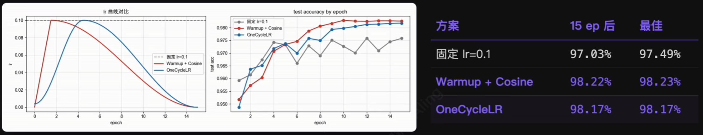

OneCycleLR 与 Warmup + Cosine 的形状差异：

| 起点不为零                                  | 峰值出现得更晚                                    | 末段降得更狠                                 |
| -------------------------------------- | ------------------------------------------ | -------------------------------------- |
| max_lr / 25 ≈ 0.004，比 Warmup 从 0 起步稳一截 | 30% step 才到达 max_lr， Warmup 在 10% step 就到了 | 压到 1e-6 量级，比 Warmup + Cosine 末段再小一个数量级 |

MNIST 这种简单任务上两者几乎打平；CIFAR-100 + ResNet 那种复杂任务，OneCycle 末段的极低 lr 通常还能再榨出 0.3~0.8 个点。

# 3.总结：策略地图 + 三条经验

> 学习率调度策略的发展，本质上是在回答同一个问题：**训练的不同阶段，模型需要多大的更新步长**？

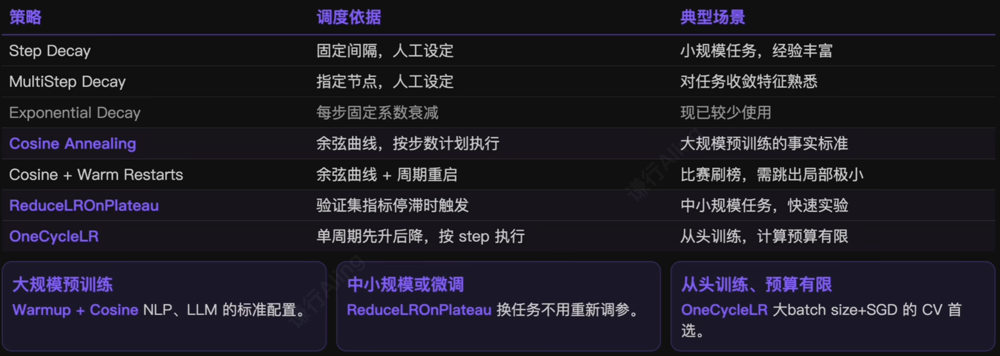