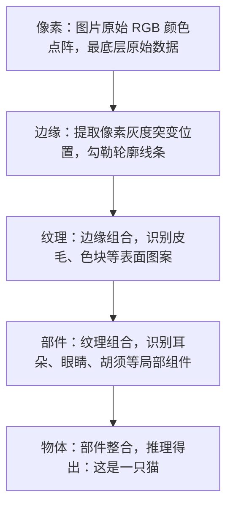

# 项目 1-1（★）DL 应用全景调研图

## 1. 内容与要求

- **练到**：四大应用领域 + 逐层抽象
- **任务**：CV、NLP、语音、推荐各选 1 个你熟悉的真实产品（如"拍照识花"、翻译软件、语音助手、短视频推荐），画一张**领域 → 产品 → 底层数据 → 任务类型**的对比表；再挑一个（如识猫）画"像素 → 边缘 → 纹理 → 部件 → 物体"的逐层抽象流程图（可对照笔记第 6 节"从像素到概念"）。
- **验收**：表格至少 4 行 × 4 列；逐层抽象图每个层级配一句解释。

## 2. 解决过程

此处我都是选择自己日常接触频率高的。

### 2.1 CV

对于 CV，我最先想到的是学校门禁的人脸识别（谁让我经常去外面吃饭呢（￣︶￣）↗　）

低层数据是**图像像素矩阵**，任务类型属于**人脸识别**。

### 2.2 NLP

这个毋庸置疑——豆包，我每天单词翻译、Minecraft 知识查询等等都用它。底层数据是**文本字符**，任务类型属于**问答系统、机器翻译**。

### 2.3 语音

这类产品我使用得较少，但矮子里面挑高个，就选 QQ 音乐的听歌识曲功能吧。低层数据是**音频波形**，任务类型属于**语音识别**。

### 2.4 推荐

推荐系统那必须是抖音（推荐得还真准😊），天天给我推荐吕德华、Minecraft、荒野求生等等。底层数据是**用户浏览次数和时长、点赞、视频特征等**，任务类型属于**深度推荐排序**。

### 总结为一张表格

| 领域 | 产品 | 底层数据 | 任务类型 |
| :---: | :---: | :---: | :---: |
| CV | 学校门禁 | 图像像素矩阵 | 人脸识别 |
| NLP | 豆包 | 文本字符 | 问答系统、机器翻译 |
| 语音 | 听歌识曲 | 音频波形 | 语音识别 |
| 推荐 | 抖音推荐 | 用户行为、视频特征 | 深度推荐排序 |

### 识别猫的逐层抽象流程图

## 3. 总结

本次项目只是初步认识深度学习，了解深度学习的引用领域并且分析了识别类任务的基本流程。