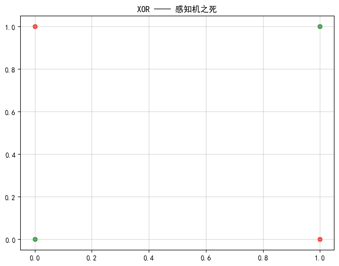

# 项目 2-2（★）构造 XOR，证明感知机之死

- **练到**：线性可分 vs 不可分、局限
- **数据**：构造 4 个样本（00→0、01→1、10→1、11→0），即 XOR（笔记第 4 节"深度学习的寒冬"）。
- **任务**：用项目 2-1 的感知机去训练，观察 loss 永远降不到 0；用 matplotlib 画出 4 个点，验证"不存在一条直线能分开它们"。
- **验收**：训练收敛不了（或震荡）、准确率≤75%；报告里写清楚为什么单层做不到。


```python
import numpy as np
import matplotlib.pyplot as plt

# 设置中文显示
plt.rcParams['font.sans-serif'] = ['SimHei']
plt.rcParams['axes.unicode_minus'] = False
```


```python
# ========== 2.1 中的感知机 ==========
class Perceptron:
    def __init__(self, lr=0.1, iterations=100):
        self.lr = lr                 # 学习率 η
        self.iterations = iterations # 最大迭代轮数
        self.w = None                # 权重 [w1, w2]
        self.b = None                # 偏置
        self.history = []            # 保存每轮 w, b，用来画决策边界变化

    def predict(self, x):
        # 计算加权和：z = w1·x1 + w2·x2 + b
        z = np.dot(self.w, x) + self.b
        return 1 if z >= 0 else 0

    def fit(self, X, y):
        _, n_features = X.shape

        # 权重、偏置全部初始化为 0
        self.w = np.zeros(n_features)
        self.b = 0.0

        for epoch in range(self.iterations):
            error_count = 0 # 本轮错误样本计数

            for xi, yi in zip(X, y):
                y_hat = self.predict(xi)

                # 如果预测错误，执行感知机更新规则
                if y_hat != yi:
                    e = yi - y_hat
                    self.w += self.lr * e * xi
                    self.b += self.lr * e
                    error_count += 1

            # 保存本轮参数
            self.history.append((self.w.copy(), self.b))

            # 打印进度
            print(f"epoch {epoch:2d} | error_count: {error_count} | w = {np.round(self.w, 4)}, b = {np.round(self.b, 4)}")

            # 全部样本预测正确，提前停止
            if error_count == 0:
                print(f"✅全部样本分类正确，提前结束训练，共迭代 {epoch+1} 轮")
                break

        return self
```


```python
# ========== 构造 XOR 数据 ==========
X = np.array([
    [0, 0],
    [0, 1],
    [1, 0],
    [1, 1]
])
y = np.array([0, 1, 1, 0])
```


```python
# ========== 开始训练 ==========
model = Perceptron(lr=0.01, iterations=100)
model.fit(X, y)

# 计算训练集准确率
correct = 0
for xi, yi in zip(X, y):
    if model.predict(xi) == yi:
        correct += 1

acc = correct / len(y)
print(f"训练集准确率：{acc:.2%}")
print(f"最终权重 [w1 w2] = {np.round(model.w, 4)}")
print(f"最终偏置 b = {np.round(model.b, 4)}")
```

	epoch  0 | error_count: 3 | w = [-0.01  0.  ], b = -0.01
    epoch  1 | error_count: 3 | w = [-0.01  0.  ], b = 0.0
    epoch  2 | error_count: 4 | w = [-0.01  0.  ], b = 0.0
    epoch  3 | error_count: 4 | w = [-0.01  0.  ], b = 0.0
    epoch  4 | error_count: 4 | w = [-0.01  0.  ], b = 0.0
    epoch  5 | error_count: 4 | w = [-0.01  0.  ], b = 0.0
    epoch  6 | error_count: 4 | w = [-0.01  0.  ], b = 0.0
    epoch  7 | error_count: 4 | w = [-0.01  0.  ], b = 0.0
    epoch  8 | error_count: 4 | w = [-0.01  0.  ], b = 0.0
    epoch  9 | error_count: 4 | w = [-0.01  0.  ], b = 0.0
    epoch 10 | error_count: 4 | w = [-0.01  0.  ], b = 0.0
    epoch 11 | error_count: 4 | w = [-0.01  0.  ], b = 0.0
    epoch 12 | error_count: 4 | w = [-0.01  0.  ], b = 0.0
    epoch 13 | error_count: 4 | w = [-0.01  0.  ], b = 0.0
    epoch 14 | error_count: 4 | w = [-0.01  0.  ], b = 0.0
    epoch 15 | error_count: 4 | w = [-0.01  0.  ], b = 0.0
    epoch 16 | error_count: 4 | w = [-0.01  0.  ], b = 0.0
    epoch 17 | error_count: 4 | w = [-0.01  0.  ], b = 0.0
    epoch 18 | error_count: 4 | w = [-0.01  0.  ], b = 0.0
    epoch 19 | error_count: 4 | w = [-0.01  0.  ], b = 0.0
    epoch 20 | error_count: 4 | w = [-0.01  0.  ], b = 0.0
    epoch 21 | error_count: 4 | w = [-0.01  0.  ], b = 0.0
    epoch 22 | error_count: 4 | w = [-0.01  0.  ], b = 0.0
    epoch 23 | error_count: 4 | w = [-0.01  0.  ], b = 0.0
    epoch 24 | error_count: 4 | w = [-0.01  0.  ], b = 0.0
    epoch 25 | error_count: 4 | w = [-0.01  0.  ], b = 0.0
    epoch 26 | error_count: 4 | w = [-0.01  0.  ], b = 0.0
    epoch 27 | error_count: 4 | w = [-0.01  0.  ], b = 0.0
    epoch 28 | error_count: 4 | w = [-0.01  0.  ], b = 0.0
    epoch 29 | error_count: 4 | w = [-0.01  0.  ], b = 0.0
    epoch 30 | error_count: 4 | w = [-0.01  0.  ], b = 0.0
    epoch 31 | error_count: 4 | w = [-0.01  0.  ], b = 0.0
    epoch 32 | error_count: 4 | w = [-0.01  0.  ], b = 0.0
    epoch 33 | error_count: 4 | w = [-0.01  0.  ], b = 0.0
    epoch 34 | error_count: 4 | w = [-0.01  0.  ], b = 0.0
    epoch 35 | error_count: 4 | w = [-0.01  0.  ], b = 0.0
    epoch 36 | error_count: 4 | w = [-0.01  0.  ], b = 0.0
    epoch 37 | error_count: 4 | w = [-0.01  0.  ], b = 0.0
    epoch 38 | error_count: 4 | w = [-0.01  0.  ], b = 0.0
    epoch 39 | error_count: 4 | w = [-0.01  0.  ], b = 0.0
    epoch 40 | error_count: 4 | w = [-0.01  0.  ], b = 0.0
    epoch 41 | error_count: 4 | w = [-0.01  0.  ], b = 0.0
    epoch 42 | error_count: 4 | w = [-0.01  0.  ], b = 0.0
    epoch 43 | error_count: 4 | w = [-0.01  0.  ], b = 0.0
    epoch 44 | error_count: 4 | w = [-0.01  0.  ], b = 0.0
    epoch 45 | error_count: 4 | w = [-0.01  0.  ], b = 0.0
    epoch 46 | error_count: 4 | w = [-0.01  0.  ], b = 0.0
    epoch 47 | error_count: 4 | w = [-0.01  0.  ], b = 0.0
    epoch 48 | error_count: 4 | w = [-0.01  0.  ], b = 0.0
    epoch 49 | error_count: 4 | w = [-0.01  0.  ], b = 0.0
    epoch 50 | error_count: 4 | w = [-0.01  0.  ], b = 0.0
    epoch 51 | error_count: 4 | w = [-0.01  0.  ], b = 0.0
    epoch 52 | error_count: 4 | w = [-0.01  0.  ], b = 0.0
    epoch 53 | error_count: 4 | w = [-0.01  0.  ], b = 0.0
    epoch 54 | error_count: 4 | w = [-0.01  0.  ], b = 0.0
    epoch 55 | error_count: 4 | w = [-0.01  0.  ], b = 0.0
    epoch 56 | error_count: 4 | w = [-0.01  0.  ], b = 0.0
    epoch 57 | error_count: 4 | w = [-0.01  0.  ], b = 0.0
    epoch 58 | error_count: 4 | w = [-0.01  0.  ], b = 0.0
    epoch 59 | error_count: 4 | w = [-0.01  0.  ], b = 0.0
    epoch 60 | error_count: 4 | w = [-0.01  0.  ], b = 0.0
    epoch 61 | error_count: 4 | w = [-0.01  0.  ], b = 0.0
    epoch 62 | error_count: 4 | w = [-0.01  0.  ], b = 0.0
    epoch 63 | error_count: 4 | w = [-0.01  0.  ], b = 0.0
    epoch 64 | error_count: 4 | w = [-0.01  0.  ], b = 0.0
    epoch 65 | error_count: 4 | w = [-0.01  0.  ], b = 0.0
    epoch 66 | error_count: 4 | w = [-0.01  0.  ], b = 0.0
    epoch 67 | error_count: 4 | w = [-0.01  0.  ], b = 0.0
    epoch 68 | error_count: 4 | w = [-0.01  0.  ], b = 0.0
    epoch 69 | error_count: 4 | w = [-0.01  0.  ], b = 0.0
    epoch 70 | error_count: 4 | w = [-0.01  0.  ], b = 0.0
    epoch 71 | error_count: 4 | w = [-0.01  0.  ], b = 0.0
    epoch 72 | error_count: 4 | w = [-0.01  0.  ], b = 0.0
    epoch 73 | error_count: 4 | w = [-0.01  0.  ], b = 0.0
    epoch 74 | error_count: 4 | w = [-0.01  0.  ], b = 0.0
    epoch 75 | error_count: 4 | w = [-0.01  0.  ], b = 0.0
    epoch 76 | error_count: 4 | w = [-0.01  0.  ], b = 0.0
    epoch 77 | error_count: 4 | w = [-0.01  0.  ], b = 0.0
    epoch 78 | error_count: 4 | w = [-0.01  0.  ], b = 0.0
    epoch 79 | error_count: 4 | w = [-0.01  0.  ], b = 0.0
    epoch 80 | error_count: 4 | w = [-0.01  0.  ], b = 0.0
    epoch 81 | error_count: 4 | w = [-0.01  0.  ], b = 0.0
    epoch 82 | error_count: 4 | w = [-0.01  0.  ], b = 0.0
    epoch 83 | error_count: 4 | w = [-0.01  0.  ], b = 0.0
    epoch 84 | error_count: 4 | w = [-0.01  0.  ], b = 0.0
    epoch 85 | error_count: 4 | w = [-0.01  0.  ], b = 0.0
    epoch 86 | error_count: 4 | w = [-0.01  0.  ], b = 0.0
    epoch 87 | error_count: 4 | w = [-0.01  0.  ], b = 0.0
    epoch 88 | error_count: 4 | w = [-0.01  0.  ], b = 0.0
    epoch 89 | error_count: 4 | w = [-0.01  0.  ], b = 0.0
    epoch 90 | error_count: 4 | w = [-0.01  0.  ], b = 0.0
    epoch 91 | error_count: 4 | w = [-0.01  0.  ], b = 0.0
    epoch 92 | error_count: 4 | w = [-0.01  0.  ], b = 0.0
    epoch 93 | error_count: 4 | w = [-0.01  0.  ], b = 0.0
    epoch 94 | error_count: 4 | w = [-0.01  0.  ], b = 0.0
    epoch 95 | error_count: 4 | w = [-0.01  0.  ], b = 0.0
    epoch 96 | error_count: 4 | w = [-0.01  0.  ], b = 0.0
    epoch 97 | error_count: 4 | w = [-0.01  0.  ], b = 0.0
    epoch 98 | error_count: 4 | w = [-0.01  0.  ], b = 0.0
    epoch 99 | error_count: 4 | w = [-0.01  0.  ], b = 0.0
    训练集准确率：50.00%
    最终权重 [w1 w2] = [-0.01  0.  ]
    最终偏置 b = 0.0
    


```python
plt.figure(figsize=(8, 6))
mask0 = (y == 0)
mask1 = (y == 1)
plt.scatter(X[mask0, 0], X[mask0, 1], c="green", alpha=0.7)
plt.scatter(X[mask1, 0], X[mask1, 1], c="red", alpha=0.7)

plt.title("XOR —— 感知机之死")
plt.grid(alpha=0.5)
plt.show()
```

