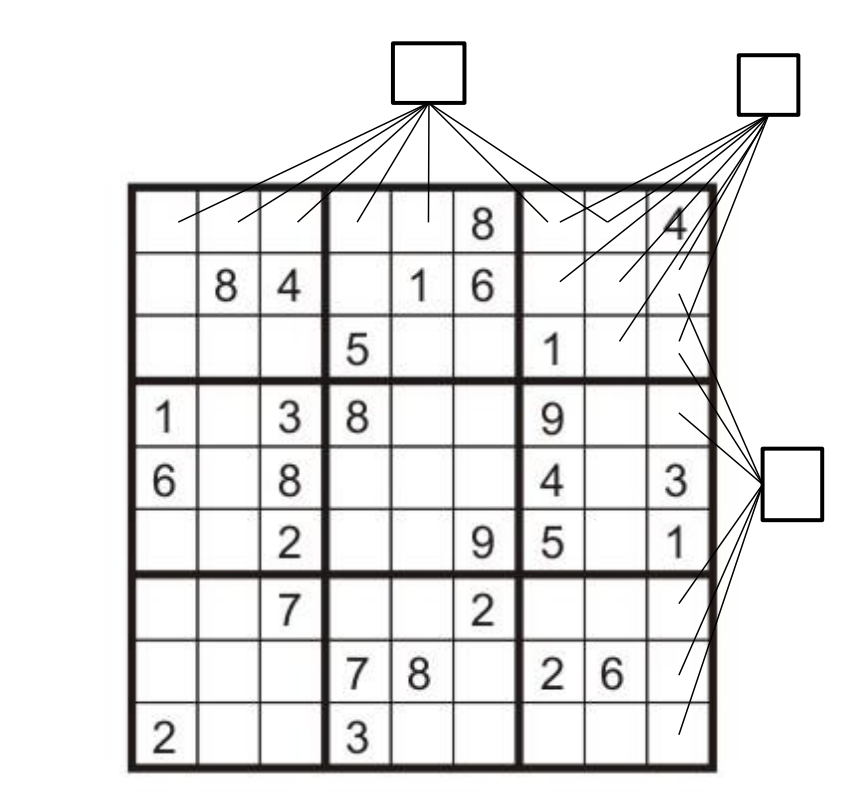
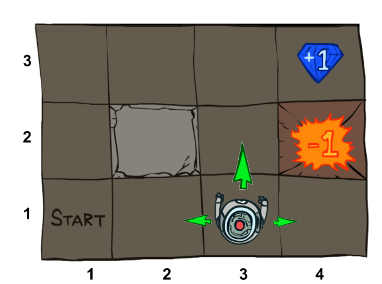
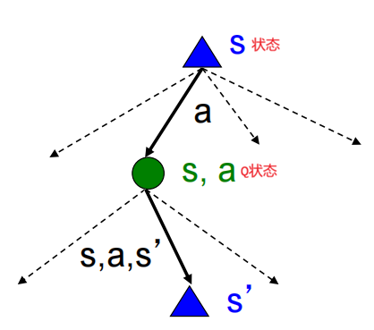
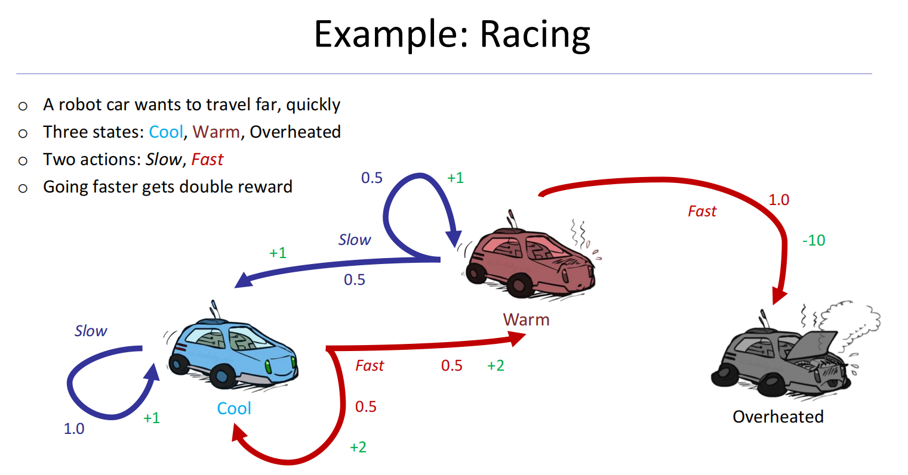
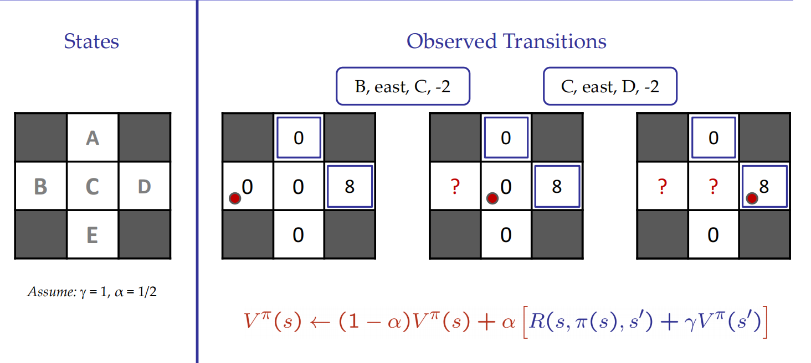
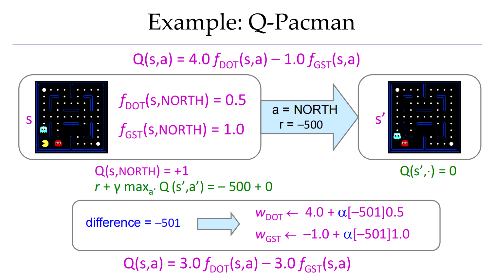

# 第一章 引言

## 课程信息
- **课程名称**：Artificial Intelligence Introduction
- **参考教材**：Russell & Norvig, 《AI: A Modern Approach》（人工智能：一种现代的方法，第 3 版）
---

## 一、什么是人工智能？
### 1.AI 的四种定义维度

| 维度         | 描述                |
| ---------- | ----------------- |
| **像人一样思考** | Think like people |
| **像人一样行动** | Act like people   |
| **理性地思考**  | Think rationally  |
| **理性地行动**  | Act rationally    |
### 2.AI 系统架构
```
┌─────────────────────────────────────────┐
│              Algorithms                 │
│  ┌───────────────┐  ┌───────────────┐   │
│  │ Representation│+ │  Constraints  │   │
│  └───────────────┘  └───────────────┘   │
│                  ▲                      │
│                Models                   │
│  ┌────────┐  ┌──────────┐  ┌─────────┐  │
│  │Thinking│  │Perception│  │ Action  │  │
│  └────────┘  └──────────┘  └─────────┘  │
└─────────────────────────────────────────┘
┌─────────────────────────────────────────┐
│              Environment                │
└─────────────────────────────────────────┘
```

**核心要素**：
- **表示 (Representation)** + **约束 (Constraints)** → **模型 (Models)**
- 模型连接三大能力：**思考、感知、行动**
- 所有能力作用于**环境 (Environment)**

---

## 二、人工智能发展简史

### 1. 早期时代 (1940-1950)
- **1943 年**：McCulloch & Pitts — 大脑的布尔电路模型
- **1950 年**：图灵发表《Computing Machinery and Intelligence》

### 2. 黄金年代 (1950-1970)
- **1950s**：早期 AI 程序涌现
    - Samuel 的跳棋程序
    - Newell & Simon 的逻辑理论家 (Logic Theorist)
    - Gelernter 的几何引擎
- **1956 年**：达特茅斯会议 — "Artificial Intelligence" 名称正式确立
- **1965 年**：Robinson 提出**逻辑推理完备算法**

### 3. 基于知识的方法 (1970-1990)
- **1969-1979**：基于知识的系统早期发展
- **1980-1988**：专家系统产业蓬勃发展
- **1988-1993**：专家系统产业衰退 — *"AI 冬天" (AI Winter)*

### 4. 统计方法时代 (1990-)
- 概率论复兴，关注不确定性问题
- 技术深度普遍提升
- 智能体与学习系统兴起 — *"AI 春天"？*

### 5. 2000 年至今
- 深度学习、大模型、AGI 概念兴起
- AI 在各领域大规模应用

---

## 三、AI 能做什么？

### 1. 游戏智能体 (Game Agents)
**经典里程碑**：
- **1997 年 5 月**：深蓝 (Deep Blue) vs 卡斯帕罗夫
    - 首次在国际象棋中击败人类世界冠军
    - 每秒搜索 2 亿个棋盘位置
    - 卡斯帕罗夫评价："我能感觉到 —— 我能闻到 —— 桌子对面有一种新的智慧"

**强化学习应用**：
- DeepMind 的 Atari 游戏（Pong、Enduro、Beamrider、Q\*bert 等）
- DeepMind: OpenSpiel
- 腾讯开悟平台（王者荣耀 AI 对战）

### 2. 机器人 (Robots)
- 功夫 BOT
- Unitree B2-W 四足机器人
- 人形机器人

### 3. 自动驾驶 (Autopilot)
- 比亚迪天神之眼
- 全场景绕行能力
- 高速公路自动驾驶

### 4. 预测 (Predictions)
- 股票市场预测
- COVID-19 疫情全球新增人数预测

### 5. 自然语言处理 (Natural Language)
**语音技术**：
- 自动语音识别 (ASR)
- 文本转语音合成 (TTS)
- 对话系统（如 Siri）

**语言处理技术**：
- 问答系统
- 机器翻译
- 网页搜索
- 文本分类、垃圾邮件过滤等

### 6. 计算机视觉 (Computer Vision)
- 图像识别
- 目标检测
- 场景理解

---

## 四、智能体 (Agent)

### 定义
**Agent 是能够感知环境并采取行动的实体。**(An agent is an entity that perceives and acts.)

### 智能体与环境的交互
```
┌─────────────────┐          ┌─────────────────┐
│                 │          │                 │
│     Agent       │ Percepts │   Environment   │
│                 │◄─────────│                 │
│   ┌─────────┐   │          │                 │
│   │ Sensors │   │          │                 │
│   └────┬────┘   │          │                 │
│        │ ?      │          │                 │
│   ┌────▼────┐   │ Actions  │                 │
│   │Actuators│   ├─────────►│                 │
│   └─────────┘   │          │                 │
│                 │          │                 │
└─────────────────┘          └─────────────────┘
```

**核心概念**：
- **传感器 (Sensors)**：从环境获取感知 (Percepts)
- **执行器 (Actuators)**：对环境施加行动 (Actions)
- **环境 (Environment)**：智能体所处的外部世界

### 理性智能体 (Rational Agent)
> 设计一个理性智能体，其选择的行动能够**最大化其（期望）效用**。

---

## 五、本课程内容

### 课程目标
1. **学习识别**：何时以及如何用现有技术解决新问题
2. **学习机制**：掌握众多算法的工作原理

### 典型案例
- Pac-Man 吃豆人：作为智能体的经典教学案例
- 狼羊菜过河问题等经典 AI 问题

---

## 关键术语
- **Agent (智能体)**：能够感知环境并采取行动的实体
- **Rationality (理性)**：选择最大化期望效用的行动
- **Percept (感知)**：智能体从环境获取的信息
- **Action (行动)**：智能体对环境施加的影响
- **Utility (效用)**：衡量行动结果好坏的标准

---
---

# 第二章 无信息搜索

## 本章内容
- 提前规划的智能体 (Agents that Plan Ahead)
- 搜索问题 (Search Problems)
- 无信息搜索方法 (Uninformed Search Methods)
    - 深度优先搜索 (DFS)
    - 广度优先搜索 (BFS)
    - 一致代价搜索 (UCS)    

---

## 一、搜索问题
### 搜索问题的组成
一个搜索问题由以下部分组成：

| 组成部分                          | 说明                   |
| ----------------------------- | -------------------- |
| **状态空间** (State Space)        | 所有可能状态的集合            |
| **后继函数** (Successor Function) | 给定状态和行动，返回下一个状态和行动代价 |
| **起始状态** (Start State)        | 搜索的起点                |
| **目标测试** (Goal Test)          | 判断当前状态是否为目标状态        |
> **解 (Solution)**：将起始状态转换为目标状态的一系列行动（一个计划）。

### 示例：罗马尼亚旅行问题
- **状态空间**：城市
- **后继函数**：道路 → 前往相邻城市，代价 = 距离
- **起始状态**：Arad
- **目标测试**：当前状态 == Bucharest ？
- **解**：从 Arad 到 Bucharest 的路径

---

## 二、状态空间
### 世界状态 vs 搜索状态
- **世界状态**：包含环境的每一个细节
- **搜索状态**：只保留规划所需的细节（抽象）

### 状态空间示例
#### 问题 1：路径规划 (Pathing)
- **状态**：(x, y) 位置
- **行动**：N/S/E/W（四个方向）
- **后继**：仅更新位置
- **目标测试**：(x, y) == END ？

#### 问题 2：吃光所有豆子 (Eat-All-Dots)
- **状态**：{(x, y), 豆子布尔值数组}
- **行动**：N/S/E/W
- **后继**：更新位置，可能更新豆子布尔值
- **目标测试**：所有豆子都被吃掉（全为 false）

### 状态空间大小计算
以吃豆人为例：

| 要素    | 数量   |
| ----- | ---- |
| 智能体位置 | 120  |
| 食物数量  | 30   |
| 幽灵位置  | 12   |
| 智能体朝向 | NSEW |

- **世界状态总数**：120 × 2³⁰ × 12² × 4
- **路径规划状态数**：120
- **吃光豆子状态数**：120 × 2³⁰

---

## 三、状态空间图与搜索树

### 状态空间图 (State Space Graph)
搜索问题的数学表示：
- **节点**：（抽象后的）世界配置
- **边**：表示后继（行动结果）
- **目标测试**：一组目标节点（可能只有一个）
- **特点**：每个状态只出现一次！
- **现实**：我们很少能在内存中构建完整的图（太大了），但这是一个有用的概念

### 搜索树 (Search Tree)
- 一棵关于计划及其结果的 "如果... 会怎样" 的树：
- **根节点**：起始状态
- **子节点**：对应后继状态
- **节点**：显示状态，但对应达到这些状态的**计划**
- **现实**：对于大多数问题，我们永远无法构建完整的树

### 状态空间图 vs 搜索树
> **关键区别**：搜索树中的*每个节点*对应状态空间图中的一条*完整路径*。
- 我们按需构建两者 —— 并且尽可能少构建
- 搜索树中存在大量重复结构（同一个状态可能出现在多条路径中）

---

## 四、树搜索算法

### 基本思想
1. **扩展**潜在计划（树节点）
2. 维护一个**边缘 (Fringe)**：待考虑的部分(partial)计划集合
3. 目标：尽可能*少*地扩展树节点

### 通用树搜索算法
```txt
function TREE-SEARCH(problem, strategy) returns a solution, or failure
    initialize the search tree using the initial state of problem
    loop do
        if there are no candidates for expansion then
            return failure
        choose a leaf node for expansion according to strategy
	    if the node contains a goal state then
	        return the corresponding solution
        else expand the node and add the resulting nodes to the search tree
    end
```

### 核心概念
- **Fringe (边缘)**：待扩展的节点集合
- **Expansion (扩展)**：生成一个节点的所有后继
- **Exploration strategy (探索策略)**：选择哪个节点进行扩展
- **核心问题**：选择边缘中的哪个节点进行探索？

---

## 五、搜索算法的评价指标

|指标|说明|
|---|---|
|**完备性 (Complete)**|如果存在解，是否保证能找到？|
|**最优性 (Optimal)**|是否保证找到代价最小的路径？|
|**时间复杂度**|算法需要多长时间？|
|**空间复杂度**|算法需要多少内存？|

### 搜索树参数
- **b**：分支因子 (branching factor)
- **m**：最大深度 (maximum depth)
- **s**：最浅解的深度 (depth of shallowest solution)
- **C***：最优解的代价
- **ε**：最小边代价
**整棵树的节点数**：1 + b + b² + ... + bᵐ = O(bᵐ)

---

## 六、深度优先搜索 (DFS)

### 策略(Strategy)
**先扩展最深的节点** (expand a deepest node first)

### 实现(Implementation)
- **Fringe**：LIFO 栈（后进先出）

### 性质(Properties)
| 性质        | 结论    | 说明                     |
| --------- | ----- | ---------------------- |
| **时间复杂度** | O(bᵐ) | 可能处理整棵树                |
| **空间复杂度** | O(bm) | 只保留路径上的兄弟节点            |
| **完备性**   | ❌ 不完备 | 如果 m 是无限的（有环），可能永远找不到解 |
| **最优性**   | ❌ 不最优 | 找到 "最左边" 的解，与深度或代价无关   |

---

## 七、广度优先搜索 (BFS)

### 策略
**先扩展最浅的节点** (expand a shallowest node first)

### 实现
- **Fringe**：FIFO 队列（先进先出）

### 性质

| 性质        | 结论      | 说明               |
| --------- | ------- | ---------------- |
| **时间复杂度** | O(bˢ)   | 处理最浅解以上的所有节点     |
| **空间复杂度** | O(bˢ)   | 大约保留最后一层的所有节点    |
| **完备性**   | ✅ 完备    | 如果存在解，s 一定是有限的   |
| **最优性**   | ⚠️ 条件最优 | 仅当所有行动代价都为 1 时最优 |

> **注意**：BFS 找到的是**行动数最少**的路径，不一定是**代价最小**的路径。

---

## 八、一致代价搜索 (Uninform Cost Search, UCS)

### 策略
**先扩展代价最小的节点** (expand a cheapest node first)

### 实现
- **边缘Fringe**：优先队列（优先级：累积代价）

### 性质

| 性质        | 结论               | 说明                      |
| --------- | ---------------- | ----------------------- |
| **时间复杂度** | $O(b^{C^{*}/ε})$ | 与有效深度成指数关系,\*不是乘法，只是标识符 |
| **空间复杂度** | $O(b^{C^{*}/ε})$ | 大约保留最后一层                |
| **完备性**   | ✅ 完备             | 假设最优解代价有限且最小边代价为正       |
| **最优性**   | ✅ 最优             | 保证找到代价最小的路径             |

| 符号     | 全称                       | 含义                                                 |
| ------ | ------------------------ | -------------------------------------------------- |
| **C*** | Cost of optimal solution | **最优解的代价** —— 从起点到目标的最小路径总代价                       |
| **ε**  | epsilon                  | **最小边代价** —— 所有行动中(包括不在最优解的)代价最小的那条边的值（每一步至少要花的代价） |
### 代价等高线
UCS 按**代价递增的等高线**探索：
- 先探索所有代价 ≤ 1 的节点
- 再探索所有代价 ≤ 2 的节点
- 依此类推...

### UCS 的优缺点
**优点**：
- ✅ 完备
- ✅ 最优

**缺点**：
- ❌ 在每个 "方向" 上都探索
- ❌ 没有关于目标位置的信息（盲目搜索）

---

## 九、统一队列思想

所有这些搜索算法除了**边缘策略**外都是相同的！

| 算法      | Fringe 数据结构           | 入队位置           |
| ------- | --------------------- | -------------- |
| **DFS** | 栈 (Stack)             | 队首 (first)     |
| **BFS** | 队列 (Queue)            | 队尾 (back)      |
| **UCS** | 优先队列 (Priority Queue) | 按代价排序 (sorted) |
### 统一算法框架

```
初始化队列 → 目标测试 → 扩展队列中第一条路径 → 入队
                                          ↑
                                          │
                     DFS: 队首    BFS: 队尾    UCS: 排序
```

---

## 十、搜索与模型

### 核心思想
- 搜索在**世界模型**上运行
- 智能体不会在现实世界中尝试所有计划
- 规划完全是 "模拟" 的
- *搜索的质量取决于模型的质量*

> "It's only a model..." — 你的搜索只和你的模型一样好

### 模型错误的后果
如果模型不准确，搜索得到的 "最优解" 在现实中可能完全不可行。

---

## 🤜十一、DFS、BFS、UCS对比
| 算法      | 完备性 | 最优性         | 时间复杂度            | 空间复杂度            | 说明         |
| ------- | --- | ----------- | ---------------- | ---------------- | ---------- |
| **DFS** | ❌   | ❌           | $O(bᵐ)$          | $O(bm)$          | 深度优先,可能走极端 |
| **BFS** | ✅   | ⚠️ 仅当代价 = 1 | $O(bˢ)$          | $O(bˢ)$          | 广度优先，找最浅解  |
| **UCS** | ✅   | ✅           | $O(b^{C^{*}/ε})$ | $O(b^{C^{*}/ε})$ | 代价优先，找最优解  |

---

## 关键术语
- **State Space (状态空间)**：所有可能状态的集合
- **Successor Function (后继函数)**：给定状态返回后继状态及代价
- **Goal Test (目标测试)**：判断状态是否为目标
- **Solution (解)**：从起始状态到目标状态的行动序列
- **Fringe (边缘)**：待扩展的节点集合
- **Expansion (扩展)**：生成节点的所有后继
- **Branching Factor (分支因子)**：每个节点的平均后继数 b
- **Depth (深度)**：从根节点到节点的步数
- **Complete (完备性)**：存在解时一定能找到
- **Optimal (最优性)**：找到的解是代价最小的
- **DFS**：深度优先搜索 (Depth-First Search)
- **BFS**：广度优先搜索 (Breadth-First Search)
- **UCS**：一致代价搜索 (Uniform-Cost Search)

---
---

# 第三章 有信息搜索

## 本章内容
- 启发式搜索 (Heuristic Search)
- 贪婪搜索 (Greedy Search)
- A* 搜索 (A* Search)
- 图搜索 (Graph Search)

---

## 一、启发式函数 (Heuristic Function)

### 定义
**启发式函数**：估计一个状态离目标有多近的函数。(A function that estimates how close a state is to a goal.)

### 特点
- 为**特定搜索问题**设计
- 提供 "往哪个方向走" 的引导
- 是有信息搜索的核心

### 常见示例

| 问题     | 启发式函数                | 说明                       |
| ------ | -------------------- | ------------------------ |
| 路径规划   | 曼哈顿距离 (Manhattan)    | 横向 + 纵向距离(x + y)         |
| 路径规划   | 欧几里得距离 (Euclidean)   | 直线距离($\sqrt{x^2 + y^2}$) |
| 罗马尼亚问题 | 直线距离 (Straight-line) | 到 Bucharest 的直线距离        |
| 煎饼问题   | 最大不在位煎饼数             | 最大的还没归位的煎饼编号             |
| 8 数码问题 | 错位棋子数                | 不在正确位置的棋子数量              |
| 8 数码问题 | 曼哈顿距离                | 每个棋子到目标位置的距离之和           |

---

## 二、贪婪搜索 (Greedy Search)

### 策略
**扩展看起来最接近目标的节点。** (Expand the node that you think is closest to a goal state.)

### 实现
- **评估函数**：h(n) —— 从 n 到目标的估计代价
- **边缘Fringe**：优先队列，按 h(n) 从小到大排序

### 性质
| 性质        | 结论    | 说明             |
| --------- | ----- | -------------- |
| **完备性**   | ❌ 不完备 | 可能走进死胡同或无限循环   |
| **最优性**   | ❌ 不最优 | 找到的路径不一定是最短的   |
| **时间复杂度** | O(bᵐ) | 最坏情况像引导不好的 DFS |
| **空间复杂度** | O(bm) | 同 DFS          |

### 优缺点
**优点**：
- ✅ 通常能快速找到目标
- ✅ 向目标方向前进，扩展节点少

**缺点**：
- ❌ 可能 "贪心" 地走向错误的目标
- ❌ 不保证找到最优解
- ❌ 可能陷入局部最优

> 典型情况：贪婪搜索直接带你走向（错误的）目标。

---

## 三、A* 搜索

### 核心思想
> **结合 UCS 的最优性和贪婪搜索的高效性。**

### 两种代价
| 代价类型      | 符号   | 含义                 | 对应算法 |
| --------- | ---- | ------------------ | ---- |
| **后向代价**  | g(n) | 从起点到 n 的实际代价       | UCS  |
| **前向代价**  | h(n) | 从 n 到目标的估计代价       | 贪婪搜索 |
| **总估计代价** | f(n) | f(n) = g(n) + h(n) | A*   |

### A* 的评估函数
$$
\begin{aligned}
f(n) &= g(n) + h(n) \\
  &= 已走的真实代价 + 到目标的估计代价 \\
  &= 经过n的完整路径的总估计代价 \\
  \end{aligned}
$$

### 策略
> **按 f(n) 从小到大扩展节点。** 优先扩展 "总估计代价最小" 的节点。

---

## 四、A* 的终止条件

### 关键问题
> 我们应该在目标*入队*时停止，还是在*出队*时停止？
> 答：必须在目标出队（dequeue）时停止！

### 为什么？
因为先入队的目标不一定是最优的。可能有一个 $f$ 值更大但实际代价更小的目标还在队列里。先入队的相当于是找到的第一个答案，有可能有更有的答案！
```txt
1. 把起点 S 入队
2. 循环：
   a. 从队列中取出 f 值最小的节点 → 出队
   b. 如果这个节点是目标，返回解 ✅
   c. 扩展这个节点，生成所有子节点
   d. 把每个子节点加入队列 → 入队
3. 队列为空则失败
```

**示例**：
```
S --2--> A --2--> G   总代价=4
 \                |
  ---2--> B --3---┘   总代价=5
```

- S→A→G 入队时 f=4
- S→B→G 入队时 f=5
- 但如果 h 不是可采纳的，可能 S→B→G 实际更优

> **只有当目标从队列中被取出时，我们才能确定它是最优的。**

---

## 五、可采纳性 (Admissibility)

### 定义
启发式 h 是**可采纳的**（乐观的），如果：$0 ≤ h(n) ≤ h^*(n)$
其中：
- **h(n)**：启发式估计的从 n 到目标的代价
- **h*(n)**：从 n 到目标的**真实最优代价**(\*号不是乘法的意思)

### 直观理解
- 可采纳 = **永远不高估**真实代价（乐观的估计）
- 实际代价 ≥ 估计代价

### 为什么需要可采纳性？
如果*启发式*高估了代价：
- 可能把真正的最优路径 "吓跑"
- 好的计划被埋在 fringe 里永远不被扩展
- A* 就不再是最优的了

> 不可采纳（悲观）的启发式会破坏最优性，因为它把好计划困在了边缘里。

---

## 六、A* 树搜索的最优性

### 定理
> 如果启发式 h 是可采纳的，那么 A* 树搜索是最优的。

### 证明思路
**假设**：
- A 是最优目标节点：g(A) = C*
- B 是次优目标节点：g(B) > C*
- h 是可采纳的

**结论**：
- A 会在 B 之前离开 fringe（被扩展）

### 证明步骤
1. **f(n) ≤ f(A)**
    - f(n) = g(n) + h(n) （定义）
    - h(n) ≤ h*(n) （可采纳性）
    - g(n) + h(n) ≤ g(n) + h*(n) = g(A) （n 是 A 的祖先）
    - f(A) = g(A) + h(A) = g(A) （目标处 h=0）
    - 所以 f(n) ≤ f(A)

2. **f(A) < f(B)**
    - g(A) < g(B) （A 是最优的）
    - f(A) = g(A), f(B) = g(B) （目标处 h=0）
    - 所以 f(A) < f(B)

3. **n 在 B 之前扩展**
    - f(n) ≤ f(A) < f(B)
    - A* 按 f 值从小到大扩展
    - 所以 n 先于 B 被扩展

**结论**：A 的所有祖先都在 B 之前扩展，所以 A 先于 B 被扩展 → A* 是最优的。

---

## 🤜七、UCS vs A* 对比

### 扩展方式
| 算法      | 扩展方式          | 等高线形状        |
| ------- | ------------- | ------------ |
| **UCS** | 向所有方向均匀扩展     | 圆形（以起点为中心）   |
| **A***  | 主要向目标扩展，但保留备选 | 椭圆形（向目标方向拉长） |

### 直观理解
- **UCS**：就像水波，从起点向四周均匀扩散
- **A\***：就像被拉向目标的水波，主要朝目标方向扩展

> A* 主要向目标扩展，但为了确保最优性也会 "对冲赌注"。

---

## 八、A* 的应用
- 🎮 视频、游戏路径寻路
- 🗺️ 路径规划、路由问题
- 📦 资源规划问题
- 🤖 机器人运动规划
- 📝 语言分析
- 🌐 机器翻译
- 🎤 语音识别
- ...

---

## 九、如何设计可采纳的启发式？

### 核心方法：松弛问题 (Relaxed Problem)
> **可采纳的启发式通常是松弛问题的解。**

### 什么是松弛问题？
- 去掉一些约束，让问题变得更容易
- 在松弛问题中，有更多可用的行动
- 松弛问题的最优解 ≤ 原问题的最优解
- 因此松弛问题的解代价可以作为原问题的可采纳启发式

### 示例：8 数码问题
**原问题**：棋子只能滑动到相邻的空格
![[8 Puzzle Problem.png]]
**松弛问题 1**：棋子可以直接移动到任意位置
- 启发式：错位棋子数（Tiles）
- h(start) = 8

**松弛问题 2**：棋子可以穿过其他棋子移动
- 启发式：曼哈顿距离（Manhattan）
- h(start) = 3+1+2+... = 18

### 效果对比（8 数码）
| 算法 / 启发式       | 4 步解 | 8 步解  | 12 步解     |
| -------------- | ---- | ----- | --------- |
| UCS            | 112  | 6,300 | 3.6 × 10⁶ |
| Tiles（错位）      | 13   | 39    | 227       |
| Manhattan（曼哈顿） | 12   | 25    | 73        |

> 启发式越准确（越接近真实代价），扩展的节点越少！

---

## 十、启发式的权衡

### 质量 vs 计算量
| 启发式质量   | 扩展节点数 | 每个节点计算量 |
| ------- | ----- | ------- |
| 差（低估很多） | 多     | 少       |
| 好（接近真实） | 少     | 多       |

### 核心权衡
> 随着启发式越来越接近真实代价，你扩展的节点会更少，但通常每个节点计算启发式本身的工作会更多。

### 极端情况
- **h(n) = 0**：就是 UCS，扩展很多节点，计算很快
- **h(n) = h*(n)**：完美启发式，只扩展最优路径上的节点，但计算 h 本身就是解原问题了

---

## 十一、图搜索 (Graph Search)

### 树搜索的问题
> **检测不到重复状态会导致指数级更多的工作。**
状态空间图中每个状态只出现一次，但搜索树中可能重复出现无数次。

### 图搜索的思想
> **永远不扩展同一个状态两次。**

### 实现方法
1. 在树搜索基础上增加一个**闭集 (Closed Set)**
2. 闭集：保存所有已经扩展过的状态
3. 扩展节点前，先检查其状态是否在闭集中
4. 如果在闭集中，跳过；如果不在，扩展并加入闭集
这个和构建**最小生成树**一样。
> **重要**：闭集要用集合（Set）存储，不要用列表（List）—— 查找效率差很多。

### 伪代码
```txt
function GRAPH-SEARCH(problem, fringe) return a solution, or failure
    closed ← an empty set
    fringe ← Insert(Make-Node(Initial-State(problem)), fringe)
    loop do
        if fringe is empty then return failure
        node ← Remove-Front(fringe)
        if GOAL-TEST(problem, STATE[node]) then return node
        if STATE[node] is not in closed then
            add STATE[node] to closed
            for child-node in Expend(STATE[node], problem) do
                fringe ← Insert(child-node, fringe)
    end
```

---

## 十二、一致性 (Consistency)

### 为什么需要一致性？
> A* *树*搜索只需要可采纳性就够了，但 A* *图*搜索需要更强的条件 ——**一致性**。

### 定义
> 启发式 h 是**一致的**，如果对于每条边 (A→C)：**h(A) - h(C) ≤ cost(A→C)**

也可以写成：
> **h(A) ≤ cost(A→C) + h(C)**

### 直观理解
- 一致性 = 启发式的 "三角不等式"
- 估计的代价差 ≤ 真实的代价差
- 沿着路径走，f 值永不下降

### 🤜一致性 vs 可采纳性
| 性质       | 含义                  | 适用场景   |
| -------- | ------------------- | ------ |
| **可采纳性** | h(n) ≤ 真实到达目标代价     | 树搜索最优性 |
| **一致性**  | h(A) - h(C) ≤ 真实边代价 | 图搜索最优性 |

**关系**：一致性蕴含可采纳性（一致的启发式一定是可采纳的）

> 一般来说，大多数自然的可采纳启发式往往也是一致的，特别是来自松弛问题的。

---

## 十三、A* 图搜索的最优性

### 定理
> 如果启发式 h 是一致的，那么 A* 图搜索是最优的。

### 证明思路
**问题**：同一个状态可能有多个路径到达。如果差的路径先扩展了该状态，好的路径就被闭集挡住了。

**证明**：
1. 假设 n' 是状态 n 的次优路径，先被扩展了
2. 设 p 是最优路径上 n 的祖先，在 n' 被弹出时 p 还在队列里(n' 更先扩展)
3. 因为一致性：f(p) < f(n)
4. 因为 n' 是次优的：f(n) < f(n')
5. 所以 f(p) < f(n') ==> p 应该在 n' 之前扩展
6. 矛盾！因此最优路径一定会先到达

**结论**：A* 图搜索在一致启发式下是最优的。

---

## 🤜十四、总结：统一队列思想

> 所有搜索算法除了**边缘策略**外都是相同的！

| 算法         | Fringe 排序依据        | 入队方式       |
| ---------- | ------------------ | ---------- |
| **DFS**    | 无（深度优先）            | 队首 (first) |
| **BFS**    | 无（广度优先）            | 队尾 (back)  |
| **UCS**    | g(n) 后向代价          | 按 g 值排序    |
| **Greedy** | h(n) 前向估计          | 按 h 值排序    |
| **A***     | f(n) = g(n) + h(n) | 按 f 值排序    |

### 最优性条件总结
| 搜索类型    | 最优性条件  | 特殊情况 (h=0) |
| ------- | ------ | ---------- |
| **树搜索** | 启发式可采纳 | UCS        |
| **图搜索** | 启发式一致  | UCS        |

---

## 关键术语
- **Heuristic Function (启发式)**：估计状态到目标距离的函数
- **Admissible (可采纳性)**：启发式永远不高估真实代价
- **Consistency (一致性)**：启发式满足三角不等式
- **Greedy Search (贪婪搜索)**：按 h(n) 扩展
- **A* Search (A* 搜索)**：按 f(n) = g(n) + h(n) 扩展
- **g(n)**：从起点到 n 的真实代价
- **h(n)**：从 n 到目标的估计代价
- **f(n)**：经过 n 的总估计代价
- **h*(n)**：从 n 到目标的真实最优代价
- **Relaxed Problem (松弛问题)**：去掉约束的简化问题，用于设计启发式
- **Graph Search (图搜索)**：不重复扩展状态的搜索
- **Closed Set (闭集)**：保存已扩展状态的集合

---
---

# 第四章 约束满足问题 (CSP)

## 本章内容
- 约束满足问题概述
- CSP 示例
- 约束图
- CSP 的种类与约束类型
- 回溯搜索
- 过滤与约束传播
- 弧一致性 (AC-3)
- 问题结构利用
- 迭代改进与最小冲突

---

## 一、什么是 CSP？

### 定义
> **约束满足问题 (Constraint Satisfaction Problem, CSP)** 是搜索问题的一个特殊子集。专门用于**识别问题**。

### 🤜标准搜索 vs CSP
| 特性       | 标准搜索问题      | CSP              |
| -------- | ----------- | ---------------- |
| **状态**   | "黑盒"：任意数据结构 | 由变量 Xi 及其值域 D 定义 |
| **目标测试** | 任意函数        | 一组约束，指定变量的允许组合   |
| **后继函数** | 任意          | 给变量赋值            |

### CSP 的组成
| 组成                   | 说明                    |
| -------------------- | --------------------- |
| **变量 (Variables)**   | N 个变量 X₁, X₂, ..., Xₙ |
| **值域 (Domain)**      | 每个变量有值域 D（可能不同）       |
| **约束 (Constraints)** | 指定变量值的允许组合            |

### 🤜两类搜索问题
| 类型                      | 目标   | 特点           | 示例      |
| ----------------------- | ---- | ------------ | ------- |
| **规划 (Planning)**       | 动作序列 | 路径很重要，有代价/深度 | 路径规划、迷宫 |
| **识别 (Identification)** | 变量赋值 | 目标本身重要，路径不重要 | 地图着色、调度 |

---

## 二、CSP 示例

### 示例 1：地图着色 (Map Coloring)

**问题**：给地图上的区域着色，相邻区域颜色不同


|   组成   |               内容               |
| :----: | :----------------------------: |
| **变量** | 各个区域（WA, NT, Q, NSW, V, SA, T） |
| **值域** |       {red, green, blue}       |
| **约束** |            相邻区域颜色不同            |

**约束表示**：
- 隐式：WA ≠ NT
- 显式：(WA, NT) ∈ {(red, green), (red, blue), ...}

**解**：满足所有约束的赋值，如：
{WA=red, NT=green, Q=red, NSW=green, V=red, SA=blue, T=green}

---

### 示例 2：N 皇后问题 (N-Queens)

#### 表述方式 1：棋盘格子
| 组成     | 内容                         |
| ------ | -------------------------- |
| **变量** | Xᵢⱼ（每个格子一个变量）              |
| **值域** | {0, 1}（0 = 空，1 = 皇后）       |
| **约束** | 每行、每列、每条对角线最多一个皇后，总共 N 个皇后 |

#### 表述方式 2：每行一个皇后
| 组成     | 内容                |
| ------ | ----------------- |
| **变量** | Qₖ（第 k 行的皇后在第几列）  |
| **值域** | {1, 2, 3, ..., N} |
| **约束** | 任意两个皇后不互相攻击       |

> 好的表述方式可以大大简化问题！

---

### 示例 3：密码算术 (Cryptarithmetic)
**问题**：SEND + MORE = MONEY

| 组成     | 内容                           |
| ------ | ---------------------------- |
| **变量** | F, T, U, W, R, O, X₁, X₂, X₃ |
| **值域** | {0,1,2,...,9}                |
| **约束** | alldiff (F,T,U,W,R,O)，列加法约束  |

---

### 示例 4：数独 (Sudoku)
| 组成     | 内容                   |
| ------ | -------------------- |
| **变量** | 每个空格子                |
| **值域** | {1,2,...,9}          |
| **约束** | 每行、每列、每个 3×3 区域数字都不同 |



---

## 三、约束图

### 二元 CSP
> **二元 CSP**：每个约束最多涉及两个变量。

### 约束图
- **节点**：变量
- **边**：表示两个变量之间有约束

### 为什么重要？
通用 CSP 算法可以**利用图结构**来加速搜索。

**示例**：塔斯马尼亚 (T) 是独立子问题，可以分开解决！

---

## 四、CSP 的种类

### 按变量类型分
| 类型        | 说明          | 示例         |
| --------- | ----------- | ---------- |
| **离散有限域** | 每个变量有有限个可选值 | 地图着色、数独    |
| **离散无限域** | 变量值域无限      | 作业调度（整数时间） |
| **连续变量**  | 变量取实数值      | 望远镜观测时间调度  |

### 约束的种类
| 类型       | 涉及变量数  | 示例         |
| -------- | ------ | ---------- |
| **一元约束** | 1 个    | SA ≠ green |
| **二元约束** | 2 个    | SA ≠ WA    |
| **高阶约束** | 3 个或更多 | 密码算术的列约束   |
| **软约束**  | -      | 偏好（红色比绿色好） |

> 软约束通常转化为每个赋值的代价，形成约束优化问题。

---

## 五、现实世界的 CSP

- 📅 课表分配问题：谁教什么课
- ⏰ 时间表问题：课程何时何地开设
- 🔧 硬件配置
- 🚚 运输调度
- 🏭 工厂调度
- 🔌 电路布局
- 🔍 故障诊断
- ...

---

## 六、CSP 的起源：线图解释

### Waltz 算法
- 用于将多面体的线框图解释为 3D 物体
- AI 中最早将问题建模为 CSP 的例子之一

### 发展历程
| 人物          | 贡献                   |
| ----------- | -------------------- |
| **Guzman**  | 提出如何用机器检测物体数量        |
| **Huffman** | 设计了线的标记方法（凹、凸、边界）    |
| **Waltz**   | 改进方法，加入裂缝、阴影等，提出约束传播 |

### 核心思想
- 每个交点是一个变量
- 相邻交点之间有约束
- 解是物理上可实现的 3D 解释

---

## 七、求解 CSP：标准搜索公式(Standard Search Formulation)

### 标准搜索表述
| 组成       | 内容           |
| -------- | ------------ |
| **状态**   | 已赋值的变量（部分赋值） |
| **初始状态** | 空赋值 {}       |
| **后继函数** | 给一个未赋值的变量赋值  |
| **目标测试** | 赋值完整且满足所有约束  |

### 问题
朴素的 DFS 效率很低，因为：
- 分支因子大
- 很多路径明显不对，但要走到头才发现

---

## 八、回溯搜索 (Backtracking Search)

### 两个核心改进
#### 思想 1：一次一个变量
- 变量赋值是可交换的（顺序不影响结果）
- 固定顺序 → 更好的分支因子！
- 例如：{WA=red 然后 NT=green} 和 {NT=green 然后 WA=red} 是一样的
- 每步只考虑给一个变量赋值
.png)
#### 思想 2：边做边检查约束
- 只考虑不与已有赋值冲突的值
- "增量式目标测试"
- 发现冲突立即回溯，不用走到头

### 定义
> **回溯搜索** = DFS + 变量顺序(variable-ordering) + 冲突即失败(fail-on-violation)

### 性能
> 可以解决 n ≈ 25 的 n 皇后问题。

### 伪代码
```txt
function BACKTRACKING-SEARCH(csp) returns solution or failure
    return RECURSIVE-BACKTRACKING({}, csp)

function RECURSIVE-BACKTRACKING(assignment, csp) returns solution or failure
    if assignment is complete then return assignment
    var ← SELECT-UNASSIGNED-VARIABLE(VARIABLES[csp], assignment, csp)
    for each value in ORDER-DOMAIN-VALUES(var, assignment, csp) do
        if value is consistent with assignment given CONSTRAINTS[csp] then
            add {var = value} to assignment
            result ← RECURSIVE-BACKTRACKING(assignment, csp)
            if result ≠ failure then return result
            remove {var = value} from assignment
    return failure
```

---

## 九、改进回溯搜索

### 三大改进方向
| 方向                 | 问题                | 方法        |
| ------------------ | ----------------- | --------- |
| **过滤 (Filtering)** | 能提前检测必然失败吗？       | 前向检查、约束传播 |
| **排序 (Ordering)**  | 下一步选哪个变量？按什么顺序试值？ | MRV、最少约束值 |
| **结构 (Structure)** | 能利用问题结构吗？         | 树分解、独立子问题 |

---

## 十、过滤：前向检查 (Forward Checking)

### 思想
> 跟踪未赋值变量的值域，划掉违反约束的坏选项。

### 怎么做
每当给一个变量赋值后：
- 检查所有相邻的未赋值变量
- 从它们的值域中删掉与新赋值冲突的值
- 如果某个变量的值域空了 → 立即回溯
.png)

### 效果
- 比朴素回溯更早检测失败
- 避免了很多无用的搜索

---

## 十一、过滤：约束传播 (Constraint Propagation)

### 前向检查的局限
> 前向检查只能从已赋值变量传播到未赋值变量，但不能检测所有失败。
**示例**：NT 和 SA 都不能是蓝色，但前向检查发现不了。

### 约束传播
> **从约束到约束进行推理**，而不仅仅是从已赋值变量出发。

### 弧一致性 (Arc Consistency)
最简单的约束传播形式：确保所有弧都是一致的。

#### 定义
> 弧 X→Y 是一致的，当且仅当对于 X 的每个值 x, Y 中都有某个值 y 满足约束。
换句话说：X 的每个值都有 Y 中的 "搭档"。

#### 怎么做
- 如果 X 失去了一个值，X 的所有邻居都需要重新检查
- 反复检查直到没有变化
.png)

### AC-3(Arc Consistency version-3) 算法
```txt
function AC-3(csp) returns the CSP, possibly with reduced domains
    inputs: csp, a binary CSP with variables {X₁, X₂, ..., Xₙ}
    local variables: queue, a queue of arcs, initially all the arcs in csp
    
    while queue is not empty do // 队列里面还有弧，继续检测
        (Xᵢ, Xⱼ) ← REMOVE-FIRST(queue)
        if REMOVE-INCONSISTENT-VALUES(Xᵢ, Xⱼ) then // 删掉Xᵢ中不一致的值，若为 1
            for each Xₖ in NEIGHBORS[Xᵢ] do
                add (Xₖ, Xᵢ) to queue // 把弧 (Xₖ → Xᵢ) 重新加入队列

function REMOVE-INCONSISTENT-VALUES(Xᵢ, Xⱼ) returns true iff(当且仅当) succeeds
    removed ← false
    for each x in DOMAIN[Xᵢ] do
        if no value y in DOMAIN[Xⱼ] allows (x, y) to satisfy the constraint Xᵢ ↔ Xⱼ then // 若 Xⱼ 的值域中，没有一个值 y，使得 (x, y) 满足约束
            delete x from DOMAIN[Xᵢ] // 把 x 从 Xᵢ 的值域中删掉
            removed ← true
    return removed
```

### 复杂度
- 运行时间：O (n²d³)，可优化到 O (n²d²)
- 但检测所有可能的未来问题是 NP-hard 的

### 弧一致性的局限
执行弧一致性后：
- 可能只剩一个解
- 可能剩多个解
- 可能无解（但我们不知道）

> 弧一致性通常在*回溯搜索内部*运行，作为每步的过滤。

---

## 十二、K 一致性

### 概念
| 级别        | 含义                |
| --------- | ----------------- |
| **1 一致性** | 每个变量自己满足约束（节点一致性） |
| **2 一致性** | 任意两个变量满足约束（弧一致性）  |
| **3 一致性** | 任意三个变量满足约束（路径一致性） |
| **k 一致性** | 任意 k 个变量满足约束      |

### 强 K 一致性
> **强 k 一致性**：同时满足 k, k-1, k-2, ..., 1 一致性。

### 强 N 一致性
如果一个有 n 个变量的 CSP 是强 n 一致的：
- 我们可以*不用回溯*就解决！
- 选任意变量赋值 → 选第二个（2 一致性保证有值）→ 选第三个（3 一致性保证有值）→ ...

> 但达到强 n 一致性通常代价很高，所以实际中只用较低级别的。

---

## 十三、排序 (Ordering)

### 为什么需要排序？
在回溯搜索中，有两个关键选择：
1. **选哪个变量**先赋值？
2. **按什么顺序**尝试它的值？

> 选得好可以大大减少搜索量。

### 1. 变量排序：选哪个变量？
#### 最小剩余值 (Minimum Remaining Values, MRV)
> 选择值域最小的变量先赋值。也叫 "最受约束变量" 启发式 (Most Constrained Variable)。

**为什么有效？**
- 值域小的变量更容易 "失败"
- 先处理容易失败的，可以尽早剪枝
- 相当于 "先啃硬骨头"

**例子**：
- 变量 A 值域有 5 个值，变量 B 值域只剩 2 个值
- 先给 B 赋值，如果 B 无解，直接回溯，不用浪费时间在 A 上

#### 度启发式 (Degree Heuristic)
> 选择约束最多的变量（度数最高）先赋值。

**为什么有效？**
- 约束多的变量对其他变量影响大
- 先搞定它，可以更快缩小其他变量的值域

**什么时候用？**
- 通常作为 MRV 的**平局打破者**
- 如果多个变量值域大小相同，选度数最高的

### 2. 值排序：按什么顺序试值？
#### 最少约束值 (Least Constraining Value)
> 选择给邻居留下最多选择的值。

**为什么有效？**
- 我们希望尽快找到一个解
- 选给别人留余地大的值，后面更容易成功
- 相当于 "先试最灵活的选项"

**注意**：这和变量排序的思路相反！
- 变量排序：选最 "难" 的变量（MRV）
- 值排序：选最 "容易" 的值（最少约束值）

### 排序策略总结
| 策略        | 作用          | 目标        |
| --------- | ----------- | --------- |
| **MRV**   | 选值域最小的变量    | 尽早失败，快速剪枝 |
| **度启发式**  | 选约束最多的变量    | 快速传播约束    |
| **最少约束值** | 选给邻居留最多选择的值 | 尽快找到解     |

> 变量排序要 "最严"，值排序要 "最松"。

---

## 十四、利用问题结构

### 树结构 CSP
如果约束图是一棵树（无环），可以在线性时间内解决！

#### 算法
**步骤 1：反向传递弧一致性**
- 从 i=n 到 i=2，对所有弧 Parent(Xᵢ) → Xᵢ 强制执行弧一致性，即*从叶子节点开始，往根节点的方向走*，对每一条 "父节点 → 子节点" 的弧，都检查*父节点的每一个值*，看子节点的值域中，*有没有至少一个值*能和它配对（满足约束）。

反向传递前：

.png)

反向传递后：

.png)

**步骤 2：正向赋值**
- 从 X₁ 到 Xₙ，给每个 Xi 赋一个与父节点一致的值
### 复杂度
- 树结构 CSP：O (nd²)
- 一般 CSP：O (dⁿ)

> 树结构的 CSP 很容易！这就是为什么我们关心图结构。

### 一般图怎么办？
- 割集条件化：选几个变量 "砍断" 环，变成树
- 树分解：把变量分组，形成树结构

---

## 十五、迭代改进 (Iterative Improvement)

### 局部搜索方法
另一种完全不同的思路：
- 从*完整状态*开始（所有变量都已赋值）
- 每次重新赋值一个变量
- 没有 fringe！直接在解空间里 "爬山"

### 最小冲突启发式 (Min-Conflicts)
**算法**：
1. 随机选一个有冲突的变量
2. 选择*违反约束最少*的值
3. 重复直到解决
```txt
function MIN-CONFLICTS(csp, max_steps) returns a solution or failure
	current ← an initial complete assignment for csp
	for i = 1 to max_steps do
		if current is a solution then return current
		var ← a randomly chosen conflicted variable from csp
		value ← the value v for var that minimizes CONFLICTS(var, v, current, csp)
		set var = value in current
	return failure
```

### 评价函数
h(x) = 违反约束的总数
> 这就是以 "冲突数" 为目标函数的爬山法。

### 惊人的性能
给定随机初始状态：
- n 皇后问题：几乎**常数时间**解决，对任意 n 都成立（例如 n=10,000,000）
- 大多数随机生成的 CSP 也类似

### 示例：4 皇后问题

#### 问题设定
**4 皇后问题**：在 4×4 棋盘上放 4 个皇后，互不攻击。

|组成|内容|
|---|---|
|**变量**|Q₁, Q₂, Q₃, Q₄（第 i 行的皇后在第几列）|
|**值域**|{1, 2, 3, 4}|
|**约束**|任意两个皇后不同列、不同对角线|

#### 初始状态
我们从一个**随机的完整赋值**开始（所有变量都有值，但可能有冲突）：
```txt
Q₁ = 2,  Q₂ = 1,  Q₃ = 2,  Q₄ = 1
```

棋盘看起来是这样：
```txt
列:  1  2  3  4
行1:    Q
行2: Q
行3:    Q
行4: Q
```

#### 第一步：计算冲突数

##### 冲突检查
| 皇后对   | 是否冲突  | 原因             |
| ----- | ----- | -------------- |
| Q₁-Q₂ | ✅ 冲突  | 对角线（列差 1，行差 1） |
| Q₁-Q₃ | ✅ 冲突  | 同列（都是第 2 列）    |
| Q₁-Q₄ | ❌ 不冲突 | 列差 1，行差 3      |
| Q₂-Q₃ | ✅ 冲突  | 对角线（列差 1，行差 1） |
| Q₂-Q₄ | ✅ 冲突  | 同列（都是第 1 列）    |
| Q₃-Q₄ | ✅ 冲突  | 对角线（列差 1，行差 1） |
> 总冲突数：5 对

##### 每个变量的冲突数：
| 变量  | 当前值 | 冲突数 |
| --- | --- | --- |
| Q₁  | 2   | 2   |
| Q₂  | 1   | 3   |
| Q₃  | 2   | 3   |
| Q₄  | 1   | 2   |
> 所有变量都有冲突，随便选一个来改。

#### 第二步：选 Q₂，找冲突最少的值
随机选一个有冲突的变量，比如 $Q_₂$（当前值 = 1，冲突数 = 3）。
试试把 Q₂ 改成其他值，看哪个值冲突最少：

| Q₂ 的值     | 和 Q₁=2  | 和 Q₃=2  | 和 Q₄=1  | 总冲突数     |
| --------- | ------- | ------- | ------- | -------- |
| **1**（当前） | 冲突（对角线） | 冲突（对角线） | 冲突（同列）  | **3**    |
| **2**     | 冲突（同列）  | 冲突（同列）  | 不冲突     | **2**    |
| **3**     | 冲突（对角线） | 冲突（对角线） | 冲突（对角线） | **3**    |
| **4**     | 不冲突     | 不冲突     | 不冲突     | **0** 🎯 |
##### 选择
**Q₂ = 4** 冲突最少（0 个）就选它。

##### 新状态
```txt
Q₁ = 2,  Q₂ = 4,  Q₃ = 2,  Q₄ = 1
```

棋盘：
```txt
列:  1  2  3  4
行1:    Q
行2:          Q
行3:    Q
行4: Q
```

#### 第三步：重新计算冲突
| 皇后对   | 是否冲突      |
| ----- | --------- |
| Q₁-Q₂ | ❌ 不冲突     |
| Q₁-Q₃ | ✅ 冲突（同列）  |
| Q₁-Q₄ | ❌ 不冲突     |
| Q₂-Q₃ | ❌ 不冲突     |
| Q₂-Q₄ | ❌ 不冲突     |
| Q₃-Q₄ | ✅ 冲突（对角线） |
> 总冲突数：2 对（比刚才的 5 对少多了！）

##### 每个变量的冲突数
| 变量  | 当前值 | 冲突数 |
| --- | --- | --- |
| Q₁  | 2   | 1   |
| Q₂  | 4   | 0 ✅ |
| Q₃  | 2   | 2   |
| Q₄  | 1   | 1   |
> Q₂ 已经没问题了，从有冲突的里面选一个。

---

#### 第四步：选 Q₃，找冲突最少的值
选 $Q_₃$（当前值 = 2，冲突数 = 2）。
试试改成其他值：

| Q₃ 的值     | 和 Q₁=2  | 和 Q₂=4  | 和 Q₄=1  | 总冲突数     |
| --------- | ------- | ------- | ------- | -------- |
| **1**     | 不冲突     | 不冲突     | 冲突（同列）  | **1** 🎯 |
| **2**（当前） | 冲突（同列）  | 不冲突     | 冲突（对角线） | **2**    |
| **3**     | 不冲突     | 冲突（对角线） | 冲突（对角线） | **2**    |
| **4**     | 冲突（对角线） | 冲突（同列）  | 不冲突     | **2**    |
##### 选择
**Q₃ = 1** 冲突最少（1 个）！

##### 新状态
```txt
Q₁ = 2,  Q₂ = 4,  Q₃ = 1,  Q₄ = 1
```

棋盘：
```txt
列:  1  2  3  4
行1:    Q
行2:          Q
行3: Q
行4: Q
```

#### 第五步：重新计算冲突
| 皇后对   | 是否冲突     |
| ----- | -------- |
| Q₁-Q₂ | ❌ 不冲突    |
| Q₁-Q₃ | ❌ 不冲突    |
| Q₁-Q₄ | ❌ 不冲突    |
| Q₂-Q₃ | ❌ 不冲突    |
| Q₂-Q₄ | ❌ 不冲突    |
| Q₃-Q₄ | ✅ 冲突（同列） |
> 总冲突数：1 对（又少了！）

##### 每个变量的冲突数
| 变量  | 当前值 | 冲突数 |
| --- | --- | --- |
| Q₁  | 2   | 0 ✅ |
| Q₂  | 4   | 0 ✅ |
| Q₃  | 1   | 1   |
| Q₄  | 1   | 1   |
> 只剩 Q₃ 和 Q₄ 之间有冲突了。

---

#### 第六步：选 Q₄，找冲突最少的值
选 $Q_₄$（当前值 = 1，冲突数 = 1）。
试试改成其他值：

| Q₄ 的值     | 和 Q₁=2 | 和 Q₂=4  | 和 Q₃=1  | 总冲突数     |
| --------- | ------ | ------- | ------- | -------- |
| **1**（当前） | 不冲突    | 不冲突     | 冲突（同列）  | **1**    |
| **2**     | 冲突（同列） | 冲突（对角线） | 冲突（对角线） | **3**    |
| **3**     | 不冲突    | 不冲突     | 不冲突     | **0** 🎯 |
| **4**     | 不冲突    | 冲突（同列）  | 不冲突     | **1**    |
##### 选择
**Q₄ = 3** 冲突最少（0 个）！

##### 新状态
```txt
Q₁ = 2,  Q₂ = 4,  Q₃ = 1,  Q₄ = 3
```

棋盘：
```txt
列:  1  2  3  4
行1:    Q
行2:          Q
行3: Q
行4:       Q
```

#### 第七步：检查是否找到解
| 皇后对   | 是否冲突    |
| ----- | ------- |
| Q₁-Q₂ | ❌ 不冲突 ✓ |
| Q₁-Q₃ | ❌ 不冲突 ✓ |
| Q₁-Q₄ | ❌ 不冲突 ✓ |
| Q₂-Q₃ | ❌ 不冲突 ✓ |
| Q₂-Q₄ | ❌ 不冲突 ✓ |
| Q₃-Q₄ | ❌ 不冲突 ✓ |
> 🎉 没有冲突！找到解了！

#### 整个过程总结
| 步骤  | 操作      | 状态           | 总冲突数 |
| --- | ------- | ------------ | ---- |
| 0   | 初始状态    | [2, 1, 2, 1] | 5    |
| 1   | Q₂ 改成 4 | [2, 4, 2, 1] | 2    |
| 2   | Q₃ 改成 1 | [2, 4, 1, 1] | 1    |
| 3   | Q₄ 改成 3 | [2, 4, 1, 3] | 0 ✅  |

> 只用了 3 次修改就从满是冲突的初始状态找到了合法解！这就是为什么最小冲突这么快 —— 每次修改都**严格减少冲突数**，像下山一样，很快就能走到谷底。

#### 关键特点
1. 每次都往 "更好" 的方向走：只选冲突更少的值
2. **速度很快**：n 皇后问题几乎常数时间
3. **内存极小**：只存当前状态，不用存搜索树
4. **但可能卡住**：如果遇到局部最优（不过 n 皇后问题很少出现）

### 相变现象
| 约束密度 R | 问题难度       |
| ------ | ---------- |
| 很低     | 很容易，解很多    |
| 临界比    | 最难         |
| 很高     | 很容易，很快发现无解 |

> 最难的问题出现在 "刚好有解又差点没解" 的临界区域。

---

## 🤜十六、总结

| 类别       | 方法        | 说明           |
| -------- | --------- | ------------ |
| **基本解法** | 回溯搜索      | DFS + 增量约束检查 |
| **过滤**   | 前向检查、弧一致性 | 提前剪掉不可能的值    |
| **排序**   | MRV、最少约束值 | 选对变量和值的顺序    |
| **结构**   | 树分解、割集    | 利用图结构        |
| **局部搜索** | 最小冲突      | 从完整赋值出发，迭代改进 |

### 核心要点
- CSP 是特殊的搜索问题：状态是部分赋值，目标由约束定义
- 回溯搜索是基本解法
- 过滤、排序、结构三大改进带来巨大加速
- 迭代最小冲突在实践中通常非常有效

---

## 关键术语
- **CSP**：约束满足问题 (Constraint Satisfaction Problem)
- **Variable (变量)**：需要赋值的对象
- **Domain (值域)**：变量可以取的值的集合
- **Constraint (约束)**：限制变量取值组合的规则
- **Unary Constraint (一元约束)**：涉及单个变量的约束
- **Binary Constraint (二元约束)**：涉及两个变量的约束
- **Constraint Graph (约束图)**：节点 = 变量，边 = 约束
- **Backtracking Search (回溯搜索)**：带剪枝的深度优先搜索
- **Forward Checking (前向检查)**：从已赋值变量传播约束
- **Constraint Propagation (约束传播)**：在约束之间推理
- **Arc Consistency (弧一致性)**：每个值都有搭档
- **AC-3**：弧一致性算法第三版
- **K-Consistency (K 一致性)**：任意 k 个变量都能满足约束
- **Min-Conflicts (最小冲突)**：选冲突最少的值的启发式
- **Phase Transition (相变)**：问题难度在临界比处突变

---
---

# 第五章 对抗搜索 (Adversarial Search)

## 本章内容
- 游戏类型概述
- 极小极大搜索 (Minimax)
- Alpha-Beta 剪枝
- 期望极大搜索 (Expectimax)
- 蒙特卡洛树搜索 (MCTS)
- 效用理论与理性偏好

---

## 一、游戏类型

### 为什么研究游戏？
> AI 智能体不是孤立行动的，它需要与人共处、帮助人。
> 每个 AI 智能体都需要解决 "游戏" 问题。

### 游戏分类
| 类型                  | 特点                   | 示例         |
| ------------------- | -------------------- | ---------- |
| **零和游戏 (Zero-Sum)** | 玩家效用完全相反，一方收益等于另一方损失 | 国际象棋、围棋、跳棋 |
| **一般游戏 (General)**  | 玩家有独立的效用，可以合作、中立、竞争  | 大多数现实场景    |

### 经典游戏的 AI 进展
| 游戏                | 里程碑                                                     |
| ----------------- | ------------------------------------------------------- |
| **跳棋 (Checkers)** | 1950 年：第一个电脑玩家；1994 年：Chinook 终结人类冠军 40 年统治；2007 年：完全求解 |
| **国际象棋 (Chess)**  | 1997 年：深蓝击败卡斯帕罗夫，每秒搜索 2 亿个局面                            |
| **围棋 (Go)**       | 2016 年：AlphaGo 击败人类冠军，使用蒙特卡洛树搜索和学习的评估函数                 |

---

## 二、确定性游戏的形式化

### 游戏的组成
| 组成               | 说明                     |
| ---------------- | ---------------------- |
| **状态 (States)**  | S，从初始状态 s₀ 开始          |
| **玩家 (Players)** | P = {1...N}，通常轮流行动     |
| **行动 (Actions)** | A，可能取决于玩家/状态           |
| **转移函数**         | S × A → S              |
| **终止测试**         | S → {t, f}             |
| **终止效用**         | S × P → ℝ，每个玩家在终止状态的得分 |

### 解的概念
> 玩家的解是一个**策略 (Policy)**：S → A，即每个状态下选什么行动。

---

## 三、单智能体搜索 vs 对抗搜索

### 单智能体搜索
- 只有一个玩家
- 状态价值 = 后继状态的最大值
- V(s) = max<sub>s'∈children(s)</sub> V(s')

### 对抗搜索（两人零和）
- 两个玩家轮流行动
- **MAX 玩家**：最大化结果
- **MIN 玩家**：最小化结果

---

## 四、极小极大搜索 (Minimax)

### 核心思想
> 在对手也最优的情况下，找到自己能保证的最好结果。

### 节点类型
| 节点         | 控制者 | 价值计算           |
| ---------- | --- | -------------- |
| **MAX 节点** | 我方  | V(s) = max 后继值 |
| **MIN 节点** | 对手  | V(s) = min 后继值 |
| **终止节点**   | -   | V(s) = 已知效用    |

### 算法伪代码
```python
def value(state):
    if state is terminal:
        return state.utility
    if next agent is MAX:
        return max_value(state)
    if next agent is MIN:
        return min_value(state)

def max_value(state):
    v = -∞
    for each successor of state:
        v = max(v, min_value(successor))
    return v

def min_value(state):
    v = +∞
    for each successor of state:
        v = min(v, max_value(successor))
    return v
```

### 性质
| 性质        | 值     | 说明           |
| --------- | ----- | ------------ |
| **时间复杂度** | O(bᵐ) | 和 DFS 一样，指数级 |
| **空间复杂度** | O(bm) | 递归栈          |
| **最优性**   | ✅     | 对抗最优对手时最优    |

### 问题
对于国际象棋：
- b ≈ 35（每个局面约 35 种合法走法）
- m ≈ 100（每局约 100 步）
- 精确求解完全不可行！

> 我们需要搜索整个树吗？不需要！可以剪枝。

---

## 五、Alpha-Beta 剪枝(Pruning)

### 核心思想
> 如果已经知道某个分支不会影响最终结果，就不用再搜下去了。

### α 和 β
| 符号            | 含义                  |
| ------------- | ------------------- |
| **α (alpha)** | MAX 玩家在当前路径上能保证的最好值 |
| **β (beta)**  | MIN 玩家在当前路径上能保证的最好值 |

### 剪枝规则
- **在 MIN 节点**：如果当前值 ≤ α，直接返回（MAX 不会选这条路）
- **在 MAX 节点**：如果当前值 ≥ β，直接返回（MIN 不会选这条路）

### 算法伪代码
```python
def max_value(state, α, β):
    v = -∞
    for each successor of state:
        v = max(v, value(successor, α, β))
        if v ≥ β:
            return v          # β 剪枝
        α = max(α, v)
    return v

def min_value(state, α, β):
    v = +∞
    for each successor of state:
        v = min(v, value(successor, α, β))
        if v ≤ α:
            return v          # α 剪枝
        β = min(β, v)
    return v
```

### 剪枝的效果
| 情况        | 时间复杂度                    |
| --------- | ------------------------ |
| 最坏情况（顺序差） | O (bᵐ)，和不剪枝一样            |
| 完美排序      | O(b<sup>m/2</sup>)，深度翻倍！ |

> 好的子节点排序能大大提升剪枝效率。

### 重要性质
- **根节点的极小极大值不变**：剪枝不影响最终结果
- **中间节点的值可能 "错"**：但不影响根节点的决策
- **元推理的例子**：计算 "该计算什么"

---

## 六、资源限制：深度有限搜索

### 为什么需要？
完整搜索不可能，所以：
- 只搜索到一定深度
- 在深度限制处用**评估函数 (Evaluation Function)** 估计状态价值

### 评估函数
> 评估函数：从状态到估计效用的函数。

**要求**：
- 计算要快
- 越好的状态评估值越高
- 只要排序对就行（单调变换不影响 minimax 决策）

---

## 七、期望极大搜索 (Expectimax)

### 为什么需要？
不是所有不确定性都来自对手：
- 掷骰子（显式随机性）
- 不可预测的对手（幽灵随机行动）
- 行动可能失败（机器人轮子打滑）

### 核心思想
> 用**平均值**代替最坏情况。

### 节点类型
| 节点                | 控制者 | 价值计算                  |
| ----------------- | --- | --------------------- |
| **MAX 节点**        | 我方  | V(s) = max 后继值        |
| **机会节点 (Chance)** | 随机  | V(s) = Σp(s') × V(s') |
| **终止节点**          | -   | V(s) = 已知效用           |

### 算法伪代码
```python
def exp_value(state):
    v = 0
    for each successor of state:
        p = probability(successor)
        v += p * value(successor)
    return v
```

### 示例
```txt
机会节点
├── 1/2 → 8
├── 1/3 → 24
└── 1/6 → -12

期望值 = (1/2)×8 + (1/3)×24 + (1/6)×(-12) = 4 + 8 - 2 = 10
```

---

## 🤜八、Minimax vs Expectimax

### 关键区别
| 特性     | Minimax | Expectimax |
| ------ | ------- | ---------- |
| 对手模型   | 最优对抗    | 随机/概率模型    |
| 决策依据   | 最坏情况    | 平均情况       |
| 评估函数要求 | 只需排序正确  | 必须与真实概率对齐  |

### 建模假设的危险
| 类型         | 假设     | 现实     | 后果                 |
| ---------- | ------ | ------ | ------------------ |
| Expectimax | 假设是随机的 | 实际是对抗的 | **危险的乐观**：以为安全其实被虐 |
| Minimax    | 假设是对抗的 | 实际是随机的 | **危险的悲观**：太保守，错失机会 |

> 用什么模型取决于对手到底是什么样的。

---

## 九、蒙特卡洛树搜索 (Monte Carlo Tree Search, MCTS)

### 为什么需要？
对于围棋这类游戏：
- 分支因子 b > 300
- Alpha-Beta 搜索深度有限，完全不够

### 核心思想
1. **Rollout（推演）**：从某个状态开始，用简单策略快速下完一局，看输赢
2. **选择性搜索**：把计算资源花在*最有希望*的分支上

### Rollout
- 从状态 s 开始，用快速策略（如随机）下到结束
- 重复多次，统计胜率
- 胜率越高，状态越好

### MCTS 版本演进
| 版本       | 策略                  | 问题        |
| -------- | ------------------- | --------- |
| **V0**   | 每个子节点做相同次数的 rollout | 浪费计算在烂节点上 |
| **V0.9** | 给有希望的节点分配更多 rollout | 但忽略了不确定性  |
| **V1.0** | 同时考虑 "有希望" 和 "不确定"  | 平衡探索与利用   |

### UCB1 公式
> 上置信界 (Upper Confidence Bound)，平衡探索与利用：

$UCB1(n) = \frac{U(n)}{N(n)} + C × \sqrt{\frac{log N(PARENT(n))}{ N(n)}}$

其中：
- $N(n)$ = 节点 n 的模拟推演总次数
- $U(n)$ = 父节点所属玩家，在节点n下所有模拟推演获得的总收益(例如:获胜次数)
- $Parent(n)$：节点 n 的父节点
- $\frac{U(n)}{N(n)}$：平均收益（利用）
- $\sqrt{\frac{log N(PARENT(n))}{ N(n)}}$：探索奖励（不确定性越高越大）
- $C$：探索系数，控制探索程度

#### UCB1 示例：多臂老虎机
##### 问题设定
你面前有 3 个老虎机拉杆，每个拉杆的中奖概率不同（但你不知道）：

| 拉杆  | 真实胜率（你不知道） |
| :---: | :----------: |
| A   | 30%        |
| B   | 50%        |
| C   | 80%        |
> 你的目标：通过试玩，找到胜率最高的拉杆，赚最多的钱。

##### 第 10 次尝试后的状态
假设你已经玩了 10 次，结果如下：

| 拉杆  | 被选次数 N | 总收益 U | 平均收益 U/N   |
| --- | ------ | ----- | ---------- |
| A   | 5 次    | 2 元   | 0.4 元 / 次  |
| B   | 3 次    | 1 元   | 0.33 元 / 次 |
| C   | 2 次    | 1 元   | 0.5 元 / 次  |
> 总次数 = 5 + 3 + 2 = **10 次**

探索系数 C = 1
##### 计算每个拉杆的 UCB1 值

###### 拉杆 A
```txt
UCB1(A) = 0.4 + 1 × √(ln(10) / 5)
        = 0.4 + √(2.30 / 5)
        = 0.4 + √0.46
        = 0.4 + 0.68
        = 1.08
```

###### 拉杆 B
```txt
UCB1(B) = 0.33 + 1 × √(ln(10) / 3)
        = 0.33 + √(2.30 / 3)
        = 0.33 + √0.77
        = 0.33 + 0.88
        = 1.21
```

###### 拉杆 C
```txt
UCB1(C) = 0.5 + 1 × √(ln(10) / 2)
        = 0.5 + √(2.30 / 2)
        = 0.5 + √1.15
        = 0.5 + 1.07
        = 1.57
```

##### 选择结果
| 拉杆  | 平均收益    | UCB1 值      |
| --- | ------- | ----------- |
| A   | 0.4     | 1.08        |
| B   | 0.33    | 1.21        |
| C   | **0.5** | **1.57** 🎯 

> 选 C！
>虽然 C 的平均收益已经最高了，但它被选的次数最少，所以探索奖励也最大，UCB1 值最高。这就是 UCB1 的特点：既偏向已经好的，也偏向试得少的。

##### 直觉理解
- **A**：试了 5 次，平均 0.4。试得挺多了，比较确定就是 0.4 左右，探索奖励小
- **B**：试了 3 次，平均 0.33。试得少，说不定其实很好，探索奖励大
- **C**：试了 2 次，平均 0.5。试得最少，而且平均还最高，双重优势！

### UCT(UCB applied to Trees) 算法（MCTS V2.0）
**循环直到时间用完**：
1. **选择 (Selection)**：用 UCB 递归选路径，到叶子节点
2. **扩展 (Expansion)**：给叶子节点加一个新子节点
3. **模拟 (Simulation)**：从新节点开始 rollout 一局
4. **回溯 (Backpropagation)**：把结果从下往上传，更新计数
5. **最后**：选*访问次数最多*的子节点对应的行动。

#### UCT 示例：井字棋
为了简单，我们看一个只有 3 个可能走法的局面：
```txt
        根节点（当前局面）
       /       |       \
   走法A     走法B     走法C
```

> 我们来模拟 5 次 MCTS 迭代。

##### 初始状态（第 0 次迭代后）
| 节点   | 访问次数 N | 胜利次数 W | 胜率 W/N |
| ---- | ------ | ------ | ------ |
| 根    | 0      | 0      | -      |
| 走法 A | 0      | 0      | -      |
| 走法 B | 0      | 0      | -      |
| 走法 C | 0      | 0      | -      |

##### 第 1 次迭代
###### 1. 选择
根节点的子节点都没被访问过（N=0），UCB 值是无穷大。
随便选一个，比如选 **走法 A**。
###### 2. 扩展
走法 A 是叶子，给它加一个新节点（不过我们简化，直接模拟）。

###### 3. 模拟
从走法 A 开始，随机下完一局，结果：**赢了** ✅

###### 4. 回溯
把结果传回去：

| 节点   | 访问次数 N | 胜利次数 W | 胜率 W/N |
| ---- | ------ | ------ | ------ |
| 根    | 1      | 1      | 100%   |
| 走法 A | 1      | 1      | 100%   |
| 走法 B | 0      | 0      | -      |
| 走法 C | 0      | 0      | -      |

##### 第 2 次迭代
###### 1. 选择
计算每个子节点的 UCB 值（C=1）：

**走法 A**：
```txt
UCB = 1/1 + √(ln(1) / 1) = 1 + √(0/1) = 1 + 0 = 1
```

**走法 B**：
```txt
N=0，UCB = ∞
```

**走法 C**：
```txt
N=0，UCB = ∞
```

> 走法 B 和 走法 C 的 UCB 都是无穷大，随便选一个，比如选 **走法 B**。

###### 2. 扩展 + 模拟
从走法 B 开始模拟，结果：**输了** ❌

###### 3. 回溯
| 节点   | 访问次数 N | 胜利次数 W | 胜率 W/N |
| ---- | ------ | ------ | ------ |
| 根    | 2      | 1      | 50%    |
| 走法 A | 1      | 1      | 100%   |
| 走法 B | 1      | 0      | 0%     |
| 走法 C | 0      | 0      | -      |

##### 第 3 次迭代
###### 1. 选择
根节点总访问次数 = 2

**走法 A**：
```txt
UCB = 1/1 + √(ln(2) / 1) = 1 + √(0.69 / 1) = 1 + 0.83 = 1.83
```

**走法 B**：
```txt
UCB = 0/1 + √(ln(2) / 1) = 0 + 0.83 = 0.83
```

**走法 C**：
```txt
N=0，UCB = ∞
```

> 走法 C 的 UCB 最大，选 **走法 C**。

###### 2. 扩展 + 模拟
从走法 C 开始模拟，结果：**赢了** ✅

###### 3. 回溯
| 节点   | 访问次数 N | 胜利次数 W | 胜率 W/N |
| ---- | ------ | ------ | ------ |
| 根    | 3      | 2      | 67%    |
| 走法 A | 1      | 1      | 100%   |
| 走法 B | 1      | 0      | 0%     |
| 走法 C | 1      | 1      | 100%   |

##### 第 4 次迭代

###### 1. 选择
根节点总访问次数 = 3

**走法 A**：
```txt
UCB = 1/1 + √(ln(3) / 1) = 1 + √(1.10 / 1) = 1 + 1.05 = 2.05
```

**走法 B**：
```txt
UCB = 0/1 + √(ln(3) / 1) = 0 + 1.05 = 1.05
```

**走法 C**：
```txt
UCB = 1/1 + √(ln(3) / 1) = 1 + 1.05 = 2.05
```

> 走法 A 和 走法 C 一样大，随便选一个，比如选 **走法 A**。

###### 2. 扩展 + 模拟
从走法 A 再模拟一局，结果：**又赢了** ✅

###### 3. 回溯
| 节点   | 访问次数 N | 胜利次数 W | 胜率 W/N |
| ---- | ------ | ------ | ------ |
| 根    | 4      | 3      | 75%    |
| 走法 A | 2      | 2      | 100%   |
| 走法 B | 1      | 0      | 0%     |
| 走法 C | 1      | 1      | 100%   |

##### 第 5 次迭代
###### 1. 选择
根节点总访问次数 = 4

**走法 A**：
```txt
UCB = 2/2 + √(ln(4) / 2) = 1 + √(1.39 / 2) = 1 + √0.69 = 1 + 0.83 = 1.83
```

**走法 B**：
```txt
UCB = 0/1 + √(ln(4) / 1) = 0 + √1.39 = 0 + 1.18 = 1.18
```

**走法 C**：
```txt
UCB = 1/1 + √(ln(4) / 1) = 1 + 1.18 = 2.18 🎯
```

> 走法 C 的 UCB 最大，选 **走法 C**。

> 注意：走法 A 的胜率也是 100%，但它被选了 2 次，走法 C 只被选了 1 次，所以走法 C 的探索奖励更大，UCB 值更高！

###### 2. 扩展 + 模拟
从走法 C 再模拟一局，结果：**输了** ❌

###### 3. 回溯
| 节点   | 访问次数 N | 胜利次数 W | 胜率 W/N |
| ---- | ------ | ------ | ------ |
| 根    | 5      | 3      | 60%    |
| 走法 A | 2      | 2      | 100%   |
| 走法 B | 1      | 0      | 0%     |
| 走法 C | 2      | 1      | 50%    |

##### 5 次迭代后的总结
| 走法  | 访问次数 | 胜率   | UCB 值（第 5 次选之前） |
| --- | ---- | ---- | --------------- |
| A   | 2 次  | 100% | 1.83            |
| B   | 1 次  | 0%   | 1.18            |
| C   | 1 次  | 100% | 2.18            |

> **最终决策**：选访问次数最多的，也就是 **走法 A**。
> 注意：最终选的是访问次数最多的，不是胜率最高的！因为访问次数多说明 "更有把握"。

---

## 十、其他游戏类型

### 混合层类型：期望极小极大
**示例：双陆棋 (Backgammon)**
- 玩家走棋 → 掷骰子 → 对手走棋 → 掷骰子 → ...
- 既有 MAX/MIN 层，又有机会层（骰子）
- 叫 **Expectiminimax**

### 多玩家游戏
- 终止状态的效用是**元组**（每个玩家一个值）
- 每个玩家最大化自己的分量
- 可以动态出现合作与竞争

---

## 十一、效用理论

### 什么是效用？(What is utility?)
> 效用函数：从结果（世界状态）到实数的函数，描述智能体的偏好。

### 理性偏好公理(rational preferences theorem)
要称为 "理性" 的偏好，需要满足：

| 公理                          | 含义                                       |
| --------------------------- | ---------------------------------------- |
| **有序性 (Orderability)**      | 任意两个选项，要么 A 好，要么 B 好，要么一样好               |
| **传递性 (Transitivity)**      | A>B 且 B>C ⇒ A>C                          |
| **连续性 (Continuity)**        | A>B>C ⇒ 存在某个概率 p，使得 [p,A; 1-p,C] 和 B 一样好 |
| **可替换性 (Substitutability)** | A~B ⇒ [p,A; 1-p,C] ~ [p,B; 1-p,C]        |
| **单调性 (Monotonicity)**      | A>B ⇒ 概率越高越好                             |

### 为什么传递性重要？
如果偏好不传递（A>B>C>A），可以被 "榨干"：
- 你有 C，付 1 分钱换 B
- 你有 B，付 1 分钱换 A
- 你有 A，付 1 分钱换 C
- ... 循环下去，钱都没了

### 期望效用定理
> **定理**：满足理性公理的偏好，一定可以表示为期望效用最大化。

即存在效用函数 U，使得：
- U(A) ≥ U(B) ⇔ A ⪰ B
- U([p₁, S₁; ...; pₙ, Sₙ]) = $\sum{pᵢU(Sᵢ)}$

### 最大期望效用原则 (MEU)
> 理性智能体应该选择*期望效用最大*的行动。

---

## 十二、人类效用

### 效用的引出
怎么测人的效用？
- 把选项 A 和一个标准彩票比较
- 彩票：最好结果 u+ 的概率 p，最坏结果 u- 的概率 1-p
- 调整 p 直到人觉得 A 和彩票一样好
- 这时 p 就是 A 的效用（在 [0,1] 之间）

### 金钱的效用
> **钱 ≠ 效用**！

| 类型       | 效用函数(Utility Function) | 特点            |
| -------- | ---------------------- | ------------- |
| **风险中性** | U(x) = x               | 期望钱 = 期望效用    |
| **风险厌恶** | U(x) = √x （凹函数）        | 确定的钱比期望相同的彩票好 |
| **风险偏好** | U(x) = x² （凸函数）        | 愿意冒险搏一把       |

### 保险为什么存在？
- 大多数人是风险厌恶的
- 确定的 400 元 > 50% 概率 1000 元 + 50% 概率 0 元
- 保险公司是风险中性的（量大）
- 双赢：你愿意付钱消除风险，公司愿意收钱承担风险

### 阿莱悖论 (Allais Paradox)
人的选择有时不理性：
- A：80% 概率得 4000，20% 得 0
- B：100% 得 3000
- 大多数人选 B > A
- C：20% 概率得 4000，80% 得 0
- D：25% 概率得 3000，75% 得 0
- 大多数人选 C > D

但这两个选择是矛盾的！（C=0.25×A，D=0.25×B）

> 说明人类并不总是完全理性的。

---

## 🤜十三、总结

|方法|适用场景|核心思想|
|---|---|---|
|**Minimax**|确定性零和游戏|假设对手最优，找最坏情况下的最好结果|
|**Alpha-Beta**|同上，加速|剪掉不影响结果的分支|
|**Expectimax**|有随机性的游戏|计算期望效用，平均情况最优|
|**MCTS**|分支因子大的游戏|用 rollout 估计价值，选择性探索|

### 游戏研究的贡献
- 强化学习（跳棋）
- 迭代加深（国际象棋）
- 理性元推理（奥赛罗）
- 蒙特卡洛树搜索（国际象棋、围棋）
- 不完全信息博弈求解（扑克）

### 视频游戏的挑战
- 分支因子 b = $10^{500}$
- 状态数 |S| = $10^{4000}$
- 部分可观测
- 通常多于 2 个玩家

> 还有很多工作要做！

---

## 关键术语
- **Zero-Sum Game (零和游戏)**：一方收益等于另一方损失的游戏
- **Minimax (极小极大)**：对抗搜索的基本算法，MAX 层最大化，MIN 层最小化
- **Utility (效用)**：描述偏好的数值函数
- **Evaluation Function (评估函数)**：估计非终止状态价值的函数
- **Alpha-Beta Pruning (Alpha-Beta 剪枝)**：剪掉不影响决策的分支
- **α (alpha)**：MAX 玩家当前能保证的最好值
- **β (beta)**：MIN 玩家当前能保证的最好值
- **Expectimax (期望极大)**：带随机性的搜索，机会层取期望
- **Chance Node (机会节点)**：结果随机的节点
- **MCTS (蒙特卡洛树搜索)**：用随机模拟估计价值的搜索方法
- **Rollout (推演)**：从某状态开始快速下完一局
- **UCB (上置信界)**：平衡探索与利用的公式
- **UCT（应用到树上的 UCB）**：用 UCB 的 MCTS 算法
- **MEU (最大期望效用)**：理性决策的原则
- **Risk Averse (风险厌恶)**：偏好确定的结果，凹效用函数
- **Allais Paradox (阿莱悖论)**：人类选择违反理性公理的现象

---
---

# 第六章 计算智能 (Computational Intelligence)

## 本章内容
- 局部搜索与爬山法
- 遗传算法 (GA)
- 粒子群优化 (PSO)
- 蚁群优化 (ACO)

---

## 一、局部搜索 (Local Search)

### 基本思想
> 从一个完整解出发，每次做小修改，逐步改进，直到不能再变好。

### 和树搜索的区别
| 特性         | 树搜索             | 局部搜索       |
| ---------- | --------------- | ---------- |
| **fringe** | 有，保存未探索的分支      | 没有，只存当前状态  |
| **完备性**    | ✅ 完备（能找到解就一定找到） | ❌ 不完备      |
| **最优性**    | ✅ 最优（特定算法）      | ❌ 不保证最优    |
| **内存**     | 大（要存搜索树）        | 极小（只存当前状态） |
| **速度**     | 慢               | 通常很快       |

---

## 二、爬山法 (Hill Climbing)

### 算法步骤
```
1. 随机选一个起始状态
2. 循环：
   a. 看所有邻居状态
   b. 如果有邻居比当前好，移到最好的那个邻居
   c. 如果没有更好的邻居，停止
```

### 特点
- **贪心**：只往更好的方向走
- **简单**：非常容易实现
- **快**：通常很快就能找到一个不错的解

### 问题

#### 1. 局部最优 (Local Maximum)
> 周围都比自己差，但全局还有更好的。
就像爬到了小山丘的山顶，但旁边还有更高的山。

#### 2. 平台 (Plateau / Flat Local Maximum)
> 周围和自己一样高，不知道往哪走。

#### 3. 肩 (Shoulder)
> 一段平路，可能后面还有上升空间。

### 爬山法的地形示意图
```
        ↑ 目标函数值
        |
        |     ╱╲ 全局最大值
        |    ╱  ╲
        |   ╱    ╲
        |  ╱      ╲
  肩 →  |─╯        ╲
        |            ╲   ╱╲ 局部最大值
        |             ╲ ╱  ╲_平台
        |              ╳
        |              ↑ 当前状态
        └──────────────────────→ 状态空间
```

---

## 三、遗传算法 (Genetic Algorithm, GA)

### 基本思想
> 模拟生物进化过程：适者生存，优胜劣汰。

### 灵感来源
- 基因 (Gene) → 解的组成部分
- 染色体 (Chromosome) → 一个完整的解
- 种群 (Population) → 一群解
- 适应度 (Fitness) → 解的好坏
- 选择 (Selection) → 好的解更容易存活
- 交叉 (Crossover) → 两个解结合产生后代
- 变异 (Mutation) → 随机小改动，保持多样性

### GA 流程图
```
开始
  ↓
初始化种群（随机生成一群解）
  ↓
评价适应度，保存最优解
  ↓
选择（选优秀的个体当父母）
  ↓
交配（交叉产生后代）
  ↓
变异（随机改动一些基因）
  ↓
重新评价适应度，更新最优解
  ↓
满足终止条件？──否──┐
  ↓ 是               │
结束 ←───────────────┘
```

### 核心操作
#### 1. 初始化
随机生成一群个体（解）。
每个个体是一个向量：
```
X₁ = [x₁₁, x₁₂, x₁₃, x₁₄]
X₂ = [x₂₁, x₂₂, x₂₃, x₂₄]
...
```

> 每个分量在 [X_low, X_high] 范围内随机取值。

#### 2. 选择 (Selection)
**轮盘赌选择 (Roulette Wheel Selection)**：
> 适应度越高，被选中的概率越大。

**概率公式**：
```
Pᵢ = f(xᵢ) / Σf(xₖ)
```

**例子**：

| 个体  | 适应度 | 占比  |
| --- | --- | --- |
| X1  | 8.2 | 58% |
| X2  | 3.2 | 23% |
| X3  | 1.4 | 10% |
| X4  | 1.2 | 9%  |

> X1 适应度最高，被选中的概率最大（58%）。

**轮盘赌算法**：
```
1. 生成一个 0 到 1 的随机数 r
2. 累加概率，直到累加值 ≥ r
3. 返回对应的个体
```

#### 3. 交叉 (Crossover)
**均匀交叉 (Uniform Crossover)**：
> 随机决定每个位置的基因来自哪个父代。
**参数**：交叉概率 P_c ∈ [0.4, 0.99]

**例子**：
```
父代1: [a, b, c, d]
父代2: [w, x, y, z]

掩码:   [0, 1, 0, 1]  ← 随机生成
        ↓  ↓  ↓  ↓
子代1: [a, x, c, z]  ← 0取父代1，1取父代2
子代2: [w, b, y, d]
```

#### 4. 变异 (Mutation)
**均匀变异 (Uniform Mutation)**：
> 以小概率随机改变某个基因的值。
**参数**：变异概率 P_m ∈ [0.001, 0.1]

**例子**：
```
原个体:  [a, b, c, d]
随机数:  [0.05, 0.26, 0.58, 0.76]
         ↓
变异后:  [新值, b, c, d]  ← 只有第一个数 < P_m，发生变异
```

> 变异概率很小，主要作用是保持种群多样性，防止过早收敛到局部最优。

---

### GA 的特点
| 优点         | 缺点            |
| ---------- | ------------- |
| 全局搜索能力强    | 计算量大          |
| 不容易陷入局部最优  | 参数难调（交叉率、变异率） |
| 适合复杂、多峰的问题 | 收敛速度慢         |
| 并行性好       | 不一定能找到最优解     |

---

## 四、粒子群优化 (Particle Swarm Optimization, PSO)

### 基本思想
> 模拟鸟群觅食：每个粒子记住自己去过的最好位置，也知道群体的最好位置，大家一起往好的方向飞。

### 灵感来源
- 粒子 (Particle)  → 一个解，有位置和速度
- 个体最优 (pBest) → 这个粒子自己去过的最好位置
- 全局最优 (gBest) → 整个群体去过的最好位置
- 速度 (Velocity)  → 粒子移动的方向和快慢

### PSO 流程图
```
开始
  ↓
初始化粒子群（随机位置和速度）
  ↓
评价每个粒子的适应度
  ↓
更新 pBest（每个粒子的历史最优）
  ↓
更新 gBest（全局最优）
  ↓
更新速度和位置
  ↓
满足终止条件？──否──┐
  ↓ 是               │
结束 ←───────────────┘
```

### 核心公式
#### 速度更新
```
vᵢd = ω × vᵢd + c₁ × rand₁ × (pBestᵢd - xᵢd) + c₂ × rand₂ × (gBestd - xᵢd)
```

|部分|含义|
|---|---|
|**ω × vᵢd**|惯性项：保持原来的飞行方向|
|**c₁ × rand₁ × (pBest - x)**|认知项：向自己的最好位置靠近|
|**c₂ × rand₂ × (gBest - x)**|社会项：向群体的最好位置靠近|

#### 位置更新
```
xᵢd = xᵢd + vᵢd
```

### 速度更新的直观理解
```
当前位置 xᵢ
    │
    ├──→ vᵢ       （惯性：继续往前飞）
    │
    ├──→ pBestᵢ   （认知：我记得那边更好）
    │
    └──→ gBest    （社会：大家说那边最好）
    
    ↓ 合成
    
新的速度方向
```

> 三个力共同决定粒子怎么飞。

### 拓扑结构
> "全局最优" 怎么定义？是看整个群体，还是只看邻居？

|拓扑|特点|
|---|---|
|**星型**|所有粒子共享一个 gBest，收敛快但容易早熟|
|**环型**|每个粒子只和左右邻居交流，收敛慢但多样性好|
|**齿型**|介于两者之间|
|**冯诺依曼**|上下左右四个邻居|

### PSO 的特点
| 优点           | 缺点        |
| ------------ | --------- |
| 简单，参数少       | 容易陷入局部最优  |
| 收敛速度快        | 对参数敏感     |
| 记忆性好（记住历史最优） | 处理离散问题不方便 |
| 没有交叉变异等复杂操作  | -         |

---

## 五、蚁群优化 (Ant Colony Optimization, ACO)

### 基本思想
> 模拟蚂蚁找食物：蚂蚁走过的路会留下信息素，信息素多的路更容易被选，好的路信息素会越来越多，形成正反馈。

### 灵感来源
- 蚂蚁 (Ant) → 一个解的构建者
- 信息素 (Pheromone) → 路径上的 "经验值"
- 启发式信息 (Heuristic) → 路径本身的好坏（比如距离短）
- 正反馈 → 好的路越来越多蚂蚁走，信息素越来越浓

### ACO 流程图
```
开始
  ↓
初始化每条边的信息素 τ₀
  ↓
满足结束条件？──是→ 结束
  ↓ 否
对每只蚂蚁，随机选一个出发城市
  ↓
i = 1
  ↓
i < n（城市数）？──否→ 计算路径长度，更新信息素 ──┐
  ↓ 是                                         │
每只蚂蚁根据信息素和启发式选下一个城市            │
  ↓                                            │
i = i + 1                                      │
  ↓                                            │
  └────────────────────────────────────────────┘
```

### 核心概念
#### 1. 信息素矩阵 (Pheromone Matrix)
记录每条边上的信息素浓度：

| A     | B   | C   | D   |     |
| ----- | --- | --- | --- | --- |
| **A** | τ₁₁ | τ₁₂ | τ₁₃ | τ₁₄ |
| **B** | τ₂₁ | τ₂₂ | τ₂₃ | τ₂₄ |
| **C** | τ₃₁ | τ₃₂ | τ₃₃ | τ₃₄ |
| **D** | τ₄₁ | τ₄₂ | τ₄₃ | τ₄₄ |

> **初始值**：τ₀ = m / Cᵐᵐ（通常用贪心解的长度来初始化）

#### 2. 距离矩阵 (Distance Matrix)
记录两个城市之间的距离：

|A|B|C|D|
|---|---|---|---|---|
|**A**|∞|3|1|2|
|**B**|3|∞|5|4|
|**C**|1|5|∞|2|
|**D**|2|4|2|∞|

### 路径选择
#### 选择概率公式
```
           [τ(i,j)]ᵅ × [η(i,j)]ᵝ
pₖ(i,j) = ─────────────────────
          Σ [τ(i,u)]ᵅ × [η(i,u)]ᵝ
```

|符号|含义|
|---|---|
|**τ(i,j)**|边 (i,j) 上的信息素量|
|**η(i,j)**|启发式信息，通常 = 1/dᵢⱼ（距离越短越好）|
|**α**|信息素的重要程度|
|**β**|启发式信息的重要程度|
|**Jₖ(i)**|从城市 i 还能去的城市集合（没去过的）|

> 信息素越浓、距离越短的路径，被选中的概率越大。

#### 选择步骤
1. 计算每个可选城市的 τᵅ × ηᵝ 值
2. 求和，计算每个的概率
3. 用轮盘赌选一个城市

### 信息素更新
#### 每只蚂蚁释放的信息素
```
Δτₖ(i,j) = 1/Cₖ,  如果 (i,j) 在路径 Rᵏ 上
Δτₖ(i,j) = 0,     否则
```
>- Cₖ = 第 k 只蚂蚁的路径长度
>- 路径越短，释放的信息素越多 ✨

#### 全局更新公式
```
τ(i,j) = (1 - ρ) × τ(i,j) + Σ Δτₖ(i,j)
```

|符号|含义|
|---|---|
|**ρ**|信息素蒸发率，0 < ρ ≤ 1，通常 0.5|
|**(1-ρ) × τ**|旧信息素蒸发一部分|
|**Σ Δτₖ**|所有蚂蚁在这条路上新释放的信息素|

> 两部分作用：
> 1. **蒸发**：旧信息素慢慢消失，防止过早收敛
> 2. **释放**：好的路径（短的）得到更多信息素

### ACO 完整示例
#### 设定
- 4 个城市：A, B, C, D
- 蚂蚁数 m = 3
- 参数：α = 1, β = 2, ρ = 0.5

#### 距离矩阵
```
   A    B    C    D
A  ∞    3    1    2
B  3    ∞    5    4
C  1    5    ∞    2
D  2    4    2    ∞
```

#### 步骤 1：初始化
用贪心算法得到路径 A→C→D→B→A，长度 = 1+2+4+3 = 10
初始信息素：τ₀ = m / Cᵐᵐ = 3 / 10 = 0.3
所有边的信息素都初始化为 0.3。

#### 步骤 2：蚂蚁选路径
**以蚂蚁 1 为例，从城市 A 出发**
可去的城市：B, C, D
计算每个城市的 τᵅ × ηᵝ：

|城市|τ|η = 1/d|τ¹ × η²|
|---|---|---|---|
|B|0.3|1/3 ≈ 0.333|0.3 × (1/3)² = 0.033|
|C|0.3|1/1 = 1|0.3 × 1² = 0.3 🎯|
|D|0.3|1/2 = 0.5|0.3 × (1/2)² = 0.075|

> 总和 = 0.033 + 0.3 + 0.075 = 0.408

概率：
- P(B) = 0.033 / 0.408 ≈ 0.081
- P(C) = 0.3 / 0.408 ≈ 0.74
- P(D) = 0.075 / 0.408 ≈ 0.18

用轮盘赌选，假设随机数 q = 0.05 → 选 **B**（虽然 C 概率最大，但随机数落在了 B 的区间）

**蚂蚁 1 到了 B，继续选**
已去：A, B，可去：C, D

|城市|τ|η = 1/d|τ¹ × η²|
|---|---|---|---|
|C|0.3|1/5 = 0.2|0.3 × 0.04 = 0.012|
|D|0.3|1/4 = 0.25|0.3 × 0.0625 = 0.019|

> 总和 = 0.031

概率：
- P(C) = 0.012 / 0.031 ≈ 0.39
- P(D) = 0.019 / 0.031 ≈ 0.61

假设随机数 q = 0.67 → 选 **D**
**蚂蚁 1 的完整路径**：A → B → D → C → A
路径长度 C₁ = 3 + 4 + 2 + 1 = 10

#### 步骤 3：信息素更新
假设三只蚂蚁的路径：
- 蚂蚁 1：A→B→D→C→A，长度 = 10
- 蚂蚁 2：B→D→C→A→B，长度 = 10
- 蚂蚁 3：D→A→C→B→D，长度 = 12

**更新 AB 边的信息素**：
```
τ_AB = (1-ρ) × τ_AB + Δτ₁ + Δτ₂ + Δτ₃
     = 0.5 × 0.3 + 1/10 + 1/10 + 0
     = 0.15 + 0.1 + 0.1
     = 0.35
```

> 蚂蚁 1 和蚂蚁 2 都经过了 AB，所以加两次；蚂蚁 3 没经过，加 0。

**更新 AC 边的信息素**：
```
τ_AC = 0.5 × 0.3 + 0 + 0 + 1/12
     = 0.15 + 0.083
     = 0.233
```
> 只有蚂蚁 3 经过了 AC。

#### 步骤 4：迭代
继续下一轮：
- 蚂蚁重新选路径
- 信息素继续更新
- 直到满足终止条件（比如迭代次数、解不再改进）

### ACO 的特点
| 优点              | 缺点     |
| --------------- | ------ |
| 适合组合优化问题（如 TSP） | 计算量大   |
| 正反馈机制，收敛快       | 参数多，难调 |
| 分布式计算，并行性好      | 容易早熟收敛 |
| 可以处理动态问题        | 理论分析难  |

---

## 六、四种算法对比

|算法|核心思想|代表操作|适用场景|
|---|---|---|---|
|**爬山法**|贪心往高处走|找最好邻居|简单问题、快速求解|
|**遗传算法**|模拟进化|选择、交叉、变异|复杂、多峰问题|
|**粒子群优化**|模拟鸟群|速度更新、pBest、gBest|连续优化、收敛快|
|**蚁群优化**|模拟蚂蚁|信息素、正反馈|组合优化、路径问题|

---

## 七、关键术语
- **Local Search (局部搜索)**：从一个解出发，迭代改进的搜索方法
- **Hill Climbing (爬山法)**：最简单的局部搜索，每次移到最好的邻居
- **Local Maximum (局部最优)**：周围都差，但全局还有更好的
- **Plateau (平台)**：周围一样高，不知道往哪走
- **Genetic Algorithm (遗传算法)**：模拟生物进化的优化算法
- **Fitness (适应度)**：解的好坏程度
- **Selection (选择)**：选优秀个体当父母
- **Crossover (交叉)**：两个父代结合产生后代
- **Mutation (变异)**：随机小改动，保持多样性
- **Particle Swarm Optimization (粒子群优化)**：模拟鸟群的优化算法
- **pBest (个体最优)**：粒子自己去过的最好位置
- **gBest (全局最优)**：整个群体的最好位置
- **Ant Colony Optimization (蚁群优化)**：模拟蚂蚁觅食的优化算法
- **Pheromone (信息素)**：蚂蚁留下的化学物质，指引路径
- **Heuristic (启发式)**：问题本身的知识，如距离短的路更好
- **Evaporation (蒸发)**：信息素随时间减少，防止早熟
- **TSP (旅行商问题)**：找经过所有城市的最短回路

---
---

# 🤜搜索算法汇总表

| 算法                                             | 时间复杂度                            | 空间复杂度            | 复杂度说明                                                | 完备性    | 最优性         | 适用场景                      |
| ---------------------------------------------- | -------------------------------- | ---------------- | ---------------------------------------------------- | ------ | ----------- | ------------------------- |
| **DFS**<br><br>（深度优先搜索）                        | $O(bm)$                          | $O(bm)$          | b = 分支因子，m = 最大深度。最坏情况遍历整棵树。栈中保存每层的兄弟节点。             | ❌ 不完备  | ❌ 不最优       | 内存有限、解较深、不要求最优解的场景        |
| **BFS**<br><br>（广度优先搜索）                        | $O(bs)$                          | $O(bs)$          | s = 最浅解的深度。逐层扩展，最浅解以上的所有节点都要扩展。队列保存最后一层节点。           | ✅ 完备   | ⚠️ 条件最优     | 找最短路径（步数最少）、解的深度不大的场景     |
| **UCS**<br><br>（一致代价搜索）                        | $O(b^{C^{∗}/ε})$                 | $O(b^{C^{∗}/ε})$ | C\*= 最优解代价，ε= 最小边代价。按代价递增的 "等高线" 扩展，有效深度 = C*/ε。     | ✅ 完备   | ✅ 最优        | 边代价不同、需要找代价最小路径的场景        |
| **Greedy Search**<br><br>（贪婪搜索）                | $O(bm)$                          | $O(bm)$          | 最坏情况和 DFS 一样。启发式不好时可能走极端路径。                          | ❌ 不完备  | ❌ 不最优       | 需要快速找到一个解、不要求最优的场景        |
| **A\***                                        | 取决于启发式                           | 取决于启发式           | 启发式越好（越接近真实值），扩展节点越少。完美启发式时只扩展最优路径。树搜索需可采纳性，图搜索需一致性。 | ✅ 完备   | ✅ 最优        | 有可用启发式、需要最优解的路径规划等场景      |
| **Backtracking**<br><br>（回溯搜索）                 | 最坏 $O(dn)$                       | $O(n)$           | n = 变量数，d = 值域大小。最坏情况遍历所有组合。实际中通过剪枝通常快很多。递归栈深度为变量数。  | ✅ 完备   | ✅ 最优        | CSP 问题、约束满足、组合优化等离散搜索场景   |
| **Min-Conflicts**<br><br>（最小冲突）                | 几乎常数时间                           | $O(n)$           | 从完整解出发迭代改进。n 皇后等问题几乎常数时间收敛。只存当前状态。                   | ❌ 不完备  | ❌ 不最优       | 大规模 CSP、解很多的问题、快速找近似解     |
| **Minimax**<br><br>（极小极大）                      | $O(bm)$                          | $O(bm)$          | b = 分支因子，m = 游戏深度。完整搜索整棵游戏树。递归栈保存路径。                 | ✅ 完备   | ✅ 最优        | 小规模零和游戏、对手最优的对抗场景         |
| **Alpha-Beta Pruning**<br><br>（Alpha-Beta 剪枝）  | 最坏 $O(bm)$<br><br>完美排序 $O(bm/2)$ | $O(bm)$          | 剪掉不影响结果的分支。好的排序能让搜索深度翻倍。空间和 Minimax 一样。              | ✅ 完备   | ✅ 最优        | 中等规模零和游戏、国际象棋等需要加速的场景     |
| **Expectimax**<br><br>（期望极大）                   | $O(bm)$                          | $O(bm)$          | 和 Minimax 类似，但机会节点计算期望值。每层节点数相同。                     | ✅ 完备   | ✅ 最优（期望意义上） | 有随机性的游戏、环境不确定的决策场景        |
| **MCTS**<br><br>（蒙特卡洛树搜索）                      | 取决于时间预算                          | 取决于树的大小          | 时间越多越准。用 rollout 估计价值，选择性探索有希望的分支。不需要评估函数。           | ❌ 极限完备 | ❌ 极限最优      | 分支因子大的游戏（如围棋）、难以设计评估函数的场景 |
| **Hill Climbing**<br><br>（爬山法）                 | 取决于问题                            | $O(1)$           | 每次只看邻居。可能卡在局部最优。只存当前状态，内存极小。                         | ❌ 不完备  | ❌ 不最优       | 简单优化问题、快速求近似解、内存受限场景      |
| **Genetic Algorithm**<br><br>（遗传算法）            | 取决于代数和种群大小                       | $O(N)$           | N = 种群大小。全局搜索能力强，但收敛慢。需要维护整个种群。                      | ❌ 不完备  | ❌ 不保证最优     | 复杂多峰优化问题、组合优化、难以设计精确算法的场景 |
| **Particle Swarm Optimization**<br><br>（粒子群优化） | 取决于迭代次数                          | $O(N)$           | N = 粒子数。收敛快，参数少。需要维护所有粒子的位置、速度、pBest。                | ❌ 不完备  | ❌ 不保证最优     | 连续优化问题、需要快速收敛、多峰但不极端的场景   |
| **Ant Colony Optimization**<br><br>（蚁群优化）      | 取决于蚂蚁数和迭代次数                      | $O(n^2)$         | n = 城市数。正反馈机制，收敛较快。需要维护信息素矩阵（n×n）。                   | ❌ 不完备  | ❌ 不保证最优     | 组合优化问题（如 TSP）、路径规划、调度问题   |

## 说明
- **完备性**：如果存在解，是否一定能找到
- **最优性**：找到的解是否一定是最优的
- **b**：分支因子（每个节点的平均后继数）
- **m**：最大深度
- **s**：最浅解的深度
- **C***：最优解的代价
- **ε**：最小边代价
- **n**：变量数 / 城市数
- **d**：值域大小

---
---

# 第七章 马尔可夫决策过程 (MDP)

## 本章内容
- 马尔可夫决策过程概述
- 马尔可夫链
- 策略与效用
- 折扣奖励
- Bellman 方程
- 值迭代 (Value Iteration)
- 策略迭代 (Policy Iteration)
- 策略评估与策略提取

---

## 一、MDP 概述

### 什么是 MDP？
> **马尔可夫决策过程 (Markov Decision Process, MDP)** 是描述随机环境下**序贯决策**的数学框架。

**序贯决策**：决策者*分多阶段依次做出一系列决策*，前一步选择会改变当前状态，并影响后续所有可选行动与收益；每做完一个动作，会收到环境反馈，再基于新状态继续决策，而非一次性选完所有方案。

### Grid World 示例
一个经典的 MDP 问题：
- 智能体在网格中移动
- 墙壁阻挡路径
- 移动有噪声（不总是按预期方向走）
- 到达终点获得奖励（正或负）
- 每一步有小的 "生存" 奖励

**噪声移动规则**：
- 80% 的时间，行动按预期执行（如 North 就往北走）
- 10% 的时间，偏向左边
- 10% 的时间，偏向右边
- 如果前方是墙，原地不动



### MDP 的组成
| 组成       | 符号            | 说明                                     |
| -------- | ------------- | -------------------------------------- |
| **状态集合** | $S$           | 所有可能的状态                                |
| **行动集合** | $A$           | 所有可能的行动                                |
| **转移函数** | $T(s, a, s')$ | 从状态 s 采取行动 a 到达 s' 的概率，即 $P (s'\|s,a)$ |
| **奖励函数** | $R(s, a, s')$ | 转移 $(s,a,s')$ 获得的即时奖励                  |
| **起始状态** | $s_0$         | 初始状态                                   |
| **折扣因子** | $\gamma$      | 未来奖励的折扣率                               |
| **终止状态** | -             | 结束状态（可选）                               |

### "马尔可夫" 是什么意思？
> **马尔可夫性**：给定当前状态，*未来与过去独立*。

$$
\begin{align*}
P(S_{t+1}=s' | S_t=s_t, A_t=a_t, S_{t-1}=s_{t-1}, A_{t-1}, ..., S_0=s_0) \\
= P(S_{t+1}=s' | S_t=s_t, A_t=a_t)
\end{align*}
$$

**变量说明**：
- $S_{t+1}$：下一个时刻的状态
- $S_t$：当前时刻的状态
- $A_t$：当前时刻采取的行动
- $s'$：下一个状态
- $s_t$：当前状态
- $a_t$：当前行动

> 也就是说，下一个状态*只取决于当前状态和当前行动*，和更早的历史无关。

---

## 二、马尔可夫链 (Markov Chain)

### 定义
> 马尔可夫链是没有行动、只有状态转移的随机过程。

$$P(X^{(n+1)}=i | X^{(n)}=j, X^{(n-1)}=i_{n-1}, ..., X^{(0)}=i_0) = P_{ij}$$

**变量说明**：
- $X^{(n)}$：第 n 步的状态
- $P_{ij}$：从状态 j 转移到状态 i 的概率
- $i, j$：状态索引
- $i_0, i_1, ..., i_{n-1}$：历史状态

### 转移矩阵
$$
\begin{pmatrix}
P = P_{00} & P_{01} & \cdots \\
P_{10} & P_{11} & \cdots \\
\vdots & \vdots & \vdots
\end{pmatrix}
$$

**变量说明**：
- $P$：一步转移概率矩阵
- $P_{ij}$：第 j 列第 i 行的元素，表示从状态 j 到状态 i 的转移概率
- 每一列的和为 1（$\sum_i P_{ij} = 1$）

### 超市示例
> 两个超市：Welcome(0) 和 Park'n(1)

转移矩阵：
$$
\begin{pmatrix}
1-\alpha & \beta \\
\alpha & 1-\beta
\end{pmatrix}
$$

**变量说明**：
- $\alpha$：从 Welcome 转到 Park'n 的概率
- $\beta$：从 Park'n 转到 Welcome 的概率
- $1-\alpha$：留在 Welcome 的概率
- $1-\beta$：留在 Park'n 的概率

### n 步转移矩阵
$$P^{(n)} = P^n = \underbrace{P \cdot P \cdot ... \cdot P}_{n \text{ times}}$$

**变量说明**：
- $P^{(n)}$：n 步转移矩阵
- $P^n$：矩阵 P 的 n 次幂
- $P_{ij}^{(n)}$：从状态 j 出发，n 步后到达状态 i 的概率

### 状态分布演化
$$X^{(n+1)} = P X^{(n)} = P^{(n+1)} X^{(0)} = P^n X^{(0)}$$

**变量说明**：
- $X^{(n)}$：第 n 步的状态概率分布向量
- $X^{(0)}$：初始状态分布向量
- $P$：转移矩阵

---

## 三、策略 (Policy)

### 定义
> **策略** $\pi$：从状态到行动的映射，即 $\pi: S \to A$。
- 策略告诉智能体在每个状态下应该做什么
- 最优策略(Optimal Policy) $\pi^*$：遵循该策略能最大化期望效用
- 一个明确的策略定义了一个**反射型智能体**

**反射型智能体**：最简单的一类 AI 智能体，*只根据当前感知到的环境状态立刻做出动作，不记忆历史、不规划未来、不推演后续收益*，如同条件反射。

### 不同奖励下的最优策略
| 生存奖励           | 策略特点           |
| -------------- | -------------- |
| $R(s) = -0.01$ | 比较保守，尽量避开危险    |
| $R(s) = -0.03$ | 更着急到达终点，愿意冒点险  |
| $R(s) = -0.4$  | 非常着急，甚至愿意走向负奖励 |
| $R(s) = -2.0$  | 宁愿直接走向负奖励快速结束  |

> 生存奖励（每步的小奖励）决定了智能体是 "着急" 还是 "谨慎"。

---

## 四、效用与折扣

### 序列的效用(Utilities of Sequences)
智能体对奖励序列有什么偏好？
1. **多还是少？**：[1, 2, 2] vs [2, 3, 4] → 当然是*越多越好*
2. **现在还是以后？**：[0, 0, 1] vs [1, 0, 0] → 通常偏好*现在*的奖励

### 折扣 (Discounting)
> **折扣**：未来的奖励价值低于现在的奖励，价值按指数衰减。

**折扣效用公式**：

$$
U([r_0, r_1, r_2, ...]) = r_0 + \gamma r_1 + \gamma^2 r_2 + ...=\sum{\gamma^{t}r_t}
$$

**变量说明**：
- $U$：序列的总效用
- $r_t$：第 t 步的奖励
- $\gamma$：折扣因子，$0 < \gamma < 1$
- $t$：时间步

**示例**： $\gamma = 0.5$
- 现在的 1 分价值 $\gamma$= 1
- 下一步的 1 分价值 $\gamma$= 0.5
- 下两步的 1 分价值 $\gamma^{2}$ = 0.25

> $U([1, 2, 3]) = 1 \times 1 + 0.5 \times 2 + 0.25 \times 3 = 1 + 1 + 0.75 = 2.75$

### 为什么折扣？
1. **数学上保证收敛**：无限序列的和是有限的
2. **符合直觉**：人们通常偏好现在的奖励
3. **可以理解为**：每一步有 $\gamma$ 的概率继续， $1-\gamma$ 的概率结束

### 无限效用问题
>如果游戏永远进行下去，奖励会无限大吗？解决方案：

| 方案       | 说明                    |
| -------- | --------------------- |
| **有限视野** | 固定 T 步后终止，类似深度限制搜索    |
| **折扣**   | $0 < \gamma < 1$，总和有界 |
| **吸收状态** | 保证最终会到达终止状态           |

**折扣下的最大效用**：

$$
\begin{align}
U([r_0, ..., r_\infty]) = \sum_{t=0}^{\infty} \gamma^t r_t \leq \frac{R_{max}}{1-\gamma}
\end{align}
$$

**变量说明**：
- $R_{max}$：单步最大奖励
- $\gamma$：折扣因子
- $1-\gamma$：折扣率

> $\gamma$ 越小，"视野" 越短，越关注短期利益。

---

## 五、最优值与 Bellman 方程

### 最优量定义
| 量        | 符号          | 含义                         |
| -------- | ----------- | -------------------------- |
| **状态值**  | $V^*(s)$    | 从状态 s 出发，采取最优行动的期望效用       |
| **Q 值**  | $Q^*(s, a)$ | 从状态 s 采取行动 a 后，继续最优行动的期望效用 |
| **最优策略** | $\pi^*(s)$  | 状态 s 下的最优行动                |

### 状态与 Q 状态


### Bellman 方程(3个)
#### 1、状态值与 Q 值的关系

$$
V^*(s) = \max_a Q^*(s, a)
$$

**变量说明**：
- $V^*(s)$：状态 s 的最优值
- $Q^*(s, a)$：在状态 s 采取行动 a 的 Q 值
- $\max_a$：对*所有可能的行动*取最大值

> 状态的最优值 = 最好的那个行动的 Q 值

#### 2、Q 值的递归定义

$$
Q^{*}(s, a) = \sum_{s'} T(s, a, s') \left[ R(s, a, s') + \gamma V^{*}(s') \right](概率 \times 奖励)
$$

**变量说明**：
- $Q^*(s, a)$：在状态 s 采取行动 a 的 Q 值
- $T(s, a, s')$：从 s 采取 a 到达 $s'$ 的概率
- $R(s, a, s')$：转移 $(s,a,s')$ 的即时奖励
- $\gamma$：折扣因子
- $V^*(s')$：下一个状态 $s'$ 的最优值
- $\sum_{s'}$：对所有“可能的下一个状态”求和

> Q 值 = 即时奖励 + 折扣后的未来值，按概率加权平均

#### 3、合并后的 Bellman 方程

$$
V^{*}(s) = \max_a \sum_{s'} T(s, a, s') \left[ R(s, a, s') + \gamma V^{*}(s') \right]
$$

> 这就是 Bellman 方程，刻画了最优值之间的递归关系。

---

## 六、值迭代 (Value Iteration)

### 基本思想

> 从初始值开始，反复应用 Bellman 更新，直到收敛到最优值。

### 算法

**初始化**： $V_0(s) = 0$
> 没有时间步剩余，奖励和为 0

**迭代更新**：

$$
V_{k+1}(s) \leftarrow \max_a \sum_{s'} T(s, a, s') \left[ R(s, a, s') + \gamma V_k(s') \right]
$$

**变量说明**：
- $V_k(s)$：第 $k$ 次迭代后状态 $s$ 的值（相当于 $k$ 步有限视野的最优值）
- $V_{k+1}(s)$：第 $k+1$ 次迭代后的值
- $\max_a$：对所有行动取最大值
- $T(s, a, s')$：转移概率
- $R(s, a, s')$：即时奖励
- $\gamma$：折扣因子
- $\sum_{s'}$：对所有的“下一个状态”求和

### 复杂度
> 每次迭代： $O(S^2 A)$

**说明**：
- S：状态数量
- A：行动数量

> 每个状态要考虑每个行动，每个行动要考虑所有后继状态。

### 收敛性
> **定理**：值迭代会收敛到唯一的最优值 $V^*$。

**直观理解**：
- $V_k$ 可以看作深度为 $k$ 的 $expectimax$(期望最大) 结果
- 随着 $k$ 增加，差异越来越小（因为折扣）
- 最终收敛到真实的最优值

**收缩映射证明思路**：
$\| BV - BV' \| \leq \gamma \| V - V' \|$

**变量说明**：
- B: Bellman 更新算子
- $\| V \| = \max_s |V(s)|$：值向量的最大范数
- $\gamma$：折扣因子

> Bellman 更新是一个收缩映射，每次迭代差异乘以 $\gamma$，所以一定收敛。

### 值迭代示例：赛车问题
#### 问题设定
- 三个状态：Cool（凉）、Warm（热）、Overheated（过热）
- 两个行动：Slow（慢开）、Fast（快开）
- 快开奖励更高，但容易过热
- 过热 = 游戏结束，大惩罚


#### 转移与奖励
| 当前状态       | 行动     | 下一个状态      | 概率  | 奖励  |
| ---------- | ------ | ---------- | --- | --- |
| Cool       | Slow   | Cool       | 1.0 | +1  |
| Cool       | Fast   | Cool       | 0.5 | +2  |
| Cool       | Fast   | Warm       | 0.5 | +2  |
| Warm       | Slow   | Cool       | 0.5 | +1  |
| Warm       | Slow   | Warm       | 0.5 | +1  |
| Warm       | Fast   | Overheated | 1.0 | -10 |
| Overheated | 结束Over | -          | 1.0 | 0   |

$$
V_{k+1}(s) \leftarrow \max_a \sum_{s'} T(s, a, s') \left[ R(s, a, s') + \gamma V_k(s') \right]
$$

##### 第 0 次迭代
$$
V_0(Cool) = 0, \quad V_0(Warm) = 0, \quad V_0(Overheated) = 0
$$

##### 第 1 次迭代（假设 $\gamma = 0.5$）
**Cool 状态**：
Slow 行动的值： $1.0 \times [1 + 0.5 \times 0] = 1$
Fast 行动的值： $0.5 \times [2 + 0.5 \times 0] + 0.5 \times [2 + 0.5 \times 0] = 2$
> 取最大值： $V_1(Cool) = \max(1, 2) = 2$

**Warm 状态**：
Slow 行动的值： $0.5 \times [1 + 0.5 \times 0] + 0.5 \times [1 + 0.5 \times 0] = 1$
Fast 行动的值： $1.0 \times [-10 + 0.5 \times 0] = -10$
> 取最大值： $V_1(Warm) = \max(1, -10) = 1$

##### 第 2 次迭代
**Cool 状态**：
Slow： $1.0 \times [1 + 0.5 \times 2] = 2$
Fast： $0.5 \times [2 + 0.5 \times 2] + 0.5 \times [2 + 0.5 \times 1] =  1.5 + 1.25 = 2.75$
> $V_2(Cool) = \max(2, 2.75) = 2.75$

**Warm 状态**：
Slow： $0.5 \times [1 + 0.5 \times 2] + 0.5 \times [1 + 0.5 \times 1] =  1 + 0.75 = 1.75$
> $V_2(Warm) = \max(1.75, -10) = 1.75$

> 每次迭代，值都在更新，逐渐接近真实的最优值。

---

## 七、策略迭代 (Policy Iteration)

### 值迭代的问题
1. **慢**：每次迭代 $O(S^2 A)$
2. **max 操作很少变化**：大多数状态的最优行动很早就确定了
> **策略收敛比值快**：很多时候策略早就不变了，但值还在微调

### 策略迭代的思想
分两步交替进行：
1. **策略评估 (Policy Evaluation)**：固定策略，计算该策略下的值
2. **策略改进 (Policy Improvement)**：根据当前值，找更好的策略
3. **Repeat**：重复直到策略收敛。

### 策略评估 (Policy Evaluation)
> 给定一个固定策略 $\pi$，计算每个状态在该策略下的值 $V^\pi(s)$。

#### 递归公式
$$
V^\pi(s) = \sum_{s'} T(s, \pi(s), s') \left[ R(s, \pi(s), s') + \gamma V^\pi(s') \right]
$$

**变量说明**：
- $V^\pi(s)$：遵循策略 $\pi$ 时状态 $s$ 的值
- $\pi(s)$：策略 $\pi$ 在状态 $s$ 下选择的行动（只有一个！）
- $T(s, \pi(s), s')$：按策略行动的转移概率
- $R(s, \pi(s), s')$：即时奖励
- $\gamma$：折扣因子

> 和 Bellman 方程很像，但没有 $\max_a$，因为策略固定了，每个状态只有一个行动。

#### 策略评估的迭代方法
$$
\begin{cases}
V_0^\pi(s) = 0 \\ 
V_{k+1}^\pi(s) \leftarrow \sum_{s'} T(s, \pi(s), s') \left[ R(s, \pi(s), s') + \gamma V_k^\pi(s') \right]
\end{cases}
$$

**变量说明**：
- $V_k^\pi(s)$：第 $k$ 次迭代后策略 $\pi$ 下状态 $s$ 的值
- 每次迭代复杂度：$O(S^2)$（比值迭代的 $O(S^2 A)$ 快，因为不用对所有行动取 max）

#### 策略评估的精确解法
因为没有 max，这是一个线性方程组，可以直接求解：

$$
\begin{cases}
V^\pi = R + \gamma P^\pi V^\pi \\
V^\pi = (I - \gamma P^\pi)^{-1} R
\end{cases}
$$

**变量说明**：
- $V^\pi$：策略 $\pi$ 下的值向量
- $R$：即时奖励向量
- $P^\pi$：策略 $\pi$ 对应的转移矩阵
- $I$：单位矩阵
- $(I - \gamma P^\pi)^{-1}$：矩阵的逆

> 可以用 Matlab 或其他线性代数工具直接求解。

### 策略改进 (Policy Improvement)
> 有了当前策略的值，用一步前瞻找更好的策略。

$$
\pi_{i+1}(s) = \arg\max_a \sum_{s'} T(s, a, s') \left[ R(s, a, s') + \gamma V^{\pi_i}(s') \right]
$$

**变量说明**：
- $\pi_{i+1}(s)$：改进后的新策略在状态 $s$ 下的行动
- $\arg\max_a$：找出*使表达式最大*的那个行动
- $V^{\pi_i}(s')$：旧策略 $\pi_i$ 下状态 $s'$ 的值

> 这也叫**策略提取 (Policy Extraction)**：从值函数中提取出策略。

### 策略迭代完整算法
1. 初始化一个策略 $π_0$（比如随机）
2. 重复：
   - 策略评估：计算 $V^π$（迭代或直接求解）
   - 策略改进： $π' = policy-extraction(V^π)$
   - 如果 $π' == π$，停止（收敛）
   - 否则 $π = π'$，继续

---

## 八、🤜值迭代 vs 策略迭代

| 特性        | 值迭代        | 策略迭代                        |
| --------- | ---------- | --------------------------- |
| **每次迭代**  | 更新值、隐式更新策略 | 先评估策略，再改进策略                 |
| **每步复杂度** | $O(S^2 A)$ | 评估 $O(S^2)$ + 改进 $O(S^2 A)$ |
| **收敛速度**  | 通常较慢       | 通常更快（策略迭代次数少）               |
| **适用场景**  | 状态空间小      | 状态空间中等                      |
| **本质**    | 动态规划       | 动态规划                        |

> 两者都是求解 MDP 的**动态规划**方法，*最终都能得到最优值和最优策略*。

---

## 九、从值到行动

### 从 V 值提取策略

$$
\pi^{*}(s) = \arg\max_a \sum_{s'} T(s, a, s') \left[ R(s, a, s') + \gamma V^{*}(s') \right]
$$

> 有了 V 值，要选行动还需要做一步 $expectimax$ 计算。

### 从 Q 值提取策略
$$
\pi^{*}(s) = \arg\max_a Q^{*}(s, a)
$$

> 有了 Q 值，选行动就很简单了 —— 直接选 *Q 值最大*的行动就行！

> **重要教训**：从 Q 值选行动比从 V 值选行动容易得多！

---

## 十、异步值迭代

### 基本思想
值迭代每次更新所有状态，但其实：
- 只要每个状态被无限次访问，任何更新顺序都会收敛
- 可以*优先更新那些值变化大的状态*
- 可以随时更新策略，不一定要等所有状态都更新完

### 优先级思想
如果 $|V_{i+1}(s) - V_i(s)|$ 很大，说明这个状态的值还在剧烈变化，应该*优先更新它的前驱状态*。

---

## 十一、总结

### MDP 算法选择
| 目标       | 方法         |
| -------- | ---------- |
| 计算最优值    | 值迭代 或 策略迭代 |
| 计算特定策略的值 | 策略评估       |
| 把值变成策略   | 策略提取（一步前瞻） |

### 核心思想
- 这些算法本质上都是 $Bellman$ 更新的变体
- 都使用一步前瞻的 $expectimax$ 片段
- 区别只在于是固定策略还是对所有行动取 $max$
 
---

## 关键术语
- **MDP**：马尔可夫决策过程 (Markov Decision Process)
- **Markov Property (马尔可夫性)**：未来只取决于现在，与过去无关
- **State (状态)**：环境的当前情况
- **Action (行动)**：智能体可以做的选择
- **Transition (转移)**：状态之间的概率转移
- **Reward (奖励)**：每步获得的即时收益
- **Discount (折扣)**：未来奖励的衰减因子 $\gamma$
- **Policy (策略)**：从状态到行动的映射
- **Value (值)**：状态的期望总奖励
- **Q-Value (Q 值)**：状态——行动对的期望总奖励
- **Bellman Equation (Bellman 方程)**：最优值的递归关系
- **Value Iteration (值迭代)**：反复应用 Bellman 更新求解最优值
- **Policy Iteration (策略迭代)**：交替进行策略评估和策略改进
- **Policy Evaluation (策略评估)**：计算固定策略下的值
- **Policy Improvement (策略改进)**：根据值改进策略
- **Policy Extraction (策略提取)**：从值函数中提取策略
- **Optimal Policy (最优策略)**：最大化期望效用的策略

---
---

# 第八章 强化学习 (Reinforcement Learning)

## 本章内容
- 强化学习概述
- 基于模型的学习 (Model-Based)
- 无模型学习 (Model-Free)
- 被动强化学习：直接评估、时序差分学习
- 主动强化学习：Q 学习
- 探索与利用
- 近似 Q 学习与特征表示
- 线性回归与梯度下降

---

## 一、强化学习概述

### 什么是强化学习？
> **强化学习 (Reinforcement Learning, RL)**：智能体通过与环境交互，从试错中学习如何最大化累积奖励。

### 🤜离线规划 vs 在线学习
| 离线规划 (MDP) | 在线学习 (RL) |
| ---------- | --------- |
| 已知 T 和 R   | 未知 T 和 R  |
| 通过计算求解     | 通过实际行动学习  |
| 不真正玩游戏     | 真正在环境中交互  |

### 强化学习的核心问题
1. **探索 (Exploration)**：尝试未知的行动来获取信息
2. **利用 (Exploitation)**：使用已知的信息来获得奖励
3. **遗憾 (Regret)**：早期探索阶段不可避免地损失奖励
4. **采样 (Sampling)**：需要多次重复来获得好的估计
5. **困难（Difficulty）**：学习问题远比求解已知马尔可夫决策过程（MDP）困难得多
6. **泛化 (Generalization)**：一个状态学到的知识可以应用到其他状态

### 强化学习的方法分类
```
强化学习
├── 基于模型的 (Model-Based)
│   └── 先学习 T 和 R，再求解 MDP
└── 无模型的 (Model-Free)
    ├── 被动学习 (策略评估)
    │   ├── 直接评估 (Direct Evaluation)
    │   └── 时序差分学习 (TD Learning)
    └── 主动学习 (策略优化)
        └── Q学习 (Q-Learning)
```

---

## 二、基于模型的学习 (Model-Based Learning)

### 基本思想
1. **第一步**：从经验中学习近似的 MDP 模型
    - 统计转移次数，估计 $\widehat{T}(s, a, s')$
    - 记录每次转移的奖励，估计 $\widehat{R}(s, a, s')$
2. **第二步**：把学到的模型当真的，用值迭代或策略迭代求解

### 转移概率估计

$$\widehat{T}(s, a, s') = \frac{\text{count}(s, a, s')}{\text{count}(s, a)}$$

**变量说明**：
- $\widehat{T}(s, a, s')$：估计的转移概率
- $\text{count}(s, a, s')$：从状态 $s$ 采取行动 $a$ 到达 $s'$ 的次数
- $\text{count}(s, a)$：从状态 $s$ 采取行动 $a$ 的总次数

> 用频率估计概率。

### 示例：网格世界
**观测到的片段**：
.png)

**计算转移概率**：

$$
\begin{cases}
\widehat{T}(C, east, A) = \frac{\text{count}(C, east, A)}{\text{count}(C, east)} = \frac{1}{4} = 0.25\\
\widehat{T}(C, east, D) = \frac{\text{count}(C, east, D)}{\text{count}(C, east)} = \frac{3}{4} = 0.75
\end{cases}
$$

.png)
### 优缺点
| 优点               | 缺点        |
| ---------------- | --------- |
| 高效利用经验（样本复杂度低）   | 状态空间大时不适用 |
| 原理直观             | 部分可观测环境更难 |
| 可以使用成熟的 MDP 求解算法 | 学习模型可能有误差 |

---

## 三、无模型学习 (Model-Free)

### 基本思想
> 不估计转移概率 $T$ 和奖励 $R$，直接从样本中估计期望值。

**类比：计算学生的平均年龄**

| 方法       | 说明                 |
| -------- | ------------------ |
| **基于模型** | 先估计年龄分布 P(a)，再计算期望 |
| **无模型**  | 直接对样本取平均           |

### 🤜被动强化学习 vs 主动强化学习
| 特性       |    被动强化学习     |     主动强化学习      |
| -------- | :-----------: | :-------------: |
| **目标**   |    评估给定策略     |     学习最优策略      |
| **行动选择** |    固定策略决定     |     智能体自己决定     |
| **探索**   |      不需要      | 需要（探索 vs 利用权衡）  |
| **算法**   | 直接评估、 $TD$ 学习 | $Q$ 学习、 $SARSA$ |
| **自主性**  |    低（只评估）     |    高（学习并行动）     |

---

## 四、被动强化学习

### 任务
> 给定一个固定策略 $\pi(s)$，不知道 $T$ 和 $R$，学习该策略下的状态值 $V^\pi(s)$。

### 方法一：直接评估 (Direct Evaluation)
#### 基本思想
> 每次访问状态 $s$ 时，记录从 $s$ 开始到结束的总折扣奖励（回报），最后*取均值*。

#### 示例
> Episode 1: B → C (-1) → D (-1) → exit (+10)
- V(B) = (-1) + (-1) + 10 = 8
- V(C) = (-1) + 10 = 9
- V(D) = 10

...

> Episode 4: E → C (-1) → A (-1) → exit (-10)
- V(E) = -1 + (-1) + (-10) = -12
- V(C) = -1 + (-10) = -11
- V(A) = -10

#### 最终平均：
| 状态  | 总奖励 | 访问次数 | V(s) |
| --- | --- | ---- | ---- |
| A   | -10 | 1    | -10  |
| B   | 16  | 2    | 8    |
| C   | 16  | 4    | 4    |
| D   | 30  | 3    | 10   |
| E   | -4  | 2    | -2   |

#### 优缺点
| 优点          | 缺点            |
| ----------- | ------------- |
| 简单易懂        | 浪费状态之间的转移信息   |
| 不需要知道 T 和 R | 每个状态要单独学习，收敛慢 |
| 最终能得到正确的平均值 | 数据效率低         |

### 方法二：时序差分学习 (Temporal Difference Learning)

#### 基本思想
> 每经历一次转移，就更新一次状态值。
> 让当前状态的值向 “当前奖励 + 下一状态的值” 靠近。

#### 运行平均 (Running Average)
**普通平均**：

$$
\mu_n = \frac{(n-1) \cdot \mu_{n-1} + x_n}{n}
$$

**变量说明**：
- $\mu_n$：第 $n$ 个样本后的平均值
- $\mu_{n-1}$：前 $n-1$ 个样本的平均值
- $x_n$：第 $n$ 个样本
- $n$：样本数量

#### 指数(exponentially)加权平均：
$$
\mu_n = (1-\alpha) \mu_{n-1} + \alpha x_n
$$

**变量说明**：
- $\mu_n$：更新后的平均值
- $\mu_{n-1}$：旧的平均值
- $x_n$：新样本
- $\alpha$：学习率（步长）， $0 < \alpha < 1$

> 旧样本的权重按指数衰减，越新的样本权重越大。

#### TD 学习更新规则
> **样本值**： $sample = R(s, \pi(s), s') + \gamma V^\pi(s')$

**变量说明**：
- sample：对 $V^\pi(s)$ 的一次采样估计
- $R(s, \pi(s), s')$：转移 $(s, \pi(s), s')$ 的即时奖励
- $\gamma$：折扣因子
- $V^\pi(s')$：下一状态 $s'$ 的当前估计值

##### 更新规则：
$$
V^\pi(s) \leftarrow (1-\alpha) V^\pi(s) + \alpha \cdot sample
$$
或等价地：
$$
V^\pi(s) \leftarrow V^\pi(s) + \alpha \cdot [sample - V^\pi(s)]
$$

**变量说明**：
- $V^\pi(s)$：状态 s 的当前值估计
- $\alpha$：学习率
- $sample - V^\pi(s)$：**TD 误差**（实际采样值和估计值的差）

> 每次观察到一个转移，就把 V(s) 往 "更符合邻居 V(s')" 的方向移动一点点。

#### TD 学习示例

**设定**： $\gamma = 1，\alpha = 1/2$

**初始状态**：
- $V(A) = 0, V(B) = 0, V(C) = 0, V(D) = 8, V(E) = 0$

**第一次转移**：{B, east, C, -2}
- $V(B) \leftarrow (1-0.5) \times 0 + 0.5 \times [-2 + 1.0 \times 0] = -1$

**第二次转移**：{C, east, D, -2}
- $V(C) \leftarrow (1-0.5) \times 0 + 0.5 \times [-2 + 1.0 \times 8] = 0.5 \times 6 = 3$

#### TD 学习的特点
| 特点           | 说明                             |
| ------------ | ------------------------------ |
| **每步更新**(同步) | 每次转移都更新，不需要等整个片段结束             |
| **利用状态关系**   | 利用了 $V(s)$ 和 $V(s')$ 的联系，数据效率高 |
| **指数遗忘**     | 旧样本权重逐渐衰减，适应非平稳环境              |
| **收敛更快**     | 比直接评估收敛快得多                     |

### TD 值学习的问题
> 学习到了 $V$ 值，但要选行动还需要 $T$ 和 $R$！

$$
\begin{cases}
\pi(s) = \arg\max_a Q(s, a) \\
Q(s, a) = \sum_{s'} T(s, a, s') [R(s, a, s') + \gamma V(s')]
\end{cases}
$$

>**解决方案**：直接学习 $Q$ 值，而不是 $V$ 值！
- $\arg\max_a$：找出*使表达式最大*的那个行动

---

## 五、Q 学习 (Q-Learning)

### 任务
> 不知道 $T$ 和 $R$，智能体*自己选择行动*，目标是学习最优策略/最优值。

### Q 值迭代回顾

**值迭代**：

$$
V_{k+1}(s) \leftarrow \max_a \sum_{s'} T(s, a, s') [R(s, a, s') + \gamma V_k(s')]
$$

**Q 值迭代**：

$$
Q_{k+1}(s, a) \leftarrow \sum_{s'} T(s, a, s') [R(s, a, s') + \gamma \max_{a'} Q_k(s', a')]
$$

**变量说明**：
- $Q_{k+1}(s, a)$：第 k+1 次迭代后的 Q 值
- $T(s, a, s')$：转移概率
- $R(s, a, s')$：即时奖励
- $\gamma$：折扣因子
- $\max_{a'} Q_k(s', a')$：下一状态 $s'$ 的最优 $Q$ 值

### Q 学习更新规则
> **基本思想**：用采样代替期望，用运行平均代替精确计算。

> **样本值**： $sample = R(s, a, s') + \gamma \max_{a'} Q(s', a')$

> **更新规则**： $Q(s, a) \leftarrow (1-\alpha) Q(s, a) + \alpha \cdot sample$

**变量说明**：
- $Q(s, a)$： $Q$ 值的当前估计
- $\alpha$：学习率
- $sample$：采样得到的新估计

> 每经历一次转移 $(s, a, s', r)$，就更新一次 $Q(s,a)$。

### Q 学习的性质
#### 离策略学习 (Off-Policy)
> **惊人结果**：即使你行动得不优(suboptimally)（比如随机探索），$Q$学习也能收敛到最优策略！

这叫做**离策略学习**：
- 学习的是**最优策略**
- 但*实际行动的策略*可以不同（比如带探索的策略）

#### 收敛条件
1. 要探索得足够多（每个状态——行动对都要被访问到）
2. 学习率要逐渐减小（但不能减得太快）
3. 极限情况下，怎么选行动都没关系！

---

## 六、🤜探索与利用 (Exploration vs. Exploitation)

### 基本概念
| 概念                    | 说明                     |
| --------------------- | ---------------------- |
| **利用 (Exploitation)** | 使用当前已知的最优行动，获得即时奖励     |
| **探索 (Exploration)**  | 尝试未知的行动，收集信息，可能发现更好的策略 |

**示例：选餐厅**
- 利用：去你最喜欢的餐厅
- 探索：尝试一家新餐厅，可能更好也可能更差

### 探索策略
#### 方法一：ε-贪心 (ε-Greedy)
**规则**：
- 以概率 $\varepsilon$：随机选择行动（探索）
- 以概率 $1-\varepsilon$：选择当前最优行动（利用）

**问题**：
- 即使学会了，还在随机行动，一直有遗憾
- **解决方案**：
  - 随时间降低 $\varepsilon$
  - 使用**探索函数**(exploration functions)

#### 方法二：探索函数 (Exploration Function)
> **思想**：给访问次数少的状态——行动对一个 "乐观奖励"。

$$
f(u, n) = u + \frac{k}{\sqrt{n}}
$$

**变量说明**：
- $f(u, n)$：探索函数，返回乐观效用
- $u$：当前的值估计
- $n$：访问次数
- $k$：探索系数

> 访问次数越少，"奖励" 越高，鼓励去探索。

>**修改后的 Q 更新**： $sample = R(s, a, s') + \gamma \max_{a'} f(Q(s', a'), n(s', a'))$

**变量说明**：
- $f(Q(s', a'), n(s', a'))$：下一状态的乐观值
- $n(s', a')$：$(s', a')$ 的访问次数

> 这个 "探索奖励" 也会反向传播到 “通向未知状态的状态”。

### ⭐遗憾 (Regret)
> **遗憾**：探索阶段因为表现不优而损失的总奖励。

| 策略      | 遗憾特点         |
| ------- | ------------ |
| 固定 ε-贪心 | 一直有遗憾（永远在随机） |
| 衰减 ε-贪心 | 遗憾逐渐减少       |
| 探索函数    | 遗憾最少，收敛最快    |
> 最小化遗憾不只是要学会最优，*还要以最优的方式学会*。

---

## 七、近似(Approximate) Q 学习

### 为什么需要近似？
**朴素 Q 学习的问题**：
- 状态太多，不可能每个都访问到
- $Q$ 表太大，存不下
- 相似状态的经验不能共享

**解决方案**：泛化 (Generalization)（一个状态学到的知识可以应用到其他状态）
- 从少量训练状态学习
- 把经验推广到新的、相似的状态

### 基于特征的表示
> 用一组特征来描述状态，而不是存储每个状态的值。

**示例：Pacman(吃豆人) 的特征**
- 到最近幽灵的距离
- 到最近豆子的距离
- 幽灵数量
- Pacman 是否在隧道里（0/1）
- ...

### 线性值函数
$$
\begin{cases}
V(s) = w_1 f_1(s) + w_2 f_2(s) + ... + w_n f_n(s)\\
Q(s, a) = w_1 f_1(s, a) + w_2 f_2(s, a) + ... + w_n f_n(s, a)
\end{cases}
$$

**变量说明**：
- $V(s)$：状态 $s$ 的值估计
- $Q(s, a)$：状态——行动对 $(s,a)$ 的 $Q$ 值估计
- $f_i(s), f_i(s, a)$：第 $i$ 个特征
- $w_i$：第 i 个特征的权重
- $n$：特征数量

> 优点：经验浓缩在几个权重里；
> 缺点：相似特征的状态可能实际差异很大。

### 近似 Q 学习更新
> **差值**： $difference = \left[r + \gamma \max_{a'} Q(s', a')\right] - Q(s, a)$

**变量说明**：
- $difference$：$TD$ 误差
- $r$：即时奖励
- $\gamma$：折扣因子
- $\max_{a'} Q(s', a')$：下一状态的最优 $Q$ 值
- $Q(s, a)$：当前 $Q$ 值估计

> **权重更新**： $w_i \leftarrow w_i + \alpha \cdot difference \cdot f_i(s, a)$

**变量说明**：
- $w_i$：第 $i$ 个特征的权重
- $\alpha$：学习率
- $difference$：$TD$ 误差
- $f_i(s, a)$：第 $i$ 个特征的值

> 直观理解：如果结果出乎意料地好，就增加活跃特征的权重；如果出乎意料地差，就减少。

### 示例：Q-Pacman

> **初始 Q 函数**： $Q(s, a) = 4.0f_{DOT}(s, a) - 1.0f_{GST}(s, a)$

**一次转移**：
- 状态 $s$，行动 $NORTH$
- $f_{DOT}(s, NORTH) = 0.5$
- $f_{GST}(s, NORTH) = 1.0$
- $Q(s, NORTH) = 4.0 \times 0.5 - 1.0 \times 1.0 = 2 - 1 = 1$
- 奖励 $r = -500$（被幽灵吃了）
- 下一状态 $Q$ 值 = 0

> **计算差值**： $difference = [-500 + 0] - 1 = -501$

**更新权重**：

$$
\begin{align}
w_{DOT} \leftarrow 4.0 + \alpha \times (-501) \times 0.5\\
w_{GST} \leftarrow -1.0 + \alpha \times (-501) \times 1.0
\end{align}
$$

> 因为结果很差，两个特征的权重都降低了（幽灵特征降得更多，因为它的值是 1）。

---

## 八、线性回归基础

### 线性模型
$$
h_\theta(x) = \theta_0 x_0 + \theta_1 x_1 + \theta_2 x_2 + ... + \theta_d x_d = \theta^T x
$$

**变量说明**：
- $h_\theta(x)$：预测值（假设函数）
- $\theta_i$：参数（权重）
- $x_i$：特征值$(x_0 = 1)$
- $\theta^T x$：向量**内积**形式

### 最小二乘损失
$$
J(\theta) = \frac{1}{2} \sum_{i=1}^n (h_\theta(x^{(i)}) - y^{(i)})^2
$$

**变量说明**：
- $J(\theta)$：损失函数（总误差）
- $h_\theta(x^{(i)})$：第 i 个样本的预测值
- $y^{(i)}$：第 i 个样本的真实值
- $n$：样本数量
- $\frac{1}{2}$：为了求导方便加的常数

### 梯度下降
#### 1、批量梯度下降 (Batch Gradient Descent, BGD)
>**更新规则**： $\theta_j := \theta_j + \alpha (y^{(i)} - h_\theta(x^{(i)})) x_j^{(i)}$

**变量说明**：
- $\theta_j$：第 j 个参数
- $\alpha$：学习率
- $y^{(i)} - h_\theta(x^{(i)})$：预测误差
- $x_j^{(i)}$：第 $i$ 个样本的第 $j$ 个特征

> 遍历整个训练集，每个样本都更新一次参数。

#### 2、随机梯度下降 (Stochastic Gradient Descent, SGD)
**特点**：
- 每看一个样本就更新一次参数
- 不需要等整个训练集就能开始进步
- 通常比批量梯度下降更快接近最小值
- 训练集大时更常用

### 正规方程 (Normal Equations)
>**闭式解**： $\theta = (X^T X)^{-1} X^T \vec{y}$

**变量说明**：
- $\theta$：最优参数向量
- $X$：设计矩阵（每行一个样本）
- $X^T$：X 的转置
- $(X^T X)^{-1}$：$X^T X$ 的逆矩阵
- $\vec{y}$：真实值向量

> 可以直接计算出最优参数，不需要迭代。

### 过拟合 (Overfitting)
> 模型太复杂，记住了训练数据的噪声，泛化能力差。

**示例**：15 次多项式完美拟合所有点，但在新数据上表现很差。
**解决方法**：
- 减少特征数量
- 正则化
- 增加训练数据

---

## 🤜九、总结

### 强化学习方法对比
|   方法    |  类型  |     学习目标     | 是否需要模型 |
| :-----: | :--: | :----------: | :----: |
| 基于模型学习  | 模型学习 | 先学 T 和 R，再求解 | 是（自己学） |
|  直接评估   |  被动  |    $V$ 值     |   否    |
| $TD$ 学习 |  被动  |    $V$ 值     |   否    |
| $Q$ 学习  |  主动  |    $Q$ 值     |   否    |

### 核心思想
1. **从经验中学习**：不需要知道环境模型，直接从交互中学习
2. **时序差分**：每一步都更新，利用状态之间的联系
3. **探索 vs 利用**：在收集信息和获得奖励之间权衡
4. **泛化**：用特征表示，把经验推广到相似状态

---

## ⭐出现过的变量汇总
| 符号                   | 名称                          | 含义说明                                                             |
| -------------------- | --------------------------- | ---------------------------------------------------------------- |
| $V(s)$               | 状态值 (State Value)           | 状态 $s$ 的期望总折扣奖励                                                  |
| $V^π(s)$             | 策略下的状态值                     | 遵循策略 $π$ 时，状态 $s$ 的期望总折扣奖励                                       |
| $V_k​(s)$            | 第 $k$ 次迭代的状态值               | 第 $k$ 次迭代后状态 $s$ 的值估计                                            |
| $Q(s,a)$             | $Q$ 值 (Q-Value)             | 状态 $s$ 采取行动 $a$ 后的期望总折扣奖励                                        |
| $Q^∗(s,a)$           | 最优 $Q$ 值                    | 状态 $s$ 采取行动 $a$ 后，继续最优行动的期望总折扣奖励                                 |
| $Q_k​(s,a)$          | 第 $k$ 次迭代的 $Q$ 值            | 第 $k$ 次迭代后状态——行动对 $(s,a)$ 的 $Q$ 值估计                              |
| $T(s,a,s′)$          | 转移函数 (Transition)           | 从状态 $s$ 采取行动 $a$ 到达 $s′$ 的概率                                     |
| $\widehat T(s,a,s′)$ | 估计的转移概率                     | 从经验中统计得到的转移概率估计                                                  |
| $R(s,a,s′)$          | 奖励函数 (Reward)               | 转移 $(s,a,s′)$ 获得的即时奖励                                            |
| $\widehat R(s,a,s′)$ | 估计的奖励                       | 从经验中得到的奖励估计                                                      |
| $π(s)$               | 策略 (Policy)                 | 从状态到行动的映射，即状态 $s$ 下选择的行动                                         |
| $π^∗(s)$             | 最优策略 (Optimal Policy)       | 最大化期望效用的策略                                                       |
| $γ$                  | 折扣因子 (Discount)             | 未来奖励的衰减系数，$0<γ<1$                                                |
| $α$                  | 学习率 (Learning Rate)         | 更新时新样本的权重，$0<α<1$                                                |
| $ε$                  | 探索概率                        | ε-贪心策略中随机行动的概率                                                   |
| $f(u,n)$             | 探索函数 (Exploration Function) | 根据值估计 $u$ 和访问次数 $n$ 返回乐观效用，如 $f(u, n) = u + \frac{k}{\sqrt{n}}$​ |
| $f_i​(s)$            | 状态特征                        | 第 $i$ 个状态特征函数                                                    |
| $f_i​(s,a)$          | $Q$ 状态特征                    | 第 $i$ 个状态——行动对的特征函数                                              |
| $w_i$​               | 特征权重                        | 第 $i$ 个特征的权重参数                                                   |
| $sample$             | 采样值                         | 一次转移得到的值估计样本                                                     |
| $difference$         | $TD$ 误差                     | 采样值与当前估计值的差，即 $sample−V(s)$                                      |
| $h_θ​(x)$            | 假设函数                        | 线性模型的预测值，即 $θ^Tx$                                                |
| $J(θ)$               | 损失函数                        | 总预测误差，如最小二乘损失                                                    |
| $θ$                  | 参数向量                        | 模型的权重参数向量                                                        |
| $x_i$​               | 特征值                         | 第 $i$ 个特征的取值                                                     |
| $y$                  | 真实值                         | 监督学习中的标签/真实值                                                     |

---

## 关键术语
- **Reinforcement Learning (强化学习)**：通过试错学习最大化累积奖励
- **Exploration (探索)**：尝试未知行动来获取信息
- **Exploitation (利用)**：使用已知信息获得奖励
- **Regret (遗憾)**：探索阶段损失的奖励
- **Model-Based (基于模型)**：先学习环境模型，再求解
- **Model-Free (无模型)**：直接从样本中学习值
- **Passive RL (被动强化学习)**：评估固定策略的值
- **Active RL (主动强化学习)**：学习最优策略
- **Direct Evaluation (直接评估)**：用回报的平均值估计值
- **Temporal Difference (时序差分)**：每步更新，利用相邻状态
- **TD Error (TD 误差)**：采样值和估计值的差
- **Q-Learning (Q 学习)**：学习最优 Q 值的无模型算法
- **Off-Policy (离策略)**：学习的策略和行动的策略可以不同
- **ε-Greedy (ε-贪心)**：以小概率随机探索的策略
- **Exploration Function (探索函数)**：给少访问的状态额外奖励
- **Feature-Based (基于特征)**：用特征向量表示状态
- **Linear Value Function (线性值函数)**：值是特征的线性组合
- **Approximate Q-Learning (近似 Q 学习)**：用函数近似代替 Q 表
- **Gradient Descent (梯度下降)**：沿梯度方向迭代优化参数
- **Stochastic Gradient Descent (随机梯度下降)**：每个样本更新一次
- **Overfitting (过拟合)**：模型太复杂，泛化能力差

---
---

# 第九章 聚类 (Clustering)

## 本章内容

- 聚类概述
- 距离度量
- K-Means 聚类
- 核 K-Means
- 层次聚类
- CHAMELEON 算法
- 基于密度的聚类 (DBSCAN)
- 聚类质量评估

---

## 一、聚类概述

### 什么是聚类？

> **聚类 (Clustering)**：无监督学习，将未标记的数据分成相似的组（簇）。

### 聚类的应用

- 邮件分组或搜索结果分类
- 发现客户类型
- 检测异常的程序执行
- 不知道在找什么的时候很有用

### 聚类框架

```
输入：无标签数据
    ↓
聚类算法
    ↓
聚类分析
    ↓
聚类验证
    ↓
输出：分组后的簇
```

### 好的聚类标准
| 标准         | 说明             |
| ---------- | -------------- |
| **高类内相似度** | 同一个簇内的点很相似（内聚） |
| **低类间相似度** | 不同簇之间差异很大（分离）  |

> 聚类质量的定义通常是主观的，取决于应用场景。

---

## 二、距离度量

### L1 范数 (曼哈顿距离)

> **绝对差和 (SAD)**： $SAD(i, j) = |x_{i,1} - x_{j,1}| + |x_{i,2} - x_{j,2}|$

**变量说明**：
- $SAD(i, j)$：点 $i$ 和点 $j$ 之间的 $L1$ 距离
- $x_{i,1}, x_{i,2}$：点 $i$ 的两个坐标
- $x_{j,1}, x_{j,2}$：点 $j$ 的两个坐标

> **平均绝对误差 (MAE)**： $MAE(i, j) = \frac{1}{2} \left( |x_{i,1} - x_{j,1}| + |x_{i,2} - x_{j,2}| \right)$

**变量说明**：
- $MAE(i, j)$：平均绝对误差
- 其他变量同上

### L2 范数 (欧几里得距离)

> **L2 范数定义**： $\|x\|_2 = \sqrt{\sum_{i=1}^n x_i^2}, \quad x = (x_1, x_2, ..., x_n)$

**变量说明**：
- $\|x\|_2$：向量 $x$ 的 $L2$ 范数
- $x_i$：向量 $x$ 的第 $i$ 个分量
- $n$：向量维度

> **平方差和 (SSD)**： $SSD(i, j) = (x_{i,1} - x_{j,1})^2 + (x_{i,2} - x_{j,2})^2$

**变量说明**：
- $SSD(i, j)$：点 $i$ 和点 $j$ 之间的平方距离
- $x_{i,1}, x_{i,2}$：点 $i$ 的坐标
- $x_{j,1}, x_{j,2}$：点 $j$ 的坐标

> **欧几里得距离**： $ED(i, j) = \sqrt{(x_{i,1} - x_{j,1})^2 + (x_{i,2} - x_{j,2})^2}$

**变量说明**：
- $ED(i, j)$：点 $i$ 和点 $j$ 之间的欧几里得距离
- 其他变量同上

> **均方误差 (MSE)**： $MSE(i, j) = \frac{1}{2} \left( (x_{i,1} - x_{j,1})^2 + (x_{i,2} - x_{j,2})^2 \right)$

**变量说明**：
- $MSE(i, j)$：均方误差
- 其他变量同上

> **一般形式的平方欧几里得距离**： $dist(x, y) = (x-y)^\top (x-y) = \sum_i (x_i - y_i)^2$

**变量说明**：
- $dist(x, y)$：向量 $x$ 和 $y$ 之间的平方距离
- $x, y$：两个向量
- $x_i, y_i$：向量的第 $i$ 个分量
- $(x-y)^\top$：差向量的转置

---

## 三、K-Means 聚类

### 基本思想

> 迭代地将数据分成 K 个簇，每个簇由其均值（中心）代表。

### 算法步骤

1. **初始化**：随机选 K 个点作为簇中心（均值）
2. **交替执行**：
    - **分配阶段**：将每个数据点分配给最近的均值
    - **更新阶段**：将每个均值移动到其分配点的平均位置
3. **停止**：当没有点改变所属簇时停止

### K-Means 作为优化问题

>**目标函数**： $\phi(\{x_i\}, \{a_i\}, \{c_k\}) = \sum_i dist(x_i, c_{a_i})$

**变量说明**：
- $\phi$：总距离（目标函数，要最小化）
- $x_i$：第 $i$ 个数据点
- $a_i$：第 $i$ 个点所属的簇编号
- $c_k$：第 $k$ 个簇的中心（均值）
- $dist(x_i, c_{a_i})$：点 $i$ 到其簇中心的距离

> 每次迭代都会减小 $\phi$，保证收敛。

### 阶段一：更新分配

$a_i = \arg\min_k dist(x_i, c_k)$

**变量说明**：
- $a_i$：第 $i$ 个点的新簇编号
- $\arg\min_k$：找出使表达式最小的 $k$
- $dist(x_i, c_k)$：点 $i$ 到第 $k$ 个簇中心的距离

> 固定中心，重新分配每个点到最近的中心。

### 阶段二：更新均值

$c_k = \frac{1}{|\{i : a_i = k\}|} \sum_{i: a_i = k} x_i$

**变量说明**：
- $c_k$：第 k 个簇的新中心
- $|\{i : a_i = k\}|$：第 $k$ 个簇中的点的数量
- $\sum_{i: a_i = k} x_i$：第 $k$ 个簇中所有点的和
- $x_i$：第 $i$ 个数据点

> 固定分配，将中心移动到簇内所有点的平均位置。

### K-Means 的特点
| 特点       | 说明                 |
| -------- | ------------------ |
| **非确定性** | 结果依赖于初始中心的选择       |
| **局部最优** | 可能收敛到局部最优，不一定是全局最优 |
| **简单高效** | 算法简单，计算速度快         |
| **凸簇假设** | 假设簇是凸的、球形的         |

> 有趣的事实：到一组点的平方欧几里得距离之和最小的点，就是它们的均值。

---

## 四、核 K-Means (Kernel K-Means)

### 为什么需要核方法？

> K-Means 只能发现线性可分的簇，对非凸形状的簇效果不好。

### 基本思想

1. 将数据映射到高维特征空间（核函数）
2. 在映射后的空间中执行 K-Means
3. 可以发现非凸形状的簇

### 高斯 RBF 核

$K(X_i, X_j) = e^{-\frac{\|X_i - X_j\|^2}{2\sigma^2}}$

**变量说明**：
- $K(X_i, X_j)$：点 $X_i$ 和 $X_j$ 之间的核函数值
- $\|X_i - X_j\|^2$：两点之间的平方欧几里得距离
- $\sigma$：高斯核的带宽参数（标准差）
- $e$：自然指数

> 核函数计算高维空间中的内积，但不需要显式计算映射。

### 核 K-Means 的特点
| 优点         | 缺点              |
| ---------- | --------------- |
| 可以发现任意形状的簇 | 计算复杂度更高         |
| 处理非线性可分数据  | 需要存储 $n×n$ 的核矩阵 |
| 原理直观       | 需要选择核函数和参数      |

---

## 五、层次聚类 (Hierarchical Clustering)

### 基本思想

> 构建一个簇的层次结构（树），而不是单一的划分。

### 两种类型
| 类型              | 方向   | 说明                     |
| --------------- | ---- | ---------------------- |
| **凝聚式 (AGNES)** | 自底向上 | 从每个点自己一个簇开始，不断合并最近的两个簇 |
| **分裂式 (DIANA)** | 自顶向下 | 从所有点一个簇开始，不断分裂成两个簇     |

### 凝聚式聚类算法

1. **初始化**：每个实例自己成一个簇
2. **重复**：
    - 选两个最近的簇
    - 合并成一个新簇
3. **停止**：只剩一个簇时停止
> **输出**：一棵树状图 (dendrogram)，表示簇的层次关系。

### 簇间距离度量
| 方法             | 公式                                                         | 说明          |
| -------------- | ---------------------------------------------------------- | ----------- |
| **MIN (单链接)**  | $MIN(i,j) = \min_{x \in C_i, y \in C_j} D(x,y)$            | 两个簇中最近点的距离  |
| **MAX (全链接)**  | $MAX(i,j) = \max_{x \in C_i, y \in C_j} D(x,y)$            | 两个簇中最远点的距离  |
| **AVE (平均链接)** | $AVE(i,j) = \text{ave} \sum_{x \in C_i, y \in C_j} D(x,y)$ | 所有点对距离的平均   |
| **Ward 方法**    | -                                                          | 最小化合并后的方差增量 |

**变量说明**：
- $C_i, C_j$：第 $i$ 和第 $j$ 个簇
- $D(x,y)$：点 $x$ 和点 $y$ 之间的距离
- $x \in C_i$：$x$ 属于簇 $C_i$
- $\min \max \text{ave}$：取最小/最大/平均

---

### 树状图 (Dendrogram)

> 通过在不同高度切割树状图，可以得到不同数量的簇。

### 层次聚类的特点
| 优点        | 缺点             |
| --------- | -------------- |
| 不需要指定 $K$ | 计算复杂度高 $O(n³)$ |
| 更确定性      | 没有迭代优化         |
| 可以看到层次结构  | 一旦合并/分裂就不能撤销   |

---

## 六、CHAMELEON 算法

### 基本思想

> 基于图的两阶段算法，使用相对互连度和相对接近度来合并簇。

### 两个关键指标

#### 相对互连度 (RI)

$$
RI(C_i, C_j) = \frac{|EC_{\{C_i, C_j\}}|}{\frac{|EC_{C_i}| + |EC_{C_j}|}{2}}
$$

**变量说明**：
- $RI(C_i, C_j)$：簇 $C_i$ 和 $C_j$ 之间的相对互连度
- $|EC_{\{C_i, C_j\}}|$：两个簇之间的边权重和（绝对互连度）
- $|EC_{C_i}|$：簇 $C_i$ 的最小割二分大小（内部互连度）
- $|EC_{C_j}|$：簇 $C_j$ 的最小割二分大小

> 衡量两个簇之间的连接程度相对于它们内部连接程度的比值。

#### 相对接近度 (RC)
$$
RC(C_i, C_j) = \frac{\bar{S}_{EC_{\{C_i, C_j\}}}}{\frac{|C_i|}{|C_i|+|C_j|} \bar{S}_{EC_{C_i}} + \frac{|C_j|}{|C_i|+|C_j|} \bar{S}_{EC_{C_j}}}
$$

**变量说明**：
- $RC(C_i, C_j)$：簇 $C_i$ 和 $C_j$ 之间的相对接近度
- $\bar{S}_{EC_{\{C_i, C_j\}}}$ ：两个簇之间边的平均权重
- $\bar{S}_{EC_{C_i}}$ ：簇 $C_i$ 最小割二分的边平均权重
- $\bar{S}_{EC_{C_j}}$ ：簇 $C_j$ 最小割二分的边平均权重
- $|C_i|, |C_j|$：两个簇的大小

### 合并规则

- 只合并 $RI$ 和 $RC$ 都超过用户指定阈值的簇对
- 选择最大化 $RI$ 和 $RC$ 组合函数的簇对进行合并

### CHAMELEON 的特点
| 特点       | 说明          |
| -------- | ----------- |
| **任意形状** | 可以发现复杂形状的簇  |
| **动态模型** | 基于动态模型衡量相似度 |
| **两阶段**  | 先构图分区，再合并   |
| **效果好**  | 在复杂数据集上表现好  |

---

## 七、基于密度的聚类 (DBSCAN)

### 基本思想

> 簇是高密度的区域，被低密度的区域分隔开。

### DBSCAN

> **Density-Based Spatial Clustering of Applications with Noise**
> 基于密度的空间聚类算法，可以发现任意形状的簇，并能处理噪声。

### 两个参数
| 参数       | 符号      | 说明                     |
| -------- | ------- | ---------------------- |
| **邻域半径** | Eps (ε) | 邻域的最大半径                |
| **最小点数** | MinPts  | 一个点的邻域内最少需要多少个点才算 "密集" |

### 点的类型
| 类型                      | 说明                     |
| ----------------------- | ---------------------- |
| **核心点 (Core)**          | 邻域内至少有 MinPts 个点（自己也算） |
| **边界点 (Border)**        | 在簇里，但自己的邻域不够密集         |
| **噪声点 (Noise/Outlier)** | 不属于任何簇                 |

### 密度可达的概念

#### ε-邻域
$$
N_{Eps}(q) = \{ p \in D \mid dist(p, q) \leq Eps \}
$$

**变量说明**：
- $N_{Eps}(q)$：点 $q$ 的 ε-邻域
- $p$：数据集中的点
- $D$：整个数据集
- $dist(p, q)$：点 $p$ 和 $q$ 之间的距离
- $Eps$：邻域半径

#### 直接密度可达

> 点 $p$ 从点 $q$ 直接密度可达，当且仅当：
> 1. $p$ 在 $q$ 的 ε-邻域内
> 2. $q$ 是核心点 $(|N_{Eps}(q)| \geq MinPts$

#### 密度可达

> 点 $p$ 从点 $q$ 密度可达，如果存在一条点链 $p_1, ..., p_n$，其中 $p_1 = q, p_n = p$，每个 $p_{i+1}$ 都从 $p_i$ 直接密度可达。

#### 密度相连

> 点 $p$ 和点 $q$ 密度相连，如果存在一个点 $o$，使得 $p$ 和 $q$ 都从 $o$ 密度可达。

### DBSCAN 算法

1. 任选一个点 $p$
2. 检索所有从 $p$ 密度可达的点
3. 如果 $p$ 是核心点，形成一个簇
4. 如果 $p$ 是边界点，没有点从它密度可达，访问下一个点
5. 继续直到所有点都被处理

### 计算复杂度
| 情况      | 复杂度           |
| ------- | ------------- |
| 使用空间索引  | $O(n \log n)$ |
| 不使用空间索引 | $O(n^2)$      |

### DBSCAN 的特点
| 优点         | 缺点                  |
| ---------- | ------------------- |
| 可以发现任意形状的簇 | 对参数 Eps 和 MinPts 敏感 |
| 可以处理噪声     | 密度变化大时效果不好          |
| 不需要指定簇的数量  | 高维数据中距离定义困难         |
| 一次扫描即可     | 参数选择需要经验            |

---

## 八、聚类质量评估

### 评估方法分类
| 类型       | 说明          | 示例                   |
| -------- | ----------- | -------------------- |
| **外部指标** | 有监督，和真实标签比较 | Purity, NMI, Jaccard |
| **内部指标** | 无监督，只用数据本身  | 轮廓系数                 |
| **相对指标** | 直接比较不同聚类结果  | 不同参数的对比              |

### 外部指标

#### 匹配基指标

> **精确率 (Precision)**： $prec_i = \frac{1}{n_i} \max_{j=1}^k \{ n_{ij} \}$

**变量说明**：
- $prec_i$：第 $i$ 个簇的精确率
- $n_i$：第 $i$ 个簇的大小
- $n_{ij}$：第 $i$ 个簇中属于第 $j$ 个真实类别的点数
- $\max_j$：对所有真实类别取最大值

> **召回率 (Recall)**： $recall_i = \frac{1}{|T_k|} \max_j (n_{ij}), \quad k = \arg\max_j (n_{ij})$

**变量说明**：
- $recall_i$：第 $i$ 个簇的召回率
- $|T_k|$：第 $k$ 个真实类别的大小
- $n_{ij}$：第 $i$ 个簇中属于第 $j$ 个真实类别的点数
- $\arg\max_j$：找出最大值对应的 $j$


> **F 值 (F-Measure)**： $F_i = \frac{2}{\frac{1}{prec_i} + \frac{1}{recall_i}}$

**变量说明**：
- $F_i$：第 $i$ 个簇的 $F$ 值（精确率和召回率的调和平均）
- $prec_i$：第 $i$ 个簇的精确率
- $recall_i$：第 $i$ 个簇的召回率

> **整体 F 值**： $F = \frac{1}{r} \sum_{i=1}^r F_i$

**变量说明**：
- $F$：整体 $F$ 值
- $r$：簇的数量
- $F_i$：第 $i$ 个簇的 $F$ 值

#### 熵基指标

**条件熵**：

$$
H(T | C) = -\sum_{i=1}^r \left( \frac{n_i}{n} \right) H(T | C_i) = -\sum_{i=1}^r \sum_{j=1}^k p_{ij} \log \left( \frac{p_{ij}}{p_{C_i}} \right)
$$

**变量说明**：
- $H(T|C)$：给定聚类 $C$ 时，真实划分 $T$ 的条件熵
- $n_i$：第 $i$ 个簇的大小
- $n$：总点数
- $p_{ij}$：点同时在簇 $i$ 和类别 $j$ 的概率
- $p_{C_i}$：点在簇 $i$ 的概率
- $r$：簇的数量
- $k$：真实类别的数量

> 完美聚类的条件熵为 0。

**归一化互信息 (NMI)**：

$$
NMI(C, T) = \sqrt{\frac{I(C, T)}{H(C)} \cdot \frac{I(C, T)}{H(T)}} = \frac{I(C, T)}{\sqrt{H(C) \cdot H(T)}}
$$

**变量说明**：
- $NMI(C, T)$：聚类 $C$ 和真实划分 $T$ 的归一化互信息
- $I(C, T)$：$C$ 和 $T$ 之间的互信息
- $H(C)$：聚类 $C$ 的熵
- $H(T)$：真实划分 $T$ 的熵

> $NMI$ 取值范围 [0, 1]，越接近 1 表示聚类越好。

**互信息**：

$$
I(C, T) = \sum_{i=1}^r \sum_{j=1}^k p_{ij} \log \left( \frac{p_{ij}}{p_{C_i} \cdot p_{T_j}} \right)
$$

**变量说明**：
- $I(C, T)$：$C$ 和 $T$ 之间的互信息
- $p_{ij}$：联合概率
- $p_{C_i}$：簇 $i$ 的边缘概率
- $p_{T_j}$：类别 $j$ 的边缘概率
- 衡量 $C$ 和 $T$ 共享的信息量

#### 成对指标

**四种可能**：

| 同一真实类别  | 不同真实类别   |          |
| ------- | -------- | -------- |
| **同一簇** | TP (真正例) | FP (假正例) |
| **不同簇** | FN (假负例) | TN (真负例) |

**定义**：

$$
\begin{cases}
TP = |\{(x_i, x_j) : y_i = y_j \text{ and } \hat{y}_i = \hat{y}_j\}| \\
FN = |\{(x_i, x_j) : y_i = y_j \text{ and } \hat{y}_i \neq \hat{y}_j\}| \\
FP = |\{(x_i, x_j) : y_i \neq y_j \text{ and } \hat{y}_i = \hat{y}_j\}| \\
TN = |\{(x_i, x_j) : y_i \neq y_j \text{ and } \hat{y}_i \neq \hat{y}_j\}|
\end{cases}
$$

**变量说明**：
- $TP$：真正例对数（同一类且同一簇）
- $FN$：假负例对数（同一类但不同簇）
- $FP$：假正例对数（不同类但同一簇）
- $TN$：真负例对数（不同类且不同簇）
- $y_i, y_j$：真实标签
- $\hat{y}_i, \hat{y}_j$：聚类标签

> **Jaccard 系数**： $Jaccard = \frac{TP}{TP + FN + FP}$

**变量说明**：
- $Jaccard$ 系数：忽略真负例的真正例比例
- 完美聚类时 $Jaccard = 1$

> **Rand 指数**： $Rand = \frac{TP + TN}{N}$

**变量说明**：
- $Rand$：正确分类的点对比例
- $N = \binom{n}{2}$：总点对数
- 完美聚类时 $Rand = 1$

> **Fowlkes-Mallow 度量**： $FM = \sqrt{prec \times recall} = \frac{TP}{\sqrt{(TP + FN)(TP + FP)}}$

**变量说明**：
- $FM$：精确率和召回率的几何平均
- 完美聚类时 $FM = 1$

### 好聚类的四个标准

1. **簇同质性**：越纯越好
2. **簇完整性**：同一类的点尽量分到同一个簇
3. **杂袋比异类好**：把异质点放进纯簇比放进 "杂袋" 惩罚更重
4. **小簇保护**：分裂小类比分裂大类更有害

---

## 九、聚类算法对比

| 算法        | 类型   | 簇形状    | 需要指定 K | 处理噪声 | 复杂度        |
| --------- | ---- | ------ | ------ | ---- | ---------- |
| K-Means   | 划分式  | 凸 / 球形 | 是      | 否    | O(n)       |
| 核 K-Means | 核方法  | 任意     | 是      | 否    | O(n²)      |
| AGNES     | 层次凝聚 | 任意     | 否      | 否    | O(n³)      |
| DBSCAN    | 密度   | 任意     | 否      | 是    | O(n log n) |
| CHAMELEON | 图基   | 任意     | 否      | 是    | 较高         |

---

## 关键术语

- **Clustering (聚类)**：将未标记数据分成相似组的无监督学习
- **Unsupervised Learning (无监督学习)**：没有标签的学习
- **L1 Norm (L1 范数)**：曼哈顿距离，绝对值之和
- **L2 Norm (L2 范数)**：欧几里得距离，平方和开根号
- **K-Means**：迭代的划分式聚类算法
- **Centroid (质心)**：簇的中心，即均值
- **Convex (凸)**：区域内任意两点连线都在区域内
- **Kernel (核)**：将数据映射到高维空间的函数
- **RBF Kernel (径向基核)**：高斯核函数
- **Hierarchical Clustering (层次聚类)**：构建簇的层次结构
- **Agglomerative (凝聚式)**：自底向上合并
- **Divisive (分裂式)**：自顶向下分裂
- **Dendrogram (树状图)**：层次聚类的树表示
- **Single-Link (单链接)**：用最近点距离度量簇间距离
- **Complete-Link (全链接)**：用最远点距离度量簇间距离
- **DBSCAN**：基于密度的聚类算法
- **Core Point (核心点)**：邻域内点足够多的点
- **Border Point (边界点)**：在簇里但邻域不够密的点
- **Outlier (离群点)**：不属于任何簇的噪声点
- **Density-Reachable (密度可达)**：通过核心点链可以到达
- **Purity (纯度)**：聚类评估指标，簇中多数类的比例
- **NMI (归一化互信息)**：聚类评估指标，衡量共享信息量
- **Jaccard Coefficient (Jaccard 系数)**：成对聚类评估指标
- **Rand Index (Rand 指数)**：成对聚类评估指标
- **F-Measure (F 值)**：精确率和召回率的调和平均

---
---

# 第十章 神经网络 (Neural Network)

## 本章内容

- 神经网络概述
- 感知机 (Perceptron)
- 线性分类的局限性
- 多层感知机 (MLP)
- 激活函数
- 反向传播 (Backpropagation)
- 卷积神经网络 (CNN)
- 全卷积网络与 U-Net
- 自编码器 (Autoencoder)

---

## 一、神经网络概述

### 什么是神经网络？

> **人工神经网络 (Artificial Neural Network, ANN)**：受生物神经系统启发的计算模型，由大量神经元相互连接组成，用于学习数据的模式。

### 神经网络的成功应用

- **AlphaGo**：2016 年击败李世石（4-1），2015 年击败樊麾（5-0）
- **图像分类**：ImageNet 错误率从 2010 年的 28% 降到 2017 年的 2% 以下，超过人类水平
- **手写数字识别**：MNIST 数据集
- **语义分割**：FCN、U-Net
- **降维与特征学习**：自编码器

---

## 二、神经元模型

### 生物神经元

- **树突 (Dendrite)**：接收信号
- **细胞体 (Soma)**：处理信号
- **轴突 (Axon)**：输出信号
- **突触 (Synapse)**：连接两个神经元

### 人工神经元
$$
y = g\left(b + \sum_i x_i w_i\right)
$$

**变量说明**：
- $y$：神经元的输出
- $g(\cdot)$：激活函数（非线性函数）
- $b$：偏置 (bias)
- $x_i$：第 $i$ 个输入
- $w_i$：第 $i$ 个输入的权重
- $\sum_i x_i w_i$：输入的加权和

> 神经元 = 加权求和 + 非线性激活

---

## 三、感知机 (Perceptron)

### 单层感知机

> 单层感知机是最简单的神经网络，只有输入层和输出层。

### 二分类线性分类

> **线性加权和**： $z = w^T x + b$

**变量说明**：
- $z$：线性加权和（净输入）
- $w$：权重向量
- $x$：输入向量
- $b$：偏置
- $w^T x$：向量内积

> **阶跃激活**： $y = \begin{cases} 1 & \text{if } z \geq 0 \\ 0 & \text{if } z < 0 \end{cases}$

**变量说明**：
- $y$：分类结果（0 或 1）
- $z$：线性加权和

> 大于等于 0 判为正类，小于 0 判为负类。

### 简化形式

**加入偏置项到权重**：

- 添加一个恒为 1 的虚拟特征 $x_0 = 1$
- 权重 $w_0$ 相当于偏置

$$
z = w^T x = w_0 x_0 + w_1 x_1 + ... + w_D x_D
$$

**变量说明**：
- $z$：线性加权和
- $w_0$：偏置权重（对应 $x_0 = 1$）
- $w_i$：第 $i$ 个特征的权重
- $x_i$：第 $i$ 个特征值
- $D$：特征维度

### 感知机的逻辑运算能力

#### NOT 门
| $x_0$ | $x_1$ | $z$ |
| ----- | ----- | --- |
| 1     | 0     | 1   |
| 1     | 1     | 0   |

参数示例：$w_0 = 1, w_1 = -2$
- $x_1 = 0$ 时： $1 \times 1 + (-2) \times 0 = 1 > 0$ → 输出 1
- $x_1 = 1$ 时： $1 \times 1 + (-2) \times 1 = -1 \leq 0$ → 输出 0

#### AND 门
| $x_0$ | $x_1$ | $x_2$ | $y$ |
| ----- | ----- | ----- | --- |
| 1     | 0     | 0     | 0   |
| 1     | 0     | 1     | 0   |
| 1     | 1     | 0     | 0   |
| 1     | 1     | 1     | 1   |

参数示例： $b = -1.5, w_1 = 1, w_2 = 1$
- 约束： $b < 0, b+w_1 < 0, b+w_2 < 0, b+w_1+w_2 > 0$

#### OR 门
| $x_0$ | $x_1$ | $x_2$ | $y$ |
| ----- | ----- | ----- | --- |
| 1     | 0     | 0     | 0   |
| 1     | 0     | 1     | 1   |
| 1     | 1     | 0     | 1   |
| 1     | 1     | 1     | 1   |

#### XOR 问题
| $x_0$ | $x_1$ | $x_2$ | $y$ |
| ----- | ----- | ----- | --- |
| 1     | 0     | 0     | 0   |
| 1     | 0     | 1     | 1   |
| 1     | 1     | 0     | 1   |
| 1     | 1     | 1     | 0   |

> **XOR 问题**：单层感知机无法解决 XOR，因为 XOR 不是线性可分的。

**约束矛盾**：

$$
\begin{cases}
b < 0 \\
b + w_2 > 0 \\
b + w_1 > 0 \\
b + w_1 + w_2 < 0
\end{cases}
$$

这四个条件无法同时满足！

### 线性可分性

> 如果训练样本可以被一个线性决策边界分开，就称它们是**线性可分**的。

**决策边界**：
- 二维空间中是一条直线
- 高维空间中是一个超平面 (hyperplane)
- 决策边界通过原点（当偏置并入权重时）

**半空间的凸性**：
- 每个类别的决策区域是一个半空间
- 半空间是凸集

### 凸集 (Convex Set)

> 集合 S 是凸的，如果 S 中任意两点的连线都完全在 S 内。

$$
x_1, x_2 \in S \Rightarrow \lambda x_1 + (1-\lambda) x_2 \in S, \quad \text{for } 0 \leq \lambda \leq 1
$$

**变量说明**：
- $x_1, x_2$：集合中的两个点
- $\lambda$：权重系数，在 0 到 1 之间
- $\lambda x_1 + (1-\lambda) x_2$：两点的凸组合（连线上的点）

> 凸组合的推广：多个点的加权平均，权重非负且和为 1。

### 线性分类的局限性

**平移不变性问题**：
- 视觉任务中通常希望识别结果不受平移影响
- 但线性分类器无法做到：所有平移后的平均向量是同一个点，会导致矛盾

**解决方案**：
1. **特征映射**：手动设计非线性特征（不是通用解法）
2. **神经网络**：自动学习非线性特征

---

## 四、多层感知机 (MLP)

### 基本思想

> 多层感知机 (Multi-Layer Perceptron, MLP) = 多个感知机堆叠起来，解决非线性问题。

### XOR 的 MLP 解决方案

**两层结构**：
- 第一层：两个隐藏神经元，分别实现 $NAND$ 和 $OR$
- 第二层：一个输出神经元，实现 $AND$

**网络结构**：

```
x₁ ──┬── h₁ ──┐
     │        ├── y
x₂ ──┴── h₂ ──┘
```


**参数示例**：

隐藏层：
- $h_1$ (NAND)： $b_1 = -0.5, w_{11} = 1, w_{21} = 1$
- $h_2$ (OR)： $b_2 = -1.5, w_{12} = 1, w_{22} = 1$

输出层：
- $y$ (AND)： $b_y = -0.5, w_{h1} = 1, w_{h2} = -1$

> 第一层把输入映射到新的特征空间，第二层在新空间中做线性分类。

### MLP 的结构
| 层                      | 说明             |
| ---------------------- | -------------- |
| **输入层 (Input Layer)**  | 接收原始数据         |
| **隐藏层 (Hidden Layer)** | 中间的特征变换层，可以有多层 |
| **输出层 (Output Layer)** | 产生最终输出         |

> **深度 (Depth)**：隐藏层的数量 + 输出层
**全连接 (Fully Connected)**：每层的每个神经元都和下一层的所有神经元相连

### 前馈计算

**一般形式**：

$$
\mathbf{h}^{(0)} = \mathbf{x} \\ 
\mathbf{h}^{(i)} = g\left(\mathbf{W}^{(i-1)} \mathbf{h}^{(i-1)} + \mathbf{b}^{(i-1)}\right) \\
\mathbf{y} = g\left(\mathbf{W}^{(L)} \mathbf{h}^{(L)} + \mathbf{b}^{(L)}\right)
$$

**变量说明**：
- $\mathbf{h}^{(i)}$：第 $i$ 层的激活值（输出）
- $\mathbf{x}$：输入向量（第 0 层）
- $\mathbf{W}^{(i)}$：第 $i$ 层的权重矩阵
- $\mathbf{b}^{(i)}$：第 $i$ 层的偏置向量
- $g(\cdot)$：激活函数
- $L$：隐藏层数量

> 数据从输入层流向输出层，没有循环，所以叫**前馈神经网络**。

---

## 五、激活函数

### 为什么需要激活函数？

> 如果没有非线性激活函数，多层网络和单层网络等价，只能学习线性变换。

### 常见激活函数
| 名称                       | 公式                                                        | 特点               |
| ------------------------ | --------------------------------------------------------- | ---------------- |
| **线性 (Linear)**          | $y = z$                                                   | 没有非线性，多层等于单层     |
| **ReLU**                 | $y = \max(0, z)$                                          | 计算快，缓解梯度消失       |
| **Soft ReLU**            | $y = \log(1 + e^z)$                                       | ReLU 的平滑版本       |
| **硬阈值 (Hard Threshold)** | $y = \begin{cases} 1 & z > 0 \\ 0 & z \leq 0 \end{cases}$ | 不可导              |
| **Logistic (Sigmoid)**   | $y = \frac{1}{1 + e^{-z}}$                                | 输出在 (0,1)，可解释为概率 |
| **Tanh**                 | $y = \frac{e^z - e^{-z}}{e^z + e^{-z}}$                   | 输出在 (-1,1)       |

### Logistic (Sigmoid) 函数
$$
y = \frac{1}{1 + e^{-z}}
$$

**变量说明**：
- $y$：输出值，范围 (0, 1)
- $z$：输入值
- $e$：自然指数

> 把任意实数映射到 (0,1) 区间，可以解释为概率。

### ReLU 函数
$$
y = \max(0, z)
$$

**变量说明**：
- $y$：输出值
- $z$：输入值
- $\max(0, z)$：取 0 和 z 中的较大值

> 正数直接通过，负数截断为 0。计算简单，是深度学习中最常用的激活函数。

---

## 六、反向传播 (Backpropagation)

### 基本思想

> **反向传播**：利用链式法则，从输出层向输入层逐层计算损失对权重的梯度，用于梯度下降训练。

### 链式法则
$$
\frac{\partial z}{\partial x} = \frac{\partial z}{\partial y} \cdot \frac{\partial y}{\partial x}
$$

**变量说明**：
- $\frac{\partial z}{\partial x}$：$z$ 对 $x$ 的偏导数
- $\frac{\partial z}{\partial y}$：$z$ 对 $y$ 的偏导数
- $\frac{\partial y}{\partial x}$：$y$ 对 $x$ 的偏导数

> 复合函数的导数 = 各层导数的乘积。

### 反向传播的计算流程

**前向传播**：
1. 输入数据，逐层计算各层的激活值
2. 最后计算损失函数 E

**反向传播**：
1. 从输出层开始，计算损失对输出的梯度
2. 逐层向前，计算损失对各层激活值、净输入的梯度
3. 最后计算损失对各层权重和偏置的梯度

### 各层梯度计算

**输出层**：

$$
\frac{\partial E}{\partial y_l} = y_l - t_l \\
\frac{\partial E}{\partial z_l} = \frac{\partial E}{\partial y_l} \cdot \frac{\partial y_l}{\partial z_l}
$$

**变量说明**：
- $\frac{\partial E}{\partial y_l}$：损失对第 $l$ 个输出的梯度
- $y_l\)：第 $l$ 个输出的预测值
- $t_l\)：第 $l$ 个输出的真实值
- $\frac{\partial E}{\partial z_l}$：损失对净输入的梯度
- $\frac{\partial y_l}{\partial z_l}$：激活函数的导数

**隐藏层**：

$$
\frac{\partial E}{\partial y_k} = \sum_{l \in out} w_{kl} \cdot \frac{\partial E}{\partial z_l}\frac{\partial E}{\partial z_k} = \frac{\partial E}{\partial y_k} \cdot \frac{\partial y_k}{\partial z_k}
$$

**变量说明**：
- $\frac{\partial E}{\partial y_k}$：损失对第 $k$ 个隐藏单元激活值的梯度
- $w_{kl}$：从隐藏单元 $k$ 到输出单元 $l$ 的权重
- $\frac{\partial E}{\partial z_l}$：上一层（更靠近输出）的梯度
- $\sum_{l \in out}$：对所有输出单元求和

> 每个隐藏单元的梯度 = 所有下游单元梯度的加权和，再乘以激活函数导数。

### 权重梯度

$$
\frac{\partial E}{\partial w_{ij}} = \frac{\partial E}{\partial z_j} \cdot y_i
$$

**变量说明**：
- $\frac{\partial E}{\partial w_{ij}}$：损失对权重 $w_{ij}$ 的梯度
- $\frac{\partial E}{\partial z_j}$：损失对第 $j$ 个单元净输入的梯度
- $y_i$：第 $i$ 个单元的激活值（上一层的输出）

> 权重梯度 = 后向误差 × 前向激活值。

---

## 七、卷积神经网络 (CNN)

### 为什么需要 CNN？

**全连接网络的问题**：
- 参数太多，容易过拟合
- 没有利用图像的空间结构
- 平移不变性差

**CNN 的两个关键特性**：
1. **局部连接 (Local Connectivity)**：每个神经元只连接局部区域
2. **权重共享 (Weight Sharing)**：同一个卷积核在整张图上滑动，参数共享

### 二维离散卷积
$$
y_{ij} = \sum_{u=1}^m \sum_{v=1}^n w_{uv} \cdot x_{i-u+1, j-v+1}
$$

**变量说明**：
- $y_{ij}$：输出特征图的第 $(i,j)$ 个像素
- $w_{uv}$：卷积核的第 $(u,v)$ 个权重
- $x$：输入图像
- $m, n$：卷积核的高和宽
- $\sum_{u=1}^m \sum_{v=1}^n$：对卷积核内所有位置求和

> 卷积核在图像上滑动，每个位置做对应元素相乘再求和。

### 卷积的参数
| 参数                     | 符号  | 说明            |
| ---------------------- | --- | ------------- |
| **步长 (Stride)**        | s   | 卷积核每次移动的像素数   |
| **零填充 (Zero Padding)** | p   | 在图像边缘补 0 的圈数  |
| **卷积核大小**              | k   | 卷积核的尺寸（如 3×3） |

> **输出尺寸计算**： $\text{output size} = \frac{\text{input size} + 2p - k}{s} + 1$

### 卷积的作用

> 卷积核可以看作**特征检测器**，不同的卷积核检测不同的特征。

**示例**：
- 边缘检测核
- 对角线检测核
- 纹理检测核

**卷积特征可视化**：
- 浅层：检测边缘、纹理、颜色等简单特征
- 深层：检测物体部件、整体等复杂特征

### 池化 (Pooling)

> **池化**：对特征图进行下采样，减少尺寸和参数，增加感受野。

**最大池化 (Max Pooling)**：
- 取每个区域中的最大值
- 保留最强的特征响应

**平均池化 (Average Pooling)**：
- 取每个区域的平均值

### 典型 CNN 结构

**LeNet-5**：
1. 输入：32×32 图像
2. C1：卷积，6 个 28×28 特征图
3. S2：下采样，6 个 14×14 特征图
4. C3：卷积，16 个 10×10 特征图
5. S4：下采样，16 个 5×5 特征图
6. C5：全连接卷积，120 维
7. F6：全连接，84 维
8. 输出：10 类（数字 0-9）

---

## 八、全卷积网络与 U-Net

### 全卷积网络 (FCN)

> **FCN (Fully Convolutional Network)**：把全连接层换成卷积层，可以处理任意尺寸的输入，输出像素级预测。

**特点**：
- 输入是图像，输出也是图像（和输入同尺寸）
- 用于语义分割：每个像素分类
- 包含编码器（下采样）和解码器（上采样）

### U-Net

> **U-Net**：用于医学图像分割的卷积网络，形状像 "U"。

**结构特点**：
- **编码器 (Encoder)**：卷积 + 池化，逐步下采样，提取特征
- **解码器 (Decoder)**：上卷积 + 卷积，逐步上采样，恢复分辨率
- **跳跃连接 (Skip Connection)**：把编码器的特征图复制拼接到解码器对应层
    - 保留低层的细节信息
    - 结合高层的语义信息

**优势**：
- 可以端到端训练
- 用很少的图像就能训练好
- 在医学图像分割上表现优秀

---

## 九、自编码器 (Autoencoder)

### 基本思想

> **自编码器**：无监督学习模型，学习把输入压缩成编码，再从编码重建输入。

### 结构
| 部分                | 作用         |
| ----------------- | ---------- |
| **编码器 (Encoder)** | 把输入映射到低维编码 |
| **编码 (Code)**     | 压缩后的表示     |
| **解码器 (Decoder)** | 从编码重建输入    |

> **训练目标**：让输出尽可能接近输入（重建误差最小）。

### 自编码器的用途

1. **降维**：把高维数据压缩到低维
2. **特征学习**：学习数据的有用表示
3. **去噪**：从噪声图像恢复清晰图像
4. **生成模型**：学习数据分布

### 自编码器 vs PCA

**PCA**：
- 线性降维
- 找到方差最大的方向
- 全局最优

**自编码器**：
- 可以是非线性的
- 学习更复杂的表示
- 可能陷入局部最优

> 自编码器可以学到比 PCA 更有意义的低维表示（如 MNIST 数字的聚类效果更好）。

---

## 十、总结

### 神经网络的层次
| 网络类型            | 特点             | 典型应用       |
| --------------- | -------------- | ---------- |
| **感知机**         | 单层，线性分类        | 简单二分类      |
| **MLP**         | 多层全连接，非线性      | 通用分类、回归    |
| **CNN**         | 卷积 + 池化，空间结构   | 图像分类、检测、分割 |
| **FCN/U-Net**   | 全卷积，编码器 - 解码器  | 语义分割       |
| **Autoencoder** | 编码器 - 解码器，重建输入 | 降维、特征学习、去噪 |

### 核心概念

1. **神经元**：加权求和 + 非线性激活
2. **激活函数**：引入非线性，让网络能学习复杂模式
3. **反向传播**：用链式法则计算梯度，训练网络
4. **卷积**：局部连接 + 权重共享，提取空间特征
5. **池化**：下采样，减少参数，增加感受野
6. **编码器 - 解码器**：压缩再重建，用于降维或分割

---

## 关键术语

- **Neural Network (神经网络)**：受生物启发的计算模型
- **Neuron (神经元)**：神经网络的基本单元
- **Perceptron (感知机)**：单层线性分类器
- **Activation Function (激活函数)**：神经元的非线性变换
- **Sigmoid (Logistic)**：S 形激活函数，输出 (0,1)
- **ReLU**：修正线性单元，最常用的激活函数
- **Tanh**：双曲正切激活函数，输出 (-1,1)
- **MLP (多层感知机)**：多层全连接神经网络
- **Hidden Layer (隐藏层)**：输入和输出之间的层
- **Fully Connected (全连接)**：每层都和下一层所有单元相连
- **Feedforward (前馈)**：数据从输入流向输出，没有循环
- **Backpropagation (反向传播)**：计算梯度的算法
- **Chain Rule (链式法则)**：复合函数求导法则
- **Gradient Descent (梯度下降)**：沿梯度方向优化参数
- **CNN (卷积神经网络)**：使用卷积操作的神经网络
- **Convolution (卷积)**：滑动窗口的加权求和操作
- **Kernel/Filter (卷积核)**：卷积的权重矩阵
- **Stride (步长)**：卷积核每次移动的距离
- **Padding (填充)**：在图像边缘补零
- **Pooling (池化)**：特征图的下采样操作
- **Max Pooling (最大池化)**：取区域最大值的池化
- **Local Connectivity (局部连接)**：每个神经元只连接局部区域
- **Weight Sharing (权重共享)**：同一个卷积核在整张图上复用
- **FCN (全卷积网络)**：全是卷积层的网络，用于分割
- **U-Net**：带跳跃连接的分割网络
- **Autoencoder (自编码器)**：编码器 - 解码器结构，重建输入
- **Encoder (编码器)**：把输入压缩成编码
- **Decoder (解码器)**：从编码重建输出
- **Semantic Segmentation (语义分割)**：像素级分类
- **Translation Invariance (平移不变性)**：识别结果不受平移影响
